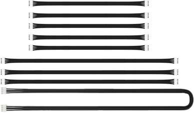

# 1. Geting Ready

## 1.1 Introduction to LeArm

**1.1.1 Product Description**

LeArm is a 6-DOF robotic arm featuring a modular controller design that supports interchangeable ESP32, STM32, and 51 control modules. It comes with built-in Bluetooth and supports multiple communication methods. Equipped with high-torque smart serial bus servos and an embedded inverse kinematics algorithm, LeArm enables precise control simply by inputting coordinates.

The LeArm robotic arm supports multi-modal expansion, allowing integration with vision modules, voice modules, and various sensors. It also supports extensions such as a motorized sliding rail and conveyor belt, enabling a wide range of creative applications including AI-powered visual and voice interaction, mobile object picking, and intelligent transport.

**1.1.2 Usage Precautions**

Important Safety Instructions for Use and Storage:

(1) This product contains small parts and sharp pins, and is not suitable for children under 12 years old.

(2) Minors should only use this product under adult supervision and guidance.

(3) The product includes small and sharp components—do not swallow or apply pressure to avoid injury.

(4) As the product contains conductive components, do not touch it with metal objects while powered on.

(5) Do not forcibly move the robotic arm once powered on, as this may damage the servos.

(6) When not in use for an extended period, store the product in a cool, dry place.

(7) If the robot is equipped with servos and is in operation, and the servo output shaft cannot rotate smoothly due to external resistance, stop the operation immediately. Continued resistance can cause the servo to stall, leading to a sharp rise in current, which may result in serious damage or even burning of the servo.

(8) "**Damage caused by stalling, overloading, or incorrect installation is not covered under warranty.**" Please follow all operational guidelines carefully and avoid overloading to ensure the proper and safe performance of both the robot and its servos.

**1.1.3 Copyright Statement**

This manual is the intellectual property of Shenzhen Hiwonder Technology Co., Ltd. No organization or individual may excerpt, copy, translate, or distribute any part of this manual without prior authorization.

Any unauthorized use of this reference material will be considered a violation of copyright, and our company reserves the right to pursue legal action.

**1.1.4 Disclaimer**

The products described in this manual (including hardware, software, etc.) are provided **"as is."** While every effort has been made to ensure the accuracy of the content at the time of writing, errors or omissions may still exist. The materials are reviewed periodically, and we welcome users to provide feedback and suggestions for improvement.

As product content may change with version updates, please contact our customer service team when placing an order to obtain the most up-to-date product information.

Furthermore, unless explicitly stated by Hiwonder Technology, we are not responsible for any losses resulting from product malfunction or damage caused by use in extreme or unintended scenarios.

## 1.2 Packing List

**(1) LeArm AI Standard Packing List**

| No.  | **Components**                       | **Quantity** | Picture                                                     |
| ---- | ------------------------------------ | ------------ | ----------------------------------------------------------- |
| 1    | LeArm AI                             | 1            |  |
| 2    | 7.5V 6A DC power adapter             | 1            |  |
| 3    | Wireless controller +Handle receiver | 1            |  |
| 4    | Data cable(200mm)                    | 1            |  |
| 5    | Type-C cable(1000mm)                 | 1            |  |
| 6    | Screwdriver                          | 1            |  |

**(2) LeArm Al Intermediate Packing List**

| No.  | **Components**                       | **Quantity** | Picture                                                      |
| ---- | ------------------------------------ | ------------ | ------------------------------------------------------------ |
| 1    | LeArm AI                             | 1            |   |
| 2    | 7.5V 6A DC power adapter             | 1            |   |
| 3    | Wireless controller +Handle receiver | 1            |   |
| 4    | Data cable(200mm)                    | 1            |   |
| 5    | Type-C cable(1000mm)                 | 1            |   |
| 6    | Screwdriver                          | 1            |   |
| 7    | Glowing ultrasonic sensor            | 1            |   |
| 8    | Ultrasonic sensor bracket            | 1            |   |
| 9    | Obstacle avoidance sensors           | 2            |   |
| 10   | Touch sensor                         | 1            |  |
| 11   | Acceleration sensor                  | 1            |  |
| 12   | Sound sensor                         | 1            |  |
| 13   | OLED display                         | 1            |  |
| 14   | 4Pin wires (200mm+300mm)             | 6            |  |

**(3) LeArm Al Advanced Packing List**

| No.  | **Components**                         | **Quantity** | Picture                                                      |
| ---- | -------------------------------------- | ------------ | ------------------------------------------------------------ |
| 1    | LeArm AI                               | 1            |   |
| 2    | 7.5V 6A DC power adapter               | 1            |   |
| 3    | Wireless controller +Handle receiver   | 2            |   |
| 4    | Data cable(200mm)                      | 1            |   |
| 5    | Type-C cable(1000mm)                   | 1            |   |
| 6    | Screwdriver                            | 1            |   |
| 7    | Glowing ultrasonic sensor              | 1            |   |
| 8    | Ultrasonic sensor bracket              | 1            |   |
| 9    | Obstacle avoidance sensors             | 2            |   |
| 10   | Touch sensor                           | 1            |  |
| 11   | Acceleration sensor                    | 1            |  |
| 12   | Sound sensor                           | 1            |  |
| 13   | OLED display                           | 1            |  |
| 14   | 4Pin wires                             | 7            |  |
| 15   | WonderMV Vision module                 | 1            |  |
| 16   | 32GB SD card +Card reader              | 2            |  |
| 17   | Waste cards (40*40mm)                  | 12           |  |
| 18   | Trafic signs                           | 6            |  |
| 19   | Number cards                           | 5            |  |
| 20   | Tags+EVA blocks (40*40mm)              | 6            |  |
| 21   | WonderEcho Al voice interaction module | 1            |  |

## 1.3 Introduction to Servo and Servo Controller

**1.3.1 Bus Servo Overview**

Bus servos are an advanced type of digital servo, distinct from traditional PWM-based digital servos. Instead of relying on pulse width modulation, bus servos communicate via asynchronous serial bus protocols. Control is achieved by sending and receiving instruction packets, enabling a closed-loop control system. Thanks to this design, multiple servos can be daisy-chained together, which simplifies wiring and reduces the number of serial ports required.

Because bus servos share a communication line, each servo must be assigned a unique ID, similar to giving each person a name. Without proper ID assignment, it would be impossible to differentiate between servos during control. Once IDs are set, commands can be sent like:

**"Servo ID1, rotate 30°; Servo ID2, rotate 40°,"** and so on.

Bus servos use high-precision potentiometers for position sensing. Compared to PWM servos, they offer additional features such as position, temperature, and voltage feedback. They also deliver superior precision and linearity, resulting in smoother, more stable robotic motion and significantly longer servo lifespan.

* **Servo Centering Before Installation**

Before assembling the servo, a centering procedure must be performed. Centering refers to aligning the servo to its neutral or zero position, from which it can rotate in both positive and negative directions. The servo should be set to this midpoint before it is fixed onto the servo horn or mechanical structure.

This step is essential because during rotation, the moving parts of the servo drive the internal potentiometer. The software assumes the midpoint as the **"zero"** reference. If the servo is not properly centered before installation, the potentiometer may operate outside its functional range (**"blind spots"**), causing the robot to malfunction—for example, failing to reach specified angles or executing incorrect motion sequences.

:::{Note}

* All servos on the LeArm robotic arm are factory-calibrated to their center positions, so no additional setup is required. For further tuning or learning, refer to: [Bus Servo Configuration]()
* For details on the communication protocol of the bus servo, please refer to the [Bus Servo Control]() folder within the corresponding main controller programming course.
  :::

**1.3.2 Servos Introduction**

The servo layout of the LeArm robotic arm is illustrated below.

The table provides a brief overview of the specifications for each servo model used in the system. For detailed performance characteristics and usage instructions, please refer to Section 4: Extended Materials.

<table class="docutils-nobg" border="1">
  <tr>
    <th>Servo</th>
    <th>Rotation speed</th>
    <th>Stall torque</th>
    <th>Data Feedback</th>
  </tr>
  <tr>
    <td>HTS-25L</td>
    <td>0.16sec/60° 7.4v</td>
    <td>
      22kg.cm 6v 
      25kg.cm 7.4v 
      32kg.cm 8.4v
    </td>
    <td rowspan="3">Temperature, voltage and position</td>
  </tr>
  <tr>
    <td>LX-225</td>
    <td>0.23sec/60° 7.4v</td>
    <td>25kg.cm 7.4v</td>
  </tr>
  <tr>
    <td>HTS-16L</td>
    <td>0.23sec/60° 7.4v</td>
    <td>16kg.cm 7.4v</td>
  </tr>
</table>

**1.3.3 Servo Controller Introduction**

The LeArm servo controller is an open-source, six-channel controller designed with a modular main control architecture. Its onboard microcontroller base supports seamless switching between ESP32, STM32, and C51 microcontrollers, providing flexibility for various development needs.

* **Interfaces and Buttons**

| **Interface/Button** | **Purpose** |
|:--:|:--:|
| PWM Servo Port | Connects PWM servos |
| Serial bus servo port | Connects bus servos |
| Power switch | Turns the controller power on or off |
| Custom Button | Allows personalized configuration and control |
| GPIO Ports | For attaching external expansion modules |
| Controller Receiver Port | Connects the receiver module for remote communication |
| Microcontroller Socket | For installing the main microcontroller module |

* **Specification Parameter**

| **Programming Software** | Official Arduino IDE, Keil |
|:----|:----|
| **Inputs** | Controller, function buttons |
| **Outputs** | Buzzer, PWM servo output, bus servo output, indicator lights |
| **Microprocessor** | Compatible with ESP32 mainboard, STM32 mainboard, C51 mainboard |
| **Communication Methods** | Controller communication, Bluetooth, USB, serial communication |
| **Control Method** | PC host software, mobile app, controller, motion-sensing glove |
| **Power Supply** | 6.4 - 8.4V |

**1.3.4 Core Board Introduction**

* **STM32 Core Board**

This development board is powered by the `STM32F103RBT6` microcontroller. It features an onboard Type-C port for programming and serial communication. On the left side, a `BOOT` button is connected to the chip's `Boot0` pin, allowing users to select the download mode during programming by pressing this button. The `RST` button on the right performs a hardware reset when pressed.

* **C51 Core Board**

This development board uses the `Ai8051U-34K64` microcontroller. It also includes a Type-C port for programming and serial communication. The `K1` button on the right side triggers a hardware reset when pressed.

* **ESP32 Core Board**

This development board is equipped with the `ESP32-WROOM` module. It has a Type-C port for programming and serial communication. The button on the left is the `IO0` button, which can toggle the corresponding pin's voltage level and can be programmed by the user to trigger custom events. The button on the right is the `EN` reset button, which performs a hardware reset when pressed.

## 1.4 Assembly

## 1.5 Deviation Adjustment Instructions

:::{Note}
If you replace a servo or remove an existing one, you must recalibrate the offset.
:::

**1.5.1 Preparation**

After assembling the robotic arm, offset calibration must be performed to ensure smooth and accurate movement during the upcoming lessons. Before beginning the calibration, please make sure the following preparations are completed:

(1) The controller is mounted onto the robotic arm base plate and one of the core boards is installed.

(2) All servo cables are connected to the controller, and the power cable is plugged into the controller's DC port and connected to the power adapter.

(3) Follow the first three sections of the document [3. PC Software Action Group Control->3.1 PC Software Overview](3.PC_Software_Action_Group_Control.md#pc-software-overview) to install and launch the LeArm PC software, and connect the robotic arm to your computer.

:::{Note}
All offset calibration steps related to the PC software must be performed in "Slider Control Mode."
:::

**1.5.2 Deviation Adjustment Standard**

Click to move all servos of the robotic arm to the position value of 1500. Then observe the arm based on the following criteria:

(1) ID1: The gripper should be centered, with the jaws lightly touching.

(2) ID2: The edge of the metal bracket connected to ID2 should be parallel to the edge of the ID1 servo.

(3) ID3: The servo should be perpendicular to the bracket below it.

(4) ID3 to ID5: These servos should form a straight vertical line, and the robotic arm as a whole should not lean forward or backward.

(5) ID5: The screw line on the horizontal servo horn should be parallel to the base platform below.

(6) ID6: The screws on the circular plate should align with the screws on the base of the pan-tilt.

(7) Drag the slider for servo ID6 fully to both sides, then click `Reset` to check if the screw on the disk is centered. If there's still a deviation after resetting, fine-tuning is required.

:::{Note}
After completing the adjustment, run Action Group 3 to verify that the arm can successfully grip a 4 cm cube.
If a joint has a slight deviation from the standard position, it is recommended to follow Section 3: Deviation Adjustment to fine-tune the servo. If the deviation is significant, it is recommended to remove and reinstall that servo. (Before reinstallation, use the PC software to center the servo.)
:::

Deviations similar to the image below are considered minor deviations.

Deviations similar to the image below are considered major deviations.

**1.5.3 Deviation Adjustment Instructions**

During installation, minor deviations are common due to manual assembly. These small misalignments are normal and can be corrected using the PC software. Follow the steps below to perform manual calibration (using Servo ID4 as an example):

(1) Click to read the current offset values of the robotic arm's servos

(2) On the left side of the interface, locate the servo icons and select the corresponding slider beneath the target servo. Drag the slider to adjust the servo's position offset. The display above shows how the offset value correlates with the servo's rotation direction.

:::{Note}
If a servo cannot reach its standard position even when the offset is set to its maximum, it may indicate a significant mechanical deviation. In this case, reset the offset to zero, click `Save`, and then remove and reinstall the servo to correct the alignment.
:::