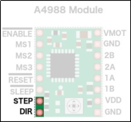
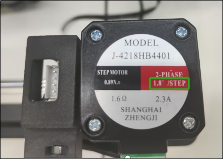
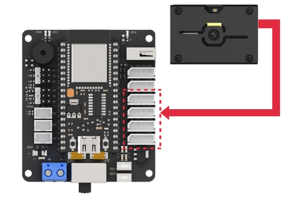
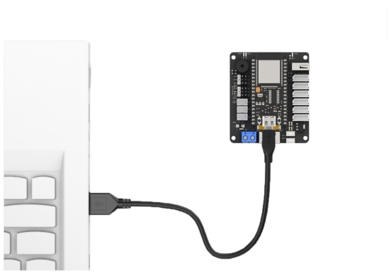

# 10. LeArm AI + Sliding Rail Course

## 10.1 Sliding Rail Introduction and Installation

### 10.1.1 Product Introduction

The electric sliding rail is a common automation device powered by a motor. The motor is controlled via a motor driver to enable smooth and precise movement.

It is often used with robotic arm teaching platforms to significantly expand the arm's operating range, making it ideal for educational experiments and theoretical verification.

### 10.1.2 Structure and Working Principle

*   **Mechanical Structure**

The sliding rail consists of the following mechanical components:

(1) Drag chain: protects the connecting wires.

(2) Timing pulley: connected to the stepper motor and drives the conveyor belt on the sliding rail.

(3) Slider platform: fixed to the conveyor belt and mounted on the guide rail.

*   **Hardware Components**

The hardware module includes the `A4988` stepper motor driver that powers the stepper motor, and a stepper motor control board which connects the driver and expands the I/O ports. The stepper motor model `J-4218HB4401` uses `PWM` control to drive the timing pulley, which moves the belt.

During operation, the `A4988` driver board may experience excessive power consumption, causing its temperature to rise. If the temperature gets too high, it can damage the driver board. To prevent this situation, a heat sink is attached to the driver `IC` (applied at the factory) to help dissipate heat and maintain a stable operating temperature.

:::{Note}

After extended use, the driver may become hot. Avoid touching it directly to prevent burns!

:::


*   **Working Principle**

The electric sliding rail transmits the motor's power through a transmission mechanism to the guide rail, enabling linear movement. The control process involves three main stages: motor driving, travel control, and sensor feedback.

(1) Motor Driving: It is the most fundamental control method. The motor receives energy via input current and is driven by the motor driver. This ensures the robot performs stable and precise movements.

(2) Travel Control: Travel distance must be regulated according to the rail's range. This is managed via programmed code and current control to accurately set displacement and speed.

(3) Sensor Feedback: For precise control, the sliding rail is equipped with sensors to monitor the system's status in real time. The rail's travel limit switch is a reset-type sensor that detects its initial state.

### 10.1.3 Pin Instruction


*   **As shown in the figure above:**

(1) Motor Drive Interface – Connects to the stepper motor on the other end.

(2) Limit Switch Interface – Connects to the travel limit switch on the other end.

(3) IIC Interface – The other end connects to the `I2C` interface on the control board. This product uses `I2C` communication to interact with the stepper motor driver.

(4) Power Interface – Connects to the power supply on the other end.

:::{Note}

The wires are designed to prevent reverse insertion. Do not force the connector if it does not fit.

:::

The diagram below shows the stepper motor driver `A4988`:


:::{Note}

The above diagram is a schematic of the `A4988` stepper motor driver module only. The actual module color may vary based on the final product.

:::

*   **Power Supply Pins:**


(1) `VDD` and `GND` power the internal logic circuit, supporting voltages from `3V` to `5.5V`.

(2) `VMOT` and `GND` supply power to the motor, supporting voltages from `8V` to `35V`.

*   **Step Resolution Pins:**

The stepper motor's precision can be controlled by setting different step resolutions.

The `A4988` driver has three step resolution selection pins: `MS1`, `MS2`, and `MS3`, as shown in the diagram below.


These allow the step resolution to be set to one of five levels. The smaller the step size, the higher the precision. For more details about step settings, please refer to the section 10.1.4 Pulse Configuration in this document.

| MS1 | MS2 | MS3 | Step Resolution |
| :--: | :--: | :--: | :--: |
| 0 | 0 | 0 | Full step |
| 1 | 0 | 0 | Half step |
| 0 | 1 | 0 | Quarter step |
| 1 | 1 | 0 | Eighth step |
| 1 | 1 | 1 | Sixteenth step |

*   **Control Input Pins:**

The driver board features two main control input pins: `STEP` and `DIR`, as shown in the diagram below.



(1) `STEP` controls the stepping of the motor. A high-frequency signal results in faster rotation, while a low-frequency signal yields slower rotation.

(2) `DIR` controls the motor's rotation direction. A high signal sets the motor to rotate clockwise, and a low signal sets it to rotate counterclockwise.

*   **Power Control Pins:**

The `ENABLE` (`EN`), `RESET` (`RST`), and `SLEEP` (`SLP`) pins are used to manage the power states of the driver, as illustrated below.


(1) These three pins are active-low, meaning they are activated when set to a low logic level.

(2) The difference is that when the `EN` pin is set to low, the `A4988` driver is enabled, meaning the board is powered and operating normally.

(3) Setting `RST` pin low will reset the internal translator of the driver and ignore incoming `STEP` signals. This action reinitializes the driver and is influenced by the step resolution settings.

(4) When `SLP` pin is low, the driver enters a low-power sleep mode to conserve energy when the motor is not in use.

*   **Output Pins**


The output pins of the motor driver are distributed along the edge of the module as follows: The `1B`, `1A`, `2A`, and `2B` pins can be supplied with a voltage ranging from `8V` to `35V`, and they deliver an output current of up to `2A`.

### 10.1.4 Pulse Configuration

By adjusting the width of `PWM` pulses, you can control the motor's rotation speed—wider pulses result in faster rotation, while narrower pulses slow it down. To better understand the relationship between pulse width and the motor's actual rotation angle or number of revolutions, you need to calculate how many pulses are required for one full revolution. The process is as follows:

(1) Determining the Motor Step Angle:

As shown in the image, the highlighted section `"1.8°/STEP"` indicates the step angle of the motor. This means that for each electrical pulse the motor receives, the rotor rotates by `1.8°`.



(2) Calculating Pulses per Revolution:

The step angle of the stepper motor is `1.8°`. Since a full circle is `360°`, when the microstepping setting, which divides the step angle into smaller increments per pulse, is set to the default value of `1`, the motor requires `200` pulses to complete one full revolution (`360` ÷ `1.8` = `200`).

(3) Microstepping (Pulse Subdivision):

To improve the rotational precision of the motor, you can configure microstepping, which divides each full step into smaller increments:

① 2 microsteps (1/2 step): Step angle = `1.8°` ÷ `2` = `0.9°`, Pulses per revolution = `200` × `2` = `400`.

② 4 microsteps (1/4 step): Step angle = `1.8°` ÷ `4` = `0.45°`, Pulses per revolution = `200` × `4` = `800`.

③ 8 microsteps (1/8 step): Step angle = `1.8°` ÷ `8` = `0.225°`, Pulses per revolution = `200` × `8` = `1600`.

:::{Note}

When a high microstepping setting is used, for example, microstepping set to `1/8`, the smallest possible step becomes `0.225°`. Since this is a very small angle and may not correspond to the motor's actual physical position, which aligns with full steps such as `1.8°`, the stepper motor must remain powered even when it is stationary. This ensures the rotor holds its current microstep position and doesn't snap back to the nearest full-step physical detent. As a result, it is normal to hear a faint humming or current noise from the motor when it's idle. This is a normal behavior and not a cause for concern.

:::

Based on the timing pulley specifications used on the sliding rail, one full rotation of the motor equals one full rotation of the pulley. Since this translates to a travel distance of `75 mm` per rotation, you can use this standard (`75 mm` per rotation) as a reference when writing code for pulse testing and movement calibration.

### 10.1.5 Current Adjustment

:::{Note}

*   Each motor driver board comes with a heatsink pre-installed from the factory.
*   The board can become hot after running for extended periods—do not touch it directly to avoid burns.

:::

Before operating the stepper motor, you need to set the current limit on the driver board to ensure the current does not exceed the rated current of the driver.

Use a Phillips screwdriver to adjust the current limiter (as shown below). Turn clockwise to increase the current, while turn counterclockwise to decrease the current. Adjust the current gradually until it reaches a safe level close to the driver's rated current.


[Current Adjustment Potentiometer]

If you'd like to understand the exact method for calculating and adjusting the current, refer to the following. Otherwise, feel free to skip this section:

Without a heatsink, keep the current below `1.2A`. With a heatsink installed, do not exceed `2A`.

(1) Use a multimeter to measure the reference voltage on the driver board. The measurement point is indicated in the image on the left below.


`A4988` Maximum Current Calculation Formula: 


`V` is the measured voltage. `R` is the sense resistor value, `0.1Ω` in this section, typically `0.1Ω` for `R100`, `0.2Ω` for `R200`, or `0.05Ω` for `R050`.


(2) Use the formula to determine the appropriate current limit for your setup. 


### 10.1.6 Specifications

*   **Sliding Rail Parameters**

| Profile Width | 40mm | Lead of Module | 75mm | Operating Temperature | -30°C to 60°C |
| :---: | :---: | :---: | :---: | :---: | :---: |
| Maximum Load | 10KG | Timing Pulley Specification | HTD3M, 25 teeth | Base Weight (at 0 mm stroke) | 1.1KG |
| Customizable Stroke | ≤500mm | Timing Belt Specification | HTD3M, 15 mm width | Weight Change per 100 mm Stroke | 0.2KG |
| Linear Speed | ≤1.5m/s | Repeat Positioning Accuracy | ≤±0.05mm | Motor Connection Type | Direct drive or with gearbox |
| Applicable Drive Torque | ≤3N·M | Straightness / Torsional bending | ≤±0.05/300mm | Compatible Motors | Stepper and Servo Motors (200W / 400W / 750W) |

*   **Stepper Motor Specifications:**

| Model | 42CM06 | Body Length | 47.5mm | Number of Wires | 4 wires |
| :---: | :---: | :---: | :---: | :---: | :---: |
| Wiring Configuration | Black: A+, Green: A- | Holding Torque | 0.60N·M | Current | 1.96A |
| Step Angle | 1.8°±5% | Number of Phases | 2 | Rated Voltage | 3.68V |
| Rated Current | 2.3A | Resistance | 1.6ohm±10%(20℃） | Inductance | 4 mH±20%（1Vrms.1k Hz) |

*   **Stepper Motor Driver:**

| Model | A4988 | Dimensions | 1.5mmx2mm | Weight | 3.7g |
| :---: | :---: | :---: | :---: | :---: | :---: |
| Motor Supply Voltage | 8~35V | Microstepping Modes | 5 (Full, Half, 1/4, 1/8, 1/16) | Maximum Drive Current | 2A |

### 10.1.7 Registers

The following table provides a description of the relevant registers:

| Register Name | Address | Function Description |
| :---: | :---: | :---: |
| I2C_ADDR | 0x35 | Used for `I2C` communication protocol |
| MOTOR_STATE_ADDR | 0x20 | Sets the motor state |
| STEPS_DRIVER_MODE_ADDR | 0x21 | Initializes different motor microstepping modes |
| MOTOR_AUTO_REPOSITION_ADDR | 0x22 | Controls the motor to return to its initial position |
| STEPS_ADDR | 0x24 | Writes the motor movement steps |
| STEPS_TIME_ADDR | 0x28 | Sets the run time for each step |

### 10.1.8 Frequently Asked Questions

(1) Why is the sliding rail moving very slowly during operation?

① Answer:

Please check the power supply voltage for the sliding rail. Make sure to use a `6–12V` power source. If the voltage is below `6V`, it may cause the rail to operate at a reduced speed.
Depending on your application, you can adjust the microstepping settings in the program. A lower microstepping value results in faster movement, while a higher value provides slower but more stable and powerful motion.

(2) Why does the motor keep working and make a clicking sound when the rail reaches its limit?

① Answer:

The sliding rail is controlled by pulse signals sent from the driver to the stepper motor. Each pulse adds to or subtracts from the previous position. When the rail reaches its physical limit and pulses continue to be sent, it may cause damage to the rail mechanism. Therefore, it's important to configure appropriate pulse limits in your program to avoid over-travel and protect the hardware.

### 10.1.9 Installation and Wiring Interface Indicators

* **Install the Sliding Rail Bracket**

[补充视频]


* **Install the Tank Tread**

[补充视频]

* **Install LeArm AI**


* **Wiring to Connect sliding rail and LeArm AI**

Connect the 3-pin cable from the sliding rail to any bus servo port on the left side of the diagram to supply power. Connect the 4-pin cable to any IIC port on the right side of the diagram for communication.


## 10.2 Wireless Controller Control

### 10.2.1 Project Introduction

In this lesson, a wireless controller is used to control both the robotic arm and the sliding rail.

### 10.2.2 Project Process


### 10.2.3 Module Instruction


The `PS2` controller communicates with the controller via a receiver using a `2.4G` wireless signal. The controller has two modes, which can be toggled using the **"MODE"** button.

### 10.2.4 Program Download

[Source Code](../_static/source_code/LeArm_Sliding_Rail_Course.zip)

(1) Connect the core board to the computer using a USB cable.


(2) Locate the corresponding Arduino project file in the same directory as this document.


(3) Select the development board model when you open the program, and the specific model is shown in the figure below.


(4) Click **"Compile"** first, then click **"Upload"**. After the upload is completed, the program download is completed if the following interface appears in the output box below the software.


### 10.2.5 Project Outcome

When the controller is in **digital mode** (only green light on), the robotic arm will not respond to control inputs.

When in **analog mode** (both red and green lights on), the robotic arm can be controlled. Pressing any button together with **"SELECT"** will trigger a predefined motion group. Moving the **right joystick** left or right will slide the rail in the corresponding direction.


### 10.2.6 Program Brief Analysis

:::{Note}

The controller input handling and protocol parsing are explained in detail in the earlier lesson titled [Wireless Controller Control](2.Remote_Control.md#wireless-controller-control). This section highlights only the differences specific to this project.

:::

*   **ino File (Application Layer)**

(1) Imports the following libraries: `config.h`, `Hiwonder.hpp`, `Robot_arm.hpp`, `PS2_CTL.hpp`, and `stepper.hpp`. `Hiwonder.hpp` defines the `LED`, `buzzer`, and `button` objects. `Robot_arm.hpp` defines the `robotic arm` object. `PS2_CTL.hpp` defines the `PS2 controller` object. `stepper.hpp` defines the `sliding rail` object.

{lineno-start=}

```python
#include "Config.h"
#include "Hiwonder.hpp"
#include "Robot_arm.hpp"
#include "./src/PS2/PS2_CTL.hpp"
#include "stepper.hpp"
```

(2) Creates objects for the `LED`, `buzzer`, `robotic arm`, `PS2 controller`, `IIC`, and `conveyor belt`. Declares variables related to the `sliding rail`.

{lineno-start=7}
```python
Led_t led_obj;
Buzzer_t buzzer_obj;
LeArm_t arm;
PS2_CTL ps2;
IIC iic;
Stepper stepper_obj;

int stepper_run = 0;
```

(3) In the `setup` function, first delay for `1000 ms` (`1` second), then power off the `Bluetooth module`. Next, initialize the `robotic arm`, `LED`, `buzzer`, `I2C`, and `sliding rail` objects, then open the `serial port` and set the `baud rate` to `9600`. Then call the `sliding rail` object and set the `step value` to `1000`.

{lineno-start=17}

```python
void setup() {
  delay(1000);
  pinMode(IO_BLE_CTL, OUTPUT);
  digitalWrite(IO_BLE_CTL, LOW);  // Set the Bluetooth control pin to low level to power off the Bluetooth module (设置蓝牙控制引脚为低电平时，断开蓝牙模块电源)

  arm.init();
  led_obj.init(IO_LED);
  buzzer_obj.init(IO_BUZZER);
  ps2.init();
  iic.init();
  stepper_obj.init(&iic);
  stepper_obj.driver_mode(0x02);
  stepper_obj.reset();
  Serial.begin(9600);

  delay(2000);
}
```

(4) In the `main loop`, the `ps2_Task` function is called to process data and control the movement of the `sliding rail`.

{lineno-start=34}

```python
void loop() {
  ps2.PS2_Task(&arm, &led_obj, &buzzer_obj, &stepper_run);
  stepper_obj.set_step(stepper_run);
}
```

*   **PS2_CTL.cpp File (Low-Level)**

(1) In the `get_result` command frame processing function, the logic is executed only when the current command frame object's working mode **"mode"** is in analog mode (`PS2_COORDINATE_MODE`).

{lineno-start=186}

```python
int PS2_CTL::get_result(LeArm_t* robot,Led_t* led,Buzzer_t* buzzer,int* stepper_run)
{
  if(rec_flag){
    rec_flag = false;
    if(keyvalue.mode == PS2_COORDINATE_MODE)
    {
      if(keyvalue.bit_triangle == 1)
      {
        robot->knot_run(1, 1600, action_running_time);
      }
      else if(keyvalue.bit_cross == 1)
      {
        robot->knot_run(1, MIN_DUTY, action_running_time);
      }
      else if(keyvalue.bit_triangle == 0 || keyvalue.bit_cross == 0)
      {
        robot->knot_stop(1);
      }

      if(keyvalue.bit_square == 1)
      {
        robot->knot_run(2, MIN_DUTY, action_running_time);
      }
      else if(keyvalue.bit_circle == 1)
      {
        robot->knot_run(2, MAX_DUTY, action_running_time);
      }
      else if(keyvalue.bit_square == 0 || keyvalue.bit_circle == 0)
      {
        robot->knot_stop(2);
      }

      if(keyvalue.bit_r1 == 1)
      {
        robot->knot_run(3, MAX_DUTY, action_running_time);
      }
      else if(keyvalue.bit_r2 == 1)
      {
        robot->knot_run(3, MIN_DUTY, action_running_time);
      }
      else if(keyvalue.bit_r1 == 0 || keyvalue.bit_r2 == 0)
      {
        robot->knot_stop(3);
      }

      if(keyvalue.bit_l1 == 1)
      {
        robot->knot_run(4, MAX_DUTY, action_running_time);
      }
      else if(keyvalue.bit_l2 == 1)
      {
        robot->knot_run(4, MIN_DUTY, action_running_time);
      }
      else if(keyvalue.bit_l1 == 0 || keyvalue.bit_l2 == 0)
      {
        robot->knot_stop(4);
      }
      
      if(keyvalue.bit_up == 1)
      {
        robot->knot_run(5, MAX_DUTY, action_running_time);
      }
      else if(keyvalue.bit_down == 1)
      {
        robot->knot_run(5, MIN_DUTY, action_running_time);
      }
      else if(keyvalue.bit_up == 0 || keyvalue.bit_down == 0)
      {
        robot->knot_stop(5);
      }

      if(keyvalue.bit_left == 1)
      {
        robot->knot_run(6, MAX_DUTY, action_running_time);
      }
      else if(keyvalue.bit_right == 1)
      {
        robot->knot_run(6, MIN_DUTY, action_running_time);
      }
      else if(keyvalue.bit_left == 0 || keyvalue.bit_right == 0)
      {
        robot->knot_stop(6);
      }

      if(keyvalue.bit_start == 1)
      {
        robot->reset();
        delay(800);
      }

      if(keyvalue.bit_select == 1 && keyvalue.bit_up == 1)
      {
        buzzer->blink(1500 , 100, 100, 1);
        while(1)
        {
          if(robot->action_group_run(0, 1))
          {
            robot->action_group_reset();
            break;
          }
        }
      }
      
      if(keyvalue.bit_select == 1 && keyvalue.bit_down == 1)
      {
        buzzer->blink(1500 , 100, 100, 1);
        while(1)
        {
          if(robot->action_group_run(1, 1))
          {
            robot->action_group_reset();
            break;
          }
        }
      }
      
      if(keyvalue.bit_select == 1 && keyvalue.bit_left == 1)
      {
        buzzer->blink(1500 , 100, 100, 1);
        while(1)
        {
          if(robot->action_group_run(2, 1))
          {
            robot->action_group_reset();
            break;
          }
        }
      }		

      if(keyvalue.bit_select == 1 && keyvalue.bit_right == 1)
      {
        buzzer->blink(1500 , 100, 100, 1);
        while(1)
        {
          if(robot->action_group_run(3, 1))
          {
            robot->action_group_reset();
            break;
          }
        }
      }	

      if(keyvalue.bit_select == 1 && keyvalue.bit_l1 == 1)
      {
        buzzer->blink(1500 , 100, 100, 1);
        while(1)
        {
          if(robot->action_group_run(4, 1))
          {
            robot->action_group_reset();
            break;
          }
        }
      }	
      
      if(keyvalue.bit_select == 1 && keyvalue.bit_l2 == 1)
      {
        buzzer->blink(1500 , 100, 100, 1);
        while(1)
        {
          if(robot->action_group_run(5, 1))
          {
            robot->action_group_reset();
            break;
          }
        }
      }	
      
      if(keyvalue.bit_select == 1 && keyvalue.bit_triangle == 1)
      {
        buzzer->blink(1500 , 100, 100, 1);
        while(1)
        {
          if(robot->action_group_run(6, 1))
          {
            robot->action_group_reset();
            break;
          }
        }
      }
      
      if(keyvalue.bit_select == 1 && keyvalue.bit_cross == 1)
      {
        buzzer->blink(1500 , 100, 100, 1);
        while(1)
        {
          if(robot->action_group_run(7, 1))
          {
            robot->action_group_reset();
            break;
          }
        }
      }
      
      if(keyvalue.bit_select == 1 && keyvalue.bit_square == 1)
      {
        buzzer->blink(1500 , 100, 100, 1);
        while(1)
        {
          if(robot->action_group_run(8, 1))
          {
            robot->action_group_reset();
            break;
          }
        }
      }
      
      if(keyvalue.bit_select == 1 && keyvalue.bit_circle == 1)
      {
        buzzer->blink(1500 , 100, 100, 1);
        while(1)
        {
          if(robot->action_group_run(9, 1))
          {
            robot->action_group_reset();
            break;
          }
        }
      }

      if(keyvalue.bit_select == 1 && keyvalue.bit_r1 == 1)
      {
        buzzer->blink(1500 , 100, 100, 1);
        while(1)
        {
          if(robot->action_group_run(10, 1))
          {
            robot->action_group_reset();
            break;
          }
        }
      }
      
      if(keyvalue.bit_select == 1 && keyvalue.bit_r2 == 1)
      {
        buzzer->blink(1500 , 100, 100, 1);
        while(1)
        {
          if(robot->action_group_run(11, 1))
          {
            robot->action_group_reset();
            break;
          }
        }
      }
      
      if(keyvalue.bit_leftjoystick_press)
      {
        buzzer->blink(1500 , 100, 100, 1);
        led->blink(100, 100, 1);
        if(action_running_time > 400)
        {
          action_running_time  -= 200;
        }
      }
      
      if(keyvalue.bit_rightjoystick_press)
      {
        buzzer->blink(1500 , 100, 100, 1);
        led->blink(100, 100, 1);
        if(action_running_time < 10000)
        {
          action_running_time += 200;
        }
      }

      int speed = (uint32_t)keyvalue.left_joystick_x > 200 ? -20 : ((uint32_t)keyvalue.left_joystick_x < 50? 20 : 0);
      *stepper_run = speed;
    }
  }
  return 0;
}
```

(2) If the controller is in analog mode:

① If the **"SELECT"** button is not pressed but other buttons are pressed, the corresponding servos are controlled to move or stop.

② If the **"SELECT"** button is pressed together with other buttons, an action group is executed.

③ If the **"START"** button is pressed, a reset is triggered.

④ When the left or right joystick buttons are pressed down, the movement duration time is increased or decreased.

⑤ For the right joystick pushed left or right, moving the right joystick left or right controls the stepper motor inside the sliding rail, driving the sliding base carrying the robotic arm to move sideways. Detailed behaviors as described below:

⑥ When the `right joystick` is centered (`x=127`), the `set_motor_move` function is called to keep the `stepper motor` stopped.

⑦ When the `right joystick` is pushed left (`x < 50`), the step size `stepper_run` is set to `-20`, causing the `stepper motor` to rotate in one direction. Similarly, when the `right joystick` is pushed to the right, it causes the `stepper motor` to rotate in the opposite direction, with the step size `stepper_run` set to `20`.

{lineno-start=452}

```python
      int speed = (uint32_t)keyvalue.left_joystick_x > 200 ? -20 : ((uint32_t)keyvalue.left_joystick_x < 50? 20 : 0);
      *stepper_run = speed;
```

## 10.3 Sliding Rail + Color Sorting

### 10.3.1 Project Introduction

In this lesson, we use the `WonderMV` vision module to detect colored waste blocks. Based on the type of waste detected by the vision module, the sliding rail and robotic arm work together to sort wastes.

### 10.3.2 Project Process


### 10.3.3 Module Instruction

*   **WonderMV Vision Module**


The `WonderMV` module is equipped with a high-performance `K210` chip and supports various `AI` vision functions such as color recognition, face detection, and identification through programming. This module features an `IIC` interface, making it easy to connect and exchange data with different controllers, providing an efficient solution for intelligent vision applications.

Module connection: As shown in the figure below, please connect the module to any `IIC` port marked in the red frame on the servo control board before starting the feature.



### 10.3.4 Program Download

*   **WonderMV Program Download**

[Source Code](../_static/source_code/LeArm_Sliding_Rail_Course.zip)

(1) Double-click to open the **"CanMV IDE"** development software, and click the **"connect"** button in the lower left corner.

(2) Select the corresponding port number, check **"Advanced Settings"**, and choose **"Mode-3"**.

(3) Click **"OK"** and wait for the connection.

(4) Once connected successfully, the icon in the lower left corner of the **"CanMV IDE"** will appear as shown below.


(5) Drag the program file from the same directory of this lesson into the code editor area of **"CanMV IDE"**. Click **"Tools"** in the toolbar, then select **"Save the currently opened script as (main.py) to CanMV Cam"**, as shown below.


(6) Next, click **"Yes"**.

(7) When the write process is successful, a prompt will appear, then click **"OK"**. Through above steps to save the `MicroPython` file to the `K210` vision module.

*   **ESP32 Program Download**

[Source Code](../_static/source_code/LeArm_Sliding_Rail_Course.zip)

(1) Connect the core board to the computer using a USB cable.



(2) Locate the corresponding Arduino project file in the same directory as this document.


(3) Select the development board model when you open the program, and the specific model is shown in the figure below.


(4) Click **"Compile"** first, then click **"Upload"**. After the upload is completed, the program download is completed if the following interface appears in the output box below the software.


### 10.3.5 Project Outcome

When the vision module detects a waste block in front, the robotic arm will pick it up and sort it into different locations based on the type of waste, placing each block at a different distance from the detection point.


### 10.3.6 Program Brief Analysis

(1) The program imports the following libraries: `config.h`, `Hiwonder.hpp`, `Robot_arm.hpp`, `stepper.hpp`, and `WonderMV.hpp`. Among them, `Hiwonder.hpp` defines the `LED`, `buzzer`, and `button` objects. `Robot_arm.hpp` defines the `robotic arm` object. `stepper.hpp` defines the `sliding rail` object. `WonderMV.hpp` defines the `vision module` object.

{lineno-start=1}

```python
#include "Config.h"
#include "Hiwonder.hpp"
#include "Robot_arm.hpp"
#include "stepper.hpp"
#include "WonderMV.hpp"
```

(2) `LED`, `buzzer`, `button`, `robotic arm`, `IIC`, `vision module`, and `ultrasonic sensor` objects are created, as well as a variable to store the vision recognition results.

{lineno-start=7}

```python
Led_t led_obj;
Buzzer_t buzzer_obj;
LeArm_t arm;
IIC iic;
Stepper stepper_obj;
WonderMV mv;

MV_RESULT_ST result;
```

(3) In the `setup()` function:

① first delay for `1000 ms` (`1` second), then power off the `Bluetooth module`. Next, initialize the `robotic arm`, `LED`, `buzzer`, `I2C`, `sliding rail`, and `vision module` objects, then open the `serial port` and set the `baud rate` to `9600`.

② Then call the `sliding rail` object and set the `step value` to `1000`. Then, the `coordinate_set` method of the `robotic arm` object is called to move the arm to the detected position.

{lineno-start=16}

```python
void setup() {
  delay(1000);
  pinMode(IO_BLE_CTL, OUTPUT);
  digitalWrite(IO_BLE_CTL, LOW);  // When the Bluetooth control pin is set to low, power to the Bluetooth module is cut off (设置蓝牙控制引脚为低电平时，断开蓝牙模块电源)

  arm.init();
  led_obj.init(IO_LED);
  buzzer_obj.init(IO_BUZZER);
  iic.init();
  stepper_obj.init(&iic);
  mv.init(&iic);
  stepper_obj.driver_mode(0x02);
  stepper_obj.reset();
  Serial.begin(9600);
  delay(2000);
  stepper_obj.set_step(1000);
  delay(1500);
  arm.coordinate_set(14, 0, -9, 0, -90, 90, 1000); //Identify position (识别位置)
  Serial.println("start");
}
```

(4) A `run flag` variable is also created.

{lineno-start=38}

```python
uint16_t step_num = 0;
```

(5) In the `main loop`:

① First, the `get_result` method of the `vision MV` object is called to obtain the detected color data, which is then stored in `result`.

② Next, `result.id` is checked. If it is not `0`, it indicates that a color has been detected. The program then waits for `3` seconds and retrieves the color data again. If `result.id` is still not `0`, the `blink` method of the `buzzer` object is called to make a short beep. This double check of `result.id` is used to filter out false detections.

③ After that, the `coordinate_set` method of the `robotic arm` object is called to move the arm above the block, preparing for gripping. Then, the `claw_set` method is called to grip the block.

④ After gripping, the `coordinate_set` method is called again to move the arm back to its initial position. Next, based on the value of `result.id` (i.e., the recognized color), different `step values` are set for the `sliding rail` according to the detected color.

⑤ Then, the `set_step` method of the `sliding rail` object is called to move the `sliding rail` to the corresponding position. After that, the robotic arm is moved to the release position, the claw is opened to drop the block, and then the arm is lifted back to its initial position.

⑥ Finally, the `sliding rail` is moved back, and the `robotic arm` is returned to the detection position.

{lineno-start=40}

```python
void loop() {
  mv.get_result(COLOR_REG , &result);
  if(result.id != 0)
  {
    delay(3000);
    mv.get_result(COLOR_REG , &result);
    if(result.id != 0)
    {
      buzzer_obj.blink(1500, 100, 100, 1);
      delay(500);
      arm.coordinate_set(15, 0, -13, 0, -90, 90, 1000); //Prepare to pick (准备夹取)
      delay(1500);
      arm.claw_set(30, 200); //Pick (夹取)
      delay(400);
      arm.coordinate_set(15.0f, 0, 15, 0, -90, 90, 1000); //Reset (复位)
      delay(1500);
      step_num = 1000+(result.id*1000);
      step_num = step_num > 5000 ? 5000 : step_num;
      stepper_obj.set_step(step_num); //Move to the corresponding position (运动到对应位置)
      delay(step_num);
      arm.coordinate_set(15, 0, -11, 0, -90, 90, 1000); //Prepare to place (准备放下)
      delay(1500);
      arm.claw_set(90, 200); //Place (放下)
      delay(400);
      arm.coordinate_set(15.0f, 0, 15, 0, -90, 90, 1000); //Reset (复位)
      delay(1500);
      stepper_obj.set_step(-step_num);
      delay(step_num);
      arm.coordinate_set(14, 0, -9, 0, -90, 90, 1000); //识别位置
      delay(1500);
      step_num = 0;
    }
  }
  delay(100);
}
```