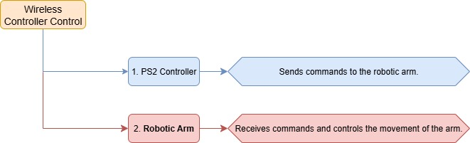
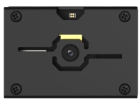

# 11.LeArm + Conveyor Belt Course

## 11.1 Introduction to Conveyor Belt

### 11.1.1 Product Introduction

The electric conveyor belt features a high-quality DC gear motor combined with an industrial-grade PVC conveyor belt and an aluminum alloy frame. It provides smooth and stable transport of various target objects without requiring an external power supply. By simply powering the motor, users can control both the direction and speed of the conveyor belt—making it a true plug-and-play solution.

This product is compatible with most multi-degree-of-freedom robotic arms and linkage-based bionic arms available on the market, making it an excellent choice for AI-powered automated object sorting scenarios.


### 11.1.2 Product Specifications

* **Mechanical Specifications**

Unit: mm


* **Operating Specifications**

| Product | Electric Conveyor Belt | Load Capacity | Approx. 9 kg |
| :------: | :--------------------: | :-----------: | :----------: |
| Rated Voltage | 12 V | Rated Current | 2.5 A |
| No-Load Current | 0.8 A (Starting Current: 1.3 A) | Gear Ratio | 1:70 |
| Maximum Speed | 50 mm/s | Effective Transport Length | 694 mm |
| Product Dimensions | 710 × 227 × 67 mm | Net Weight | Approx. 3.7 kg |
| Package Weight | 4.5 kg | Package Dimensions | 780 × 300 × 120 mm |

### 11.1.3 Conveyor Belt Installation

Connect the 3-pin cable of the conveyor belt to any bus servo port on the left side of the diagram for power supply, and connect the 4-pin cable to any IIC port on the right side of the diagram for communication.


## 11.2 Wireless Controller Control

### 11.2.1 Project Introduction

In this lesson, a wireless controller is used to control both the robotic arm and the conveyor belt.

### 11.2.2 Project Process



### 11.2.3 Module Instruction


The PS2 controller communicates with the controller via a receiver using a 2.4G wireless signal. The controller has two modes, which can be toggled using the **MODE** button.

### 11.2.4 Program Download

[Source Code](../_static/source_code/LeArm_Conveyor_Belt_Course.zip)

(1) Connect the core board to the computer using a USB cable.


(2) Locate the corresponding Arduino project file in the same directory as this document.


(3) Select the development board model when you open the program, and the specific model is shown in the figure below.


(4) Click **"Compile"** first, then click **"Upload"**. After the upload is completed, the program download is completed if the following interface appears in the output box below the software.


### 11.2.5 Project Outcome

When the controller is in digital mode (only green light on), the robotic arm will not respond to control inputs.

When in analog mode, both red and green lights on, the robotic arm can be controlled. Pressing any button together with **SELECT** will trigger a predefined motion group. Moving the left joystick left or right will drive the conveyor belt in the corresponding direction, and the more the joystick is pushed, the faster the conveyor moves.


### 11.2.6 Program Brief Analysis

[Source Code](../_static/source_code/LeArm_Conveyor_Belt_Course.zip)

* **ino File (Application Layer)**

(1) Imports the following libraries: `config.h`, `Hiwonder.hpp`, `Robot_arm.hpp`, `PS2_CTL.hpp`, and `conveyor_belt.hpp`. `Hiwonder.hpp` defines the `LED`, `buzzer`, and `button` objects. `Robot_arm.hpp` defines the `robotic arm` object. `PS2_CTL.hpp` defines the `PS2 controller` object. `conveyor_belt.hpp` defines the `conveyor belt` object.

{lineno-start=1}

```python
#include "Config.h"
#include "Hiwonder.hpp"
#include "Robot_arm.hpp"
#include "./src/PS2/PS2_CTL.hpp"
#include "conveyor_belt.hpp"
```

(2) Creates objects for the `LED`, `buzzer`, `robotic arm`, `PS2 controller`, `IIC`, and `conveyor belt`.

{lineno-start=7}

```python
Led_t led_obj;
Buzzer_t buzzer_obj;
LeArm_t arm;
PS2_CTL ps2;
IIC iic;
CONVEYOR_BELT belt;
```

(3) In the `setup` function, first delay for 1000 ms (1 second), then power off the Bluetooth module. Next, initialize the `robotic arm`, `LED`, `buzzer`, `I2C`, `PS2 controller`, and `conveyor belt` objects, then open the serial port and set the baud rate to 9600.

{lineno-start=14}

```python
void setup() {
  delay(1000);
  pinMode(IO_BLE_CTL, OUTPUT);
  digitalWrite(IO_BLE_CTL, LOW);  // Set the Bluetooth control pin to low level to power off the Bluetooth module (设置蓝牙控制引脚为低电平时，断开蓝牙模块电源)

  arm.init();
  led_obj.init(IO_LED);
  buzzer_obj.init(IO_BUZZER);
  ps2.init();
  iic.init();
  belt.init(&iic);
  
  Serial.begin(9600);
  delay(2000);
}
```

(4) In the main loop, the program enters the `ps2_Task` function to process controller data.

{lineno-start=30}

```python
void loop() {
  ps2.PS2_Task(&arm, &led_obj, &buzzer_obj, &belt);
}
```

* **PS2_CTL.cpp File (Low-Level)**

(1) In the `PS2_Task` function, the `receive_msg` method is first called to obtain data sent by the PS2 controller and store it in the `button state`. Next, the `get_result` method is called to control the robotic arm based on the `button state`.

{lineno-start=22}

```python
void PS2_CTL::PS2_Task(LeArm_t* robot,Led_t* led,Buzzer_t* buzzer,int* stepper_run)
{
  static uint8_t first_flag = 1;
  if(first_flag!=0)
  {
    first_flag = 0;
    if(mode_count == PS2_SINGLE_SERVO_MODE)
    {
      led->blink(250,250,0);
    }else{
      led->blink(250,0,0);
    }
  }
  receive_msg();
  get_result(robot,led,buzzer,stepper_run);
  delay(20);
}
```

(2) In the `receive_msg` function, which handles data retrieval and unpacking, the length of the received data is first checked. If the length is not zero, it indicates that data has been received, and the unpacking process begins. Using a state machine, the function first identifies the frame header, then extracts the data length from the frame, and finally starts retrieving the data content.

{lineno-start=48}

```python
void PS2_CTL::receive_msg(void)
{
  static uint8_t step = 0;
  static uint8_t index = 0;
  while (Serial_PS2.available()>0) {
    switch(step){
      case 0:{
        if(Serial_PS2.read() == FRAME_HEADER)
        {
          step++;
        }
      }break;
      case 1:{
        if(Serial_PS2.read() == FRAME_HEADER)
        {
          index = 0;
          step++;
        }else{
          step = 0;
        }
      }break;
      case 2:{
        recbuff[index++] = Serial_PS2.read();
        if(index > 9)
        {
          rec_flag = true;
          step = 0;
        }
      }break;
      default:{
        step = 0;
      }break;
    }
```

(3) First, the mode of the PS2 controller is determined by checking bytes 6 to 9 in the buffer. It identifies whether the controller is in digital mode (`PS2_SINGLE_SERVO_MODE`) or analog mode (`PS2_COORDINATE_MODE`).

{lineno-start=82}

```python
    if(rec_flag)
    {
      if(recbuff[9] == 0x80 && recbuff[6] == 0x80 &&
          recbuff[7] == 0x80 && recbuff[8] == 0x80)
      {
        keyvalue.mode = PS2_SINGLE_SERVO_MODE;
      }
      else if(recbuff[9] == 0x7F && recbuff[6] == 0x7F &&
              recbuff[7] == 0x7F && recbuff[8] == 0x7F)
      {
        keyvalue.mode = PS2_COORDINATE_MODE;
      }
```

(4) Then, based on the detected PS2 mode, different assignment logics are executed accordingly. If the controller is in digital mode, the function reads bytes 3 to 7 from the data buffer to determine the states of buttons such as `triangle`, `circle`, `up`, `down`, `left`, `right`, as well as whether the joysticks have been pressed.

{lineno-start=94}

```python
      switch(keyvalue.mode){
        case PS2_SINGLE_SERVO_MODE:
          keyvalue.bit_triangle = 	recbuff[3] & 0xFF;
          keyvalue.bit_circle = 	(recbuff[3] & 0xFF) >> 1;
          keyvalue.bit_cross = 		(recbuff[3] & 0xFF) >> 2;
          keyvalue.bit_square = 	(recbuff[3] & 0xFF) >> 3;
          keyvalue.bit_l1 =  		(recbuff[3] & 0xFF) >> 4;
          keyvalue.bit_r1 =  		(recbuff[3] & 0xFF) >> 5;
          keyvalue.bit_l2 =  		(recbuff[3] & 0xFF) >> 6;
          keyvalue.bit_r2 =  		(recbuff[3] & 0xFF) >> 7;
          keyvalue.bit_select = 	recbuff[4] & 0xFF;
          keyvalue.bit_start = 		(recbuff[4] & 0xFF) >> 1;
          keyvalue.bit_leftjoystick_press =  (recbuff[4] & 0xFF) >> 2;
          keyvalue.bit_rightjoystick_press = (recbuff[4] & 0xFF) >> 3;
          keyvalue.bit_left = recbuff[6] == 0x00 ? 1 : 0;
          keyvalue.bit_right = recbuff[6] == 0xFF ? 1 : 0;
          keyvalue.bit_up = recbuff[7] == 0x00 ? 1 : 0;
          keyvalue.bit_down = recbuff[7] == 0xFF ? 1 : 0;
          break;
```

(5) If the controller is in analog mode, it reads bytes 3–4 and 6–9 to get the states of the same buttons and joystick presses, while also retrieving the movement values of the left and right joysticks. These values are assigned to the `X` and `Y` positions of the left and right joysticks respectively.

{lineno-start=114}

```python
        case PS2_COORDINATE_MODE:
          keyvalue.bit_triangle = 	recbuff[3] & 0xFF;
          keyvalue.bit_circle = 	(recbuff[3] & 0xFF) >> 1;
          keyvalue.bit_cross = 		(recbuff[3] & 0xFF) >> 2;
          keyvalue.bit_square = 	(recbuff[3] & 0xFF) >> 3;
          keyvalue.bit_l1 =  		(recbuff[3] & 0xFF) >> 4;
          keyvalue.bit_r1 =  		(recbuff[3] & 0xFF) >> 5;
          keyvalue.bit_l2 =  		(recbuff[3] & 0xFF) >> 6;
          keyvalue.bit_r2 =  		(recbuff[3] & 0xFF) >> 7;
          keyvalue.bit_select = 	recbuff[4] & 0xFF;
          keyvalue.bit_start = 		(recbuff[4] & 0xFF) >> 1;
          keyvalue.bit_leftjoystick_press =  (recbuff[4] & 0xFF) >> 2;
          keyvalue.bit_rightjoystick_press = (recbuff[4] & 0xFF) >> 3;
          keyvalue.left_joystick_x = recbuff[6];
          keyvalue.left_joystick_y = recbuff[7];
          keyvalue.right_joystick_x = recbuff[8];
          keyvalue.right_joystick_y = recbuff[9];
```

(6) Then, based on byte 5, the function updates the status of the directional buttons: `bit_up`, `bit_right`, `bit_down`, and `bit_left`.

{lineno-start=131}

```python
          switch(recbuff[5])
          {
            case 0x00:
              keyvalue.bit_up = 1;
              break;
            
            case 0x01:
              keyvalue.bit_up = 1;
              keyvalue.bit_right = 1;
              break;
            
            case 0x02:
              keyvalue.bit_right = 1;
              break;
            
            case 0x03:
              keyvalue.bit_down = 1;
              keyvalue.bit_right = 1;
              break;
            
            case 0x04:
              keyvalue.bit_down = 1;
              break;
            
            case 0x05:
              keyvalue.bit_down = 1;
              keyvalue.bit_left = 1;
              break;
            
            case 0x06:
              keyvalue.bit_left = 1;
              break;
            
            case 0x07:
              keyvalue.bit_up = 1;
              keyvalue.bit_left = 1;
              break;
            
            case 0x0F:
              keyvalue.bit_up = 0;
              keyvalue.bit_down = 0;
              keyvalue.bit_left = 0;
              keyvalue.bit_right = 0;
              break;
          }
```

(7) Once the data has been fully processed, the `get_result` function uses the button states to control the robotic arm and the conveyor belt, triggering the appropriate actions.

The logic specific to controlling the conveyor belt with the controller is as follows: At the end of each call to `get_result`, the current X-axis position of the left joystick ranging from 0 on the far left, 127 at center, to 255 on the far right is read. This value is mapped to the conveyor belt speed.

The direction of motion matches the direction the joystick is pushed. The farther the joystick is pushed from the center, the faster the conveyor moves.

Finally, the mapped speed value is passed to the `set_speed` method of the conveyor belt object, which sends the speed command to the motor driver board via the `I2C` interface.

## 11.3 Dual-Arm Cooperative Handling

### 11.3.1 Project Introduction

In this lesson, two robotic arms work together with a conveyor belt to perform object picking, handling, and sorting.

### 11.3.2 Project Process


### 11.3.3 Module Instruction

* **WonderMV Vision Module**



The WonderMV module is equipped with a high-performance K210 chip and supports various AI vision functions such as color recognition, face detection, and identification through programming. This module features an `IIC` interface, making it easy to connect and exchange data with different controllers, providing an efficient solution for intelligent vision applications.

Module connection: As shown in the figure below, please connect the module to any `IIC` port marked in the red frame on the servo control board before starting the feature.


* **Ultrasonic Module**


This module uses an `IIC` communication interface and can read distance measurements from the ultrasonic sensor via `IIC`. Additionally, the ultrasonic probe integrates two RGB LEDs, which not only support brightness adjustment but also can produce colorful lighting effects through changes and combinations of the red (R), green (G), and blue (B) channels.

Module connection: As shown in the figure below, please connect the module to any `IIC` port marked in the red frame on the servo control board before starting the feature.


### 11.3.4 Program Download

* **WonderMV Program Download**

(1) Double-click to open the CanMV IDE development software, and click the **connect** button in the lower left corner.


(2) Select the corresponding port number, check Advanced Settings, and choose Mode-3.


(3) Click **OK** and wait for the connection.


(4) Once connected successfully, the icon in the lower left corner of the CanMV IDE will appear as shown below.


(5) Drag the program file from the same directory of this lesson into the code editor area of CanMV IDE. Click **Tools** in the toolbar, then select **Save the currently opened script as (main.py) to CanMV Cam**, as shown below.


(6) Next, click **Yes**.


(7) When the write process is successful, a prompt will appear, then click **OK**. Through above steps to save the MicroPython file to the K210 vision module.


* **ESP32 Program Download**

(1) Connect the core board to the computer using a USB cable.


(2) Locate the corresponding Arduino project file in the same directory as this document.


(3) Select the development board model when you open the program, and the specific model is shown in the figure below.


(4) Click **"Compile"** first, then click **"Upload"**. After the upload is completed, the program download is completed if the following interface appears in the output box below the software.


### 11.3.5 Project Outcome

When the ultrasonic module on Arm 1 detects an object, it picks up the object and places it onto the conveyor belt. After running for a certain period, the conveyor belt stops. Then, the vision module on Arm 2 identifies the type of object, and Arm 2 picks it up and sorts it into different locations.


### 11.3.6 Program Brief Analysis

* **Arm 1 (Pick and Place onto the Conveyor Belt)**

(1) Imports the following libraries: `config.h`, `Hiwonder.hpp`, `Robot_arm.hpp`, `IIC.hpp`, `Ultrasound.hpp`, and `conveyor_belt.hpp`. `Hiwonder.hpp` defines the `LED`, `buzzer`, and `button` objects. `Robot_arm.hpp` defines the `robotic arm` object. `IIC.hpp` defines the `iic` object. `Ultrasound.hpp` defines the `ultrasonic sensor` object. `conveyor_belt.hpp` defines the `conveyor belt` object.

{lineno-start=1}

```python
#include "Config.h"
#include "Hiwonder.hpp"
#include "Robot_arm.hpp"
#include "IIC.hpp"
#include "Ultrasound.hpp"
#include "conveyor_belt.hpp"
```

(2) Create the `LED`, `buzzer`, `button`, `robotic arm`, `IIC`, `conveyor belt`, and `ultrasonic sensor` objects, and then set the ultrasonic sensor's compensation value to 10.0.

{lineno-start=8}

```python
Led_t led_obj;
Buzzer_t buzzer;
LeArm_t arm;
IIC iic;
CONVEYOR_BELT belt;
Ultrasound ult;

#define ULTRASOUND_OFFSET 10.0f
```

(3) In the `setup` function, first delay for 1000 ms (1 second), then power off the Bluetooth module. Next, initialize the `robotic arm`, `LED`, `buzzer`, `IIC`, `vision module`, `ultrasonic sensor`, and `conveyor belt` objects, then open the serial port and set the baud rate to 9600.

{lineno-start=17}

```python
void setup() {
  delay(1000);
  pinMode(IO_BLE_CTL, OUTPUT);
  digitalWrite(IO_BLE_CTL, LOW);  // Set the Bluetooth control pin to low level to power off the Bluetooth module (设置蓝牙控制引脚为低电平时，断开蓝牙模块电源)

  arm.init();
  led_obj.init(IO_LED);
  buzzer.init(IO_BUZZER);
  iic.init();
  belt.init(&iic);
  ult.init(&iic);

  Serial.begin(9600);
  delay(2000);
}
```

(4) Then, create a status flag variable.

{lineno-start=33}

```python
uint8_t running_state = 0;
uint8_t finish_count  = 0;
```

(5) In the main loop, first call the `GetDistance` method of the ultrasonic sensor object to obtain the measured distance and assign it to the `dis` variable. Then, based on the value of `running_state`, execute different business logic.

{lineno-start=35}

```python
void loop() {
  uint16_t dis = ult.GetDistance();
  switch(running_state)
  {
    case 0:{
      if(dis >= 50 && dis <= 100)
			{
        delay(1500);
        dis = ult.GetDistance();
        if(dis >= 50 && dis <= 100)
			  {
          buzzer.blink(1500 , 100 , 100 , 1);
          arm.coordinate_set((float)(dis / 10) + ULTRASOUND_OFFSET, 0, -7, 0, -90, 90, 1000);
          delay(1200);
          running_state = 1;
        }
      }
      delay(100);
    }break;
    case 1:{ // Pick (抓取)
      arm.claw_set(30, 500);
			delay(700);
			running_state = 2;
    }break;
    case 2:{ // Transition position (过渡位置)
      arm.coordinate_set(15.0f, 0, 15, 0, -90, 90, 900);
			delay(900);
      running_state = 3;
    }break;
    case 3:{ // Place (放置)
      arm.coordinate_set(2.0f, -15, 10, 0, -90, 90, 1000);
      delay(1000);
      arm.coordinate_set(2.0f, -15, 1, 0, -90, 90, 800);
      delay(1000);
      arm.claw_set(90, 0);
      delay(500);
      running_state = 4;
    }break;
    case 4:{
      arm.coordinate_set(2.0f, -15, 10, 0, -90, 90, 800);
      delay(1000);
      belt.set_speed(-100);
      arm.coordinate_set(15.0f, 0, 15, 0, -90, 90, 1000);
      delay(7000); // Wait for conveyor to run (等待传送带运行)
      belt.set_speed(0);
      running_state = 0;
    }break;
  }
}
```

(6) If the current motion state is 0, the robotic arm remains in the initial position, detecting objects in front:

① First, check whether the measured distance `dis` is within the range [50, 100]. If not, exit directly. If it is within the range, wait for a short period and then call the `GetDistance` method of the ultrasonic sensor object again to retrieve the distance value to prevent false triggering.

② If the distance is still within [50, 100], it confirms that there is an object that needs to be picked up. Then, call the `blink` method of the buzzer object to make it beep at 1500 Hz for 100 ms, pause for 100 ms, and repeat this cycle once.

③ Finally, based on the obstacle distance obtained from the ultrasonic sensor, dynamically calculate the arm movement distance using kinematic analysis and control the robotic arm accordingly. Call the `joint control function` to move the robotic arm to the object's position, then switch to the next state.

{lineno-start=39}

```python
    case 0:{
      if(dis >= 50 && dis <= 100)
			{
        delay(1500);
        dis = ult.GetDistance();
        if(dis >= 50 && dis <= 100)
			  {
          buzzer.blink(1500 , 100 , 100 , 1);
          arm.coordinate_set((float)(dis / 10) + ULTRASOUND_OFFSET, 0, -7, 0, -90, 90, 1000);
          delay(1200);
          running_state = 1;
        }
      }
      delay(100);
    }break;
```

(7) If the current motion state is 1, the robotic arm has detected the object and has moved to its position, then call the `joint control function` to grip the block. Next, wait for a short period to ensure the gripping is completed, and switch to the next motion state.

{lineno-start=54}

```python
    case 1:{ // Pick (抓取)
      arm.claw_set(30, 500);
			delay(700);
			running_state = 2;
    }break;
```

(8) If the current motion state is 2, the robotic arm has gripped the block, then call the `joint control function` to lift the block and move to the transition position, then switch to the next state.

{lineno-start=59}

```python
    case 2:{ // Transition position (过渡位置)
      arm.coordinate_set(15.0f, 0, 15, 0, -90, 90, 900);
			delay(900);
      running_state = 3;
    }break;
```

(9) If the current motion state is 3, the robotic arm has lifted the block, then call the `joint control function` to place the block onto the conveyor belt, release the gripper, and set down the block. Then, switch to the next state.

{lineno-start=64}

```python
    case 3:{ // Place (放置)
      arm.coordinate_set(2.0f, -15, 10, 0, -90, 90, 1000);
      delay(1000);
      arm.coordinate_set(2.0f, -15, 1, 0, -90, 90, 800);
      delay(1000);
      arm.claw_set(90, 0);
      delay(500);
      running_state = 4;
    }break;
```

(10) If the current motion state is 4, the robotic arm has released the block, call the `joint control function` to return to the home position. After that, run the conveyor belt for a certain period and then stop it, and finally switch back to the initial state 0.

{lineno-start=73}

```python
    case 4:{
      arm.coordinate_set(2.0f, -15, 10, 0, -90, 90, 800);
      delay(1000);
      belt.set_speed(-100);
      arm.coordinate_set(15.0f, 0, 15, 0, -90, 90, 1000);
      delay(7000); // Wait for conveyor to run (等待传送带运行)
      belt.set_speed(0);
      running_state = 0;
    }break;
```

* **Arm 2 (Pick from Conveyor Belt and Sort)**

(1) The program imports the following libraries: `config.h`, `Hiwonder.hpp`, `Robot_arm.hpp`, `IIC.hpp`, `WonderMV.hpp`, and `ASR_module.hpp`. Among them, `Hiwonder.hpp` defines the `LED`, `buzzer`, and `button` objects. `Robot_arm.hpp` defines the `robotic arm` object. `IIC.hpp` defines the `IIC` object. `WonderMV.hpp` defines the `vision module` object. `ASR_module.hpp` defines the `voice interaction` object.

{lineno-start=1}

```python
#include "Config.h"
#include "Hiwonder.hpp"
#include "Robot_arm.hpp"
#include "IIC.hpp"
#include "WonderMV.hpp"
#include "ASR_module.hpp"
```

(2) Create the `LED`, `buzzer`, `button`, `robotic arm`, `IIC`, `vision module`, and `voice interaction` objects for subsequent control.

{lineno-start=8}

```python
Led_t led_obj;
Buzzer_t buzzer_obj;
LeArm_t arm;
IIC iic;
WonderMV mv;
ASR_MOUDLE asr;
```

(3) In the `setup()` function,

① first delay for 1000 ms (1 second), then power off the Bluetooth module. Next, initialize the `robotic arm`, `LED`, `buzzer`, `IIC`, `vision module`, and `ultrasonic sensor` objects, then open the serial port and set the baud rate to 9600.

② Then, call the `coordinate_set` and `claw_set` methods of the `robotic arm` object to return the arm to its home position and open the gripper.

{lineno-start=15}

```python
void setup() {
  delay(1000);
  pinMode(IO_BLE_CTL, OUTPUT);
  digitalWrite(IO_BLE_CTL, LOW);  // Set the Bluetooth control pin to low to cut off the power supply to the Bluetooth module (设置蓝牙控制引脚为低电平时，断开蓝牙模块电源)

  arm.init();
  led_obj.init(IO_LED);
  buzzer_obj.init(IO_BUZZER);
  iic.init();
  mv.init(&iic);
  asr.init(&iic);

  Serial.begin(9600);
  arm.coordinate_set(2, -15 , 2 , -90 , -90 , 90 , 1000);
  delay(2000);
  arm.claw_set(90 , 100);
}paste source code here.
```

(4) Next, create status flag and vision result variables.

{lineno-start=33}

```python
uint8_t step = 0;
MV_RESULT_ST result;
```

(5) In the main loop, different business logic is executed based on the value of `step`.

{lineno-start=36}

```python
void loop() {
  switch(step){
    case 0:{
      delay(100);
      mv.get_result(OBJECT_REG, &result);
      if(result.id != 0){
        delay(4000);
        arm.coordinate_set(2, -19, -1, 0, -90, 90, 600);
        delay(800);
        arm.claw_set(30 , 100);
        delay(500);
        arm.coordinate_set(2, -15, 10, 0, -90, 90, 600);
        delay(800);
        step = 1;
      }
    }break;
    case 1:{
      if(result.id == 1){
        arm.coordinate_set(2, 15, -5, 0, -90, 90, 1000);
        delay(1500);
        arm.claw_set(90, 100);
        delay(500);
      }else if(result.id == 2){
        arm.coordinate_set(8, 15, -5, 0, -90, 90, 1000);
        delay(1500);
        arm.claw_set(90, 100);
        delay(500);
      }else if(result.id == 3){
        arm.coordinate_set(15, 15, -5, 0, -90, 90, 1000);
        delay(1500);
        arm.claw_set(90, 100);
        delay(500);
      }else if(result.id == 4){
        arm.coordinate_set(15, 0, -5, 0, -90, 90, 1000);
        delay(1500);
        arm.claw_set(90, 100);
        delay(500);
      }
      arm.coordinate_set(2, -15 , 2 , -90 , -90 , 90 , 1000);
      delay(1500);
      mv.get_result(OBJECT_REG, &result); //Clear the recognition results detected during the handling process(清空识别搬运过程中识别到的结果)
      result.id = 0;
      step = 0;
    }break;
    default:break;
  }
}
```

(6) The program first enters the `case 0` branch, where the `get_result` method of the `vision MV` object is called to obtain the detected block type, and the color data is stored in `result`. Then, `result.id` is checked. If it is not 0, indicating an object has been detected, the robotic arm is controlled to move to the object's position, close the gripper to pick up the object, and lift it. The program then jumps to the next branch.

{lineno-start=38}

```python
    case 0:{
      delay(100);
      mv.get_result(OBJECT_REG, &result);
      if(result.id != 0){
        delay(4000);
        arm.coordinate_set(2, -19, -1, 0, -90, 90, 600);
        delay(800);
        arm.claw_set(30 , 100);
        delay(500);
        arm.coordinate_set(2, -15, 10, 0, -90, 90, 600);
        delay(800);
        step = 1;
      }
    }break;
```

(7) In the `case 1` branch, based on the value of `result.id` (i.e., the detected object type), the robotic arm moves to different trash bins and places the object to complete sorting, then returns to the home position.

{lineno-start=52}

```python
    case 1:{
      if(result.id == 1){
        arm.coordinate_set(2, 15, -5, 0, -90, 90, 1000);
        delay(1500);
        arm.claw_set(90, 100);
        delay(500);
      }else if(result.id == 2){
        arm.coordinate_set(8, 15, -5, 0, -90, 90, 1000);
        delay(1500);
        arm.claw_set(90, 100);
        delay(500);
      }else if(result.id == 3){
        arm.coordinate_set(15, 15, -5, 0, -90, 90, 1000);
        delay(1500);
        arm.claw_set(90, 100);
        delay(500);
      }else if(result.id == 4){
        arm.coordinate_set(15, 0, -5, 0, -90, 90, 1000);
        delay(1500);
        arm.claw_set(90, 100);
        delay(500);
      }
      arm.coordinate_set(2, -15 , 2 , -90 , -90 , 90 , 1000);
      delay(1500);
      mv.get_result(OBJECT_REG, &result); //Clear the recognition results detected during the handling process(清空识别搬运过程中识别到的结果)
      result.id = 0;
      step = 0;
    }break;
```