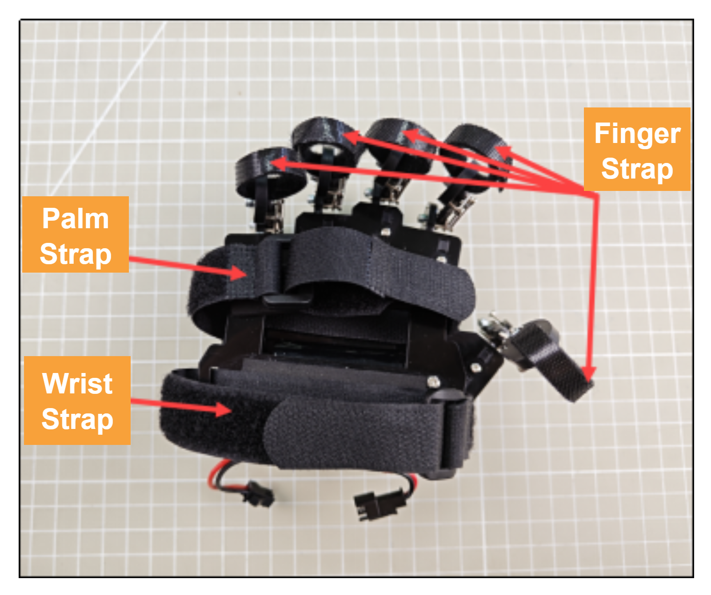
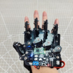

# 12. LeArm AI + Wireless Glove Course

## 12.1 Wireless Glove Overview and Wearing Instructions

The wireless glove consists of five potentiometers and communicates with the device via a Bluetooth module.

### 12.1.1 Wireless Glove Structure


**Potentiometer**: Located on the back of the glove, there are five potentiometers. These are key components used to control the opening and closing of the uHand UNO robotic hand.

**Gyroscope and Accelerometer Sensor** (`MPU6050`): This sensor captures the glove's acceleration and tilt angle across the X, Y, and Z axes. By rotating the wireless glove, you can trigger additional actions on the uHand UNO robotic hand.

**Bluetooth Module**: Enables wireless communication between the glove and the uHand UNO.

**Function Button**: Function description for the three buttons:

(1) `DEL`: Clears Bluetooth pairing history.

(2) `K3`: Switches between control modes on the wireless glove.

**Reset Button**: Restarts the wireless glove.

**LED Indicator**: Displays the current control mode of the wireless glove.

**USB Port**: Used to connect to a PC for debugging and firmware uploads.

**Power Port**: Connects to a lithium battery to power the glove. Standard voltage is 7.4V.

**Power Switch**

### 12.1.2 How to Wear the Wireless Glove



First open all the straps, and secure each finger strap at the last knuckle of each of the five fingers. Then, fasten the palm strap across the center of the palm, followed by the wrist strap around the wrist. The final fit should look like this. For more details, refer to the instructional video located in the same folder as this document:


Front View of Glove Fit Back View of Glove Fit

### 12.1.3 Device Pairing Instructions

(1) Turn on the power switch of the device you want to control. Make sure the Bluetooth module is properly plugged into the device.

(2) Wear the wireless glove on your right hand with your palm facing downward and make a fist. Power on the glove, you will see all mode indicator LEDs light up.


(3) Once the indicator LEDs turn off, open your hand. The mode LEDs will light up again. This completes the wireless glove's initialization process. **This step must be performed every time the wireless glove is restarted.**


(4) Press the `DEL` button to clear any previous Bluetooth pairing records.

(5) Once the records are cleared, the `STA` (status) indicator will start blinking, and the glove will automatically attempt to pair with the device. When the pairing is successful, the `STA` indicator will stay solid.


### 12.1.4 Switching Control Modes

You can switch between control modes using the `K3` button located on the wireless glove's controller. The LED indicators (`D1`–`D5`) will show which mode is currently selected.


Refer to the table below for the LED patterns and their corresponding control modes:

| **LED Status (D1–D5)** | **Selected Mode** |
|:---:|:---:|
| All LEDs off | Bionic Robot Control Mode |
| 1 LED on (D1) | Palm Control Mode (Right Hand) |
| 2 LEDs on (D1, D2) | Tank Chassis Control Mode |
| 3 LEDs on (D1, D2, D3) | Robotic Arm Control Mode (PWM Servo Drive) |
| 4 LEDs on (D1, D2, D3, D4) | Palm Control Mode (Left Hand) |
| 5 LEDs on (D1, D2, D3, D4, D5) | Robotic Arm Control Mode (Bus Servo Drive) |

### 12.1.5 Control Mode Overview

The wireless glove offers four control modes designed to work with different categories of products, including bionic robots, palm-type robotic hands, tank chassis robots, and robotic arms with built-in Bluetooth modules. The table below provides example products for each category:

| **Product Category** | **Example Products** |
|:---:|:---:|
| Bionic Robot Series | Narrow-legged Robot, Cross-legged Robot, Spiderbot |
| Tank Chassis Robots | Tankbot |
| Robot Hand Series | uHand, uHand UNO |
| Robotic Arm Series | LeArm AI, xArm 1S, MiniArm |

* **Bionic Robot Control**

Bionic robots are primarily controlled through hand gestures to perform action groups:

| **Gesture Description** | **Gesture Illustration** | **Robot Action (First-Person Perspective)** |
|:---:|:---:|:---:|
| Middle finger extended, ring finger curled, palm tilted to the right |  | Turn Right |
| Middle finger extended, ring finger curled, palm tilted to the left |  | Turn Left |
| Palm facing down, fist clenched |  | Stop |
| Palm facing down, fingers open (middle finger extended) |  | Move Forward |
| Palm facing up, middle finger bent, pinky extended (Spiderman pose) |  | Move Backward |
| Palm facing up, fingers open |  | Stop |

* **Tank Chassis Control**

The tank chassis robot can be controlled using specific hand gestures. The following table lists the recognized gestures and the corresponding movement responses from the chassis:

<table class="docutils-nobg" border="1">
  <thead>
    <tr>
      <th>Initial Gesture</th>
      <th>Gesture Description (User's Perspective)</th>
      <th>Gesture Illustration</th>
      <th>Tank Chassis Response (Robot's Perspective)</th>
    </tr>
  </thead>
  <tbody>
    <tr>
      <td rowspan="4">Palm facing down, index and middle fingers extended and together, other fingers curled in</td>
      <td>Wrist tilted upward so the two extended fingers point slightly forward and upward</td>
      <td></td>
      <td>Move Forward</td>
    </tr>
    <tr>
      <td>Wrist bent downward, so the two extended fingers point forward and downward.</td>
      <td></td>
      <td>Move Backward</td>
    </tr>
    <tr>
      <td>Rotate wrist clockwise so the palm faces directly left</td>
      <td></td>
      <td>Rotate in place clockwise</td>
    </tr>
    <tr>
      <td>Rotate wrist counterclockwise so the palm faces directly right</td>
      <td></td>
      <td>Rotate in place counterclockwise</td>
    </tr>
    <tr>
      <td colspan="3">Any other gesture</td>
      <td>Stop</td>
    </tr>
  </tbody>
</table>

* **Robotic Hand Control**

The robotic hand is controlled by flexing or straightening individual fingers:

<table class="docutils-nobg" border="1">
  <tr>
    <th>Potentiometer</th>
    <th>Gesture Illustration</th>
    <th>Controlled Servo</th>
  </tr>
  <tr>
    <td colspan="2">Thumb</td>
    <td>Servo 1</td>
  </tr>
  <tr>
    <td colspan="2">Index Finger</td>
    <td>Servo 2</td>
  </tr>
  <tr>
    <td colspan="2">Middle Finger</td>
    <td>Servo 3</td>
  </tr>
  <tr>
    <td colspan="2">Ring Finger</td>
    <td>Servo 4</td>
  </tr>
  <tr>
    <td colspan="2">Pinky Finger</td>
    <td>Servo 5</td>
  </tr>
  <tr>
    <td>With your palm facing down, fingers extended, rotate your wrist clockwise.</td>
    <td></td>
    <td>The pan-tilt servo rotates counterclockwise (robot's perspective).</td>
  </tr>
  <tr>
    <td>With your palm facing down, fingers extended, rotate your wrist counterclockwise.</td>
    <td></td>
    <td>The pan-tilt servo rotates clockwise (robot's perspective).</td>
  </tr>
</table>


* **Robotic Arm Control**

Specific hand gestures are used to control individual servos of the robotic arm. The table below outlines each gesture and the corresponding servo it controls:

<table class="docutils-nobg" border="1">
  <tr>
    <th>Initial Gesture</th>
    <th>Gesture Description</th>
    <th>Gesture Illustration</th>
    <th>Controlled Servo</th>
  </tr>
  <tr>
    <td rowspan="6">Palm facing down</td>
    <td>Extend index finger, tilt palm left or right</td>
    <td></td>
    <td>Servo 1</td>
  </tr>
  <tr>
    <td>Palm facing down, extend index and middle fingers, tilt palm left or right</td>
    <td></td>
    <td>Servo 2</td>
  </tr>
  <tr>
    <td>Palm facing down, extend middle, ring, and pinky fingers, tilt palm left or right.</td>
    <td></td>
    <td>Servo 3</td>
  </tr>
  <tr>
    <td>Palm facing down, extend four fingers (excluding thumb), tilt palm left or right.</td>
    <td></td>
    <td>Servo 4</td>
  </tr>
  <tr>
    <td>Palm facing down, extend all five fingers, tilt palm left or right.</td>
    <td></td>
    <td>Servo 5</td>
  </tr>
  <tr>
    <td>Palm facing down, make a fist, tilt palm left or right.</td>
    <td></td>
    <td>Servo 6</td>
  </tr>
</table>

## 12.2 Wireless Glove Control

### 12.2.1 Project Introduction

In this lesson, a wireless glove is used to control the robotic arm in the program.

### 12.2.2 Project Process


### 12.2.3 Module Instruction


The wireless glove uses potentiometers to detect finger movement, and the `MPU6050` sensor collects acceleration and tilt data across the X, Y, and Z axes. Wireless communication is achieved via a Bluetooth module. It is equipped with function buttons for clearing pairing history and switching modes, a reset button, LED indicators for mode display, a USB port for debugging and uploading code, and a power port to connect a 7.4V lithium battery for power supply.

### 12.2.4 Program Download

[Source Code](../_static/source_code/LeArm_Wireless_Glove_Course.zip)

(1) Connect the core board to the computer using a USB cable.


(2) Locate the corresponding Arduino project file in the same directory as this document.


(3) Select the development board model when you open the program,and the specific model is shown in the figure below.


(4) Click **"Compile"** first, then click **"Upload"**. After the upload is completed, the program download is completed if the following interface appears in the output box below the software.


### 12.2.5 Project Outcome

(1) Set the control mode of the motion-sensing glove to Mode 5 (Bus Servo Robotic Arm Control Mode) using the `K3` button. At this point, LEDs `D1` to `D5` will light up.

(2) After uploading the program to the robotic arm, turn on the servo control board to pair the wireless glove by pressing the **"DEL"** button on the glove. Wait briefly for pairing to complete. If pairing fails, press the button a few more times.

(3) Then, specific hand gestures are used to control individual servos of the robotic arm. The table below outlines each gesture and the corresponding servo it controls:

<table class="docutils-nobg" border="1">
  <tr>
    <th>Initial Gesture</th>
    <th>Description</th>
    <th>Gesture Illustration</th>
    <th>Controlled Servo</th>
  </tr>
  <tr>
    <td rowspan="6">Palm facing down</td>
    <td>Extend index finger, tilt palm left or right</td>
    <td></td>
    <td>Servo 1</td>
  </tr>
  <tr>
    <td>Palm facing down, extend index and middle fingers, tilt palm left or right</td>
    <td></td>
    <td>Servo 2</td>
  </tr>
  <tr>
    <td>Palm facing down, extend middle, ring, and pinky fingers, tilt palm left or right</td>
    <td></td>
    <td>Servo 3</td>
  </tr>
  <tr>
    <td>Palm facing down, extend four fingers (excluding thumb), tilt palm left or right</td>
    <td></td>
    <td>Servo 4</td>
  </tr>
  <tr>
    <td>Palm facing down, extend all five fingers, tilt palm left or right</td>
    <td></td>
    <td>Servo 5</td>
  </tr>
  <tr>
    <td>Palm facing down, make a fist, tilt palm left or right</td>
    <td></td>
    <td>Servo 6</td>
  </tr>
</table>


### 12.2.6 Program Brief Analysis

:::{Note}
The wireless glove communicates with the robotic arm via Bluetooth. The command frame format, protocol parsing, and control logic are consistent with the **"App Control"** section in the Remote Control. Please refer to that section for more details. The explanation here focuses on specific implementation details.
:::

* **ino File (Application Layer)**

(1) Import the following libraries: `config.h`, `Hiwonder.hpp`, `Robot_arm.hpp`, and `PC_BLE_CTL.hpp`. The `Robot_arm.hpp` file contains the definition of the robotic arm object, while `PC_BLE_CTL.hpp` includes the definition of the Bluetooth receiver object.

{lineno-start=1}

```cpp
#include "Config.h"
#include "Hiwonder.hpp"
#include "Robot_arm.hpp"
#include "./src/PC_BLE/PC_BLE_CTL.hpp"
```

(2) Objects for the LED, buzzer, robotic arm, and Bluetooth receiver are created for later use in control operations.

{lineno-start=8}

```cpp
Led_t led_obj;
Buzzer_t buzzer_obj;
LeArm_t arm;
PC_BLE_CTL pc_ble_obj;
```

(3) In the `setup()` function:

① First delay for 1000 ms (1 second), then power off the Bluetooth module. Next, initialize the robotic arm, LED, and buzzer objects, then open the serial port and set the baud rate to 9600.

② The Bluetooth receiver object is initialized, and the buzzer beeps once for feedback.

{lineno-start=11}

```cpp
void setup() {
  delay(1000);
  pinMode(IO_BLE_CTL, OUTPUT);
  digitalWrite(IO_BLE_CTL, HIGH);  // Set the Bluetooth control pin to low level to power off the Bluetooth module (设置蓝牙控制引脚为低电平时，断开蓝牙模块电源)

  arm.init();
  led_obj.init(IO_LED);
  buzzer_obj.init(IO_BUZZER);

  Serial.begin(9600);
  delay(2000);

  pc_ble_obj.init(1);

  buzzer_obj.blink(1500, 100, 100, 1);
}
```

(4) In the main loop (`loop()` function), the Bluetooth receiver controller is activated.

{lineno-start=28}

```cpp
void loop() {
  pc_ble_obj.PC_BLE_Task(&arm , &led_obj , &buzzer_obj);
}
```

* **PC_BLE_CTL.cpp File (Low-Level)**

(1) PC_BLE_Task – Main Bluetooth Receiver Function

① Within the main Bluetooth control function, the `unpack()` method is first called to decode incoming Bluetooth data. If decoding is successful, the command field (`packet.cmd`) is checked to determine which action to perform.

② The wireless glove controls the rotation of multiple servos in the robotic arm. At the communication protocol level, it sends command frames of the type **"Control Single/Multiple Servo PWM"**, which corresponds to Function Code 3 in the message definition. When `case 3` is triggered, the control mode is set to `APP_FUNC_MULT_SERVO_MOVE`.

{lineno-start=108}

```cpp
void PC_BLE_CTL::PC_BLE_Task(LeArm_t* robot,Led_t* led,Buzzer_t* buzzer)
{
  unpack();
  if(unpack_successful)
  {
    unpack_successful = false;
    if(packet.cmd == APP_ACTION_GROUP_RUN)
    {
      robot->action_group_reset();
    }
    status = (AppFunctionStatus)packet.cmd;
  }

  uint8_t send_data[30] = {0};
  
  switch (status)
  {
      case APP_VERSION_QUERY:{
        send_data[0] = APP_VERSION_QUERY;
        send_data[1] = SERVO_TYPE;
        send_data[2] = SOFTWARE_VERSION;
        delay(30);
        packet_transmit(send_data, 3);
        memset(send_data, 0, sizeof(send_data));
        status = APP_FUNC_NULL;
      }break;

      case APP_SERVO_OFFSET_READ:{
        send_data[0] = APP_SERVO_OFFSET_READ;
        for (uint8_t i = 0; i < 6; i++)
        {
          send_data[(2 * i) + 1] = 1 + i;
          send_data[(2 * i) + 2] = (uint8_t)robot->offset_read(1 + i);
        }
        delay(20);
        packet_transmit(send_data, 13);
        memset(send_data, 0, sizeof(send_data));
        status = APP_FUNC_NULL;
      }break;
  
```

③ Within the `APP_FUNC_MULT_SERVO_MOVE` branch, the number of servos to control and the motion duration are extracted from the data packet. A loop iterates through the packet to read each servo's ID and duty cycle. The `knot_run()` function is then called to control the corresponding servo motor based on the parsed values.

{lineno-start=148}

```cpp
      case APP_MULT_SERVO_MOVE:{
          servos_count = packet.buffer[0];
          servos_count = packet.buffer[0];
          running_time = MERGE_HL(packet.buffer[2], packet.buffer[1]);
          for (uint8_t i = 0; i < servos_count; i++)
          {
              set_id = packet.buffer[3 + i * 3];
              set_duty = MERGE_HL(packet.buffer[5 + i * 3], packet.buffer[4 + i * 3]);
              robot->knot_run(set_id, set_duty, running_time);
          }
          status = APP_FUNC_NULL;
      }break;
```