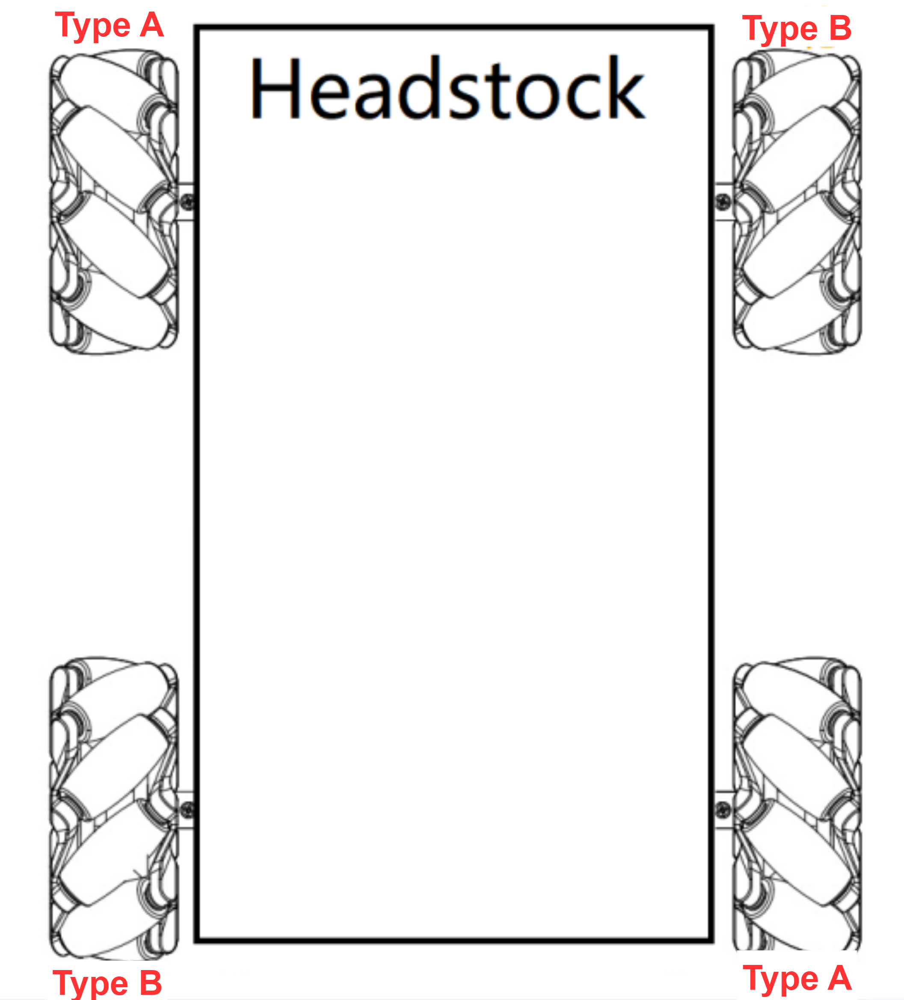

# 13. LeArm AI + Mecanum Wheel Chassis Course

## 13.1 Mecanum Wheel Chassis Overview

### 13.1.1 Introduction


The Mecanum wheel chassis is an omnidirectional vehicle platform, distinguished by its use of Mecanum wheels. These specialized wheels enable full-directional movement — including forward, backward, lateral, and diagonal motion — granting the robot high flexibility and mobility.

(1) Omnidirectional Movement

Thanks to the Mecanum wheels, this chassis can move freely in all directions. It can travel forward, backward, strafe left and right, and even move diagonally. This capability allows the chassis to react and adapt quickly in complex environments.

(2) Compact Design

The compact structure of the Mecanum wheel chassis makes it suitable for environments with spatial constraints.

(3) Efficient Motion Performance

With its ability to move in any direction, the chassis offers quick and efficient positioning, boosting overall performance in various applications.

<p id="anchor_13_1_2"></p>

### 13.1.2 Mecanum Wheel Hardware Introduction

* **Hardware Structure**

The Mecanum wheel chassis uses Mecanum wheels as both the drive mechanism and the structural support for movement. These wheels are the core components of the chassis. Each Mecanum wheel consists of multiple rollers mounted evenly around the circumference of the wheel hub. These rollers are angled relative to the hub axis, typically at 45 degrees. The generatrix of the rollers is approximately shaped as an equiangular spiral or an elliptical arc. When the wheel rotates around its axis, the envelope traced by the peripheral rollers forms a cylindrical surface, allowing the chassis to roll smoothly in the intended direction.


(1) Physical Characteristics

The Mecanum wheel chassis features several physical characteristics:

① Omnidirectional Mobility: The omnidirectional movement of a Mecanum wheel is based on a central wheel with multiple rollers mounted around its circumference. These angled rollers convert part of the wheel's rotational force into a normal force, producing a resultant vector that allows the platform to move freely in any direction—without changing the wheel's orientation.

② Continuous Rolling: The rollers on the edge of each Mecanum wheel are diagonally positioned, allowing the wheel to slide sideways. The rollers follow a unique path. When the wheel rotates around its central axis, the roller surfaces form a cylindrical envelope, allowing the robot to roll continuously in a given direction.

③ Compact Design: Mecanum wheels have a compact mechanical structure that allows for efficient and flexible movement, making them one of the most effective designs for omnidirectional motion.

④ Flexible Movement: By independently adjusting the speed and direction of the four wheels, the Mecanum chassis can perform a wide range of movements.

### 13.1.3 Learning Guide

You can follow the steps below to learn how the Mecanum wheel chassis operates and how it integrates with the LeArm AI robotic arm:

| **Path**                                                    | **Description**                                              |
| :---------------------------------------------------------- | :----------------------------------------------------------- |
| [13.1.2 Mecanum Wheel Chassis Installation](#anchor_13_1_2) | Learn how to assemble the chassis from separate components, mount the robotic arm onto the chassis, and complete the wiring process. |
| [13.2 Wireless Controller Control](#anchor_13_2)            | Learn how to use a PS2 controller to operate the robotic arm and Mecanum chassis. |
| [13.3 APP Control](#anchor_13_3)                            | Learn how to use the APP to operate the robotic arm and Mecanum chassis. |
| [13.4 Mecanum Chassis Kinematics Analysis](#anchor_13_4)    | Study the kinematic modeling and parameter derivation for the Mecanum wheel chassis. |

<p id="anchor_13_2"></p>

## 13.2 Wireless Controller Control

### 13.2.1 Project Introduction

In this lesson, a PS2 wireless controller is used to control both the robotic arm and the Mecanum wheel chassis.

### 13.2.2 Project Process


### 13.2.3 Module Instruction


The PS2 controller communicates with the controller via a receiver using a 2.4G wireless signal. The controller has two modes, which can be toggled using the **MODE** button.

### 13.2.4 Program Download

[Source Code](../_static/source_code/LeArm_Mecanum_Wheel_Chassis_Course.zip)

(1) Connect the core board to the computer using a USB cable.


(2) Locate the corresponding Arduino project file in the same directory as this document.


(3) Select the development board model when you open the program, and the specific model is shown in the figure below.


(4) Click **"Compile"** first, then click **"Upload"**. After the upload is completed, the program download is completed if the following interface appears in the output box below the software.


### 13.2.5 Project Outcome

When the controller is in digital mode (only green light on), the robotic arm will not respond to control inputs.

When in analog mode, both red and green lights on, the robotic arm can be controlled. Pressing any button together with **SELECT** will trigger a predefined motion group.

The following table explains how the joysticks function in analog mode:

| Button | Function |
| :--------: | :----------: |
| Left joystick moves in any direction | Controls the linear movement direction of the chassis car. <br> When released, the linear velocity resets to zero. |
| Right joystick moves left or right | Controls the chassis car to rotate counterclockwise or clockwise. <br> When released, the angular velocity resets to zero. |


### 13.2.6 Program Brief Analysis

:::{Note}
The controller input handling and protocol parsing are explained in detail in the earlier lesson titled [13.2 Wireless Controller Control](#anchor_13_2). This section highlights only the differences specific to this project.
:::

* **ino File (Application Layer)**

(1) Imports the following libraries: `config.h`, `Hiwonder.hpp`, `Robot_arm.hpp`, `PS2_CTL.hpp`, and `motor.hpp`. `Hiwonder.hpp` defines the LED, buzzer, and button objects. `Robot_arm.hpp` defines the robotic arm object. `PS2_CTL.hpp` defines the PS2 controller object. `motor.hpp` defines the chassis object.

{lineno-start=1}

```python
#include "Config.h"
#include "Hiwonder.hpp"
#include "Robot_arm.hpp"
#include "IIC.hpp"
#include "./src/PS2/PS2_CTL.hpp"
#include "motor.hpp"
```

(2) Creates objects for the LED, buzzer, robotic arm, PS2 controller, IIC, and chassis.

{lineno-start=8}

```python
Led_t led_obj;
Buzzer_t buzzer_obj;
LeArm_t arm;
PS2_CTL ps2;
IIC iic;
Motor motors_obj;
```

(3) In the `setup` function, first delay for 1000 ms (1 second), then power off the Bluetooth module. Next, initialize the robotic arm, LED, buzzer, I2C, and chassis objects, then open the serial port and set the baud rate to 9600.

{lineno-start=15}

```python
void setup() {
  delay(1000);
  pinMode(IO_BLE_CTL, OUTPUT);
  digitalWrite(IO_BLE_CTL, LOW);  // Set the Bluetooth control pin to low level to power off the Bluetooth module (设置蓝牙控制引脚为低电平时，断开蓝牙模块电源)

  arm.init();
  led_obj.init(IO_LED);
  buzzer_obj.init(IO_BUZZER);
  ps2.init();
  iic.init();
  motors_obj.init(&iic);

  Serial.begin(9600);
  delay(2000);
  motors_obj.set_type(MOTOR_TYPE_JGB37_520_12V_110RPM);
  delay(200);
  motors_obj.set_polarity(0);
  delay(500);
  Serial.println("begin");
}
```

(4) In the main loop, the program enters the `ps2_Task` function to process controller data.

{lineno-start=36}

```python
void loop() {
  ps2.PS2_Task(&arm, &led_obj, &buzzer_obj, &motors_obj);
}
```

* **ps2_CTL.cpp File (Low-Level)**

(1) In the `PS2_Task` function, the `receive_msg` method is first called to obtain data sent by the PS2 controller and store it in the button state. Next, the `get_result` method is called to control the robotic arm based on the button state.

{lineno-start=22}

```python
void PS2_CTL::PS2_Task(LeArm_t* robot,Led_t* led,Buzzer_t* buzzer,Motor* motors_obj)
{
  static uint8_t first_flag = 1;
  if(first_flag!=0)
  {
    first_flag = 0;
    if(mode_count == PS2_SINGLE_SERVO_MODE)
    {
      led->blink(250,250,0);
    }else{
      led->blink(250,0,0);
    }
  }
  receive_msg();
  get_result(robot,led,buzzer,motors_obj);
}
```

(2) In the `receive_msg` function, which handles data retrieval and unpacking, the length of the received data is first checked. If the length is not zero, it indicates that data has been received, and the unpacking process begins. Using a state machine, the function first identifies the frame header, then extracts the data length from the frame, and finally starts retrieving the data content.

{lineno-start=47}

```python
void PS2_CTL::receive_msg(void)
{
  static uint8_t step = 0;
  static uint8_t index = 0;
  while (Serial_PS2.available()>0) {
    switch(step){
      case 0:{
        if(Serial_PS2.read() == FRAME_HEADER)
        {
          step++;
        }
      }break;
      case 1:{
        if(Serial_PS2.read() == FRAME_HEADER)
        {
          index = 0;
          step++;
        }else{
          step = 0;
        }
      }break;
      case 2:{
        recbuff[index++] = Serial_PS2.read();
        if(index > 9)
        {
          rec_flag = true;
          step = 0;
        }
      }break;
      default:{
        step = 0;
      }break;
    }
```

(3) First, the mode of the PS2 controller is determined by checking bytes 6 to 9 in the buffer. It identifies whether the controller is in digital mode (`PS2_SINGLE_SERVO_MODE`) or analog mode (`PS2_COORDINATE_MODE`).

{lineno-start=81}

```python
    if(rec_flag)
    {
      if(recbuff[9] == 0x80 && recbuff[8] == 0x80)
      {
        keyvalue.mode = PS2_SINGLE_SERVO_MODE;
      }else{
        keyvalue.mode = PS2_COORDINATE_MODE;
      }
```

(4) Then, based on the detected PS2 mode, different assignment logics are executed accordingly. If the controller is in digital mode, the function reads bytes 3 to 7 from the data buffer to determine the states of buttons such as triangle and circle, as well as whether the joysticks have been pressed. For the joysticks, only simple directional inputs are read: whether the left joystick has moved left (`bit_left`) or right (`bit_right`), and whether the right joystick has moved up (`bit_up`) or down (`bit_down`). Each joystick only has two states: stationary or moved.

{lineno-start=103}

```python
      switch(keyvalue.mode){
        case PS2_SINGLE_SERVO_MODE:
          keyvalue.bit_left = recbuff[6] == 0x00 ? 1 : 0;
          keyvalue.bit_right = recbuff[6] == 0xFF ? 1 : 0;
          keyvalue.bit_up = recbuff[7] == 0x00 ? 1 : 0;
          keyvalue.bit_down = recbuff[7] == 0xFF ? 1 : 0;
          break;
```

(5) In analog mode, data is extracted from bytes 3–4 and 6–9 to determine which buttons, like triangle and circle, are pressed and whether either joystick is pressed down. For the joysticks, the movement position parameters of both the left and right joysticks are read, and their values are assigned respectively to the left joystick's x and y positions and the right joystick's x and y positions.

{lineno-start=90}

```python
      keyvalue.bit_triangle = 	recbuff[3] & 0xFF;
      keyvalue.bit_circle = 	(recbuff[3] & 0xFF) >> 1;
      keyvalue.bit_cross = 		(recbuff[3] & 0xFF) >> 2;
      keyvalue.bit_square = 	(recbuff[3] & 0xFF) >> 3;
      keyvalue.bit_l1 =  		(recbuff[3] & 0xFF) >> 4;
      keyvalue.bit_r1 =  		(recbuff[3] & 0xFF) >> 5;
      keyvalue.bit_l2 =  		(recbuff[3] & 0xFF) >> 6;
      keyvalue.bit_r2 =  		(recbuff[3] & 0xFF) >> 7;
      keyvalue.bit_select = 	recbuff[4] & 0xFF;
      keyvalue.bit_start = 		(recbuff[4] & 0xFF) >> 1;
      keyvalue.bit_leftjoystick_press =  (recbuff[4] & 0xFF) >> 2;
      keyvalue.bit_rightjoystick_press = (recbuff[4] & 0xFF) >> 3;
```

(6) Then, based on byte 5, the function updates the status of the directional buttons: `bit_up`, `bit_right`, `bit_down`, and `bit_left`.

{lineno-start=116}

```python
          switch(recbuff[5])
          {
            case 0x00:
              keyvalue.bit_up = 1;
              break;
            
            case 0x01:
              keyvalue.bit_up = 1;
              keyvalue.bit_right = 1;
              break;
            
            case 0x02:
              keyvalue.bit_right = 1;
              break;
            
            case 0x03:
              keyvalue.bit_down = 1;
              keyvalue.bit_right = 1;
              break;
            
            case 0x04:
              keyvalue.bit_down = 1;
              break;
            
            case 0x05:
              keyvalue.bit_down = 1;
              keyvalue.bit_left = 1;
              break;
            
            case 0x06:
              keyvalue.bit_left = 1;
              break;
            
            case 0x07:
              keyvalue.bit_up = 1;
              keyvalue.bit_left = 1;
              break;
            
            case 0x0F:
              keyvalue.bit_up = 0;
              keyvalue.bit_down = 0;
              keyvalue.bit_left = 0;
              keyvalue.bit_right = 0;
              break;
          }
          break;
      }
      break;
    }
  }
}
```

(7) Once the data has been fully processed, the `get_result` function uses the button states to control the robotic arm triggering the appropriate actions.

* **Example: Controlling Tank Movement**

(1) For controlling the tank movement, the forward/backward movement speed `y` is determined by the vertical displacement of the left joystick, and the rotational speed `rx` is determined by the horizontal displacement of the right joystick.

(2) When the forward/backward speed is 0, based on kinematic analysis, the left motor speed is set to the rotational speed `rx`, and the right motor speed is set to the negative rotational speed `–rx`.

(3) Based on kinematic analysis, when the forward/backward speed is negative, the left motor speed is set to the current speed multiplied by (1 + `rx` × 0.01). Based on kinematic analysis, when the forward/backward speed is positive, the right motor speed is set to the current speed multiplied by (1 − `rx` × 0.01).

{lineno-start=435}

```
      /* The x-axis of the joystick points to the right, and the y-axis points downward (手柄的x轴方向往右，y轴方向往下) */
      int x = map((float)((uint32_t)keyvalue.left_joystick_x), 0.0f, 255.0f, -100.0f, 100.0f); // Lateral movement (左右平移)
      int y = -map((float)((uint32_t)keyvalue.left_joystick_y), 0.0f, 255.0f, -100.0f, 100.0f); // Forward and backward movement (前后运动)
      int rx = map((float)((uint32_t)keyvalue.right_joystick_x), 0.0f, 255.0f, -100.0f, 100.0f); // Rotation (旋转)

      // Calculate the speed of the four wheels (计算四个轮子的速度)
      int Forward_Left = y + x; // Front left wheel: forward/backward + left/right (前左轮：前后 + 左右)
      int Forward_Right = y - x; // Front right wheel: forward/backward - left/right (前右轮：前后 - 左右)
      int Backward_Left = y - x; // Rear left wheel: forward/backward - left/right (后左轮：前后 - 左右)
      int Backward_Right = y + x; // Rear right wheel: forward/backward + left/right (后右轮：前后 + 左右)

      // Limit speed within -100 to 100 (optional) (限制速度在 -100~100 之间（可以不用）)
      Forward_Left = (Forward_Left < -100) ? -100 : (Forward_Left > 100)? 100 : Forward_Left;
      Forward_Right = (Forward_Right < -100)? -100 : (Forward_Right > 100)? 100 : Forward_Right;
      Backward_Left = (Backward_Left < -100)? -100 : (Backward_Left > 100)? 100 : Backward_Left;
      Backward_Right = (Backward_Right < -100)? -100 : (Backward_Right > 100)? 100 : Backward_Right;

      if(x == 0 && y == 0)
      {
        Forward_Left = rx;
        Forward_Right = -rx;
        Backward_Left = rx;
        Backward_Right = -rx;
      }else if(rx < 0){
        Forward_Left = (Forward_Left*(100+rx)/100);
        Backward_Left = (Backward_Left*(100+rx)/100);
      }else{
        Forward_Right = (Forward_Right*(100-rx)/100);
        Backward_Right = (Backward_Right*(100-rx)/100);
      }

      motors_speed[0] = Forward_Right;
      motors_speed[1] = -Backward_Right;
      motors_speed[2] = -Forward_Left;
      motors_speed[3] = Backward_Left;

      motors->set_speed(motors_speed);
    }
  }
  return 0;
}
```

<p id="anchor_13_3"></p>

## 13.3 APP Control

### 13.3.1 Project Introduction

In this lesson, you'll use an app to control both the robotic arm and the Mecanum-wheeled chassis.

### 13.3.2 Project Process


### 13.3.3 Introduction to APP


This lesson uses the dedicated LeArm app — Wonderbot — to control the robotic arm and chassis through various function icons.

:::{Note}
Before starting this lesson, please make sure you have completed [2. Remote Control->2.2 App Control](2.Remote_Control.md#app-usage-instructions) and are familiar with the function icons in the app interface.
:::

### 13.3.4 Program Download

[Source Code](../_static/source_code/LeArm_Mecanum_Wheel_Chassis_Course.zip)

(1) Connect the core board to the computer using a USB cable.


(2) Locate the corresponding Arduino project file in the same directory as this document.


(3) Select the development board model when you open the program, and the specific model is shown in the figure below.


(4) Click **"Compile"** first, then click **"Upload"**. After the upload is completed, the program download is completed if the following interface appears in the output box below the software.


### 13.3.5 Project Outcome

After powering on the robotic arm, use the app to control the movement of both the arm and the chassis.


### 13.3.6 Program Brief Analysis

:::{Note}
The control processing and protocol parsing for the app have been explained in detail in [ 2. Remote Control->2.2 App Usage Instructions](2.Remote_Control.md#app-usage-instructions). Only the differences in processing is introduced in this lesson.
:::

* **ino File (Application Layer)**

(1) Imports the following libraries: `config.h`, `Hiwonder.hpp`, `Robot_arm.hpp`, `PS2_CTL.hpp`, and `motor.hpp`. `Hiwonder.hpp` defines the LED, buzzer, and button objects. `Robot_arm.hpp` defines the robotic arm object. `PS2_CTL.hpp` defines the PS2 controller object. `motor.hpp` defines the chassis object.

{lineno-start=1}

```python
#include "Config.h"
#include "Hiwonder.hpp"
#include "Robot_arm.hpp"
#include "IIC.hpp"
#include "./src/PC_BLE/PC_BLE_CTL.hpp"
#include "motor.hpp"
```

(2) Creates objects for the LED, buzzer, robotic arm, PS2 controller, IIC, and chassis.

{lineno-start=8}

```python
Led_t led_obj;
Buzzer_t buzzer_obj;
LeArm_t arm;
PC_BLE_CTL pc_ble_obj;
IIC iic;
Motor motors_obj;
```

(3) In the `setup` function, first delay for 1000 ms (1 second), then power off the Bluetooth module. Next, initialize the robotic arm, LED, buzzer, I2C, and chassis objects, then open the serial port and set the baud rate to 9600.

(4) In the main loop, the program enters the `ps2_Task` function to process controller data.

{lineno-start=32}

```python
void loop() {
  pc_ble_obj.PC_BLE_Task(&arm , &led_obj , &buzzer_obj , &motors_obj);
}
```

* **PC_BLE_CTL.cpp File (Low-Level)**

(1) In the `PS2_Task` function, the `receive_msg` method is first called to obtain data sent by the PS2 controller and store it in the button state. Next, the `get_result` method is called to control the robotic arm based on the button state.

{lineno-start=107}

```python
/* header header len cmd count time [id duty] */
void PC_BLE_CTL::PC_BLE_Task(LeArm_t* robot,Led_t* led,Buzzer_t* buzzer,Motor* motors)
{
  static uint8_t car_run_flag = 0;
  static uint32_t last_car_run_time = 0;
  uint8_t send_data[30] = {0};
  static int8_t motors_speed[4] = {0,0,0,0};

  unpack();
  if(unpack_successful)
  {
    unpack_successful = false;
    if(packet.cmd == APP_ACTION_GROUP_RUN)
    {
      robot->action_group_reset();
    }
    status = (AppFunctionStatus)packet.cmd;
  }

  switch (status)
  {
      case APP_VERSION_QUERY:{
        send_data[0] = APP_VERSION_QUERY;
        send_data[1] = SERVO_TYPE;
        send_data[2] = SOFTWARE_VERSION;
        delay(50);
        packet_transmit(send_data, 3);
        memset(send_data, 0, sizeof(send_data));
        status = APP_FUNC_NULL;
      }break;

      case APP_SERVO_OFFSET_READ:{
```

(2) Then, based on byte 5, the function updates the status of the directional buttons: `bit_up`, `bit_right`, `bit_down`, and `bit_left`.

{lineno-start=216}

```python
          switch(packet.buffer[0]){
            case 0: //Stop (停止)
              break;
            case 1: //Move left (左平移)
              x = -100;
              break;
            case 2: //Move forward left (左上平移)
              x = -50;
              y = 50;
              break;
            case 3: //Move forward (前进)
              y = 100;
              break;
            case 4: //Move forward right (右上平移)
              x = 50;
              y = 50;
              break;
            case 5: //Move right (右平移)
              x = 100;
              break;
            case 6: //Move backward right (右下平移)
              x = 50;
              y = -50;
              break;
            case 7: //Move backward (后退)
              y = -100;
              break;
            case 8: //Move backward left (左下平移)
              x = -50;
              y = -50;
              break;
          }
          switch(packet.buffer[1]){
            case 0: //Stop (停止)
              break;
            case 1: //Rotate left (左旋转)
              rx = -100;
              break;
            case 2: //Rotate right (右旋转)
              rx = 100;
              break;
          }
```

(3) Once the data has been fully processed, the `get_result` function uses the button states to control the robotic arm triggering the appropriate actions.

* **Example: Controlling Tank Movement**

(1) For controlling the tank movement, the forward/backward movement speed `y` is determined by the vertical displacement of the left joystick, and the rotational speed `rx` is determined by the horizontal displacement of the right joystick.

(2) When the forward/backward speed is 0, based on kinematic analysis, the left motor speed is set to the rotational speed `rx`, and the right motor speed is set to the negative rotational speed `–rx`.

(3) Based on kinematic analysis, when the forward/backward speed is negative, the left motor speed is set to the current speed multiplied by (1 + `rx` × 0.01). Based on kinematic analysis, when the forward/backward speed is positive, the right motor speed is set to the current speed multiplied by (1 − `rx` × 0.01).

{lineno-start=259}

```
          int Forward_Left = y + x; // Front left wheel: forward/backward + left/right (前左轮：前后 + 左右)
          int Forward_Right = y - x; // Front right wheel: forward/backward - left/right (前右轮：前后 - 左右)
          int Backward_Left = y - x; // Rear left wheel: forward/backward - left/right (后左轮：前后 - 左右)
          int Backward_Right = y + x; // Rear right wheel: forward/backward + left/right (后右轮：前后 + 左右)
          if(x == 0 && y == 0)
          {
            Forward_Left = rx;
            Forward_Right = -rx;
            Backward_Left = rx;
            Backward_Right = -rx;
          }else if(rx < 0){
            Forward_Left = (Forward_Left*(100+rx)/100);
            Backward_Left = (Backward_Left*(100+rx)/100);
          }else{
            Forward_Right = (Forward_Right*(100-rx)/100);
            Backward_Right = (Backward_Right*(100-rx)/100);
          }
          motors_speed[0] = Forward_Right;
          motors_speed[1] = -Backward_Right;
          motors_speed[2] = -Forward_Left;
          motors_speed[3] = Backward_Left;
          status = APP_FUNC_NULL;
      }break;
```

<p id="anchor_13_4"></p>

## 13.4 Mecanum Chassis Kinematics Analysis

### 13.4.1 Overview

The wheels used on the Mecanum chassis are omnidirectional Mecanum wheels. Depending on the 45-degree roller orientation, Mecanum wheels can be classified into two mirror-image types: Type A and Type B, as shown in the diagram below.


Mecanum wheels are known for their omnidirectional mobility, flexibility, and smooth operation. As a highly successful omnidirectional wheel design, a set of four Mecanum wheels allows the robot chassis to achieve flexible and convenient movement in all directions.

### 13.4.2 Working Principle

* **Hardware Structure and Physical Characteristics**


A Mecanum wheel consists of a main wheel hub and multiple rollers mounted around the hub. The rollers are angled at 45 degrees relative to the axis of the hub. Typically, Mecanum wheels are used in sets of four, two left-handed wheels (Type A) and two right-handed wheels (Type B), which are arranged symmetrically.

There are several common configurations, such as AAAA, BBBB, AABB, ABAB, BABA, etc. However, not all configurations support full-range movement functions like forward/backward motion, rotation, and lateral movement. The Mecanum chassis uses the ABAB configuration, which enables true omnidirectional movement.



(1) Physical Characteristics

The motion of a Mecanum wheel robot is determined by the direction and speed of each individual wheel. The forces generated by each wheel combine to produce a resultant force vector, allowing the robot to move freely in any desired direction without changing the orientation of the wheels.

Because of the angled rollers distributed around the edge of the wheel, lateral movement is also possible. The rollers follow a unique path. When the wheel rotates around its central axis, the roller surfaces form a cylindrical envelope, allowing the robot to roll continuously in a given direction.

### 13.4.3 Motion Analysis

Let's take the example of a wheel rotating forward and analyze only the rollers in contact with the ground. When the wheel rotates forward, the roller in contact with the ground can be considered as a stationary point with friction. The ground provides a forward friction force to the roller. This friction force can be decomposed into two components: one along the roller axis and one perpendicular to it. The analysis is as follows:


The component perpendicular to the roller axis causes the roller to rotate, which is rolling friction that is very small and has little effect on the overall movement of the wheel. It can be considered that this force is negligible since it is offset by the roller's rotation.

However, because the roller has physical constraints and cannot roll along the direction parallel to its own axis, the component parallel to the roller axis results in sliding friction. This sliding friction is crucial to the movement of the wheel. The direction of this force determines the actual moving direction when the wheel rolls forward. In other words, when this Mecanum wheel rolls forward, it actually moves diagonally forward to the left.

:::{Note}
The force analysis here focuses on the roller in contact with the ground. The roller directly above it is perpendicular to this contact roller. In the force analysis sections of later lessons, a top-down view is taken, and the force direction corresponds to the direction perpendicular to the upper roller.
:::


### 13.4.4 Chassis Motion Decomposition

* **Relationship Between a Single Mecanum Wheel and Chassis Velocity Vectors**


The motion of the chassis on a plane can be decomposed into three independent components: translation along the X-axis, translation along the Y-axis, and rotation about its own axis.

(1) Vx: Linear velocity of the chassis along the X-axis, typically the forward/backward direction.

(2) Vy: Linear velocity of the chassis along the Y-axis, typically the left/right or lateral direction.

(3) ω: Angular velocity of the chassis, the rotation speed around its own center.

For example, the motion of the front-right wheel (Wheel B) on a 2D plane can be decomposed into:

① VBx: Linear velocity of the chassis along the X-axis, typically the forward/backward direction.

② VBy: Linear velocity of the chassis along the Y-axis, typically the left/right or lateral direction.

③ L: The distance between the centers of the left and right wheels.

④ H: The distance between the centers of the front and rear wheels.

⑤ θB: The angle between the robot's center of chassis and the front-right wheel.

(1) Solution Method 1

For the front right Mecanum wheel, you can derive the velocities `VBx` and `VBy` as follows:


 and   represent the velocity components caused by the chassis rotation. Therefore, VBx and VBy depend not only on the linear velocity of the chassis but also on its angular velocity.

Assuming we define  , R is the distance from the center of the chassis to the center of the wheel, the equations can be rewritten as:


① Velocity of the Wheel Center Point

Let's continue using the front right wheel as an example. VB is the velocity along the main wheel axis of the Mecanum wheel, and VBl is the velocity along the roller direction. By combining these two velocity components, the total velocity of the Mecanum wheel can be obtained:


In these equations, θ represents the angle between the main wheel axis and the chassis X-axis, which is 45 degrees.

② Simplification


Since θ = 45°, by solving equations (5) and (6) :


Furthermore, since:


Based on the derived expressions above, the corresponding formulas for the other wheels can be obtained in a similar way.


(2) Solution Method 2

To simplify the kinematic model, we make the following two idealized assumptions:

① The Mecanum wheels do not slip on the ground, and the ground provides sufficient friction.

② The four wheels are positioned at the corners of a rectangle or square, and all wheels are parallel to their corresponding axes.

In this model, the robot's rigid body movement is decomposed into three linear components: translation along the X-axis, translation along the Y-axis, and rotation around the Z-axis. By calculating the individual wheel speeds required for these three simple motions, we can combine them to compute the required rotational speed for each wheel during compound motion of simultaneous translation and rotation.

Here, VA, VB, VC, and VD represent the rotational speeds of wheels A, B, C, and D, respectively, corresponding to the motor speeds. Vx is the translational velocity of the robot along the X-axis, Vy is the translational velocity along the Y-axis, and Vω is the rotational velocity around the Z-axis.

1/2L is half the track width L, and 1/2H is half the wheelbase H.

① When the robot moves along the X-axis, the speed component of each wheel can be calculated using the following formula:


VA, VB, VC, VD: the real-time speeds of the four Mecanum wheels, Vx: the velocity component in the X-axis direction.

② When the robot moves along the Y-axis, the speed component of each wheel can be calculated using the following formula:


Vy is the velocity component in the Y-axis direction.

③ When the robot rotates around the Z-axis, the speed component of each wheel can be calculated using the following formula:


: Angular velocity of the chassis, the rotation speed around its own center.

By combining the velocities along the X, Y, and Z axes, the rotational speed required for each of the four wheels can be derived according to the robot's overall motion state.

