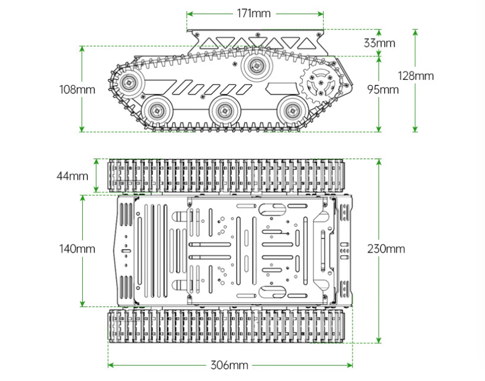
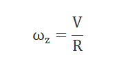
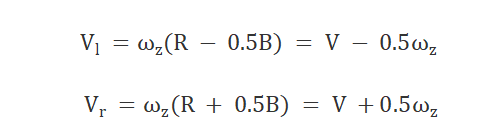

# 14. LeArm AI + Tank Chassis Course

## 14.1 Introduction to Tank Chassis and installation

### 14.1.1 Product Overview

The tank chassis features a full aluminum alloy body with an anodized surface finish, making it both robust and durable. The chassis is equipped with numerous M3 and M4 mounting holes for installing controllers such as Raspberry Pi and Jetson Nano, as well as various sensors, camera modules, robotic arms, and more. There is also a dedicated battery compartment at the bottom of the chassis, making it easy for users to expand and customize as needed.

### 14.1.2 Tank Chassis Hardware Overview

* **Hardware Structure**

(1) Drive Sprocket

As the key component of the track propulsion system, the drive sprocket transfers power from the transmission system to the tracks. In this tank chassis, the drive sprocket is located at the front of the chassis and plays an important role in effectively delivering power to the tracks.

(2) Road Wheel

The primary function of the road wheels is to support the weight of the chassis and maintain the correct track position. They help distribute the pressure exerted by the tracks on the ground, enhancing driving stability.

(3) Idler Wheel

The position of the idler wheel depends on the placement of the drive sprocket and is typically installed at the front of the chassis. Its main function is to guide the track to loop correctly, preventing misalignment or derailment.

(4) Support Roller

The support rollers help support the upper section of the track, preventing excessive sagging or lateral slipping, which helps reduce vibration and bouncing of the tracks during movement.

(5) Tracks

The tracks are composed of multiple track plates connected by track pins, forming a continuous loop structure. This design ensures both flexibility and durability of the tracks.

(6) Chassis

The tank chassis moves using the tracks mounted on its chassis. When moving forward, the motion of the tracked chassis is similar to walking along a pre-laid rail. Power is transmitted through the drive sprocket, which drives the tracks to move continuously. As the tracks pass over the idler wheel, they are laid flat on the ground and roll forward under the pressure of the road wheels. At the same time, the sections of track that have already passed the road wheels are taken up again by the drive sprocket.

* **Structural Parameters**



* **Physical Characteristics**


### 14.1.3 Learning Guide

You can follow the steps below to learn how the tank chassis operates and how it integrates with the LeArm AI robotic arm:

|                       **Path**                        | **Description** |
|:-----------------------------------------------------:| :--: |
|  [14.1.4 Tank Chassis Installation](#anchor_14_1_4)   | Learn how to assemble the chassis from separate components, mount the robotic arm onto the chassis, and complete the wiring process. |
|       [14.2 Wireless Controller](#anchor_14_2)        | Learn how to use a PS2 controller to operate the robotic arm and Mecanum chassis. |
|           [14.3 APP Control](#anchor_14_3)            | Learn how to use the APP to operate the robotic arm and Mecanum chassis. |
| [14.4 Tank Chassis Kinematics Analysis](#anchor_14_4) | Study the kinematic modeling and parameter derivation for the tank chassis. |

<p id="anchor_14_1_4"></p>

### 14.1.4 Tank Chassis Installation

This section is only for users who purchased the LeArm AI + tracked chassis kit (disassembled version).


<p id="anchor_14_2"></p>

## 14.2 Wireless Controller Control

### 14.2.1 Project Introduction

In this lesson, a wireless controller is used to control both the robotic arm and the tank chassis.

### 14.2.2 Project Process


### 14.2.3 Module Instruction


The **PS2** controller communicates with the controller via a receiver using a **2.4G** wireless signal. The controller has two modes, which can be toggled using the **MODE** button.

### 14.2.4 Program Download

[Source Code](../_static/source_code/LeArm_Tank_Chassis_Course.zip)

(1) Connect the core board to the computer using a USB cable.


(2) Locate the corresponding Arduino project file in the same directory as this document.


(3) Select the development board model when you open the program, and the specific model is shown in the figure below.


(4) Click "**Compile**" first, then click "**Upload**". After the upload is completed, the program download is completed if the following interface appears in the output box below the software.


### 14.2.5 Project Outcome

When the controller is in digital mode (only green light on), the robotic arm will not respond to control inputs.

When in analog mode, both red and green lights on, the robotic arm can be controlled. Pressing any button together with **SELECT** will trigger a predefined motion group.

The following table explains how the joysticks function in analog mode:

| Button | Function |
| :--: | :--: |
| Left joystick moves in any direction | Controls the linear movement direction of the chassis car.<br> When released, the linear velocity resets to zero. |
|Right joystick moves left or right | Controls the chassis car to rotate counterclockwise or clockwise.<br> When released, the angular velocity resets to zero. |


### 14.2.6 Program Brief Analysis

* **ino File (Application Layer)**

[Source Code](../_static/source_code/LeArm_Tank_Chassis_Course.zip)

Import the following libraries: `config.h`, `Hiwonder.hpp`, `Robot_arm.hpp`, `PS2_CTL.hpp`, and `motor.hpp`. `Hiwonder.hpp` defines the `LED`, `buzzer`, and `button` objects. `Robot_arm.hpp` defines the robotic arm object. `PS2_CTL.hpp` defines the `PS2` controller object. `motor.hpp` defines the chassis object.

{lineno-start=1}
```python
#include "Config.h"
#include "Hiwonder.hpp"
#include "Robot_arm.hpp"
#include "IIC.hpp"
#include "./src/PS2/PS2_CTL.hpp"
#include "motor.hpp"
```

(1) Creates objects for the `LED`, `buzzer`, robotic arm, `PS2` controller, `IIC`, and chassis.

{lineno-start=8}
```python
Led_t led_obj;
Buzzer_t buzzer_obj;
LeArm_t arm;
PS2_CTL ps2;
IIC iic;
Motor motors_obj;
```

(2) In the `setup` function, first delay for `1000 ms` (`1` second), then power off the Bluetooth module. Next, initialize the robotic arm, `LED`, `buzzer`, `I2C`, and chassis objects, then open the serial port and set the baud rate to `9600`.

{lineno-start=15}
```python
void setup() {
  delay(1000);
  pinMode(IO_BLE_CTL, OUTPUT);
  digitalWrite(IO_BLE_CTL, LOW);  // Set the Bluetooth control pin to low level to power off the Bluetooth module (设置蓝牙控制引脚为低电平时，断开蓝牙模块电源)

  arm.init();
  led_obj.init(IO_LED);
  buzzer_obj.init(IO_BUZZER);
  ps2.init();
  iic.init();
  motors_obj.init(&iic);

  Serial.begin(9600);
  delay(2000);
  motors_obj.set_type(MOTOR_TYPE_JGB37_520_12V_110RPM);
  delay(200);
  motors_obj.set_polarity(0);
  delay(500);
  Serial.println("begin");
}
```

(3) In the main loop, the program enters the `ps2_Task` function to process controller data.

{lineno-start=36}
```python
void loop() {
  ps2.PS2_Task(&arm, &led_obj, &buzzer_obj, &motors_obj);
}
```

* **PS2_CTL.cpp File (Low-Level)**

[Source Code](../_static/source_code/LeArm_Tank_Chassis_Course.zip)

(1) In the `PS2_Task` function, the `receive_msg` method is first called to obtain data sent by the `PS2` controller and store it in the `button state`. Next, the `get_result` method is called to control the robotic arm based on the `button state`.

{lineno-start=22}
```python
void PS2_CTL::PS2_Task(LeArm_t* robot,Led_t* led,Buzzer_t* buzzer,Motor* motors)
{
  static uint8_t first_flag = 1;
  if(first_flag!=0)
  {
    first_flag = 0;
    if(mode_count == PS2_SINGLE_SERVO_MODE)
    {
      led->blink(250,250,0);
    }else{
      led->blink(250,0,0);
    }
  }
  receive_msg();
  get_result(robot,led,buzzer,motors);
  delay(20);
}
```

(2) In the `receive_msg` function, which handles data retrieval and unpacking, the length of the received data is first checked. If the length is not zero, it indicates that data has been received, and the unpacking process begins. Using a state machine, the function first identifies the frame header, then extracts the data length from the frame, and finally starts retrieving the data content.

{lineno-start=48}
```python
void PS2_CTL::receive_msg(void)
{
  static uint8_t step = 0;
  static uint8_t index = 0;
  while (Serial_PS2.available()>0) {
    switch(step){
      case 0:{
        if(Serial_PS2.read() == FRAME_HEADER)
        {
          step++;
        }
      }break;
      case 1:{
        if(Serial_PS2.read() == FRAME_HEADER)
        {
          index = 0;
          step++;
        }else{
          step = 0;
        }
      }break;
      case 2:{
        recbuff[index++] = Serial_PS2.read();
        if(index > 9)
        {
          rec_flag = true;
          step = 0;
        }
      }break;
      default:{
        step = 0;
      }break;
    }
```

(3) First, the mode of the `PS2` controller is determined by checking bytes `6` to `9` in the buffer. It identifies whether the controller is in digital mode (`PS2_SINGLE_SERVO_MODE`) or analog mode (`PS2_COORDINATE_MODE`).

{lineno-start=82}
```python
    if(rec_flag)
    {
      if(recbuff[9] == 0x80 && recbuff[6] == 0x80 &&
          recbuff[7] == 0x80 && recbuff[8] == 0x80)
      {
        keyvalue.mode = PS2_SINGLE_SERVO_MODE;
      }
      else if(recbuff[9] == 0x7F && recbuff[6] == 0x7F &&
              recbuff[7] == 0x7F && recbuff[8] == 0x7F)
      {
        keyvalue.mode = PS2_COORDINATE_MODE;
      }
```

(4) Then, based on the detected `PS2` mode, different assignment logics are executed accordingly. If the controller is in digital mode, the function reads bytes `3` to `7` from the data buffer to determine the states of buttons such as triangle and circle, as well as whether the joysticks have been pressed. For the joysticks, only simple directional inputs are read: whether the left joystick has moved left (`bit_left`) or right (`bit_right`), and whether the right joystick has moved up (`bit_up`) or down (`bit_down`). Each joystick only has two states: stationary or moved.

{lineno-start=94}
```python
      switch(keyvalue.mode){
        case PS2_SINGLE_SERVO_MODE:
          keyvalue.bit_triangle = 	recbuff[3] & 0xFF;
          keyvalue.bit_circle = 	(recbuff[3] & 0xFF) >> 1;
          keyvalue.bit_cross = 		(recbuff[3] & 0xFF) >> 2;
          keyvalue.bit_square = 	(recbuff[3] & 0xFF) >> 3;
          keyvalue.bit_l1 =  		(recbuff[3] & 0xFF) >> 4;
          keyvalue.bit_r1 =  		(recbuff[3] & 0xFF) >> 5;
          keyvalue.bit_l2 =  		(recbuff[3] & 0xFF) >> 6;
          keyvalue.bit_r2 =  		(recbuff[3] & 0xFF) >> 7;
          keyvalue.bit_select = 	recbuff[4] & 0xFF;
          keyvalue.bit_start = 		(recbuff[4] & 0xFF) >> 1;
          keyvalue.bit_leftjoystick_press =  (recbuff[4] & 0xFF) >> 2;
          keyvalue.bit_rightjoystick_press = (recbuff[4] & 0xFF) >> 3;
          keyvalue.bit_left = recbuff[6] == 0x00 ? 1 : 0;
          keyvalue.bit_right = recbuff[6] == 0xFF ? 1 : 0;
          keyvalue.bit_up = recbuff[7] == 0x00 ? 1 : 0;
          keyvalue.bit_down = recbuff[7] == 0xFF ? 1 : 0;
          break;
```

(5) In analog mode, data is extracted from bytes `3–4` and `6–9` to determine which buttons, like triangle and circle, are pressed and whether either joystick is pressed down. For the joysticks, the movement position parameters of both the left and right joysticks are read, and their values are assigned respectively to the left joystick's `x` and `y` positions and the right joystick's `x` and `y` positions.

{lineno-start=114}
```python
        case PS2_COORDINATE_MODE:
          keyvalue.bit_triangle = 	recbuff[3] & 0xFF;
          keyvalue.bit_circle = 	(recbuff[3] & 0xFF) >> 1;
          keyvalue.bit_cross = 		(recbuff[3] & 0xFF) >> 2;
          keyvalue.bit_square = 	(recbuff[3] & 0xFF) >> 3;
          keyvalue.bit_l1 =  		(recbuff[3] & 0xFF) >> 4;
          keyvalue.bit_r1 =  		(recbuff[3] & 0xFF) >> 5;
          keyvalue.bit_l2 =  		(recbuff[3] & 0xFF) >> 6;
          keyvalue.bit_r2 =  		(recbuff[3] & 0xFF) >> 7;
          keyvalue.bit_select = 	recbuff[4] & 0xFF;
          keyvalue.bit_start = 		(recbuff[4] & 0xFF) >> 1;
          keyvalue.bit_leftjoystick_press =  (recbuff[4] & 0xFF) >> 2;
          keyvalue.bit_rightjoystick_press = (recbuff[4] & 0xFF) >> 3;
          keyvalue.left_joystick_x = recbuff[6];
          keyvalue.left_joystick_y = recbuff[7];
          keyvalue.right_joystick_x = recbuff[8];
          keyvalue.right_joystick_y = recbuff[9];
```

(6) Then, based on byte `5`, the function updates the status of the directional buttons: `bit_up`, `bit_right`, `bit_down`, and `bit_left`.

{lineno-start=131}
```python
          switch(recbuff[5])
          {
            case 0x00:
              keyvalue.bit_up = 1;
              break;
            
            case 0x01:
              keyvalue.bit_up = 1;
              keyvalue.bit_right = 1;
              break;
            
            case 0x02:
              keyvalue.bit_right = 1;
              break;
            
            case 0x03:
              keyvalue.bit_down = 1;
              keyvalue.bit_right = 1;
              break;
            
            case 0x04:
              keyvalue.bit_down = 1;
              break;
            
            case 0x05:
              keyvalue.bit_down = 1;
              keyvalue.bit_left = 1;
              break;
            
            case 0x06:
              keyvalue.bit_left = 1;
              break;
            
            case 0x07:
              keyvalue.bit_up = 1;
              keyvalue.bit_left = 1;
              break;
            
            case 0x0F:
              keyvalue.bit_up = 0;
              keyvalue.bit_down = 0;
              keyvalue.bit_left = 0;
              keyvalue.bit_right = 0;
              break;
          }
```

(7) Once the data has been fully processed, the `get_result` function uses the button states to control the robotic arm triggering the appropriate actions.

:::{Note} Example: Controlling Tank Movement

(1) For controlling the tank movement, the forward/backward movement speed `y` is determined by the vertical displacement of the left joystick, and the rotational speed `rx` is determined by the horizontal displacement of the right joystick.

(2) When the forward/backward speed is `0`, based on kinematic analysis, the left motor speed is set to the rotational speed `rx`, and the right motor speed is set to the negative rotational speed `–rx`.

(3) Based on kinematic analysis, when the forward/backward speed is negative, the left motor speed is set to the current speed multiplied by (`1 + rx × 0.01`). Based on kinematic analysis, when the forward/backward speed is positive, the right motor speed is set to the current speed multiplied by (`1 − rx × 0.01`).

:::

{lineno-start=453}

```
      int y = map((float)((uint32_t)keyvalue.left_joystick_y), 0.0f, 255.0f, -100.0f, 100.0f); //Forward and backward movement 
      int rx = map((float)((uint32_t)keyvalue.right_joystick_x), 0.0f, 255.0f, -60.0f, 60.0f); // Rotation 
      
      int Left = y;
      int Right = y;
      
      if(y == 0)
      {
        Left = rx;
        Right = -rx;
      }else if(rx < 0){
        Left = (Left*(100+rx)/100);
      }else{
        Right = (Right*(100-rx)/100);
      }

      motors_speed[0] = Left;
      motors_speed[1] = Right;
      motors_speed[2] = 0;
      motors_speed[3] = 0;
```

<p id="anchor_14_3"></p>

## 14.3 APP Control

### 14.3.1 Project Introduction

In this lesson, you'll use an app to control both the robotic arm and the Mecanum-wheeled chassis.

### 14.3.2 Project Process


### 14.3.3 Introduction to APP


This lesson uses the dedicated LeArm app — **Wonderbot** — to control the robotic arm and chassis through various function icons.

[2. Remote Control -> 2.2 App Control](2.Remote_Control.md#app-usage-instructions) and are familiar with the function icons in the app interface.

### 14.3.4 Program Download

[Source Code](../_static/source_code/LeArm_Tank_Chassis_Course.zip)

(1) Connect the core board to the computer using a USB cable.


(2) Locate the corresponding Arduino project file in the same directory as this document.


(3) Select the development board model when you open the program, and the specific model is shown in the figure below.


(4) Click **"Compile"** first, then click **"Upload"**. After the upload is completed, the program download is completed if the following interface appears in the output box below the software.


### 14.3.5 Project Outcome

After powering on the robotic arm, use the app to control the movement of both the arm and the chassis.


### 14.3.6 Program Brief Analysis

:::{Note}
The control processing and protocol parsing for the app have been explained in detail in [2. Remote Control >2.2 App Usage Instructions](2.Remote_Control.md#app-usage-instructions) Only the differences in processing is introduced in this lesson.
:::

* **ino File (Application Layer)**

[Source Code](../_static/source_code/LeArm_Tank_Chassis_Course.zip)

(1) Imports the following libraries: `config.h`, `Hiwonder.hpp`, `Robot_arm.hpp`, `PS2_CTL.hpp`, and `motor.hpp`. `Hiwonder.hpp` defines the `LED`, `buzzer`, and `button` objects. `Robot_arm.hpp` defines the robotic arm object. `PS2_CTL.hpp` defines the `PS2` controller object. `motor.hpp` defines the chassis object.

{lineno-start=1}
```python
#include "Config.h"
#include "Hiwonder.hpp"
#include "Robot_arm.hpp"
#include "IIC.hpp"
#include "./src/PC_BLE/PC_BLE_CTL.hpp"
#include "motor.hpp"
```

(2) Creates objects for the `LED`, `buzzer`, robotic arm, `PS2` controller, `IIC`, and chassis.

{lineno-start=8}
```python
Led_t led_obj;
Buzzer_t buzzer_obj;
LeArm_t arm;
PC_BLE_CTL pc_ble_obj;
IIC iic;
Motor motors_obj;xxxxxxxxxx Led_t led_obj;Buzzer_t buzzer_obj;LeArm_t arm;PC_BLE_CTL pc_ble_obj;IIC iic;Motor motors_obj;paste source code here.
```

(3) In the `setup` function, first delay for `1000 ms` (`1` second), then power off the Bluetooth module. Next, initialize the robotic arm, `LED`, `buzzer`, `I2C`, and chassis objects, then open the serial port and set the baud rate to `9600`.

(4) In the main loop, the program enters the `ps2_Task` function to process controller data.

{lineno-start=33}
```python
void loop() {
  pc_ble_obj.PC_BLE_Task(&arm , &led_obj , &buzzer_obj , &motors_obj);
}
```

* **PC_BLE_CTL.cpp File (Low-Level)**

[Source Code](../_static/source_code/LeArm_Tank_Chassis_Course.zip)

(1) In the `PS2_Task` function, the `receive_msg` method is first called to obtain data sent by the `PS2` controller and store it in the `button state`. Next, the `get_result` method is called to control the robotic arm based on the `button state`.

{lineno-start=107}
```python
/* header header len cmd count time [id duty] */
void PC_BLE_CTL::PC_BLE_Task(LeArm_t* robot,Led_t* led,Buzzer_t* buzzer,Motor* motors)
{
  static uint8_t car_run_flag = 0;
  static uint32_t last_car_run_time = 0;
  uint8_t send_data[30] = {0};
  static int8_t motors_speed[4] = {0,0,0,0};

  unpack();
  if(unpack_successful)
  {
    unpack_successful = false;
    if(packet.cmd == APP_ACTION_GROUP_RUN)
    {
      robot->action_group_reset();
    }
    status = (AppFunctionStatus)packet.cmd;
  }

  switch (status)
  {
      case APP_VERSION_QUERY:{
        send_data[0] = APP_VERSION_QUERY;
        send_data[1] = SERVO_TYPE;
        send_data[2] = SOFTWARE_VERSION;
        delay(50);
        packet_transmit(send_data, 3);
        memset(send_data, 0, sizeof(send_data));
        status = APP_FUNC_NULL;
      }break;
```

(2) Then, based on byte `5`, the function updates the status of the directional buttons: `bit_up`, `bit_right`, `bit_down`, and `bit_left`.

{lineno-start=216}
```python
          switch(packet.buffer[0]){
            case 0: //Stop (停止)
              break;
            case 1: //Move left (左平移)
              break;
            case 2: //Move forward left (左上平移)
              break;
            case 3: //Move forward (前进)
              y = -100;
              break;
            case 4: //Move forward right (右上平移)
              break;
            case 5: //Move right (右平移)
              break;
            case 6: //Move backward right (右下平移)
              break;
            case 7: //Move backward (后退)
              y = 100;
              break;
            case 8: // Move backward left (左下平移)
              break;
          }
```

(3) Once the data has been fully processed, the `get_result` function uses the button states to control the robotic arm triggering the appropriate actions.

:::{Note}

Example: Controlling Tank Movement

(1) For controlling the tank movement, the forward/backward movement speed `y` is determined by the vertical displacement of the left joystick, and the rotational speed `rx` is determined by the horizontal displacement of the right joystick.

(2) When the forward/backward speed is `0`, based on kinematic analysis, the left motor speed is set to the rotational speed `rx`, and the right motor speed is set to the negative rotational speed `–rx`.

(3) Based on kinematic analysis, when the forward/backward speed is negative, the left motor speed is set to the current speed multiplied by (`1 + rx × 0.01`). Based on kinematic analysis, when the forward/backward speed is positive, the right motor speed is set to the current speed multiplied by (`1 − rx × 0.01`).

:::

{lineno-start=248}

```
          // Calculate the speeds of the four wheels (计算四个轮子的速度)
          int Left = y;
          int Right = y;
          if(y == 0)
          {
            Left = rx;
            Right = -rx;
          }else if(rx < 0){
            Left = (Left*(100+rx)/100);
          }else{
            Right = (Right*(100-rx)/100);
          }
          motors_speed[0] = Left;
          motors_speed[1] = Right;
          motors_speed[2] = 0;
          motors_speed[3] = 0;
          status = APP_FUNC_NULL;
      }break;
```

<p id="anchor_14_4"></p>

## 14.4 Tank Chassis Kinematics Analysis

### 14.4.1 Structure Analysis

The track is driven by drive sprockets, with a flexible track loop running around the drive sprockets, road wheels, idler wheels, and support rollers.


The track is made up of track plates and track pins.


Track plate; Track pin

The track pins connect the individual track plates to form the track chain. The ends of the track plates have holes to mesh with the drive wheel. The center of the track plates has guiding teeth to align the track and prevent it from falling off during tank turns or side slope driving. The side that contacts the ground has reinforced anti-slip ribs, referred to as patterns, to improve the strength of the track plate and the adhesion between the track and the ground.


Support Roller; Drive Sprocket; Idler Wheel; Road Wheel

* **Drive Sprocket**

The drive sprocket is part of the track propulsion system, responsible for transferring the power from the transmission system to the track. Its main function is to transfer power to the track and is typically installed at the rear of the vehicle.

* **Road Wheel**

The road wheel bears the weight of the vehicle and aligns the track. Its primary role is to evenly distribute the pressure of the track on the ground, enhancing the stability of the vehicle during movement.

* **Idler Wheel**

The idler wheel depends on the placement of the `drive sprocket` and is typically installed at the front of the chassis. Its main function is to guide the track to loop correctly, preventing misalignment or derailment.

* **Support Roller**

The support rollers help support the upper section of the track, preventing excessive sagging or lateral slipping. This helps reduce vibration and jumping while the track is in motion.

* **Chassis**

The tank chassis moves using the tracks mounted on its chassis. When the chassis moves, it operates similarly to walking on a set track. The power generated by the track is continuously transmitted through the drive wheel, which keeps turning the track in a winding motion. During the propulsion process, the track laid by the idler wheel is pressed down on the ground, while the track passed by the rear road wheel is pulled back onto the drive sprocket.

### 14.4.2 Motion Analysis

Based on the mechanical structure of the tracked vehicle, the kinematics of the robot can be analyzed, including the position, velocity, and acceleration variations of the vehicle. The analysis process is as follows:


During the movement of the tank chassis, when turning on a flat surface, it rotates around the axis `O` in a stable manner. The distance from the steering axis to the vehicle's longitudinal symmetry plane is `R`, which is the turning radius of the tank chassis.

O_r represents the projection of the axis on the symmetry plane, and the velocity V of O_r represents the average speed of the vehicle during movement. The turning angle ω_z of the vehicle is defined as:



During the turning motion, every point on the chassis rotates around the steering axis O, and the velocity of that point is the product of the distance from the point to axis O and the angular velocity ω_z. Therefore, the velocities of the slow and fast side tracks, V_l and V_r, are given by:



According to the principle of relative motion, the motion of the tank chassis robot can be decomposed into the sum of two different motions. This yields:

