# 15. LeArm AI + Synchronization Controller Course

## 15.1 Synchronization Controller Overview and Usage

### 15.1.1 Synchronization Controller Overview

*   **Introduction**

The robot synchronization controller is an Arduino-based controller equipped with 6 potentiometers and 1 joystick module. It is compatible with various HiWonder series robots, such as the LeArm AI robotic arm. Using Bluetooth communication, it enables easy wireless remote control and synchronized actions, making operation simple, convenient, and fun.

*   **Functional Diagram**

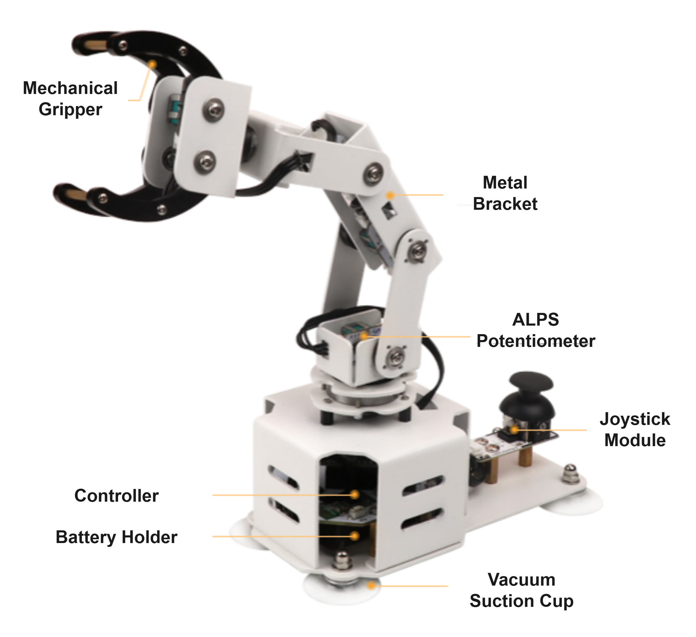

*   **Specifications**

<table class="docutils-nobg" border="1">
  <tr>
    <th>Name</th>
    <th>Robot Teaching Synchronization Controller</th>
  </tr>
  <tr>
    <td rowspan="3">Physical Specifications</td>
    <td>Dimensions (L × W × H)</td>
  </tr>
  <tr>
    <td>Weight</td>
  </tr>
  <tr>
    <td>Material</td>
  </tr>
  <tr>
    <td rowspan="3">Electrical Specifications</td>
    <td>Battery</td>
  </tr>
  <tr>
    <td>Power Supply</td>
  </tr>
  <tr>
    <td>Operating Current</td>
  </tr>
  <tr>
    <td rowspan="4">Control System</td>
    <td>Controller</td>
  </tr>
  <tr>
    <td>Synchronized Control Communication Method</td>
  </tr>
  <tr>
    <td>Degrees of Freedom</td>
  </tr>
  <tr>
    <td>Joint Sensors</td>
  </tr>
  <tr>
    <td rowspan="3">Additional Specifications</td>
    <td>Expansion 4-Pin Interfaces</td>
  </tr>
  <tr>
    <td>Custom Buttons</td>
  </tr>
  <tr>
    <td>Custom LED</td>
  </tr>
</table>

### 15.1.2 Installation and Interface Overview of the Arduino IDE

:::{Note}
Installation instructions for Mac can be found in the corresponding section of this guide.
:::

*   **Installation**

(1) Locate the Arduino IDE installation package provided in the same directory as this document. Double-click the installer to begin. To download the latest version of the software, visit the official Arduino website:<https://www.arduino.cc/en/software>


(2) Click **"I Agree"** to accept the license agreement to proceed with the installation.

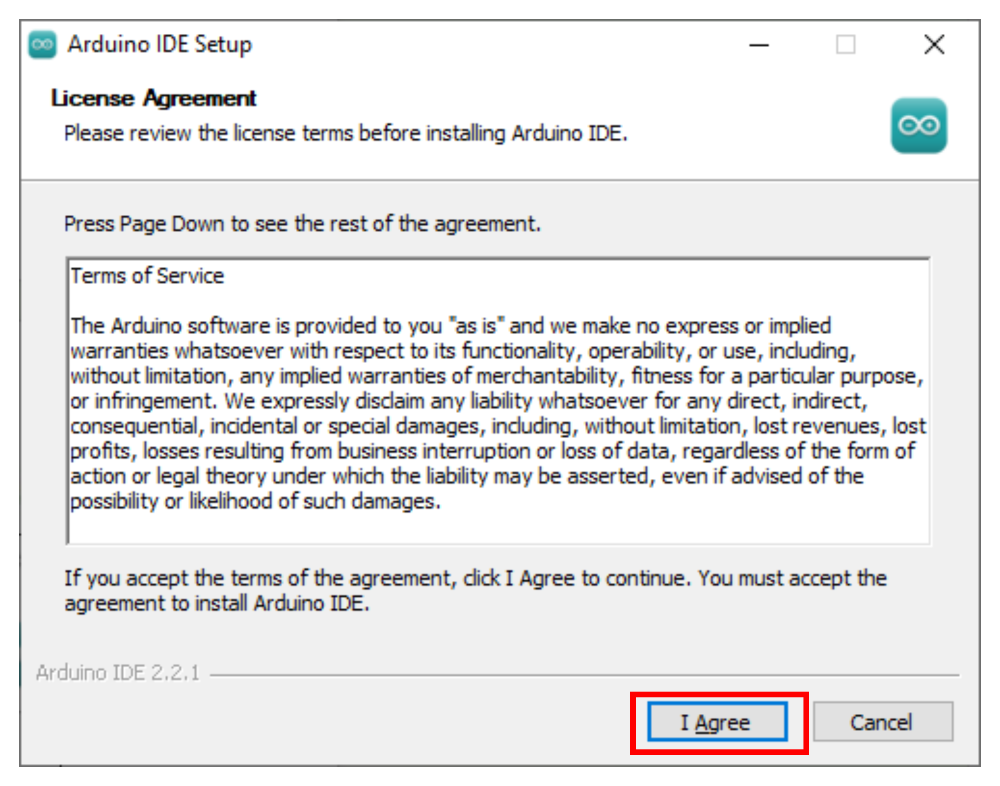

(3) Use the default selected options and click **"Next"** to continue.

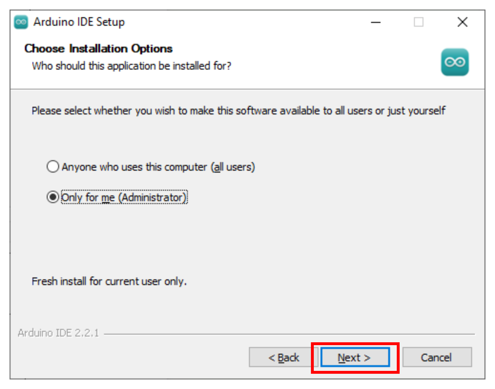

(4) Choose the desired installation path by clicking **"Browse,"** then click **"Install"** to begin installation.

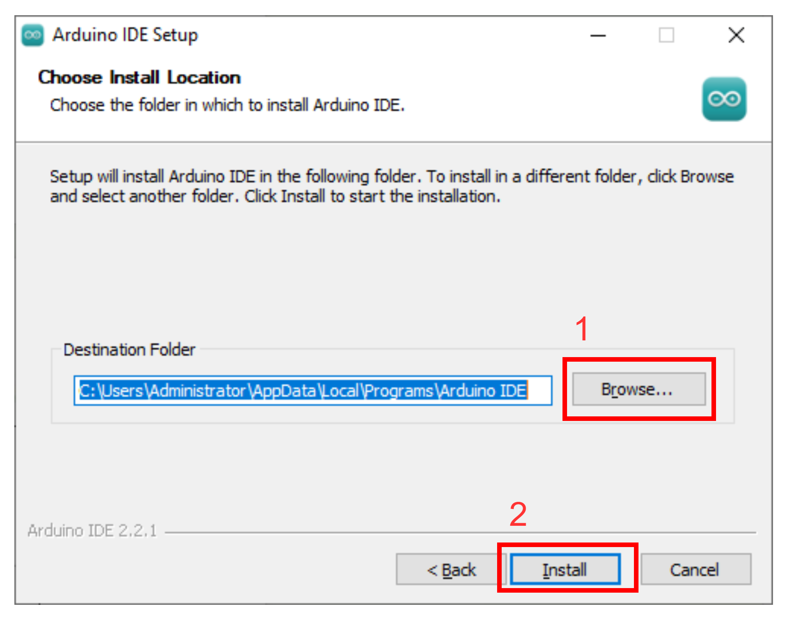

(5) Wait for the installation process to complete.


:::{Note}
If prompted to install USB drivers during the installation, select **"Always trust software from Arduino LLC"** and click **"Install."**
:::

(6) Once installation is complete, click **"Finish"** to exit the installer.

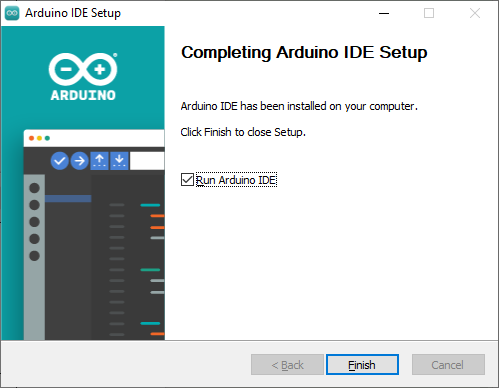

*   **Interface Overview**

(1) The main interface of the Arduino IDE is divided into five primary sections:

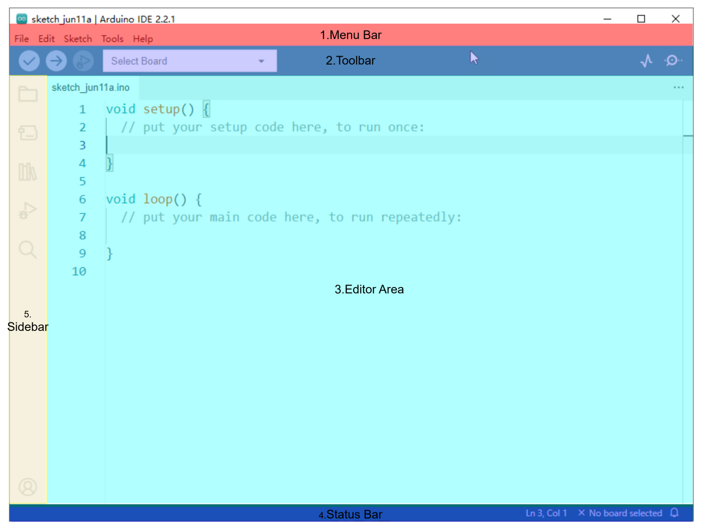

① Menu Bar provides access to key settings and configuration options for the Arduino IDE.

| **Icon** | **Function** |
|:---:|:---|
| 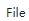 | Create or open projects, and configure interface preferences |
|  | Comment, indent, find/replace text |
|  | Configure and compile projects, manage libraries |
|  | Select controllers and ports, access controller information |
|  | Access tutorials, troubleshooting resources |

② Toolbar contains essential tools for project development, including program compilation, uploading, and serial monitoring.

| **Icon** | **Function** |
|:---:|:---|
|  | Verify: Check for errors and compile the code |
|  | Upload: Upload the program to the Arduino controller |
|  | Debug: Real-time debugging for supported controllers |
|  | Select Controller: Select the target controller for the project |
|  | Serial Plotter: Visualize serial data as a graph |
|  | Serial Monitor: Display data from the serial port |

③ Editor Area: The primary area for writing and editing code.

④ Status Bar: Displays relevant editor and project information, such as cursor position, controller selection, and other status indicators.

⑤ Sidebar: A key component of the Arduino IDE, providing tools for file management, code debugging, and library installation.

| **Icon** | **Function** |
|:---:|:---|
|  | Explorer: shows the current project 's files |
|  | Board Manager: add or manage packages of controller |
|  | Library Manager: install or remove code libraries |
|  | Debug: perform real-time project debugging |
|  | Search: search or replace code and variables |

### 15.1.3 Using the Arduino IDE

*   **Arduino IDE Interface Configuration**

(1) To switch the interface language to English, navigate to **File** → **Preferences**, then locate the `Language` setting in the pop-up window. Select **"English"** from the list and click **OK** to apply the changes.


(2) Additional preferences such as project file location, editor font size, and color theme can also be configured from this menu.

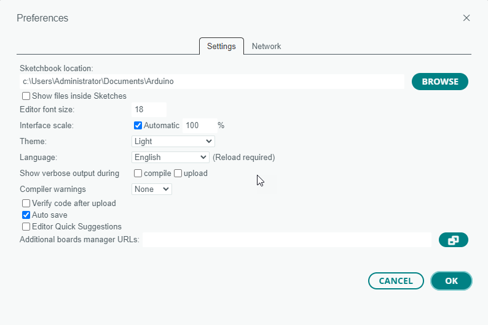

*   **Upload Program to the Arduino**

(1) This section demonstrates how to upload a simple program that prints the text **"hiwonder"**. Locate and open the sample sketch file `Demo.ino` found in the [_Demo](../_static/source_code/Demo.zip) folder under the same directory as this document.

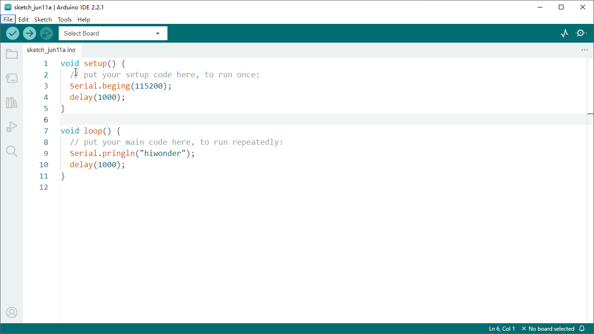

(2) Connect the Arduino controller to the computer using a USB cable.

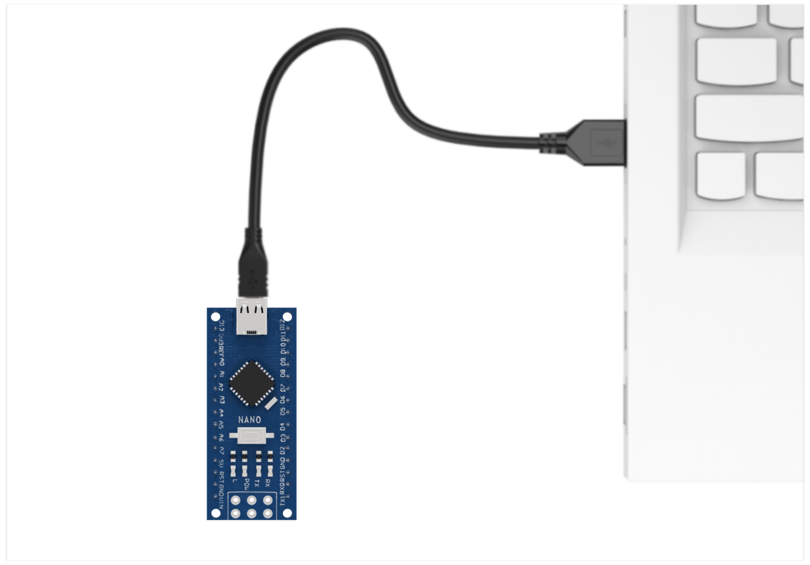

(3) Select the development board model when you open the program, and the specific model is shown in the figure below.


(4) Click **"Compile"** first, then click **"Upload"**. After the upload is completed, the program download is completed if the following interface appears in the output box below the software.


(5) After uploading, open the Serial Monitor . The text **"hiwonder"** should appear, confirming that the program is running correctly.


<p id="anchor_15_1_4"></p>

### 15.1.4 LeArm AI Robotic Arm Control

*   **Preparation**

The synchronization controller control board has a built-in Bluetooth module, and the firmware program has been pre-flashed at the factory.

You only need to prepare three AA dry batteries or rechargeable NiMH batteries. Insert the batteries into the battery compartment at the bottom of the synchronizer.

:::{Note}
Do not use lithium batteries or any power supply with a total voltage higher than 5V. Also, make sure not to reverse the positive and negative terminals when inserting the batteries.
:::

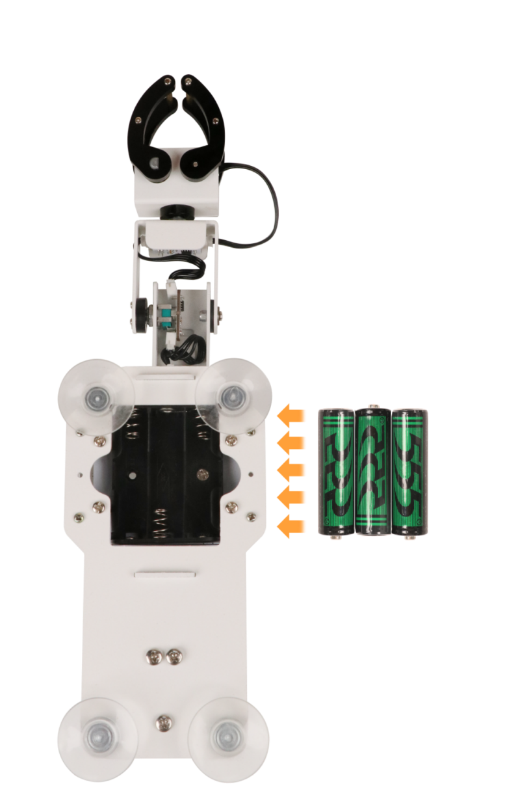

*   **Program Download**

[Source Code](../_static/source_code/LeArm_Synchronization_Controller_Course.zip)

(1) Connect the controller to the computer using a USB cable.


(2) In the [Factory Firmware Program->Sync](Appendix.md) folder located in the same path as this document, find the corresponding example project file.

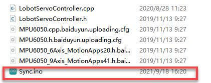

(3) Select the development board model when you open the program, and the specific model is shown in the figure below.


(4) Select the development board and processor model as shown in the figure.

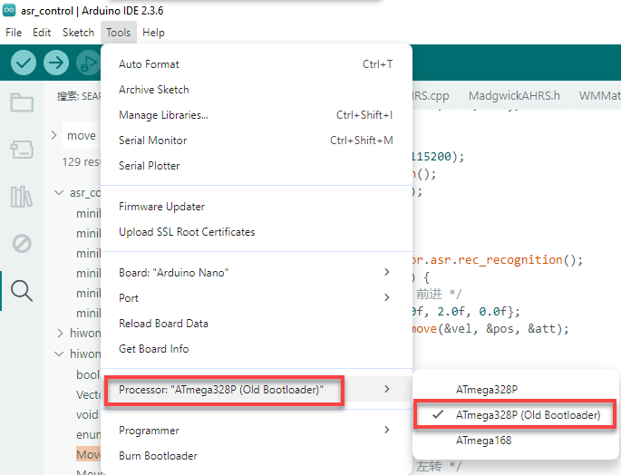

(5) Click **"Compile"** first, then click **"Upload"**. After the upload is completed, the program download is completed if the following interface appears in the output box below the software.


*   **Device Connection**

(1) Step 1: Place the synchronization controller on a smooth table surface using the suction cup and secure it.

:::{Note}
Make sure the suction cup is firmly attached to a smooth surface to prevent instability, tipping over, or falling during operation.
:::

(2) Step 2: Turn on the robotic arm first, then turn on the synchronization controller.

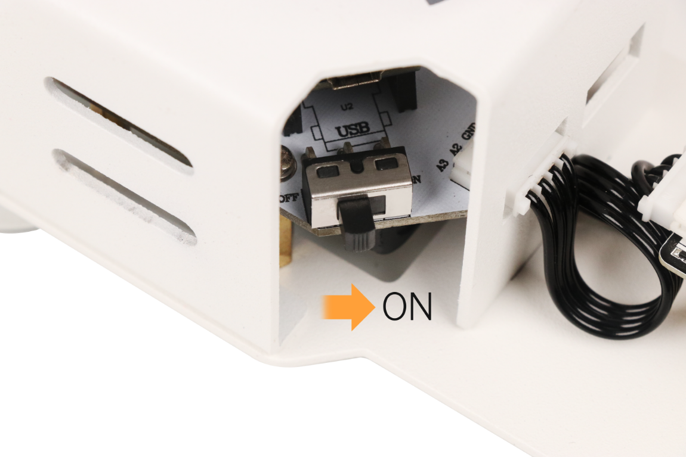

(3) Step 3: The indicator light on the Bluetooth module of the synchronization controller control board will start blinking, indicating that the device is not yet connected.

(4) Step 4: For initial pairing, briefly press the **"DEL"** button on the synchronization controller control board, located next to the Bluetooth module.

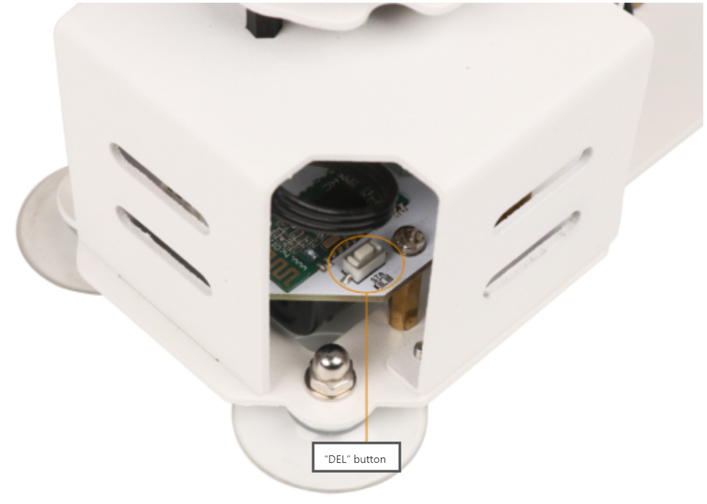

(5) Step 5: Wait for 2 seconds. The synchronization controller and the LeArm AI will automatically pair. Once paired successfully, the indicator light on the Bluetooth module of the synchronization controller control board will remain steadily on. From then on, both devices will automatically pair when powered on, without the need to press the **"DEL"** button again.

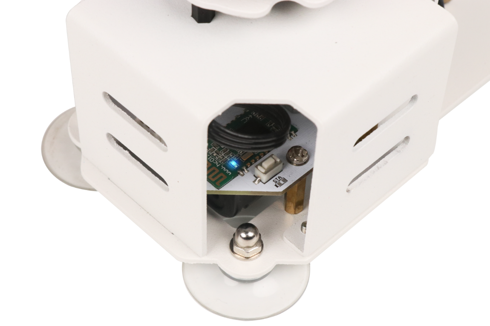

:::{Note}
If pairing fails, you can press the **"DEL"** button on the synchronization controller control board again to retry. Additionally, if you need to pair with another device, such as a different LeArm AI robotic arm or the Tankbot robot, you must press the **"DEL"** button after powering on to clear the previous pairing.
:::

*   **Mode Selection**

:::{Note}
When using the synchronization controller to control a robot, only one-to-one control is allowed. It is not possible to operate in a one-to-many configuration or to control multiple devices simultaneously, if you have purchased all three devices mentioned above.

Additionally, before entering the corresponding mode, please press the **"DEL"** button to ensure the devices are successfully connected before proceeding with the operations in this section.
:::

The factory firmware of the synchronization controller supports four control modes: Tankbot, xArm, LeArm AI, and WonderArm.

| **No.** | **Control Mode** | **LED Indicator Pattern** |
|:---:|:---:|:---|
| 1 | Tankbot (default mode) | LED1 flashes once in a repeating cycle |
| 2 | xArm | LED1 flashes twice in a repeating cycle |
| 3 | LeArm AI | LED1 flashes three times in a repeating cycle |
| 4 | WonderArm | LED1 flashes four times in a repeating cycle |

**"KEY1"** is used to select the mode, and **"KEY2"** is used to confirm and enter the selected mode. After choosing the desired mode, press **"KEY2"** to confirm and enter.

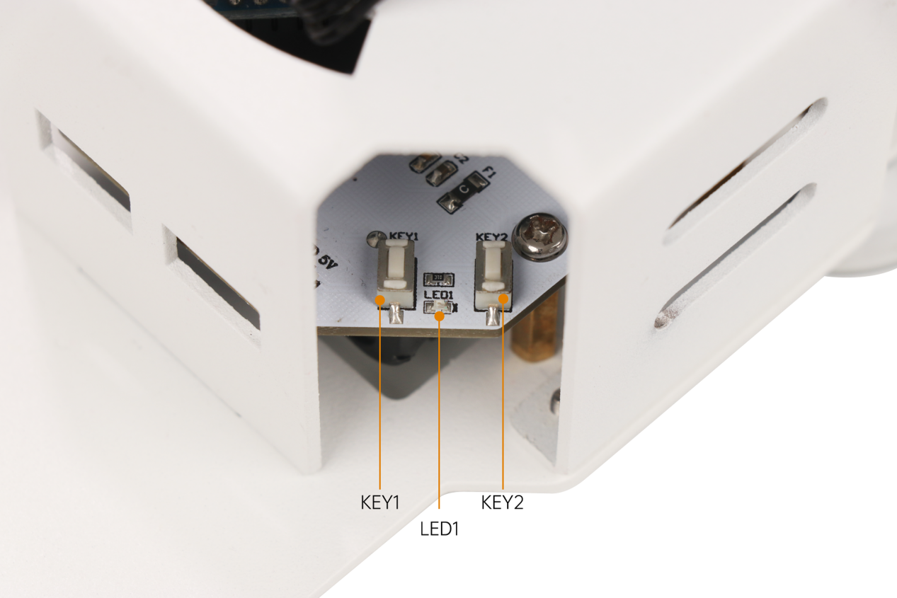

In this section, we will control the LeArm AI robotic arm. According to the table above, we know that after powering on, the synchronization controller defaults to the Tankbot control mode.

Therefore, after successfully pairing with the device, press the **"KEY1"** button twice until LED1 flashes three times in a repeating cycle, indicating that it has successfully switched to the LeArm AI robotic arm control mode. Finally, press the **"KEY2"** button to confirm and enter this mode.

:::{Note}
If you accidentally press **"KEY1"** and switch to another mode, you can press **"KEY1"** again. When LED1 flashes twice in a repeating cycle, it has switched back to the xArm robotic arm control mode.
:::

*   **Diagram**

By rotating or moving the potentiometers on the synchronization controller, the corresponding servos on the LeArm AI robotic arm will execute the same movements in real time.

Each potentiometer on the synchronization controller corresponds one-to-one with a specific servo on the robotic arm. For example, potentiometer 1 on the synchronization controller controls servo 1 on the LeArm AI, and so on.


:::{Note}
When using the robotic arm, make sure to keep it away from your body to avoid accidental injury. Additionally, operate it slowly and carefully whenever possible.
:::

The joystick module on the back of the synchronization controller is reserved for advanced development. For example, you can add a mobile chassis and modify the program according to their own needs, which requires basic development skills.

### 15.1.5 Editing Actions with the Synchronization Controller

*   **Overview**

The `KEY1` and `KEY2` buttons on the synchronization controller can also be configured as **"Learn"** and **"One-Key Run"** functions.
You can use them to record actions on the synchronization controller and then have the device execute the pre-edited actions synchronously.


*   **Program Download**

[Source Code](../_static/source_code/LeArm_Synchronization_Controller_Course.zip)

(1) Connect the controller to the computer using a USB cable.


(2) In the [Factory Firmware Program->Sync57600_ActionStudy](Appendix.md) folder located in the same path as this document, find the corresponding example project file.

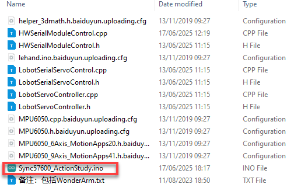

(3) Select the development board model when you open the program, and the specific model is shown in the figure below.


(4) Select the development board and processor model as shown in the figure.

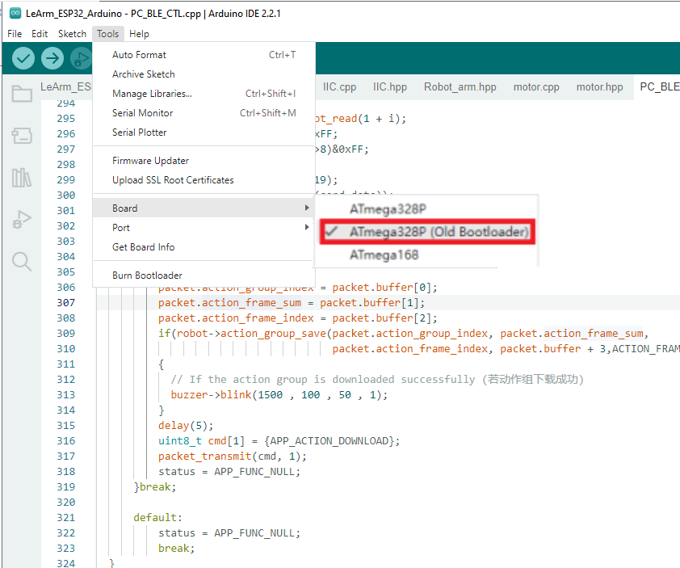

(5) Click **"Compile"** first, then click **"Upload"**. After the upload is completed, the program download is completed if the following interface appears in the output box below the software.


*   **Device Connection and Controlling**

(1) Step 1: Turn on the robotic arm and the synchronization controller.

(2) Step 2: For the first time, press the **"DEL"** button to pair with the device.

(3) Step 3: Once connected, you can directly control the robotic arm using the synchronization controller. Refer to the illustration below: Potentiometer 1 controls servo 1 on the robotic arm, and so on.

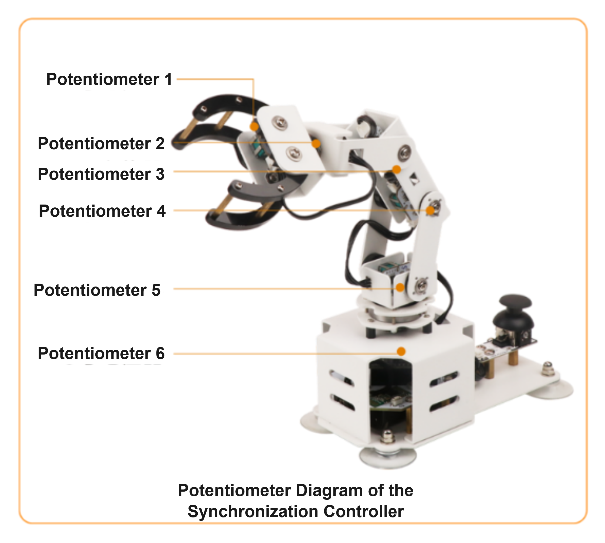

:::{Tip}
When using the robotic arm, make sure to keep it away from your body to avoid accidental injury. Additionally, operate it slowly and carefully whenever possible.
:::

*   **Edit Actions**

This example shows how to edit 4 actions step-by-step:

(1) Step 1: Press and hold the `KEY1` button until LED1 stays steadily on, indicating that you have entered **Learning Mode**.

(2) Step 2: For the first action, record the current position of the potentiometers. Briefly press `KEY1`; LED1 will flash once to confirm the action has been recorded.

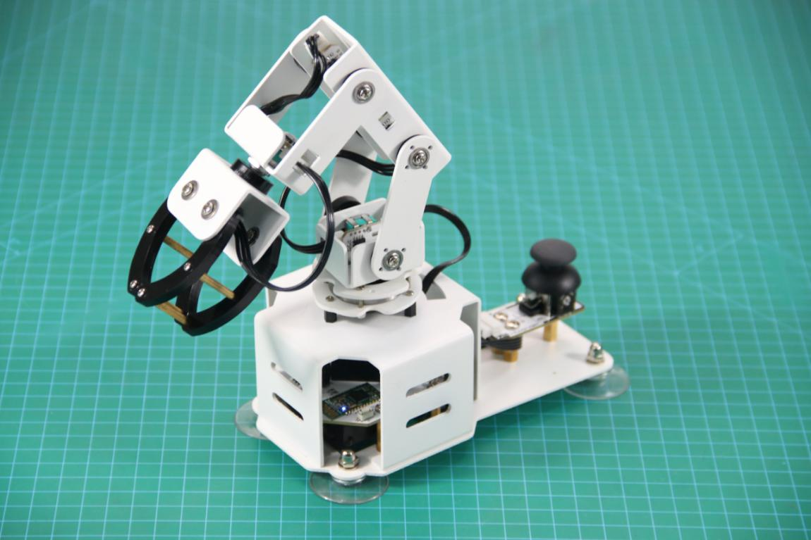

(3) Step 3: For the second action, rotate potentiometer 5 slightly to the side, then briefly press `KEY1` again.

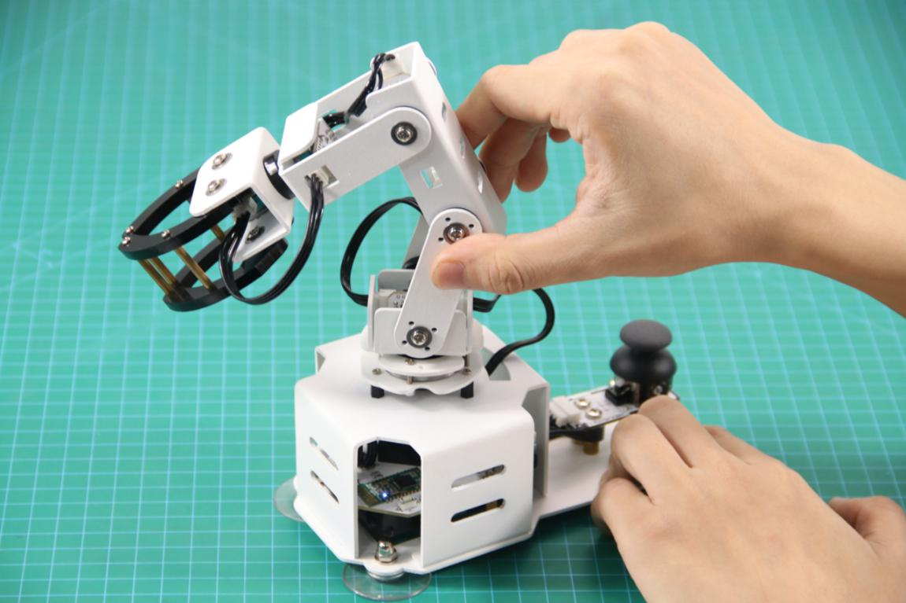

(4) Step 4: For the third action, lift potentiometer 4 slightly upwards, then briefly press `KEY1` again.

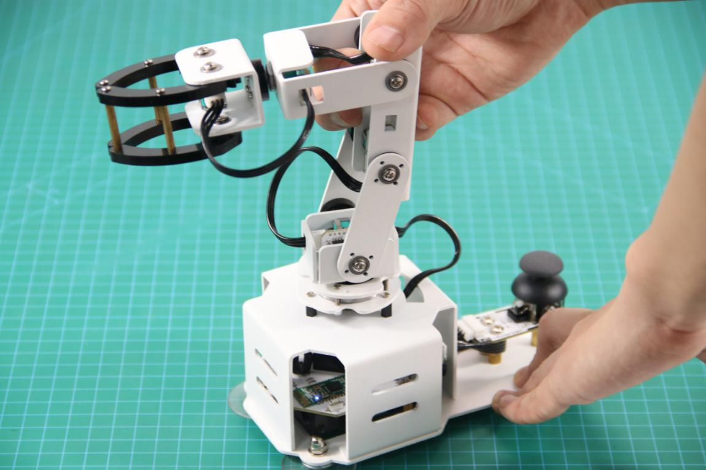

(5) Step 5: For the fourth action, gently rotate potentiometer 1 to the right. After completing this, briefly press `KEY1` once more, then press and hold `KEY1` to finish learning and exit **Learning Mode**. LED1 will turn off.

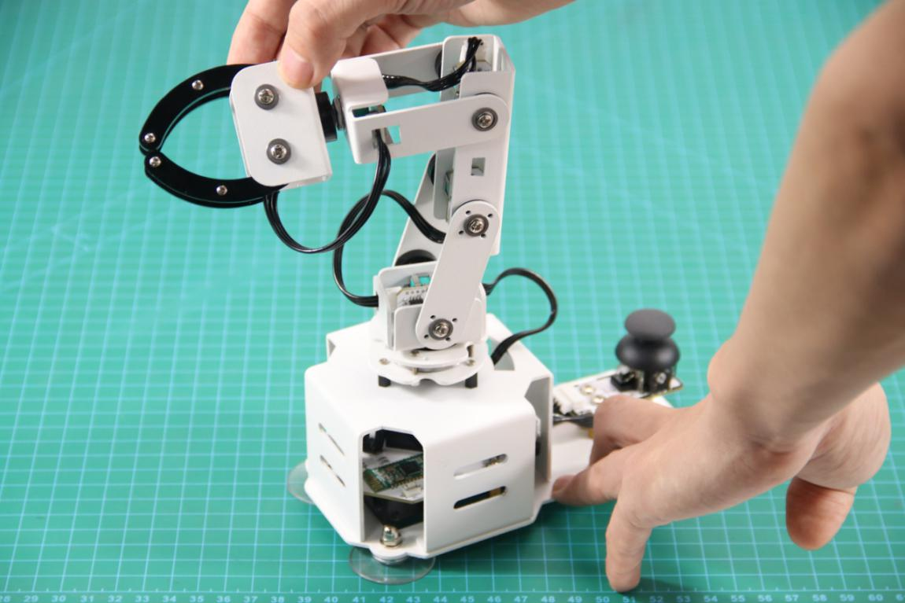

Briefly press `KEY2` to execute the recorded actions once. Press and hold `KEY2` for 3 seconds to run the actions in a continuous loop. During looping, briefly press `KEY1` to stop the loop and exit.

### 15.1.6 Changing Function for Control Button

*   **Overview**

The factory firmware of the synchronization controller supports four control modes: Tankbot, xArm, LeArm AI, and WonderArm.

| **No.** | **Control Mode** | **LED Indicator Pattern** |
|:---:|:---:|:---|
| 1 | Tankbot (default mode) | LED1 flashes once in a repeating cycle |
| 2 | xArm | LED1 flashes twice in a repeating cycle |
| 3 | LeArm AI | LED1 flashes three times in a repeating cycle |
| 4 | WonderArm | LED1 flashes four times in a repeating cycle |

**"KEY1"** is used to select the mode, and **"KEY2"** is used to confirm and enter the selected mode. After choosing the desired mode, press **"KEY2"** to confirm and enter.


If you need to change the order of control modes, you can follow the approach provided in this section.

*   **Modification Method**

:::{Tip}
Before modifying, you can use **"//"** to comment out the code sections that need to be modified below.
:::

(1) Open the program file with the `.ino` extension located in the [Factory Firmware Programs → Sync](Appendix.md) folder in the same directory as this document.

(2) To change the device order associated with the `KEY1` button, you need to modify the following three locations in the code:

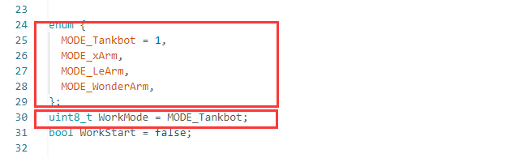

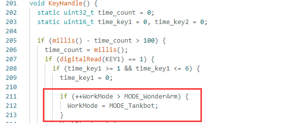

(3) The `KEY1` button cycles through devices in this order: Tankbot, xArm, LeArm AI, and WonderArm. For example, if you want to set xArm as the default device after power-on, followed by LeArm AI, WonderArm, and lastly Tankbot, refer to the illustration below for how to modify the code accordingly.

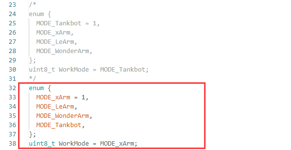

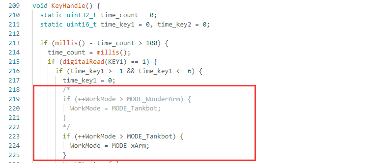

(4) When finished the modifications, compile and upload the program to apply them.

## 15.2 Synchronization Controller Control

### 15.2.1 Project Introduction 

In this lesson, a synchronization controller is used to control the robotic arm in the program.

### 15.2.2 Project Process 

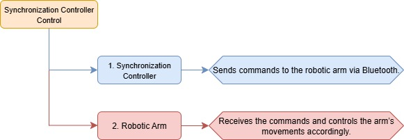

### 15.2.3 Module Instruction 

:::{Note}
Before starting this section, please first complete the course [15.1.4 LeArm AI Robotic Arm Control](#anchor_15_1_4) to familiarize yourself with how to use the synchronization controller.
:::


The robot synchronization controller is an Arduino-based controller equipped with 6 potentiometers and 1 joystick module. It is compatible with various HiWonder series robots, such as the LeArm AI robotic arm. Using Bluetooth communication, it enables easy wireless remote control and synchronized actions, making operation simple, convenient, and fun.

### 15.2.4 Program Download 

[Source Code](../_static/source_code/LeArm_Synchronization_Controller_Course.zip)

(1) Program Download for Synchronization Controller

① Connect the controller to the computer using a USB cable.

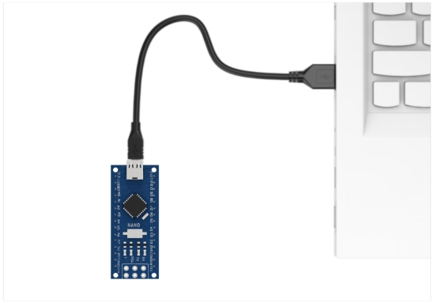

② In the [Factory Firmware Program for Synchronization Controller->Sync](Appendix.md) folder located in the same path as this document, find the corresponding example project file.

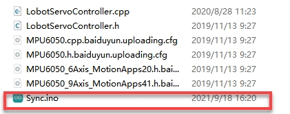

③ Select the development board model when you open the program, and the specific model is shown in the figure below.


④ Select the development board and processor model as shown in the figure.


⑤ Click **"Compile"** first, then click **"Upload"**. After the upload is completed, the program download is completed if the following interface appears in the output box below the software.


(2) ESP32 Program Download

① Connect the core board to the computer using a USB cable.


② Locate the corresponding Arduino project file in the same directory as this document.


③ Select the development board model when you open the program, and the specific model is shown in the figure below.


④ Click **"Compile"** first, then click **"Upload"**. After the upload is completed, the program download is completed if the following interface appears in the output box below the software.


### 15.2.5 Project Outcome 

First, turn on the robotic arm first, then turn on the synchronizer. If the synchronization controller 's Bluetooth module indicator is flashing, briefly press the **"DEL"** button next to the Bluetooth module. Wait a moment for the two devices to automatically pair. Once the indicator stays solid, pairing is successful.

After successfully pairing with the device, press the **"KEY1"** button twice until LED1 flashes three times in a repeating cycle, indicating that it has successfully switched to the LeArm AI robotic arm control mode. Finally, press the **"KEY2"** button to confirm and enter this mode.

By rotating or moving the potentiometers on the synchronization controller, the corresponding servos on the robotic arm will execute the same movements in real time. Each potentiometer on the synchronization controller corresponds one-to-one with a specific servo on the robotic arm. For example, potentiometer 1 on the synchronization controller controls servo No. 1 on the LeArm AI, and so on.


### 15.2.6 Program Brief Analysis 

:::{Note}
The synchronization controller communicates with the robotic arm via Bluetooth. The command frame format, protocol parsing, and control logic are consistent with the **"App Control"** section in the Basic Development Course. Please refer to that section for more details. The explanation here focuses on specific implementation details.
:::

(1) ino File (Application Layer)

{lineno-start=1}
```python
#include "Config.h"
#include "Hiwonder.hpp"
#include "Robot_arm.hpp"
#include "./src/PC_BLE/PC_BLE_CTL.hpp"

Led_t led_obj;
Buzzer_t buzzer_obj;
LeArm_t arm;
PC_BLE_CTL pc_ble_obj;

void setup() {
  delay(1000);
  pinMode(IO_BLE_CTL, OUTPUT);
  digitalWrite(IO_BLE_CTL, HIGH);  // Set the Bluetooth control pin to low level to cut off the Bluetooth module power (设置蓝牙控制引脚为低电平时，断开蓝牙模块电源)

  arm.init();
  led_obj.init(IO_LED);
  buzzer_obj.init(IO_BUZZER);

  Serial.begin(9600);
  delay(2000);

  pc_ble_obj.init(1);

  buzzer_obj.blink(1500, 100, 100, 1);
}

void loop() {
  pc_ble_obj.PC_BLE_Task(&arm , &led_obj , &buzzer_obj);
}
```

① Import the following libraries: `config.h`, `Hiwonder.hpp`, `Robot_arm.hpp`, and `PC_BLE_CTL.hpp`. The `Robot_arm.hpp` file contains the definition of the robotic arm object, while `PC_BLE_CTL.hpp` includes the definition of the Bluetooth receiver object.

② Objects for the LED, buzzer, robotic arm, and Bluetooth receiver are created for later use in control operations.

③ In the `setup()` function,first delay for 1000 ms (1 second), then power off the Bluetooth module. Next, initialize the robotic arm, LED, and buzzer objects, then open the serial port and set the baud rate to 9600.
The Bluetooth receiver object is initialized, and the buzzer beeps once for feedback.

④ In the main loop, the Bluetooth receiver controller is activated.

(2) PC_BLE_CTL.cpp File (Low-Level)

① PC_BLE_Task – Main Bluetooth Receiver Function

Within the main Bluetooth control function, the `unpack()` method is first called to decode incoming Bluetooth data. If decoding is successful, the command field (`packet.cmd`) is checked to determine which action to perform.

The synchronization controller controls the rotation of multiple servos in the robotic arm. At the communication protocol level, it sends command frames of the type "**Control Single/Multiple Servo PWM**", which corresponds to Function Code 3 in the message definition. When `case 3` is triggered, the control mode is set to `APP_FUNC_MULT_SERVO_MOVE`.

{lineno-start=21}
```python
typedef enum
{
	APP_VERSION_QUERY = 1, //Firmware query (固件查询)
	APP_SERVO_OFFSET_READ, //Read servo offset (舵机偏差读取)
	APP_MULT_SERVO_MOVE, //Control single/multiple servo pulse width (控制单/多个舵机脉宽)
```

Within the `APP_MULT_SERVO_MOVE` branch, the number of servos to control and the motion duration are extracted from the data packet. A loop iterates through the packet to read each servo's ID and duty cycle. The `knot_run()` function is then called to control the corresponding servo motor based on the parsed values.

{lineno-start=148}
```python
      case APP_MULT_SERVO_MOVE:{
          servos_count = packet.buffer[0];
          servos_count = packet.buffer[0];
          running_time = MERGE_HL(packet.buffer[2], packet.buffer[1]);
          for (uint8_t i = 0; i < servos_count; i++)
          {
              set_id = packet.buffer[3 + i * 3];
              set_duty = MERGE_HL(packet.buffer[5 + i * 3], packet.buffer[4 + i * 3]);
              robot->knot_run(set_id, set_duty, running_time);
          }
          status = APP_FUNC_NULL;
      }break;
```