# 2. Remote Control

## 2.1 Wireless Controller Control

### 2.1.1 Preparation

Insert the controller receiver into the robotic arm's control board. Open the back cover of the controller and install two AAA batteries in the battery compartment, ensuring the correct polarity.

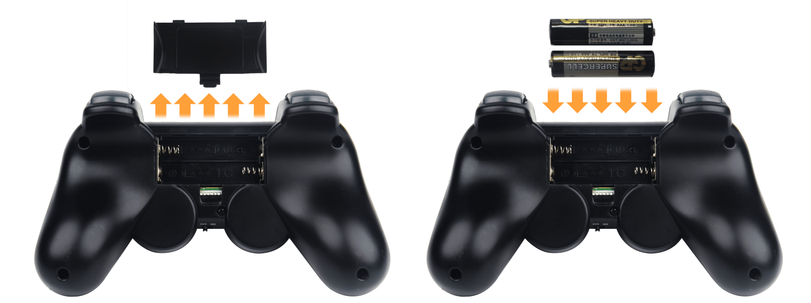

### 2.1.2 Device Connection

Turn ON the robotic arm. Turn ON the controller. Both the red and green LEDs will begin flashing, indicating the controller is searching for a connection. After a few seconds, the controller will automatically pair with the robotic arm. Once pairing is successful, both LEDs will remain steadily lit.

:::{Note}

If only the red or green LED stays lit, press the **MODE** button to initiate pairing again.
:::

(1) If the core board is running the factory default program, press the **K1** button on the servo controller board twice shortly after powering on. When the buzzer beeps three times, the robotic arm will switch to controller mode and begin responding to input commands.

(2) Sleep mode: To conserve power, the controller will automatically enter sleep mode under the following conditions: It does not pair with the robotic arm within 30 seconds of powering on, or there is no input activity for 5 minutes after pairing. To wake the controller from sleep mode, simply press the **START** button.

(3) If pairing is unsuccessful, turn off both the robotic arm and the controller. Then, repeat the above steps to try reconnecting.

### 2.1.3 Mode Introduction

The Controller Offers Two Operating Modes for the Robotic Arm: Normal Control Mode and Coordinate Control Mode. Once the controller is successfully connected, it defaults to Normal Control Mode.

Normal Control Mode (Red LED on): This is the default mode after startup. You can control individual servos by pressing single buttons. Pressing **Select** + another button allows you to trigger action sequences.

Coordinate Control Mode (Red and Green LEDs on): In this mode, you can use the analog sticks on both sides of the controller to move the robotic arm's end-effector to a specific 3D coordinate using inverse kinematics.

:::{Note}
For unassembled kit users: This mode requires the action group files to be preloaded onto the main controller board. Please refer to the tutorial in [3. PC Software Action Group Control](3.PC_Software_Action_Group_Control.md) for guidance.
:::

To switch between the two modes, press and hold the **MODE** button until you hear a confirmation sound, then release. The system will toggle to the other mode.

### 2.1.4 Interfaces and Buttons

The following table outlines the button functions in Normal Control Mode:

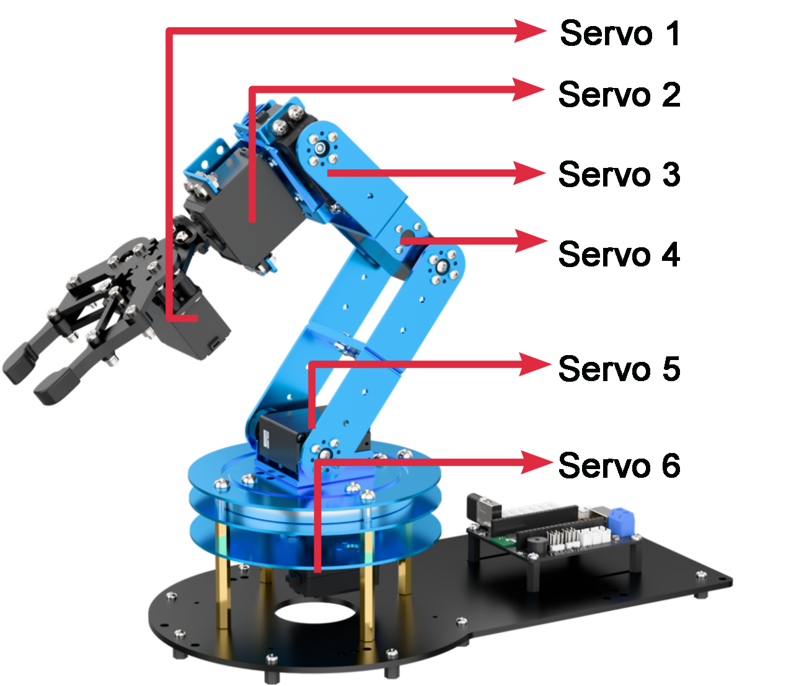

For combination keys, hold down **SELECT** first, then press the corresponding button.

| **Button** | **Function** |
|:----------:|:------------:|
| **START** | **Reset all servos** |
| **△** | Rotate Servo 1 forward/backward |
| **×** | Rotate Servo 1 forward/backward |
| **○** | Rotate Servo 2 forward/backward |
| **◻** | Rotate Servo 2 forward/backward |
| **R1:** | Rotate Servo 3 forward/backward |
| **R2:** | Rotate Servo 3 forward/backward |
| **L1:** | Rotate Servo 4 forward/backward |
| **L2:** | Rotate Servo 4 forward/backward |
| **↑** | Rotate Servo 5 forward/backward |
| **↓** | Rotate Servo 5 forward/backward |
| **←** | Rotate Servo 6 forward/backward |
| **→** | Rotate Servo 6 forward/backward |
| **SELECT + ↑** | Run Action Group 0 (Forward-facing standby) |
| **SELECT +↓** | Run Action Group 1 (Downward-facing standby) |
| **SELECT +←** | Run Action Group 2 (Upward-facing standby) |
| **SELECT +→** | Run Action Group 3 (Sort left after recognition) |
| **SELECT + L1** | Run Action Group 4 (Sort right after recognition) |
| **SELECT + L2** | Run Action Group 5 (Sort center after recognition) |
| **SELECT + △** | Run Action Group 6 (Sort center from left side) |
| **SELECT +×** | Run Action Group 7 (Sort center-left from left) |
| **SELECT + ○** | Run Action Group 8 (Sort center-right from left) |
| **SELECT +→** | Run Action Group 9 (Swing left-right) |
| **SELECT + R1** | Run Action Group 10 (Swing up-down) |
| **SELECT + R2** | Run Action Group 11 (Place recyclable waste) |
| **Left stick press** | Decrease movement time (minimum 400 ms) |
| **Right stick press** | Increase movement time (maximum 10,000 ms) |

The following table outlines the button functions in Coordinate Control Mode:

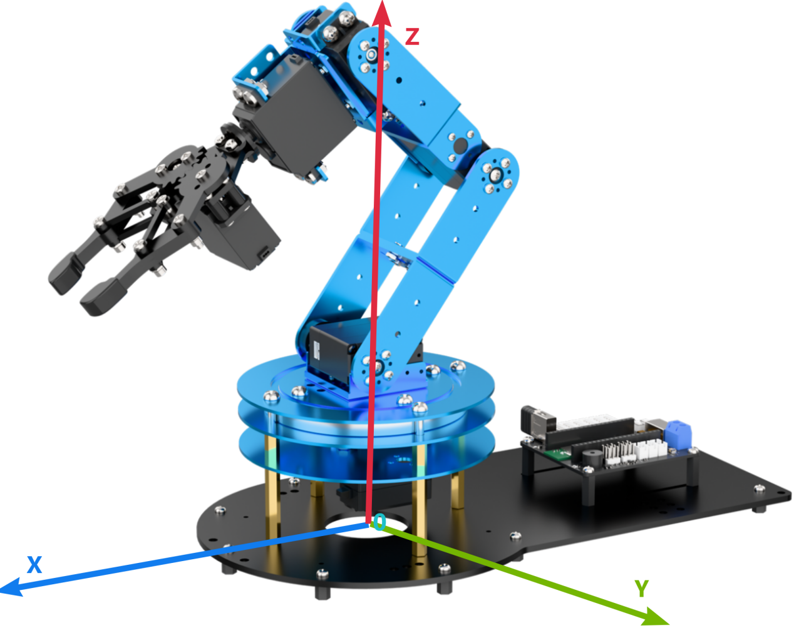

| Button | Function |
|:----------:|:------------:|
| Left stick (up/down) | Controls X-axis of the arm's end-effector |
| Left stick (left/right) | Controls Y-axis of the arm's end-effector |
| Right stick (up/down) | Controls Z-axis of the arm's end-effector |

## 2.2 App Usage Instructions

**The app control program is pre-installed on LeArm, enabling users to start exploring its features right away.**

### 2.2.1 App Installation

For iOS users: Simply download [Wonderbot](https://apps.apple.com/us/app/wonderbot-robot/id1519146341) from the App Store.

For Android users: Download "**Wonderbot**" from the Google Play Store using this link: <https://play.google.com/store/apps/details?id=com.Wonder.bot>

### 2.2.2 App Connection

:::{Note}
* Before using the app, please enable Bluetooth and Location Services in your phone's settings.
* To connect to the device, use the Bluetooth button within the app. Do not pair the device through your phone's Bluetooth settings using a passkey.
:::

(1) Turn ON the power switch on the LeArm servo controller.

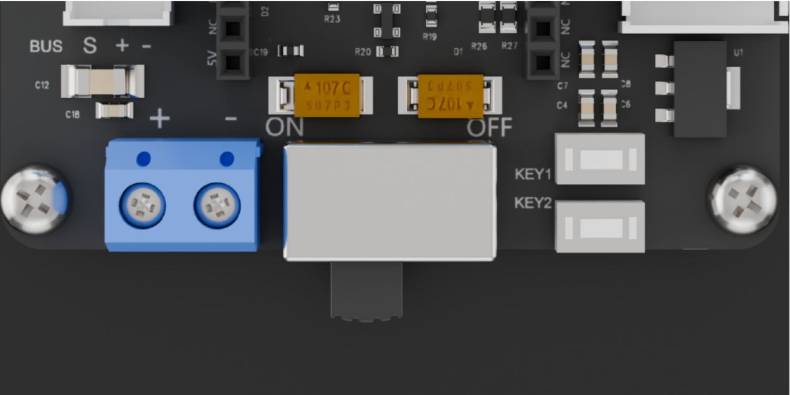

(2) Open the **Wonderbot** app on your smartphone. Tap the icon in the top-left corner to select your robot model, then choose **LeArm** from the list.

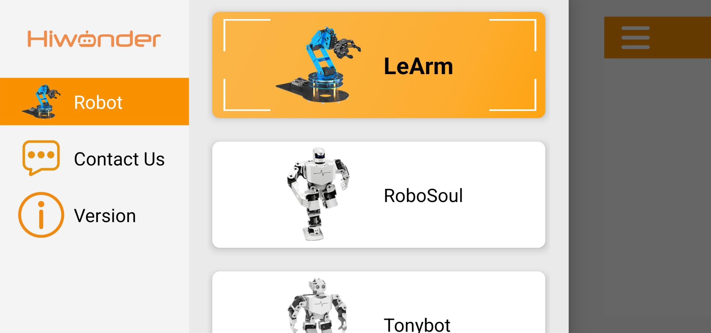

(3) After selecting the model, you'll be taken to the Mode Selection screen. Tap the blinking icon in the top-right corner , then look for **"Hiwonder"** in the list of available Bluetooth devices. Tap to connect.

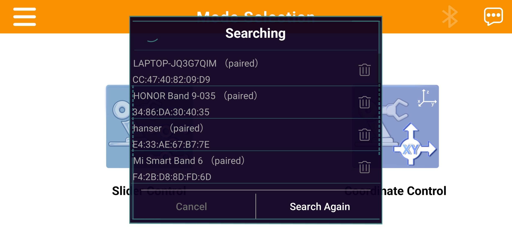

:::{Note}

If **"Hiwonder"** doesn't appear right away, tap **"Rescan"** to search again.

:::

(4) Once connected, the Bluetooth icon in the top-right corner will stay lit, indicating a successful connection.

### 2.2.3 Feature Overview

The app provides two control modes: Slider Control and Coordinate Control. The following section outlines the functions of each mode and related icons.

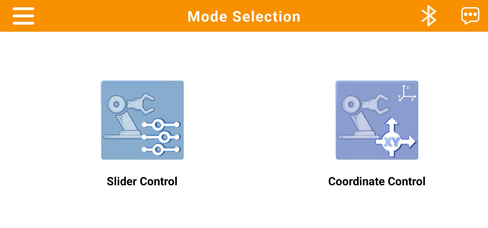

|                                           Icon                                           | Function Description |
|:----------------------------------------------------------------------------------------:|:--------------------:|
|   | Return to the home interface to select a robot model |
| 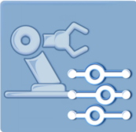  | Slider Control Mode: Manually control the robotic arm's servos or drive the chassis using on-screen sliders |
| 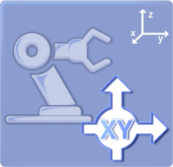  | Coordinate Control Mode: Move the robotic arm to specified 3D coordinates or execute preset action groups |
|  | Bluetooth Connection Status: The icon flashes when not connected; it remains solid when connected successfully |
|  | Access additional information or settings |

### 2.2.4 Slider Control

:::{Note}
Action groups 0–20 are preloaded at the factory.
:::

Within the control interface, you can manipulate the robotic arm's joints using buttons and sliders. The interface consists of two main sections, as illustrated below:

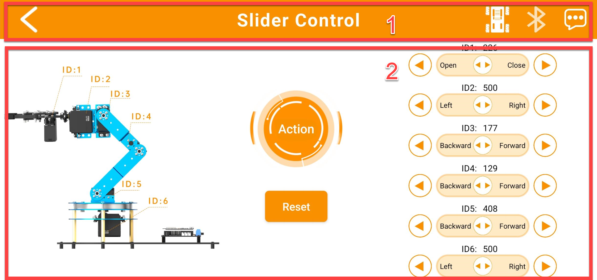

(1) Menu Bar

|                                           Icon                                           | Function Description |
|:----------------------------------------------------------------------------------------:|:--------------------:|
|  | Return to the home interface to select a robot model |
|  | Switch to the chassis control interface (refer to Section ③ below). |
|  | Bluetooth Connection Status: The icon flashes when not connected; it remains solid when connected successfully |
|  | Access additional information or settings |
|  | Operating Mode |

(2) Control zone

| Icon | Function Description |
|:----:|:--------------------:|
| 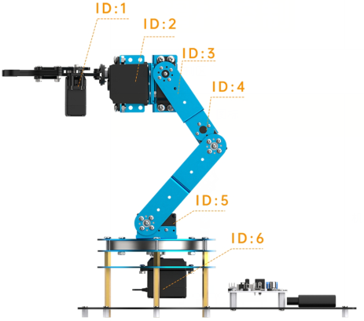 | Servo ID Diagram: Helps you easily identify and adjust each servo. |
|  | Servo Control Area: Control individual servo positions here by either: 1. Dragging the slider left or right to change the position, or 2. Tapping or holding the buttons to increase or decrease the value. |
|  | Custom Action Groups: Tap this button to access the custom action group screen (see Section ④ below). |
|  | Reset Pose: Tap to return the robotic arm to its default starting position. |

(3) Chassis Movement Interface:

Use this mode to control the movement of the chassis equipped with the LeArm robotic arm.

:::{Note}
This interface supports both tracked and mecanum wheel chassis.
:::

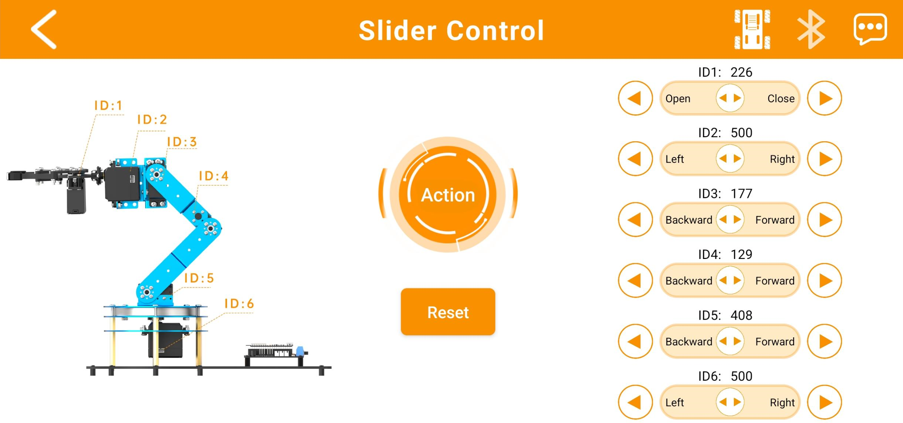

| Icon | Function Description |
|:----:|:--------------------:|
|  | Control the movement direction of the car |
|  | Control the robot car to turn left/ right |

(4) Custom Action Group Interface

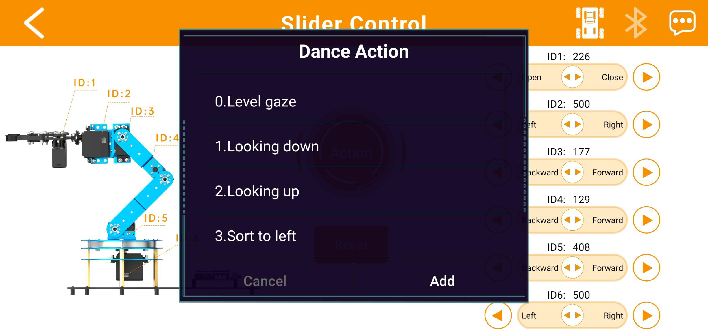

① This screen displays your custom action groups. Tap **"Add"** to create a new custom action group.

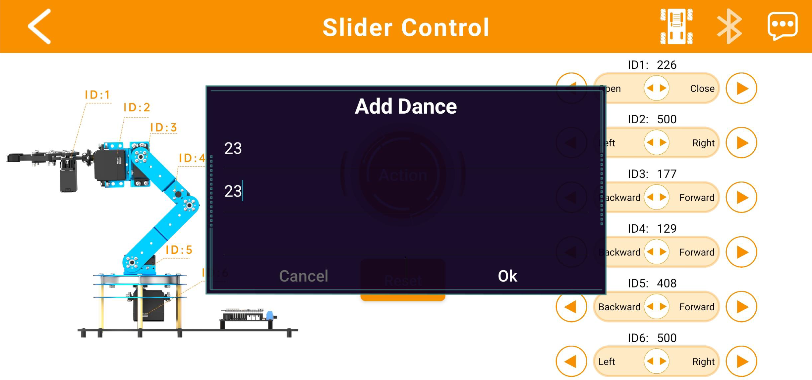

② For example, as shown above, you can rename Action Group 23 to **"Action 23"** for easier access within the app, then tap **"Confirm."**

③ Afterwards, you can easily call up Action Group 23 by selecting **"Action 23"** in the **"Custom Action Group"** interface.

:::{Note}
* The factory firmware does not include Action Group 23 by default. You will need to learn how to download the action group file to Action Group 23 using the PC software in later lessons, and then call it through the app.
* If the robotic arm attempts to execute an action group number for which the corresponding file has not been downloaded, it will remain stationary and unresponsive.
:::

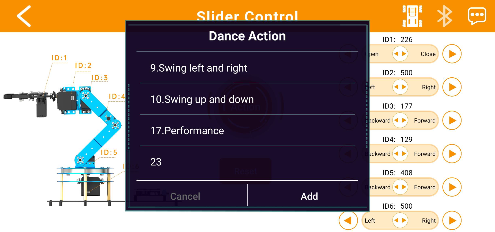

④ Press and hold the action group icon to modify the assigned action group number or change the system alias used to call that action group.

:::{Note}
Predefined action groups in the app's **"Custom Action Group"** interface cannot be modified.
:::

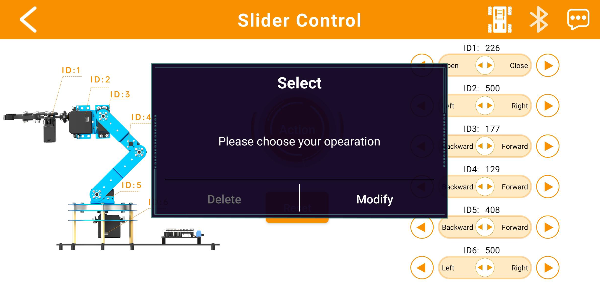

### 2.2.5 Coordinate Control

In Action Creation Mode, users can precisely control the robotic arm's end-effector—the front part of the gripper—to move to designated coordinates within the arm's coordinate system, as well as operate the gripper's opening, closing, and rotation movements.

(1) Menu Bar

|                                           Icon                                           | Function Description |
|:----------------------------------------------------------------------------------------:|:--------------------:|
|  | Return to the home interface to select a robot model |
|  | Switch to the chassis control interface (refer to Section ③ below). |
|  | Bluetooth Connection Status: The icon flashes when not connected; it remains solid when connected successfully |
|  | Access additional information or settings |
|  | Operating Mode |

(2) Control zone

|                                           Icon                                           | Function Description |
|:----------------------------------------------------------------------------------------:|:--------------------:|
| 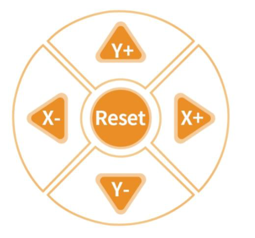 | Click **"X+"** to increase the X-axis coordinate of the end-effector, moving the robotic arm forward. Click **"X−"** to decrease the X-axis coordinate, moving the robotic arm backward. Click **"Y+"** to increase the Y-axis coordinate, moving the robotic arm to the left. Click **"Y−"** to decrease the Y-axis coordinate, moving the robotic arm to the right. Click **'Reset'** to move the robotic arm's end effector to its initial position and restore the arm to its default posture at power-on. |
|  | Adjusting the Z-axis coordinate of the end effector within the robotic arm's coordinate system causes the arm to move vertically upward or downward. |
|           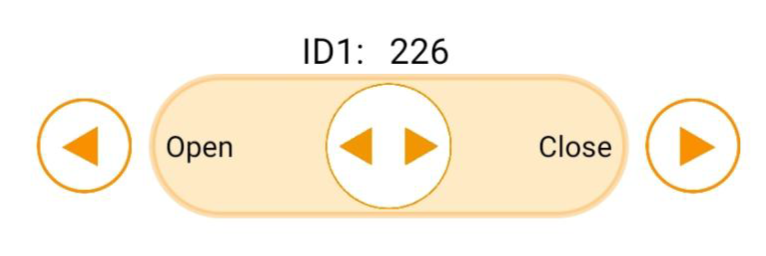           | Servo Control Area: Control individual servo positions here by either: 1. Dragging the slider left or right to change the position, or 2. Tapping or holding the buttons to increase or decrease the value. |
|                      | Click this button to access the Custom Action Group interface (previously introduced, so not detailed here). |

(3) Chassis Movement Interface:

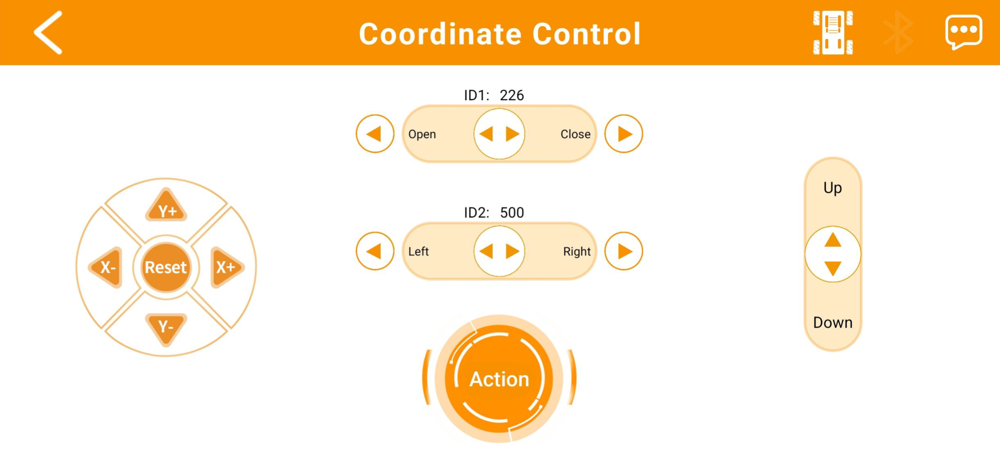

| Icon | Function Description |
|:----:|:--------------------:|
|  | Control the movement direction of the car |
|  | Control the robot car to turn left/ right |