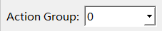
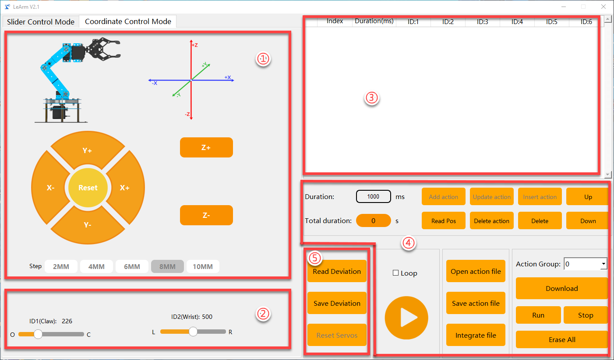
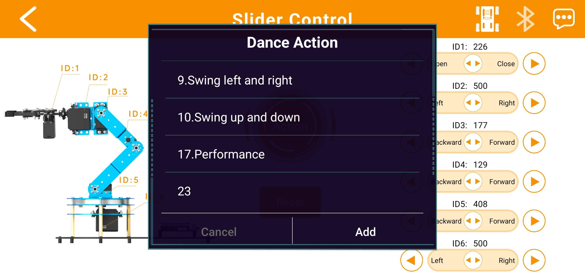

# 3. PC Software Action Group Control

## 3.1 PC Software Overview

### 3.1.1 Install Serial Port Driver

(1) Locate and run the application in the folder [Appendix->PC Software Installation Pack](Appendix.md).

(2) Click the **Install** button. The **Install** and **Uninstall** buttons will then be grayed out. After a moment, a message will appear confirming the installation was successful.

### 3.1.2 Launch the Software

:::{Note}
The PC software is portable and does not require installation. Just make sure the driver is installed in advance.
:::

(1) Navigate to the folder [Appendix->PC Software Installation Pack](Appendix.md) and locate the software named **"LeArm"**.

(2) Copy it to any location on your computer, then double-click to launch.

(3) You can switch the software language in the top-left corner of the interface.

### 3.1.3 Device Connection

:::{Note}
* Before proceeding, please ensure that the robotic arm has been fully assembled and wired. Also, make sure that one of the compatible core control boards is installed on the 6-channel servo controller and powered via the adapter.
* If the core board is running the factory default program, press the **K1** button on the servo controller twice shortly after powering on. When the buzzer beeps twice briefly, the robotic arm enters PC control mode, ready to receive commands from the software.
:::

(1) Connect the power adapter to the servo controller and turn on the controller switch. Then, use a USB cable to connect the Type-C port of the core board to your computer, and double-click to open the PC software.

The diagram below uses the ESP32 core board as an example to show the USB connection method.

(2) In the software, select the correct **COM** port for your device.

(3) When the red circular icon turns green, the connection is successful.

### 3.1.4 Feature Description

The PC software offers two control modes for operating the robotic arm:

(1) Slider Control Mode

(2) Coordinate Control Mode

In Slider Control Mode, users can control individual servos or execute predefined action groups. In Coordinate Control Mode, inverse kinematics is used to control the robotic arm's movement based on target coordinates.

You can switch between modes by clicking the corresponding icon in the top-left corner of the software interface. The software will automatically switch to the selected mode.

:::{Note}
LeArm is available in two versions: one with bus servos and one with PWM servos. The PC software automatically detects the servo type and switches to the appropriate interface. While both interfaces are nearly identical, there are slight differences in action group formats and servo position values.
This guide uses the PWM version as an example, but users with the bus servo version can also refer to it for learning purposes.
:::

* **Slider Control Function**

(1) Device Connection

| Icon | Feature Description |
| :--: | :--: |
|  | Used to indicate the device connection status. When the connection is successful, it appears green; when disconnected or not connected, it appears red. |
|  | This section is used to select the external device port for communication with the PC software. You must select the correct port corresponding to **LeArm** here in order to establish a successful connection. |

(2) Servo Control Area

This area displays the icons of selected servos. You can adjust each servo's position by moving the corresponding slider.

| Icon | Feature Description |
| :--: | :--: |
|  | Represents the servo's ID. In this example, the ID is 2. |
|  | Used to adjust the servo's position. The value ranges from 0 to 1000. |
|  | Used to adjust the servo offset. The value ranges from -100 to 100. |

(3) Action List

Displays the execution time of each action in the current action group, as well as the position values of all servos within each action.

| Icon | Feature Description |
| :--: | :--: |
|  | Action number. There are a total of 230 action groups, and each group can contain up to 1,020 actions. If this limit is exceeded, a prompt will appear stating that the actions can only be run online and cannot be downloaded. |
|  | The action runtime refers to the time required to execute that action. You can double-click the value below to directly modify the runtime. |
|  | The values correspond to the actions for the specified servo ID. |

(4) Action Group Setting Area

| Icon | Feature Description |
| :--: | :--: |
|  | Action group index selection. Click to select an action group number between 0 and 254. Typically, action group 0 serves as the initial pose. |
|  | Downloads the current list of actions to the controller, overwriting any existing actions in the selected group. |
|  | Executes the selected action group once. |
|  | Stops the currently running action group. |
|  | (Use with caution) Deletes all data in action groups numbered 0–254. |
|  | User-defined time for the robotic arm's servos to move to the positions set in the servo control area (left-side robotic arm image). |
|  | Total execution time for all actions in the action detail list. |
|  | Adds the current servo values from the servo control area as a new action at the end of the action detail list. |
|  | Reads and imports the current servo positions of the robotic arm. |
|  | Replaces the selected position values in the action detail list with the values from the servo control area. (The replaced action runtime is updated with the time set in **"Action Time."**) |
|  | Deletes the selected action(s) from the action detail list. |
|  | Inserts a new action above the selected action. (The inserted action uses the **"Action Time (ms)"** setting and the servo values from the servo control area.) |
|  | Deletes the selected action(s) from the action detail list. |
|  | Moves the currently selected action up by one position in the action detail list. |
|  | Moves the currently selected action down by one position in the action detail list. |
|  | Select an action group to load its data into the action detail list. (Provided action group files are located in the folder: **"2. Software Tools & Programs Collection\\ Action Group Files"**.) |
|  | Saves the current actions in the action detail list to a specified location. |
|  | After opening an action group, you can click the **"Integrate Action Files"** button to load another action group and merge both into a new action group. |
|  | Clicking this button runs the actions in the action detail list once. (If **"Loop"** is checked, the robotic arm will repeat the actions continuously.) |

(5) Servo Setting Area

| Icon | Feature Description |
| :--: | :--: |
|  | Click to automatically read the saved servo offsets from the controller. |
|  | Click to download the servo offsets adjusted via the PC software to the robotic arm. |
|  | All servos will move to their neutral positions, with the robotic arm pointing straight upward. |

* **Coordinate Control Function**

In Coordinate Control Mode, the interface is divided into five areas:

(1) Kinematic Coordinate Control Area

(2) End-Effector Servo Control Area

(3) Action Detail List

(4) Action Group Settings Area

(5) Servo Settings Area

Areas (3), (4), and (5) function the same as in Slider Control Mode, though some features may be disabled (grayed out icons/text), so they will not be elaborated here.

(1) Kinematic Coordinate Control Area

In this mode, you can use the PC software to control the end-effector (the frontmost part of the gripper) by specifying 3D coordinates within the robotic arm's coordinate system (as shown in the diagram on the right).
The robotic arm will use inverse kinematics to move the end-effector precisely to the designated position.

| Icon | Feature Description |
| :--: | :--: |
|  | Click **"X+"** to increase the X-axis coordinate of the end-effector, moving the robotic arm forward. Click **"X−"** to decrease the X-axis coordinate, moving the robotic arm backward. Click **"Y+"** to increase the Y-axis coordinate, moving the robotic arm to the left. Click **"Y−"** to decrease the Y-axis coordinate, moving the robotic arm to the right. Click **"Reset"** to move the robotic arm back to its initial pose. |
|  | Increase the Z-axis coordinate to raise the robotic arm. |
|  | Decrease the Z-axis coordinate to lower the robotic arm. |
|  | Set the increment value for each adjustment of the end-effector's X, Y, or Z coordinate. |

(2) End-Effector Servo Control Area

| Icon | Feature Description |
| :--: | :--: |
|  | Controls the position of Servo 1, which operates the gripper to open and close. The diagram shows the relationship between position values and the gripper's opening/closing state. |
|  | Controls the position of Servo 2, which rotates the gripper wrist left or right. The diagram indicates how position values correspond to the direction of rotation. |

## 3.2 Action Calling & Download

### 3.2.1 Objective

Use the PC software to control the robotic arm and **burn the action group file "No. 3: Recognition and Sorting to the Left"** into the servo controller, then execute it once.

:::{Note}
LeArm is available in two versions: one with **bus servos** and one with **PWM servos**.

The PC software will automatically detect the version and switch to the corresponding interface.

Both interfaces are highly similar, with only slight differences in action group formats and servo position values.

This guide uses the **PWM servo version** as an example, but users with the **bus servo version** may also refer to it for learning.
:::

### 3.2.2 Action Download

(1) Turn on the robotic arm and connect it to your computer using a USB cable.

:::{Note}
If the core board is running the factory default program, press the **K1** button on the servo controller once after powering on.
When the buzzer beeps **twice briefly**, the robotic arm enters **PC control mode** and is ready to receive commands from the software.
:::

(2) Open the PC software, and navigate to [Appendix->Action Group Files](Appendix.md) to select the action group file you wish to download.

(3) In the action group list, choose the **action group number** where you want to store the file. In this example, select **Group 3**.

(4) Click **"Download"** — the action group will be downloaded automatically.

### 3.2.3 Action Calling

* **Method 1**

(1) Turn on the robotic arm and connect it to your computer as previously instructed.

:::{Note}

If the core board is running the factory default program, press the **K1** button on the servo controller once after powering on.

When the buzzer beeps **twice briefly**, the robotic arm enters **PC control mode** and is ready to receive commands from the software.
:::

(2) Double-click to launch the PC software, then click the **"Open Action File"** button.

Navigate to the folder:[Appendix->Action Group Files](Appendix.md),and select the action file **"No. 3: Recognition and Sorting to the Left."**

(3) Click  — the **LeArm** robotic arm will immediately begin executing the action group **once**.

:::{Note}

If the **"Loop"** option is checked, the robotic arm will repeat the action continuously.

:::

* **Method 2**

(1) Turn on the robotic arm and connect it to your computer as previously instructed.

:::{Note}

If the core board is running the factory default program, press the **K1** button on the servo controller once after powering on.
When the buzzer beeps **twice briefly**, the robotic arm enters **PC control mode** and is ready to receive commands from the software.

:::

(2) Double-click to launch the PC software. In the **"Action Group"** dropdown menu, select **Group 3**.

(3) Click the **"Run Action Group"** button — the **LeArm** robotic arm will immediately begin executing **Action Group 3** once.

:::{Note}
To use this method, please ensure that the selected action group has been **preloaded onto the servo controller**.
:::

* **Other Methods**

**LeArm** also supports other methods for executing action group files, including:

(1) Offline execution ([File 3.5 Offline Operation](#anchor_3_6))

(2) Execution via mobile app ([Section 3.6: Custom App Control](#anchor_3_6))

(3) Execution via serial commands (["**1. Tutorials**" folder, under each core board's programming project in the "**Serial Communication Practice**" subfolder](https://drive.google.com/drive/folders/1OnU6SC0Wc7oRPk8l6BEuOX519DnwVkOo?usp=sharing))

## 3.3 Action Editing

### 3.3.1 Objective

Create an action group titled **"Forward Grasp"** consisting of 7 actions.

:::{Note}

The actions in this section are for demonstration purposes only and are intended to help users quickly understand how to edit actions. For reference to standard actions, please check the sample action group files in the folder: [Appendix->Action Group Files](Appendix.md).
:::

### 3.3.2 Function Realization

* **Action Design**

(1) Turn on the robotic arm and connect it to your computer using a USB cable.

(2) Double-click to open the PC software, then click the **"Open Action File"** button and select the action file **"Group 0 – Forward-facing Idle Recognition."** Click  to update the servo values in the control panel on the left. This becomes the first action in your group.

(3) Next, adjust the robotic arm to bend forward slightly and open the gripper.In the Servo Control Area on the left, slide the sliders for servos ID 1, 3, 4, and 5 to match the values shown in the image below.

:::{Note}
You can hold the left mouse button and tap the slider bar for fine-tuning.
:::

(4) Click **"Add Action"** to add this **"bending forward"** motion as the second action in the action list on the right.

(5) Then, slightly lower the arm and fine-tune the gripper angle to prepare for grasping. Adjust servos ID 1, 3, and 4 as shown in the diagram, then click **"Add Action"** to save the third action.

(6) Now let the gripper close to grasp the object. Follow the same method and adjust the values as shown to add the fourth action.

(7) Keep the gripper closed and rotate the base to move the object. This mainly involves adjusting servo ID 6. Set the value according to the image and add the fifth action.

(8) Once in position, slightly lower the arm and open the gripper to place the object down. Add this as the sixth action.

(9) Finally, return the arm to its initial pose: Click the first action in the list to move the arm back to its original posture.
Then click **"Add Action"** again — a seventh action will be added, with servo values identical to the current positions (same as Action 1).

* **Action Download**

(1) After editing the action group, you'll need to save the file locally for future testing and adjustments. Click the **"Save File"** button. In the pop-up window, enter a file name and group number — for example, name it **"Group 22 – Grasp Object"**, then click **Save**. As shown below:

(2) Once the file is saved, download the action group to the controller. On the right side of the interface, set the action group number to 22, then click the **"Download"** button.

When the download is complete, a **"Download Complete"** confirmation window will appear. Click **"OK"** to close the program.

## 3.4 Integrate Action Files

### 3.4.1 Objective

Learn to use the action file integration feature to merge action groups

:::{Note}
LeArm is available in two versions: one with bus servos and one with PWM servos. The PC software automatically detects the servo type and switches to the appropriate interface. While both interfaces are nearly identical, there are slight differences in action group formats and servo position values.
This guide uses the PWM version as an example, but users with the bus servo version can also refer to it for learning purposes.
:::

### 3.4.2 Function Realization

(1) Turn on the robotic arm and connect it to your computer using a USB cable.

:::{Note}
If the core board is running the factory default program, press the **K1** button on the servo controller once after powering on. When the buzzer emits two short beeps, the robotic arm enters PC control mode, ready to process commands from the software.
:::

(2) Open the PC software and connect to the correct serial port. In the Action Group Settings area, click the **"Integrate Action Files"** button. Navigate to [Appendix->Action Group Files](Appendix.md), and open Action Group 0.

(3) You will now see the parameters of Action Group 0 displayed in the Action Detail List.

(4) Click the **"Integrate Action Files"** button again and select Action Group 2 to merge it with the current action group.

(5) You can now click  to execute the newly concatenated action group online.

(6) To save the merged sequence for future debugging, click the **"Save Action File"** button. In this example, we name the file **"Group 21 – Post-Initialization Grasp to Left 90°"**.

:::{Note}
If too many actions are concatenated and the total exceeds the system limit, the PC software will prompt that the limit has been exceeded.
In this case, the action group cannot be downloaded to the controller and can only be run online for testing.
:::

## 3.5 Offline Operation

### 3.5.1 Objective

This section demonstrates how to execute an action group on the robotic arm without a PC connection, using physical button control.

:::{Note}
* **Offline execution** is only supported when a compatible core board with the factory firmware is installed on the servo controller.
* **All core boards** are shipped with the factory firmware pre-flashed.If the firmware has been overwritten and you wish to restore it, you can find it at: [Apppendix](Appendix.md).
:::

### 3.5.2 Function Realization

(1) Turn on the power switch to power up the device.

(2) After powering on, press the **K1** button on the servo controller three times to switch the working mode. When the buzzer emits **four short beeps**, the robotic arm enters **offline control mode**.

(3) Press the **K2** button once to trigger the robotic arm to execute the **"Action Group 17 – Performance Routine"** once offline.

### 3.5.3 Function Expansion

When a short press of the **K2** button on the controller is detected → execute Action Group 17.

Therefore, you can use the PC software to download a new action group file into Group 17, enabling the robotic arm to execute your custom action group offline.

:::{Note}
The method for downloading action groups has been detailed earlier and will not be repeated here.
:::

## 3.6 Custom App Control

### 3.6.1 Objective

Use the custom control feature in the mobile app to execute the action group file **"Group 22 – Grasp Object"** created in the section [3.3 Action Editing](#anchor_3_3).

### 3.6.2 Function Realization

* **Preparation**

(1) Ensure that Bluetooth and location services are enabled on your phone.

(2) Also, confirm that Action Group 22 has been successfully downloaded to the robotic arm.

* **Operation**

(1) Turn **ON** and power on the robotic arm.

(2) Open the **"Wonderbot"** app and connect to the device.

(3) Enter any control mode (for example, Slider Control Mode) and tap the **"Action Group"** button on the main interface. In the pop-up window, tap **"Add"**.

(4) In the new window, fill in both the action group name and the action group number. The name can be anything you like, but the group number must be accurate, or the action will not run correctly.

(5) Once added, tap the **"Action Group"** button again to open the custom action group interface. Then, simply tap the button with the action name to execute it once.

(6) To edit or delete an action, press and hold the action name button, then tap **"Delete"**.

