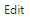

# 4. Programming Tool Installation & Introduction

## 4.1 Arduino IDE Installation & Introduction

### 4.1.1 Arduino IDE Installation

Arduino IDE is a powerful software exclusively designed for **Arduino** microcontrollers. No matter which version it is, the same installation method can be used. This lesson will take the window version of **"Arduino-2.2.1"** as an example to illustrate:

* **Arduino IDE Installation Guide**

(1) Locate the **Arduino IDE** installation package in the same folder as this document, as shown in the below figure, and double click to open it. (If you want to download the latest version of the software, you can download it through the [Arduino official website](https://www.arduino.cc/en/software).)

(2) Click **"I Agree"** to install.

(3) Remain the default option, and click **"Next"**.

(4) Click **"Browse"** to choose the installation path, and then click **"Install"**.

(5) Wait for the installation to complete.

:::{Note}

If you’re prompted for the installation of the chip driver during the installation, please check **"Always trust software from Arduino LLC (A)"**, then click **"Install"**.

:::

(6) After the installation is complete, click **"Finish"**.

### 4.1.2 Software Introduction

(1) The main interface of **Arduino IDE** consists of 5 workplaces:

① Menu bar: it is responsible for **Arduino IDE**-related settings.

| **Icon** | **Function** |
|:---:|:---:|
|  | Create or open a project file, and customize preferences for the main interface. |
|  | Perform text editing such as commenting, indenting or searching for code. |
|  | Configure the entire project, including compiling, running, and adding the library files. |
|  | Select the development board and port, as well as obtain the board information. |
|  | Assist users with getting ready and offer solutions to common issues. |

② Tool bar: some tools related to the project, including program compilation, programs download, serial monitor, etc.

| **Icon** | **Function** |
|:---:|:---:|
|  | Verification. Check if a program is written without errors. If it is fully correct, the compilation process will activate. |
|  | Download the program to the control board. |
|  | Debugging. Some development can be debugged through **Arduino IDE** in real time. |
|  | Select different boards for different development projects. |
|  | Serial plotter, which can plot data printed to the **Arduino** serial port into graph. |
|  | Serial monitor, printing serial port information. |

③ Sidebar: the core of **Arduino IDE** is in charge of displaying the working folders, code debugging, library file installation, etc.

| **Icon** | **Function** |
|:---:|:---:|
|  | Management folder, display the files of current project. |
|  | Development board manager, add the board tool package. |
|  | Library management, add or delete the library files of the program. |
|  | Debugging, real-time debugging of the project. |
|  | Search or replace the code or variables. |

④ Editing area: the area for editing code.

⑤ Status bar: display the status of the current editor, such as the line and column of code, information about the development board, etc.

## 4.2 Arduino IDE Introduction

### 4.2.1 Arduino IDE Interface Setting

* **Interface Configuration**

(1) Modify the Chinese interface: select **"File"** -> **"Preferences"** on the **Arduino IDE** interface. Then, choose Chinese from the **"Language"**, and click **"OK"**.

(2) You can modify the project file path, editor text size, color themes, etc by selecting **"File"** -> **"Preferences"** in the pop-up window.

### 4.2.2 Arduino Download Program

* **Program Download Steps**

(1) In this case, we will use an example that prints **"hiwonder"** to illustrate. Open the example program ["_Demo"]() in the **"Demo"** folder at the same folder as this document.

(2) Connect **ESP32** core board to the computer.

(3) In the **"Select board"** option, find the corresponding **ESP32** development board. (Take **"ESP32 Dev Module"** and `COM6` as an example to demonstrate. The `COM` port is not unique. You can check the `COM` port number in the computer’s device manager.)

(4) Click  button to compile the program, which can check if the program has syntax errors and other issues.

(5) After the compilation is complete, click  to upload the program into the **ESP32** development board.

(6) When the upload is done, click  to open the serial monitor. The word **"hiwonder"** is printed on the serial monitor.

### 4.2.3 Import Library Files

To run the program, you need to import the necessary **LeArm** libraries: `u8g2` and `LeArm_Kinematics_lib`. Below are the steps to import the `u8g2` library as an example:

* **Importing Libraries**

(1) In the **"Arduino IDE"**, go to the menu and select **"Project"** -> **"Include Library"** -> **"Add .ZIP Library"**.

(2) In the pop-up window, navigate to the [u8g2.zip]() file (you can find this file in the [Appendix-> ArduinoIDE Installation Package"]() folder located in the same directory as this document), then click **"Open"**.

(3) If a confirmation message appears, it means the library has been successfully installed.

