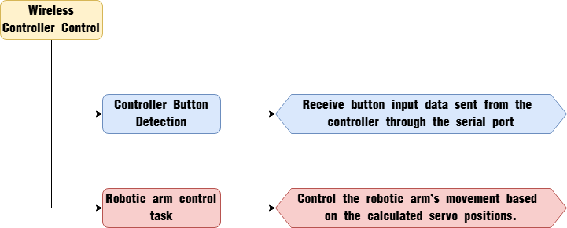
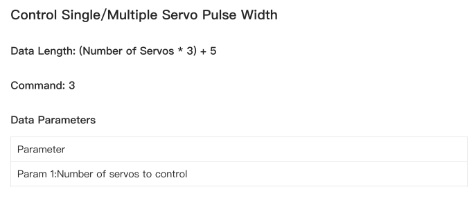
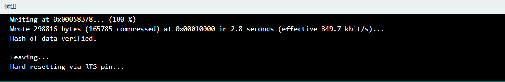

# 5. Basic Development Course

## 5.1 LED Blinking Instruction

### 5.1.1 Project Overview

This project demonstrates how to control the onboard LED on the control board to create a blinking effect through programming.

### 5.1.2 Program Procedure


### 5.1.3 Module Introduction


The LED module is a common human-machine interface component in embedded systems and development boards. It is primarily used for status indication, information feedback, and control signaling. Typical applications include system debugging, visualizing operational status, and providing feedback for specific control commands.

The LEDs on the servo controller and the main control board use a common-anode design: the anode is connected to a 3.3V power supply through a current-limiting resistor, while the cathode is connected to a GPIO pin of the main controller. When the GPIO outputs a high level (3.3V), the LED turns off; when it outputs a low level (0V), the LED turns on.

### 5.1.4 Program Download

[Source Code](../_static/source_code/Basic_Development_Course.zip)

Before downloading the program, please ensure the serial port driver is properly installed.

(1) Connect the main control board to the computer using a USB cable.


(2) Locate the corresponding example project file in the **Arduino** project folder provided in the same directory as the documentation.


(3) Open the project and select the appropriate board model, as shown in the image below.


(4) First, click **"Verify"** (Compile), then click **"Upload"**. Once the upload is complete, the output window at the bottom of the **Arduino** software should display a message similar to the one below, indicating that the program has been successfully uploaded.


### 5.1.5 Program Outcome

After the robotic arm is powered on and initialized, the LED1 indicator on the controller blinks periodically at a frequency of 1 Hz, indicating normal operation.


### 5.1.6 Program Analysis

[Source Code](../_static/source_code/Basic_Development_Course.zip)

* **INO File (Application Layer)**

(1) Import the `config.h` and `Hiwonder.hpp` library files. The `Hiwonder.hpp` file contains the definition of the `LED` object.

{lineno-start=1}
```python
#include "Config.h"
#include "Hiwonder.hpp"
```

(2) Create an `LED` object for later control.

{lineno-start=4}
```python
Led_t led_obj;
```

(3) In the `setup` function:

① Initialize the `LED` object by calling `led_obj.init`, binding it to the `IO_LED` pin on the chip.

② Initialize the serial port and set the baud rate to 9600.

**Method 1:** In the `setup` function, call the `blink` method of the `LED` object to enable blinking. Set the on-time to 1 second, the off-time to 1 second, and the number of blinks to 0 (indicating continuous blinking).

{lineno-start=6}
```python
void setup() {
  delay(1000);
  pinMode(IO_BLE_CTL, OUTPUT);
  digitalWrite(IO_BLE_CTL, LOW);  // Set the Bluetooth control pin to high level to cut off the Bluetooth module power (设置蓝牙控制引脚为高电平时,断开蓝牙模块电源)

  led_obj.init(IO_LED);
  Serial.begin(9600);

  /* Method 1: Call the led object's blink method（方法一：调用led对象的blink方法,）
  to set the LED to blink with 1s on, 1s off, and 0 times means it keeps blinking continuously（设置LED闪烁,亮灯时长为1s,灭灯的时长为1s,闪烁次数为0 次即一直闪烁） */
  led_obj.blink(1000,1000,0);
}
```

**Method 2:** In the `loop` function, call the `on_off` method of the `LED` object to manually control the `LED`: turn it on, delay for 1 second; turn it off, delay for another second—repeating this cycle continuously.

{lineno-start=19}
```python
void loop() {
  /* Method 2: Call the led object's on_off method to turn on the LED, delay 1s, then turn it off and delay 1s (方法二：调用led对象的on_off方法,设置LED亮灯,延时1s,灭灯后延时1s) */
  // led_obj.on_off(0);
  // delay(1000);
  // led_obj.on_off(1);
  // delay(1000);
  
  delay(100);
}
```

* **Led.cpp File (Underlying)**

(1) blink Method (Hardware Abstraction Layer) 

This section introduces the `Led_t::blink` method, which takes three parameters:

① Duration of the LED on state per cycle

② Duration of the LED off state per cycle

③ Number of blink cycles

Within the method, a new task flag `new_flag` is first set to 1, indicating that the parameters have changed and require processing by the underlying system. Then, the provided parameters are assigned to the corresponding internal variables.

{lineno-start=83}
```python
void Led_t::blink(uint32_t on_time , uint32_t off_time , uint32_t count)
{
    new_flag = 1;
    ticks_on = on_time;
    ticks_off = off_time;
    repeat = count;
}
```

::: {Note}
Within the method, a new task flag `new_flag` is first set to 1, indicating that the parameters have changed and require processing by the underlying system. Then, the provided parameters are assigned to the corresponding internal variables.
:::

* **led_control_callback Interrupt Callback Function (Low-Level Layer)**

(1) Task Flag Handling & Initialization

At the beginning of the function, the system checks the task control flag `new_flag`. If the flag is set to 1, it indicates a new LED task has been issued. The function then resets the flag and the internal state machine to begin a new control cycle. Afterward, the function evaluates the current status of the `LED` object and processes it based on four main states, as illustrated below.

{lineno-start=8}
```python
static void led_control_callback(Led_t* obj)
{
    /* Try to fetch new control data from the queue; if successful, reset the state machine and start a new control loop (尝试从队列中取的新的控制数据,如果成功取出则重置状态机重新开始一个控制循环) */
    if(obj->new_flag != 0) {
        obj->new_flag = 0;
        obj->stage = LED_STAGE_START_NEW_CYCLE;
    }
    /* State machine handling (状态机处理) */
    switch(obj->stage) {
        case LED_STAGE_START_NEW_CYCLE: {
            if(obj->ticks_on > 0) {
                digitalWrite(obj->led_pin,LOW);
                if(obj->ticks_off > 0) { /* If the off time is not zero, it blinks; otherwise, it stays on (熄灭时间不为0即为闪烁否则为长亮)*/
                    obj->ticks_count = 0;
                    obj->stage = LED_STAGE_WATTING_OFF; /* Wait until the LED on-time ends (等待LED灯亮起时间结束) */
                }else{
                  obj->stage = LED_STAGE_IDLE; /* Long on, then switch to idle (长亮,转入空闲) */
                }
            } else { /* As long as on-time is zero, it stays off (只要亮起时间为0即为长灭) */
                digitalWrite(obj->led_pin,HIGH);
				        obj->stage = LED_STAGE_IDLE; /* Long off, then switch to idle (长灭,转入空闲) */
            }
            break;
        }
        case LED_STAGE_WATTING_OFF: {
            obj->ticks_count += LED_TASK_PERIOD;
            if(obj->ticks_count >= obj->ticks_on) { /* LED on-time ended (LED亮起时间结束) */
                digitalWrite(obj->led_pin,HIGH);
                obj->stage = LED_STAGE_WATTING_PERIOD_END;
            }
            break;
        }
        case LED_STAGE_WATTING_PERIOD_END: { /* Wait until the cycle ends (等待周期结束)  */
            obj->ticks_count += LED_TASK_PERIOD;
            if(obj->ticks_count >= (obj->ticks_off + obj->ticks_on)) {
				        obj->ticks_count -= (obj->ticks_off + obj->ticks_on);
                if(obj->repeat == 1) { /* When the remaining repeat count is 1, the current control task can end (剩余重复次数为1时就可以结束此次控制任务) */
                    digitalWrite(obj->led_pin,HIGH);
                    obj->stage = LED_STAGE_IDLE;  /* Repeat count exhausted, then switch to idle (重复次数用完,转入空闲) */
                } else {
                    digitalWrite(obj->led_pin,LOW);
                    obj->repeat = obj->repeat == 0 ? 0 : obj->repeat - 1;
                    obj->stage = LED_STAGE_WATTING_OFF;
                }
            }
            break;
        }
        case LED_STAGE_IDLE: {
            break;
        }
        default:
            break;
    }
}
```

* **State 1 – LED_START_NEW_CYCLE**

When a new `LED` blink pattern is issued, the status automatically transitions to `LED_START_NEW_CYCLE`. The function first checks if the `LED` on-time is greater than 0:

(1) If yes:

① Pull the `GPIO` pin low to turn the `LED` on.

② Reset the blink cycle timer `ticks_count`.

③ Switch to State 2 – `LED_WATTING_OFF`, then exit the function.

(2) If not:

① Pull the `GPIO` pin high to keep the `LED` off.

② Switch directly to State 4 – `LED_IDLE`, then exit the function.

{lineno-start=17}
```python
        case LED_STAGE_START_NEW_CYCLE: {
            if(obj->ticks_on > 0) {
                digitalWrite(obj->led_pin,LOW);
                if(obj->ticks_off > 0) { /* If the off time is not zero, it blinks; otherwise, it stays on (熄灭时间不为0即为闪烁否则为长亮)*/
                    obj->ticks_count = 0;
                    obj->stage = LED_STAGE_WATTING_OFF; /* Wait until the LED on-time ends (等待LED灯亮起时间结束) */
                }else{
                  obj->stage = LED_STAGE_IDLE; /* Long on, then switch to idle (长亮,转入空闲) */
                }
            } else { /* As long as on-time is zero, it stays off (只要亮起时间为0即为长灭) */
                digitalWrite(obj->led_pin,HIGH);
				        obj->stage = LED_STAGE_IDLE; /* Long off, then switch to idle (长灭,转入空闲) */
            }
            break;
        }
```

* **State 2 – LED_WATTING_OFF**

In this state, each time the function is called, it increments `ticks_count` by `LED_TIMER_PERIOD` (the timer interval). Once `ticks_count` reaches the specified **on-time**, the function pulls the `GPIO` pin **high** to turn the `LED` **off**, and transitions to **State 3 –** `LED_WATTING_PERIOD_END`.

{lineno-start=32}
```python
        case LED_STAGE_WATTING_OFF: {
            obj->ticks_count += LED_TASK_PERIOD;
            if(obj->ticks_count >= obj->ticks_on) { /* LED on-time ended (LED亮起时间结束) */
                digitalWrite(obj->led_pin,HIGH);
                obj->stage = LED_STAGE_WATTING_PERIOD_END;
            }
            break;
        }
```

* **State 3 – LED_WATTING_PERIOD_END**

Here, the function continues incrementing `ticks_count` by `LED_TIMER_PERIOD` on each call, until the total reaches the sum of the on-time + off-time. This marks the end of one full `LED` blink cycle.

(1) The function then resets `ticks_count` and checks the remaining `times` value:

① If `times` equals 1 (i.e., the last cycle): switch to State 4 – `LED_IDLE`.

② If more cycles remain: decrement `times`, pull the `GPIO` pin low to turn the `LED` on again, and return to State 2 to begin the next cycle.

{lineno-start=40}
```python
        case LED_STAGE_WATTING_PERIOD_END: { /* Wait until the cycle ends (等待周期结束)  */
            obj->ticks_count += LED_TASK_PERIOD;
            if(obj->ticks_count >= (obj->ticks_off + obj->ticks_on)) {
				        obj->ticks_count -= (obj->ticks_off + obj->ticks_on);
                if(obj->repeat == 1) { /* When the remaining repeat count is 1, the current control task can end (剩余重复次数为1时就可以结束此次控制任务) */
                    digitalWrite(obj->led_pin,HIGH);
                    obj->stage = LED_STAGE_IDLE;  /* Repeat count exhausted, then switch to idle (重复次数用完,转入空闲) */
                } else {
                    digitalWrite(obj->led_pin,LOW);
                    obj->repeat = obj->repeat == 0 ? 0 : obj->repeat - 1;
                    obj->stage = LED_STAGE_WATTING_OFF;
                }
            }
            break;
        }
```

## 5.2 Button Control Instruction

### 5.2.1 Project Overview

Implement LED on/off control via the onboard button on the control board.

### 5.2.2 Program Procedure


### 5.2.3 Module Introduction


The onboard button is a standard human-machine interface component widely used in embedded systems and development boards. It plays a crucial role in receiving user input and controlling system behavior. Common applications include system wake-up, hardware reset, and triggering specific operation sequences.

### 5.2.4 Program Download

[Source Code](../_static/source_code/Basic_Development_Course.zip)

(1) Connect the main control board to the computer using a USB cable.


(2) Locate the corresponding example project file in the **Arduino** project folder provided in the same directory as the documentation.


(3) Open the project and select the appropriate board model, as shown in the image below.


(4) First, click **"Verify"** (Compile), then click **"Upload"**. Once the upload is complete, the output window at the bottom of the **Arduino** software should display a message similar to the one below, indicating that the program has been successfully uploaded.


### 5.2.5 Program Outcome

After the robotic arm is powered on:

Pressing Key1 on the controller will cause the onboard `LED` to blink once with a pattern of 100ms on, 100ms off.

Pressing Key2 will cause the `LED` to blink twice with the same 100ms on, 100ms off timing.


### 5.2.6 Program Analysis

[Source Code](../_static/source_code/Basic_Development_Course.zip)

* **INO File (Application Layer)**

(1) Import the `config.h` and `Hiwonder.hpp` library files. The `Hiwonder.hpp` file contains the definition of the `LED` object.

{lineno-start=1}
```python
#include "Config.h"
#include "Hiwonder.hpp"
```

(2) Create objects for the button, robotic arm, and `LED` to enable subsequent control.

{lineno-start=4}
```python
Button_t key_obj;
Led_t led_obj;
```

(3) In the `setup` function, initialize the `LED` and button objects, then start the serial communication and set the baud rate to 9600.

{lineno-start=7}
```python
void setup() {
  delay(1000);
  pinMode(IO_BLE_CTL, OUTPUT);
  digitalWrite(IO_BLE_CTL, LOW);  // Set the Bluetooth control pin to low to cut off the Bluetooth module power (设置蓝牙控制引脚为低电平时,断开蓝牙模块电源)

  led_obj.init(IO_LED);
  key_obj.init();
  Serial.begin(9600);
}
```

(4) In the main loop:

① First, call the button object's `read` method (`key_obj.read`) to check the status of Button 1.

② If Button 1's status is 1, it means Button 1 is pressed. Then call the `LED` object's `blink` method (`led_obj.blink`) to make `LED` 1 blink once with a cycle of 100ms on and 100ms off. After that, wait in a loop until the button is released before proceeding to the next iteration of the main loop.

③ If the status is not 1, it means Button 1 is not pressed. Then call the button object's `read` method (`key_obj.read`) again to check the status of Button 2.

④ If Button 2's status is 1, it means Button 2 is pressed. Call the `LED` object's `blink` method (`led_obj.blink`) to make `LED` 2 blink once with the same 100ms on, 100ms off cycle. After that, wait until the button is released before continuing to the next main loop iteration.

{lineno-start=17}
```python
void loop() {
  if(key_obj.read(1) == 1){
    led_obj.blink(100 , 100 , 1); // Button 1 pressed, LED blinks once (按键1按下,LED闪烁1次)
    while(key_obj.read(1) == 1); // Wait for button release (等待按键松开)
  }else if (key_obj.read(2) == 1){
    led_obj.blink(100, 100, 2); // Button 2 pressed, LED blinks twice (按键2按下,LED闪烁2次)
    while(key_obj.read(2) == 1); //Wait for button release (等待按键松开)
  }
  delay(50);
}
```

* **Key.cpp File (Underlying)**

(1) Introduction to Button_t::read Method:

① The function starts by calling `analogRead` to obtain the real-time voltage level (`adcValue`) on the button pin `KEY` (`IO_BUTTON`).


② As shown in the diagram, both buttons on the controller are connected to the same pin `KEY` (`IO_BUTTON`) on the main board. Different button press scenarios (no button pressed, only KEY1 pressed, only KEY2 pressed, or both pressed) pull the analog voltage level on the KEY pin to distinct values. By reading this voltage level, the function can determine which button(s) are currently pressed.

③ Based on the current pin voltage, the function identifies the button press state `button_id`:

1: only KEY1 pressed

2: only KEY2 pressed

3: both buttons pressed

④ Next, the function compares the detected `button_id` with the `id` of the button being queried. Taking `id` = 1 as an example:

If the queried button `ID` is 1 (checking KEY1), and the detected `button_id` is either 1 (only KEY1 pressed) or 3 (both pressed), the function returns 1 to indicate that KEY1 is pressed. Otherwise, it returns 0.

{lineno-start=108}
```python
uint8_t Button_t::read(uint8_t id)
{
  int adcValue = analogRead(IO_BUTTON);
  uint8_t button_id = 0;
  if(700 < adcValue && adcValue < 900)
  {
    button_id = 1;
  }else if(1600 < adcValue && adcValue < 2000)
  {
    button_id = 2;
  }else if(500 < adcValue && adcValue < 700)
  {
    button_id = 3;
  }
  if(id == 1 && (button_id == 1 || button_id == 3))
  {
    return 1;
  }else if(id == 2 && (button_id == 2 || button_id == 3))
  {
    return 1;
  }else{
    return 0;
  }
}
```

::: {Note}
* Due to the time constant of capacitor charging and discharging, it's generally considered that full charge/discharge is achieved after several cycles. In practical terms, this occurs on the order of seconds. Since the main function samples the pin voltage every 50 ms, the effect of capacitor voltage fluctuations during sampling can be safely ignored.
* In this example, `ADC` sampling is handled separately from the main program, within the `button_control_callback` function. This function is periodically invoked by a timer interrupt and will not be elaborated on here.
:::

## 5.3 Buzzer Control Instructions

### 5.3.1 Project Overview

Implement functionality to trigger the buzzer when the onboard button on the control board is pressed.

### 5.3.2 Program Procedure


### 5.3.3 Module Introduction

The buzzer is an integrated electronic sound component widely used in devices such as computers and printers to generate audio signals.

Its sound is produced by passing current through an electromagnetic coil, which creates a magnetic field that drives a vibrating diaphragm. As a result, a certain amount of current is required to produce sound effectively.

By adjusting the frequency of the input signal, the pitch of the buzzer can be controlled—the higher the frequency, the higher the pitch. Additionally, the volume can be regulated by modifying the duty cycle of the signal's high and low levels.

### 5.3.4 Program Download

[Source Code](../_static/source_code/Basic_Development_Course.zip)

Before downloading the program, please ensure the serial port driver is properly installed.

(1) Connect the main control board to the computer using a USB cable.


(2) Locate the corresponding example project file in the **Arduino** project folder provided in the same directory as the documentation.


(3) Open the project and select the appropriate board model, as shown in the image below.


(4) First, click **"Verify"** (Compile), then click **"Upload"**. Once the upload is complete, the output window at the bottom of the **Arduino** software should display a message similar to the one below, indicating that the program has been successfully uploaded.


### 5.3.5 Program Outcome

After the robotic arm is powered on, pressing the Key1 button once will cause the buzzer to beep once.


### 5.3.6 Program Analysis

[Source Code](../_static/source_code/Basic_Development_Course.zip)

* **INO File (Application Layer)**

(1) Import the `config.h` and `Hiwonder.hpp` library files. The `Hiwonder.hpp` file contains the definition of the `LED` object.

{lineno-start=1}
```python
#include "Config.h"
#include "Hiwonder.hpp"
```

(2) Create objects for the button and the buzzer to enable subsequent control.

{lineno-start=4}
```python
Button_t key_obj;
Buzzer_t buzzer_obj;
```

(3) In the `setup` function, initialize both the buzzer and button objects. Then, start the serial communication and set the baud rate to 9600.

{lineno-start=7}
```python
void setup() {
  delay(1000);
  pinMode(IO_BLE_CTL, OUTPUT);
  digitalWrite(IO_BLE_CTL, LOW);  // Set the Bluetooth control pin to low to cut off the Bluetooth module power (设置蓝牙控制引脚为低电平时,断开蓝牙模块电源)

  buzzer_obj.init(IO_BUZZER);
  key_obj.init();
  Serial.begin(9600);
}
```

(4) In the `loop` function:

① First, call the `read` method of the button object (`key_obj.read`) to check the status of Button 1.

② If the status is 1, it indicates that Button 1 is pressed. Then, call the `blink` method of the buzzer object (`buzzer_obj.blink`) to make the buzzer beep **once** at a frequency of **1500 Hz**, with **100ms on**, **100ms off**.

③ After the beep, enter a loop to wait until the button is released before proceeding to the next iteration of the main loop.

{lineno-start=17}
```python
void loop() {
  if(key_obj.read(1) == 1){
    buzzer_obj.blink(1500 , 100 , 100 , 1); // Button 1 pressed, buzzer beeps once (按键1按下,蜂鸣器响1次)
    while(key_obj.read(1) == 1); // Wait for button release (等待按键松开)
  }
  delay(50);
}
```

* **Buzzer.cpp File (Underlying)**

① blink Method

* **Introduction to the blink Method:**

The `blink` method takes four parameters:

(1) Beep frequency

(2) Duration of each beep

(3) Duration of each pause

(4) Number of beep cycles

Within the function, these parameters are assigned to the corresponding members of the buzzer object. Additionally, the `new_flag` of the buzzer object is set to 1, indicating that a new task has been issued and requires processing by the low-level `buzzer_control_callback` function.

{lineno-start=86}
```python
void Buzzer_t::blink(uint16_t frequency , uint16_t on_time , uint16_t off_time , uint16_t count)
{
    new_flag = 1;
    freq = frequency;
    ticks_on = on_time;
    ticks_off = off_time;
    repeat = count;
}
```

::: {Note}
The `buzzer_control_callback` function is registered as a timer interrupt service routine and is automatically called at regular intervals. Its implementation is not detailed here.
:::

② buzzer_control_callback Function

In the function, the first step is to check the new task flag. If the flag is set to 1, it indicates that a new task has been assigned. The function then resets the flag and the internal state machine to restart the control cycle.

Next, it evaluates the current state of the buzzer object and processes it according to four main states, as illustrated in the diagram.

{lineno-start=6}
```python
static void buzzer_control_callback(Buzzer_t* obj)
{
  /* Try to fetch new control data from the queue; if successful, reset the state machine and start a new control loop (尝试从队列中取的新的控制数据,如果成功取出则重置状态机重新开始一个控制循环) */
    if(obj->new_flag != 0) {
        obj->new_flag = 0;
        obj->stage = BUZZER_STAGE_START_NEW_CYCLE;
    }
    /* State machine processing (状态机处理) */
    switch(obj->stage) {
        case BUZZER_STAGE_START_NEW_CYCLE: {
            if(obj->ticks_on > 0 && obj->freq > 0) {
                ledcWriteTone(obj->buzzer_channel , obj->freq); /* Activate the buzzer (鸣响蜂鸣器) */
                if(obj->ticks_off > 0) {/* If silence time is not zero, it means beeping; otherwise, it means continuous sound (静音时间不为 0 即为嘀嘀响,否则就是长鸣) */
                    obj->ticks_count = 0;
                    obj->stage = BUZZER_STAGE_WATTING_OFF; /* Wait until the sound duration ends (等到鸣响时间结束) */
                }else{
					obj->stage = BUZZER_STAGE_IDLE; /* Continuous sound, switch to idle state (长鸣,转入空闲) */
				}
            } else { /* As long as the sound duration is zero, it means silence (只要鸣响时间为 0 即为静音) */
                ledcWriteTone(obj->buzzer_channel , 0);
				obj->stage = BUZZER_STAGE_IDLE;  /* Long silence, switch to idle state (长静音,转入空闲) */
            }
            break;
        }
        case BUZZER_STAGE_WATTING_OFF: {
            obj->ticks_count += BUZZER_TASK_PERIOD;
            if(obj->ticks_count >= obj->ticks_on) { /* Sound duration ended (鸣响时间结束) */
                ledcWriteTone(obj->buzzer_channel , 0);
                obj->stage = BUZZER_STAGE_WATTING_PERIOD_END;
            }
            break;
        }
        case BUZZER_STAGE_WATTING_PERIOD_END: { /* Wait for the cycle to end (等待周期结束) */
            obj->ticks_count += BUZZER_TASK_PERIOD;
            if(obj->ticks_count >= (obj->ticks_off + obj->ticks_on)) {
                obj->ticks_count -= (obj->ticks_off + obj->ticks_on);
                if(obj->repeat == 1) { /* When the remaining repeat count is 1, the control task can end (剩余重复次数为1时就可以结束此次控制任务) */
                    ledcWriteTone(obj->buzzer_channel , 0);
                    obj->stage = BUZZER_STAGE_IDLE;
                } else {
                    ledcWriteTone(obj->buzzer_channel , obj->freq);
                    obj->repeat = obj->repeat == 0 ? 0 : obj->repeat - 1;
                    obj->stage = BUZZER_STAGE_WATTING_OFF;
                }
            }
            break;
        }
        case BUZZER_STAGE_IDLE: {
            break;
        }
        default:
            break;
    }
}
```

* **When the buzzer is requested to execute a new beep pattern (i.e., state is `BUZZER_START_NEW_CYCLE`, State 1):**

The program first checks whether both the **beep duration** and **frequency** are greater than 0.

(1) If both values are greater than 0:

① The program configures the controller's low-level registers to generate a `PWM` signal with a 50% duty cycle (i.e., toggling between high and low every half cycle), causing the buzzer to start beeping.

② It then checks the pause duration to determine whether the buzzer should beep repeatedly or continuously.

(2) If the pause duration is greater than 0 (indicating multiple beep cycles):

① The beep duration counter `ticks_count` is reset.

② The state transitions to State 2 – `BUZZER_WATTING_OFF`, and the function exits.

(3) If the pause duration equals 0 (indicating a continuous long beep):

① The `ticks_count` is reset.

② The state transitions directly to State 4 – `BUZZER_IDLE`, and the function exits.

(4) If the beep duration is not greater than 0:

① The controller's registers are configured to output a constant low signal (0% duty cycle), silencing the buzzer.

② The state transitions directly to State 4 – `BUZZER_IDLE`, and the function exits.

{lineno-start=15}
```python
        case BUZZER_STAGE_START_NEW_CYCLE: {
            if(obj->ticks_on > 0 && obj->freq > 0) {
                ledcWriteTone(obj->buzzer_channel , obj->freq); /* Activate the buzzer (鸣响蜂鸣器) */
                if(obj->ticks_off > 0) {/* If silence time is not zero, it means beeping; otherwise, it means continuous sound (静音时间不为 0 即为嘀嘀响,否则就是长鸣) */
                    obj->ticks_count = 0;
                    obj->stage = BUZZER_STAGE_WATTING_OFF; /* Wait until the sound duration ends (等到鸣响时间结束) */
                }else{
					obj->stage = BUZZER_STAGE_IDLE; /* Continuous sound, switch to idle state (长鸣,转入空闲) */
				}
            } else { /* As long as the sound duration is zero, it means silence (只要鸣响时间为 0 即为静音) */
                ledcWriteTone(obj->buzzer_channel , 0);
				obj->stage = BUZZER_STAGE_IDLE;  /* Long silence, switch to idle state (长静音,转入空闲) */
            }
            break;
        }
```

* **In State 2 – BUZZER_WATTING_OFF:**

Each time the function is called, it increments the single-beep timer (`ticks_count`) by `BUZZER_TIMER_PERIOD` (the interval between each function call). Once the accumulated time reaches the predefined **beep duration**, the `PWM` duty cycle is set to 0, silencing the buzzer. The state then transitions to **State 3 –** `BUZZER_WATTING_PERIOD_END`.

{lineno-start=30}
```python
        case BUZZER_STAGE_WATTING_OFF: {
            obj->ticks_count += BUZZER_TASK_PERIOD;
            if(obj->ticks_count >= obj->ticks_on) { /* Sound duration ended (鸣响时间结束) */
                ledcWriteTone(obj->buzzer_channel , 0);
                obj->stage = BUZZER_STAGE_WATTING_PERIOD_END;
            }
            break;
        }
```

* **In State 3 – BUZZER_WATTING_PERIOD_END:**

The function continues incrementing `ticks_count` by `BUZZER_TIMER_PERIOD` on each call, until it reaches the total of **beep duration + pause duration**. At this point, one complete beep cycle (sound and silence) has been executed.

(1) The program then clears the `ticks_count` and checks whether the buzzer's loop counter `times` is equal to 1, indicating this was the final cycle. If so, it transitions to **State 4 –** `BUZZER_IDLE`.

(2) If not, it decrements `times` by 1, sets the `PWM` duty cycle back to 50%, and returns to **State 2** to begin the next beep cycle.

{lineno-start=38}
```python
        case BUZZER_STAGE_WATTING_PERIOD_END: { /* Wait for the cycle to end (等待周期结束) */
            obj->ticks_count += BUZZER_TASK_PERIOD;
            if(obj->ticks_count >= (obj->ticks_off + obj->ticks_on)) {
                obj->ticks_count -= (obj->ticks_off + obj->ticks_on);
                if(obj->repeat == 1) { /* When the remaining repeat count is 1, the control task can end (剩余重复次数为1时就可以结束此次控制任务) */
                    ledcWriteTone(obj->buzzer_channel , 0);
                    obj->stage = BUZZER_STAGE_IDLE;
                } else {
                    ledcWriteTone(obj->buzzer_channel , obj->freq);
                    obj->repeat = obj->repeat == 0 ? 0 : obj->repeat - 1;
                    obj->stage = BUZZER_STAGE_WATTING_OFF;
                }
            }
            break;
        }
```

## 5.4 Serial Bus Servo Instructions

### 5.4.1 Project Overview

In this lesson, we will control the bus servo to rotate continuously in a loop.

### 5.4.2 Program Procedure


### 5.4.3 Module Introduction

A bus servo, also known as a serial bus smart servo, can be considered an advanced version of a digital servo. It typically uses a single-wire `UART` (serial) communication interface, meaning that both data transmission and reception are handled through a single wire.

In a standard `UART` setup, two wires are used: one for transmitting (`TX`) and one for receiving (`RX`), allowing full-duplex communication. However, in a single-wire `UART` configuration, a single line alternates between sending and receiving data. When not transmitting, the line remains in receive mode. During transmission, the receive function is temporarily disabled.

To achieve this on the servo controller, a Double Pole Double Throw (`DPDT`) switch is used to convert the standard two-wire `UART` into a single-wire `UART`. The `TX` and `RX` lines are connected to the communication line through a logic circuit.

- When idle (not transmitting), the controller outputs a low signal to the switch's enable pin. This connects `RX` to the communication line and disconnects `TX`.

- When transmitting data, the controller outputs a high signal to the enable pin. The logic circuit then connects `TX` to the communication line and disconnects `RX`.

::: {Note}
The bus servo communication protocol used in this example is compatible with all bus servo models from our company. For details on the protocol format, please refer to the document titled [Bus Servo Communication Protocol](../_static/source_code/Bus_Servo_Communication_Protocol.zip) located in the same folder as this manual.
:::

### 5.4.4 Program Download

[Source Code](../_static/source_code/Basic_Development_Course.zip)

(1) Connect the main control board to the computer using a USB cable.


(2) Locate the corresponding example project file in the **Arduino** project folder provided in the same directory as the documentation.


(3) Open the project and select the appropriate board model, as shown in the image below.


(4) First, click **"Verify"** (Compile), then click **"Upload"**. Once the upload is complete, the output window at the bottom of the **Arduino** software should display a message similar to the one below, indicating that the program has been successfully uploaded.


### 5.4.5 Program Outcome

After the robotic arm is powered on, serial bus servo 1 will rotate.


### 5.4.6 Program Analysis

[Source Code](../_static/source_code/Basic_Development_Course.zip)

* **main.c File (Business Layer)**

(1) **Include** the `config.h` and `Hiwonder.hpp` header files. The `Hiwonder.hpp` file contains the definition of the bus servo object.

{lineno-start=1}
```python
#include "Config.h"
#include "Hiwonder.hpp"
```

(2) **Create** a bus servo object for subsequent control operations.

{lineno-start=4}
```python
BusServo_t busservo_obj;
```

(3) In the `setup` function:

① Delay for 1000 ms (1 second),

② Then cut off the power to the Bluetooth module,

③ Create a software serial port named `Serial1` and open it with a baud rate of 115200,

④ Initialize the bus servo object and bind its communication to `Serial1`,

⑤ Finally, open the default serial port and set its baud rate to 9600.

(4) In the `loop` function (main loop):

① First, call the `set_angle` method of the bus servo object to rotate Servo 1 (`PWM` channel 1) to 0° over 1000 ms. At this point, the servo moves to 0°, causing the robotic gripper to close.

② After a delay of 1100 ms (1.1 seconds), call the `read_angle` method to read the current angle of Servo 1, and print the value through the serial port.

③ After another delay of 500 ms (0.5 seconds), call the `set_angle` method again to rotate Servo 1 to 180° over 2000 ms. This causes the servo to move to 180°, opening the robotic gripper.

④ After a delay of 2100 ms (2.1 seconds), call the `read_angle` method again to get the current angle of Servo 1, and print it via the serial port.

⑤ Finally, wait for another 500 ms (0.5 seconds) before starting the next loop cycle.

{lineno-start=18}
```python
void loop() {
  busservo_obj.set_angle(1, 0, 1000);
  delay(1100);
  Serial.println(busservo_obj.read_angle(1));
  delay(500);
  busservo_obj.set_angle(1, 180, 2000);
  delay(2100);
  Serial.println(busservo_obj.read_angle(1));
  delay(500);
}
```

* **SerialServo.cpp File (Low-Level)**

(1) BusServo_t::set_angle Method

The `set_angle` method is used to control the servo's movement. It takes three parameters:

① Servo ID,

② Target position (angle),

③ Movement duration.

* Inside the method, a buffer `buf` is first created to hold the serial data to be sent. Then, the target angle (`angle`) is mapped to a corresponding position value (`position`), which is then limited to a valid range.

* After that, the buffer is filled sequentially with the appropriate data values. Finally, the `write` method is called to send the data over the serial port.

{lineno-start=114}
```python
void BusServo_t::set_angle(uint16_t servo_ID, uint32_t angle, uint16_t duration)
{
  uint8_t buf[10];
  uint16_t position = angle > 240 ? 1000 : (angle*1000/240);
  if(position < 0)
    position = 0;
  if(position > 1000)
    position = 1000;
  buf[0] = buf[1] = LOBOT_SERVO_FRAME_HEADER;
  buf[2] = servo_ID;
  buf[3] = 7;
  buf[4] = LOBOT_SERVO_MOVE_TIME_WRITE;
  buf[5] = GET_LOW_BYTE(position);
  buf[6] = GET_HIGH_BYTE(position);
  buf[7] = GET_LOW_BYTE(duration);
  buf[8] = GET_HIGH_BYTE(duration);
  buf[9] = CheckSum(buf);
  SerialX->write(buf, 10);
}
```

::: {Note}
This function only prepares the command frame before data transmission. It does not handle the actual sending or receiving of data.
:::

## 5.5 PWM Servo Control Instructions

### 5.5.1 Project Overview

In this lesson, we will control the `PWM` servo to rotate continuously in a loop.

### 5.5.2 Program Procedure


### 5.5.3 Module Introduction

A standard `PWM` servo has three control wires: **power**, **ground**, and **signal**.


A periodic positive pulse signal is input through the signal line. The **low-level duration** of this signal should be between **5 ms and 20 ms**.

To maintain the servo's position, an **analog `PWM` servo** requires a continuous periodic `PWM` signal. If the signal is lost, the servo will stop holding its position and cease providing torque.

::: {Note}
A **digital `PWM` servo** does not require a continuous `PWM` waveform for operation. Instead, it focuses on the **width of a single high-level pulse**, and the duration of the low-level portion is not strictly defined. This means you can select any frequency within the servo's supported **control frequency range** as the working frequency, and then determine the `PWM` cycle accordingly.

Within each cycle, a **high-level signal** is applied starting at a specific time and lasting for a duration equal to the desired **pulse width**. For the remainder of the cycle, the signal stays low. The servo will rotate to the position corresponding to the pulse width.

Based on this principle, a **single timer or task** can be used to control **multiple servos** simultaneously.

(1) During the time allocated to a specific servo, the timer/task outputs a **high-level signal** of the target pulse width.

(2) Outside of that window, the timer/task outputs a **low-level signal** to that servo and does not perform further operations.
:::

### 5.5.4 Program Download

[Source Code](../_static/source_code/Basic_Development_Course.zip)

(1) Connect the main control board to the computer using a USB cable.


(2) Locate the corresponding example project file in the **Arduino** project folder provided in the same directory as the documentation.


(3) Open the project and select the appropriate board model, as shown in the image below.


(4) First, click **"Verify"** (Compile), then click **"Upload"**. Once the upload is complete, the output window at the bottom of the **Arduino** software should display a message similar to the one below, indicating that the program has been successfully uploaded.


### 5.5.5 Program Outcome

Once powered on, the robotic arm's No. 1 `PWM` servo continuously oscillates, driving the gripper to open and close in a repeated cycle.


### 5.5.6 Program Analysis

[Source Code](../_static/source_code/Basic_Development_Course.zip)

* **main.c File (Business Layer)**

(1) Include the header files `config.h` and `Hiwonder.hpp`. The file `Robot_arm.hpp` contains the definition of the robotic arm object.

{lineno-start=1}
```python
#include "Config.h"
#include "Robot_arm.hpp"
```

(2) Create an instance of the robotic arm object for subsequent control.

{lineno-start=4}
```python
LeArm_t arm;
```

(3) In the `setup` function, first delay for 1000 ms (1 second), then power off the Bluetooth module. Next, initialize the robotic arm object, open the serial port, and set the baud rate to 9600.

{lineno-start=6}
```python
void setup() {
  delay(1000);
  pinMode(IO_BLE_CTL, OUTPUT);
  digitalWrite(IO_BLE_CTL, LOW);  // Set the Bluetooth control pin to low to cut off the Bluetooth module power (设置蓝牙控制引脚为低电平时,断开蓝牙模块电源)
  arm.init();
  Serial.begin(9600);
  delay(2000);
}
```

(4) In the main `loop`:

① Call the robotic arm object's `knot_run` method to move `PWM` channel 1 to a pulse width of 500 µs over 1000 ms. At this point, the servo rotates to 0°, causing the gripper to close.

② After a 1000 ms (1 second) delay, call the `knot_run` method again to move `PWM` channel 1 to a pulse width of 1500 µs over 2000 ms. This causes the servo to rotate to 90°, opening the gripper.

③ After another 1000 ms (1 second) delay, repeat the loop.

{lineno-start=15}
```python
void loop() {
  arm.knot_run(1 , 500 , 1000);
  delay(1000);
  arm.knot_run(1, 1500 , 2000);
  delay(2000);
}
```

::: {Note}
* Servo 1 on the gripper is the topmost servo of the robotic arm.
* The servo's control angle ranges from 0° to 180°, corresponding to a pulse width range of 500 µs to 2500 µs. These values can be mapped to each other.
* A smaller servo angle results in the gripper closing more; a larger angle causes it to open further.
:::

* **Robot_arm.cpp File (Abstract Layer)**

(1) LeArm_t::knot_run Method

The method takes three parameters:

①  The ID of the servo to control

②  The target pulse width

③ The movement duration

* **Within the method, the logic executes based on the given servo ID:**

(1) If the servo `ID` is 1, the target pulse width is first constrained to ensure the parameter's validity, then the `set_duty` method of the `PWM` servo object is called with the target pulse width and movement duration.

(2) If the servo `ID` is between 2 and 6, the `set_duty` method is called directly with the target pulse width and movement duration.

{lineno-start=156}
```python
void LeArm_t::knot_run(uint8_t id, int target_duty, uint32_t time)
{
#if (SERVO_TYPE == TYPE_PWM_SERVO)
  if(id == 1 && target_duty > 1500)
  {
    target_duty = 1500;
  }
  pwmservo_obj.set_duty(6-id, target_duty, time);
#else
  if(id == 1)
  {
    target_duty = target_duty > 700 ? 700 : (target_duty < 200 ? 200 : target_duty);
  }else{
	target_duty = target_duty > 875 ? 875 : (target_duty < 125 ? 125 : target_duty);
  }
	busservo_obj.set_position(id, target_duty, time);
#endif
}
```

* **Pwmservo.cpp File (Low-Level)**

(1) PwmServo_t::set_duty Method

**The method takes three parameters:**

① `PWM` digital servo control index

② Target pulse width

③ Movement duration

Within the method, it first checks whether the provided control index is valid. Then, the input movement duration and target pulse width are constrained to ensure parameter validity. After that, the corresponding members for pulse width and movement duration in the `PWM` digital servo control array at the given index are assigned these values. Finally, the status flag `pulsewidth_changed` for that servo control member is set to indicate that the pulse width has been updated.

{lineno-start=111}
```python
int  PwmServo_t::set_duty(uint16_t servo_index, uint32_t pulsewidth, uint32_t duration)
{
  // Check if servo ID is valid
  if (servo_index >= SERVO_NUM) {
    return -1;
  }
  duration = duration < 20 ? 20 : (duration > 30000 ? 30000 : duration);  // Limit duration to 20ms to 30s
  pulsewidth = pulsewidth > 2500 ? 2500 : (pulsewidth < 500 ? 500 : pulsewidth); // Limit pulsewidth to 500us to 2500us
  pwm_servos[servo_index].target_pulsewidth = pulsewidth;  // Set target pulsewidth
  pwm_servos[servo_index].duration = duration;             // Set duration
  pwm_servos[servo_index].pulsewidth_changed = true;
  return 0;
}

```

(2) timer_update_callback Function

This function controls servo movement by sequentially calling the servo handler function `pwm_servo_pulsewidth_update` for each servo, according to the total number of servos defined by `SERVO_NUM`.

{lineno-start=84}
```python
static void IRAM_ATTR timer_update_callback(void *argv) {
  if (servo_deinit_flag == 0) {
    for (int i = 0; i < SERVO_NUM; ++i) {
      pwm_servo_pulsewidth_update(&pwm_servos[i], i);
    }
  }
}

```

::: {Note}
The `timer_update_callback` function is registered as a timer interrupt handler and is automatically invoked at regular intervals. Further details are omitted here.
:::

(3) pwm_servo_pulsewidth_update Function

The function takes two parameters: the member of the `PWM` digital servo control array corresponding to the given index, and the index itself.

First, the function checks whether the `pulsewidth_changed` status flag of the object is set:

Next, the function checks if the `is_running` flag is set to control the servo movement step-by-step:

① If set, the function decrements the remaining step count `inc_num` and adds the step pulse width increment to the current pulse width `current_pulsewidth`.

② Once all steps are completed, the current pulse width is set directly to the target pulse width, and the `is_running` flag is cleared.

③ At the end of each function call, the sum of the current pulse width `current_pulsewidth` and the offset value `offset` (default 0, used for calibration) is assigned to `actual_pulsewidth`.

::: {Note}
Only when the pulse width value is written into the `actual_pulsewidth` member and passed to the `writeMicroseconds` function does the servo physically move to the corresponding position.
:::

{lineno-start=48}
```python
static void IRAM_ATTR pwm_servo_pulsewidth_update(pwm_servo_obj_t *self, int8_t index) {
  // Check if pulsewidth has changed
  if (self->pulsewidth_changed) {
    self->pulsewidth_changed = false;

    // Calculate pulsewidth increment based on target and current pulsewidth
    if (self->current_pulsewidth == 0) {  // If current pulsewidth is 0, set increment to target pulsewidth
      self->pulsewidth_inc = (float)self->target_pulsewidth;
      self->inc_num = 1;
    } else {
      self->inc_num = self->duration / 10;  // 10ms per tick
      if (self->target_pulsewidth > self->current_pulsewidth) {
        self->pulsewidth_inc = (float)(-(self->target_pulsewidth - self->current_pulsewidth)) / (float)self->inc_num;
      } else {
        self->pulsewidth_inc = (float)(self->current_pulsewidth - self->target_pulsewidth) / (float)self->inc_num;
      }
    }
    self->is_running = true;
  }

```

## 5.6 Action Group Reading Instructions

### 5.6.1 Project Overview

In this lesson, the program continuously executes the predefined action groups numbered 30 and 31 in a loop.

### 5.6.2 Program Procedure


### 5.6.3 Module Introduction

**FLASH memory** is a type of non-volatile storage that can retain data for a long time without power. Its storage characteristics are similar to those of a hard drive, which is why flash memory serves as the fundamental storage medium for various portable digital devices.

The **W25Q64** is a `FLASH` memory chip that communicates via the `SPI` interface. Its read and write characteristics are as follows:

(1) During writing, it can only change bits from 1 to 0; writing 0 back to 1 is not supported.

(2) Erasing is done by sectors (setting all bits in the sector to 1). Sector sizes vary by chip; for the chip we use, each sector is 4096 bytes.

From these points, we know that updating a byte of data involves changing bits from 0 to 1 or from 1 to 0. Since writing 0 is not supported directly, the corresponding sector must be erased before bits can be set back to 1. However, erasing a sector will delete all data within it. Therefore, the typical procedure is to first read the sector's data, erase the sector, then rewrite the modified data back to the `FLASH`.

::: {Note}
* In the program, two full sectors (8 KB) are allocated for storing action frame data of each action group. Each action frame within a group is allocated 21 bytes.
* In `FLASH` memory, different data of action groups are stored in separate address spaces. The frame counts for each action group are stored in one area, while the action frame data for each group is stored in another.
* `FLASH` memory is organized in pages of 256 bytes each. When writing data, care must be taken to handle cases where data crosses page boundaries.
:::

### 5.6.4 Program Download

[Source Code](../_static/source_code/Basic_Development_Course.zip)

(1) Connect the main control board to the computer using a USB cable.


(2) Locate the corresponding example project file in the **Arduino** project folder provided in the same directory as the documentation.


(3) Open the project and select the appropriate board model, as shown in the image below.


(4) First, click **"Verify"** (Compile), then click **"Upload"**. Once the upload is complete, the output window at the bottom of the **Arduino** software should display a message similar to the one below, indicating that the program has been successfully uploaded.


### 5.6.5 Program Outcome

After powering on the robotic arm, action groups 30 and 31 are written to the Flash memory and executed in a continuous loop.


### 5.6.6 Program Analysis

[Source Code](../_static/source_code/Basic_Development_Course.zip)

(1) Include the header files `Config.h`, `Hiwonder.hpp`, and `Robot_arm.hpp`. The robotic arm control class is defined in `Robot_arm.hpp`. Initialize an instance of the robotic arm class.

{lineno-start=1}
```python
#include "Config.h"
#include "Hiwonder.hpp"
#include "Robot_arm.hpp"

LeArm_t arm;
```

(2) Define the data format required for downloading action groups to Flash.

{lineno-start=8}
```python
/* 
  * Array content of a single action frame (一个动作帧的数组内容)
  * Number of servos to control: frame[0] (控制的舵机数量：frame[0])
  * Execution time: frame[1] + (frame[2] << 8) (运行时间：frame[1] + frame[2] << 8)
  * Servo ID: frame[3 + i * 3] (舵机ID：frame[3 + i * 3])
  * Servo pulse width: frame[4 + i * 3] + (frame[5 + i * 3] << 8) (舵机脉宽：frame[4 + i * 3] + frame[5 + i * 3] << 8)
  * 0 - action frame execution failed; 1 - action frame executed successfully (0-动作帧运行失败 1-动作帧运行完成)
  */
#pragma pack(1)
  typedef struct {
    uint8_t id;       // Servo ID, corresponds to frame[3 + i*3] (舵机ID,对应frame[3 + i*3])
    uint16_t duty;    // Servo pulse width, corresponds to frame[4 + i*3] + (frame[5 + i*3] << 8) (舵机脉宽,对应frame[4 + i*3] + (frame[5 + i*3] << 8))
  } ServoConfig;

  typedef struct {
    uint8_t num;        // Number of servos, corresponds to frame[0] (舵机数量,对应frame[0])
    uint16_t time;      // Execution time, corresponds to frame[1] + (frame[2] << 8) (运行时间,对应frame[1] + (frame[2] << 8))
    ServoConfig configs[6]; // Servo configuration array (flexible array) (舵机配置数组（柔性数组）)
  } ActionFrame;
#pragma pack(0)
```

(3) Initialize the data structure for downloading action groups with the following fields:

- `num`: Number of servos involved in the action group

- `time`: Duration to execute each frame

- `config`: For each frame, the servo `ID`s and their target positions

Use this structure to set the servo angles.

{lineno-start=37}
```python
  // Example: initialize 6 servos (示例：初始化6个舵机)
  ActionFrame act = {
    .num = 6,
    .time = 1500,
    .configs = {
        {1, 500}, {2, 500}, {3, 500},
        {4, 500}, {5, 500}, {6, 500}
    }
  };
```

(4) Write different action groups to slots 30 and 31 in Flash, and execute each once.

{lineno-start=46}
```python
  arm.action_group_save(30 , 1 , 0 , (uint8_t*)&act , ACTION_FRAME_SIZE);
  delay(1000);
  arm.action_run(30, 1);
  delay(1000);

  act.configs[0].duty = 0;
  act.configs[1].duty = 0;
  arm.action_group_save(31 , 1 , 0 , (uint8_t*)&act , ACTION_FRAME_SIZE);
  delay(1000);
  arm.action_run(31, 1);
```

(5) In the `loop()` function, repeatedly execute action groups 30 and 31.

{lineno-start=60}
```python
void loop() {
  arm.action_run(30, 1);
  delay(1000);
  arm.action_run(31, 1);
  delay(1000);
}
```

(6) The function `action_group_save()` saves an action frame to the Flash memory location corresponding to a specific action group ID. It accepts five parameters:

- Parameter 1: Action group ID

- Parameter 2: Total number of frames in the action group

- Parameter 3: Index of the current frame to write

- Parameter 4: Frame data

- Parameter 5: Length of the frame data

This function is defined in `src/robot_arm/Robot_arm.cpp`. You can find its definition by searching for `action_group_save`.

Detailed process inside `action_group_save()`:


① The Flash memory is organized as follows:

 `ACTION_GROUP_BASE_ADDRESS` is the base address for storing action group data (each containing servo `ID`s and pulse widths). Each action group is allocated 8 KB (two sectors).

 `ACTION_FRAME_SUM_BASE_ADDRESS` is the base address for storing the frame counts of each action group.

{lineno-start=394}
```python
int LeArm_t::action_group_save(uint8_t action_group_index, uint8_t frame_num,uint8_t frame_index,uint8_t* pdata,uint16_t size)
{
	uint32_t ag_addr_offset;
	uint32_t af_addr_offset;
	uint32_t page_offset;
	uint32_t write_addr;
	uint16_t remaining_space;
	
	robot_arm.action_group.index = action_group_index;
	robot_arm.action_group.frame.index = frame_index;
	ag_addr_offset = action_group_index * ACTION_GROUP_SIZE;
	af_addr_offset = frame_index * ACTION_FRAME_SIZE;
	page_offset = af_addr_offset % 256; // Correctly calculate page offset (正确计算页偏移)
	write_addr = ACTION_GROUP_BASE_ADDRESS + ag_addr_offset + af_addr_offset;
	remaining_space = 256 - page_offset;
	
	/* If writing the first frame of the corresponding action group, it is necessary to erase all contents of that action group first (如果写入对应动作组的第一帧,则需要先擦除该动作组的所有内容) */
	if (frame_index == 0)
	{
		/* One action group occupies 8KB. Erasing one sector is 4KB, so two erasures are needed (一个动作组占8KB,擦除一个扇区是4KB,则需要擦除2次) */
		for (uint8_t i = 0; i < 2; i++)
		{
			flash_obj.erase_sector(ACTION_GROUP_BASE_ADDRESS + ag_addr_offset + (i * 4096));
		}
	}
	/* Cross-page write handling to prevent write failure. To ensure the entire frame is written successfully at the page end, the page offset address must not exceed 234 (255 - the size of one frame, which is 21) (跨页写入处理,避免造成写入失败 若要在页尾保证1帧数据全部写入成功,那么页偏移的地址必须保证要不大于234(255 - 一帧的字节数21))*/
	// if(page_offset > 234)
	// {
	// 	flash_obj.write(ACTION_GROUP_BASE_ADDRESS + ag_addr_offset + af_addr_offset, (uint8_t*)pdata, 256 - page_offset);
	// 	flash_obj.write(ACTION_GROUP_BASE_ADDRESS + ag_addr_offset + af_addr_offset + (256 - page_offset), (uint8_t*)(pdata + (256 - page_offset)), size - (256 - page_offset));
	// }
	// else
	// {
	// 	flash_obj.write(ACTION_GROUP_BASE_ADDRESS + ag_addr_offset + af_addr_offset, (uint8_t*)pdata, size);
	// }

	/* Cross-page write handling (跨页写入处理) */
    if (remaining_space < ACTION_FRAME_SIZE) {
        flash_obj.write(write_addr, pdata, remaining_space);
        flash_obj.write(write_addr + remaining_space, pdata + remaining_space, ACTION_FRAME_SIZE - remaining_space);
    }else{
        flash_obj.write(write_addr, pdata, ACTION_FRAME_SIZE);
    }

	// delay(5);
	// memcpy(write_frame[frame_index], pdata, size);
	if ((robot_arm.action_group.frame.index + 1) == frame_num)
	{
		/* If writing the last frame, the total number of action frames for the corresponding action group in the flash needs to be updated (如果写入的是最后一帧,此时需要更新一下flash中对应动作组的动作帧总数) */
		flash_obj.read(ACTION_FRAME_SUM_BASE_ADDRESS,af_sum, sizeof(af_sum));
		af_sum[robot_arm.action_group.index] = frame_num;
		flash_obj.erase_sector(ACTION_FRAME_SUM_BASE_ADDRESS);
		flash_obj.write(ACTION_FRAME_SUM_BASE_ADDRESS,(uint8_t*)af_sum,sizeof(af_sum));
		delay(5);
		return 1;
	}
	return 0;
}
```

② Upon entering the function, calculate the offset `ag_addr_offset` for the target action group ID to locate the start address of the allocated space for that group.

③ Calculate the offset `af_addr_offset` for the current frame index within the action group's space to locate the start address for that frame.

④ If the current frame is the first frame (index = 0), call `flash_obj.erase_sector()` to erase the two sectors allocated for that action group, clearing its storage space.

⑤ After writing the current frame, check if it is the last frame of the group. If so, the writing process is complete.

- Read the stored frame counts from `ACTION_FRAME_SUM_BASE_ADDRESS` into an array `af_sum` using `flash_obj.read()`.

- Update the frame count for the current action group in `af_sum`.

- Erase the original storage area and rewrite the updated `af_sum` back to Flash.

⑥ Update the total number of frames for the current action group in the `af_sum` array, erase the original storage space, and write the updated `af_sum` back to Flash.

## 5.7 Motion Control Instructions

### 5.7.1 Project Overview

In this lesson, the program uses kinematic algorithms to control the robotic arm to move in a loop among predefined 3D coordinates, achieving vertical up-and-down motion of the end effector as well as three-point cyclic movement.

### 5.7.2 Program Procedure


### 5.7.3 Kinematics Algorithm Analysis (Based on Geometric Method)

* **Forward Kinematics**

Forward kinematics is a very intuitive concept. The goal is: **given the angles (or positions) of each joint in a robotic arm, calculate the position and orientation of the arm's end effector**.

Think of the robotic arm like a human arm—joint angles control the arm's movement. If we know the angles of all joints, we can determine the exact location and direction of the end effector (e.g., the gripper).

For example, if the angles of all joints are known, forward kinematics allows us to compute the precise position and orientation of the gripper.

* **Inverse Kinematics**

**Overview:** Inverse kinematics is the opposite of forward kinematics. In this case, **we already know the desired position and orientation of the end effector (e.g., the gripper), and we need to calculate how each joint should move to achieve that target**.

For instance, suppose we want the robotic arm's gripper to reach a specific point—**inverse kinematics helps determine the exact angles each joint must rotate to in order to reach that target**.

Model Analysis:

To simplify the model, we remove the base pan-tilt and the end-effector, focusing only on the core structure of the robotic arm.

From the diagram, the coordinates of the robotic arm's endpoint **P(x, y)** are composed of three segments:

(1) **x = x₁ + x₂ + x₃**,

(2) **y = y₁ + y₂ + y₃**

In the diagram, **θ₁, θ₂, and θ₃** are the servo angles we need to solve for, and **α** is the angle between the gripper and the horizontal plane.

From the geometry, it's clear that the top-down angle of the gripper is:
**α α= θ₁ + θ₂ + θ₃**

Based on this relationship, we can derive the following equations:


### 5.7.4 Program Download

[Source Code](../_static/source_code/Basic_Development_Course.zip)

(1) Connect the main control board to the computer using a USB cable.


(2) Locate the corresponding example project file in the **Arduino** project folder provided in the same directory as the documentation.


(3) Open the project and select the appropriate board model, as shown in the image below.


(4) First, click **"Verify"** (Compile), then click **"Upload"**. Once the upload is complete, the output window at the bottom of the **Arduino** software should display a message similar to the one below, indicating that the program has been successfully uploaded.


### 5.7.5 Program Outcome

(1) Vertical Movement of the Robotic Arm: After powering on, the robotic arm's end effector moves vertically between two fixed points—one above the other.

(2) Fixed-Point Movement of the Robotic Arm: After powering on, the robotic arm cycles between three predefined points arranged in an inverted triangle pattern.


### 5.7.6 Program Analysis

[Source Code](../_static/source_code/Basic_Development_Course.zip)

::: {Note}
This section analyzes the **"Vertical Movement of the Robotic Arm"** program. The **"Fixed-Point Movement"** program functions similarly.
:::

(1) Include the header files `Config.h`, `Hiwonder.hpp`, and `Robot_arm.hpp`. The robotic arm control class is defined in `Robot_arm.hpp`. Initialize an instance of the robotic arm class.

{lineno-start=1}
```python
#include "Config.h"
#include "Hiwonder.hpp"
#include "Robot_arm.hpp"

LeArm_t arm;
```

(2) Initialize the robotic arm control object.

{lineno-start=12}
```python
  arm.init();
```

(3) In the `loop()` function, use the `coordinate_set()` function to set the end-effector's 3D coordinate points to (20, 0, 15) and (20, 0, 20), making the arm move back and forth between these two points in a loop.

*   Parameters 1, 2, and 3 represent the x, y, and z coordinates in centimeters.

*   Parameter 4 sets the default pitch angle of the arm, typically 90 degrees.

*   Parameters 5 and 6 specify the maximum and minimum allowable pitch angles.

*   Parameter 7 defines the movement duration, in milliseconds.

{lineno-start=19}
```python
void loop() {
  arm.coordinate_set(20 , -15 , 20 , 0 , -90, 90 , 1000);
  delay(2000);
  arm.coordinate_set(20, 15, 20, 0, -90 , 90, 1000);
  delay(2000);
  arm.coordinate_set(20, 0, 5, 0, -90, 90, 1000);
  delay(2000);
}
```

(4) The `coordinate_set()` function is implemented in the file `src/robot_arm/Robot_arm.cpp`. You can locate it by searching for `coordinate_set` in the project.


(5) The function first performs inverse kinematics calculations using the maximum and minimum pitch angles, storing the results in `kinematics_result1` and `kinematics_result2`.

{lineno-start=55}
```python
uint8_t LeArm_t::coordinate_set(float target_x,float target_y,float target_z,float pitch,float min_pitch,float max_pitch,uint32_t time)
{
	bool result1_state, result2_state;
	
	KinematicsObjectTypeDef kinematics_result1;
	KinematicsObjectTypeDef kinematics_result2;	
	VectorObjectTypeDef vector;

	vector.x = target_x;
	vector.y = target_y;
	vector.z = target_z;
	
	result1_state = set_pitch_range(&kinematics_result1, &vector, pitch, min_pitch);
	result2_state = set_pitch_range(&kinematics_result2, &vector, pitch, max_pitch);
```

(6) It then evaluates the solution status using `result1_state` and `result2_state`. If both are valid, the function compares the two solutions and selects the one that is closer to the desired pitch angle to determine the joint angles.

{lineno-start=70}
```python
	if (result1_state)
	{
		kinematics.alpha = kinematics_result1.alpha;
		kinematics.vector.x = kinematics_result1.vector.x;
		kinematics.vector.y = kinematics_result1.vector.y;
		kinematics.vector.z = kinematics_result1.vector.z;
		for (uint8_t i = 0; i< 4; i++)
		{
			kinematics.knot[i].theta = kinematics_result1.knot[i].theta;
		}
		
		if (result2_state)
		{
			if (fabs(kinematics_result2.alpha - pitch) < fabs(kinematics_result1.alpha - pitch))
			{
				kinematics.alpha = kinematics_result2.alpha;
				kinematics.vector.x = kinematics_result2.vector.x;
				kinematics.vector.y = kinematics_result2.vector.y;
				kinematics.vector.z = kinematics_result2.vector.z;
				for (uint8_t i = 0; i< 4; i++)
				{
					kinematics.knot[i].theta = kinematics_result2.knot[i].theta;
				}			
			}
		}
	}
	else
	{
		if (result2_state)
		{
			kinematics.alpha = kinematics_result2.alpha;
			kinematics.vector.x = kinematics_result2.vector.x;
			kinematics.vector.y = kinematics_result2.vector.y;
			kinematics.vector.z = kinematics_result2.vector.z;
			for (uint8_t i = 0; i< 4; i++)
			{
				kinematics.knot[i].theta = kinematics_result2.knot[i].theta;
			}
		}
		else
		{
			return false;
		}
	}
```

(7) Finally, the joint angles are set accordingly to move the robotic arm to the specified coordinates.

{lineno-start=114}
```python
	result1_state = 0;
	result2_state = 0;
	theta2servo(&kinematics, time);
	return true;
```

## 5.8 Wireless Controller Control

<p id="anchor_5_8_1"></p>

### 5.8.1 Explanation of Wireless Controller Control Protocol Parsing

* **Project Overview**

This lesson uses the **"LeArm_ESP32_Arduino_simple"** program as an example to explain the wireless controller protocol, as well as how it is received and parsed in the code.

* **Program Procedure**



* **Module Introduction**


The `PS2` wireless controller communicates with the main control board through a dedicated receiver using a 2.4 GHz wireless connection. The wireless controller supports two operating modes, which can be toggled using the **"MODE"** button.

* **Program Download**

[Source Code](../_static/source_code/Basic_Development_Course.zip)

(1) Connect the main control board to the computer using a USB cable.


(2) Locate the corresponding example project file in the **Arduino** project folder provided in the same directory as the documentation.


(3) Open the project and select the appropriate board model, as shown in the image below.


(4) First, click **"Verify"** (Compile), then click **"Upload"**. Once the upload is complete, the output window at the bottom of the **Arduino** software should display a message similar to the one below, indicating that the program has been successfully uploaded.


* **Program Outcome**

After powering on the robotic arm, connect the wireless controller and press the **"MODE"** button to select the digital mode (indicated by a single green light). You can then control the robotic arm's gripper opening and closing using the **"Triangle"** and **"Cross"** buttons.

* **Program Analysis**

[Source Code](../_static/source_code/Basic_Development_Course.zip)

(1) Include the relevant header files, with the wireless controller receiver control class defined in `PS2_CTL.hpp`. Initialize and instantiate objects for the `LED`, buzzer, and robotic arm.

{lineno-start=1}
```python
#include "Config.h"
#include "Hiwonder.hpp"
#include "Robot_arm.hpp"
#include "./src/PS2/PS2_CTL.hpp"

Led_t led_obj;
Buzzer_t buzzer_obj;
LeArm_t arm;
PS2_CTL ps2;
```

(2) Initialize each object.

{lineno-start=16}
```python
  arm.init();
  led_obj.init(IO_LED);
  buzzer_obj.init(IO_BUZZER);
  ps2.init();
```

(3) Run the wireless controller command handling task within the `loop` function.

{lineno-start=25}
```python
void loop() {
  ps2.PS2_Task(&arm, &led_obj, &buzzer_obj);
}
```

(4) The initialization of the wireless controller control object involves setting up the software serial port as the communication interface for receiving wireless controller signals.

{lineno-start=17}
```python
void PS2_CTL::init(void)
{
  Serial_PS2.begin(9600 ,SERIAL_8N1 , USB_TX , -1);
  action_running_time = 1000;
}
```

(5) The wireless controller task function `PS2_Task()` is defined in the `PS2_CTL.cpp` file. You can locate it by searching for `PS2_Task` in the project.


(6) The function begins by setting the `LED` indicator according to the current control mode. It then receives wireless controller data through the `receive_msg()` function. Afterward, the `get_result()` function evaluates the current state of the wireless controller buttons and commands the robotic arm to execute the corresponding actions.

{lineno-start=23}
```python
void PS2_CTL::PS2_Task(LeArm_t* robot,Led_t* led,Buzzer_t* buzzer)
{
  static uint8_t first_flag = 1;
  if(first_flag!=0)
  {
    first_flag = 0;
    if(mode_count == PS2_SINGLE_SERVO_MODE)
    {
      led->blink(250,250,0);
    }else{
      led->blink(250,0,0);
    }
  }
  receive_msg();
  get_result(robot,led,buzzer);
}paste source code here.
```

(7) The `receive_msg()` function first receives data from the wireless controller via the serial port. It then parses the data according to the protocol. When parsing is successful, it sets the `rec_flag` to true.

(8) Within this function, the `Serial_PS2.available()` method is called to get the number of unread bytes in the buffer. If the buffer is not empty (i.e., there is unread data), the function returns the length of the newly available data.

(9) When the receive data buffer is not empty, data processing proceeds step-by-step according to the `step` variable:

① Match the first frame header

② Match the second frame header

③ Extract a full frame of data

④ Parse the data based on the current working mode of the wireless controller command frame object

{lineno-start=48}
```python
void PS2_CTL::receive_msg(void)
{
  static uint8_t step = 0;
  static uint8_t index = 0;
  while (Serial_PS2.available()>0) {
    switch(step){
      case 0:{
        if(Serial_PS2.read() == FRAME_HEADER)
        {
          step++;
        }
      }break;
      case 1:{
        if(Serial_PS2.read() == FRAME_HEADER)
        {
          index = 0;
          step++;
        }else{
          step = 0;
        }
      }break;
      case 2:{
        recbuff[index++] = Serial_PS2.read();
        if(index > 9)
        {
          rec_flag = true;
          step = 0;
        }
      }break;
      default:{
        step = 0;
      }break;
    }
```

(10) During the first frame header matching phase (`step` = 0), the function calls `Serial_PS2.read()` to read one byte of unread data and compares it with the first frame header `FRAME_HEADER`.

(11) If the match is successful, the data frame acquisition state transitions from the first header matching phase (`step` = 0) to the second header matching phase (`step` = 1).

{lineno-start=53}
```python
      case 0:{
        if(Serial_PS2.read() == FRAME_HEADER)
        {
          step++;
        }
      }break;
```

(12) In the second frame header matching phase (`step` = 1), `Serial_PS2.read()` is called again to read one byte of unread data, which is compared with the second frame header `FRAME_HEADER`. If the match fails, the state resets to the first header matching phase.

{lineno-start=59}
```python
      case 1:{
        if(Serial_PS2.read() == FRAME_HEADER)
        {
          index = 0;
          step++;
        }else{
          step = 0;
        }
      }break;
```

(13) In the frame data acquisition phase (`step` = 2), the function continuously reads and stores the unread data of the fixed frame length (9 bytes). When the index exceeds this length, the current frame is considered fully received, and the state machine resets to the first header matching phase.

{lineno-start=68}
```python
      case 2:{
        recbuff[index++] = Serial_PS2.read();
        if(index > 9)
        {
          rec_flag = true;
          step = 0;
        }
      }break;
```

(14) When the `rec_flag` is set to true, the program proceeds to parse the result. It first determines whether the wireless controller is currently operating in digital mode (`PS2_SINGLE_SERVO_MODE`) or analog mode (`PS2_COORDINATE_MODE`).

{lineno-start=81}
```python
    if(rec_flag)
    {
      if(recbuff[9] == 0x80 && recbuff[8] == 0x80)
      {
        keyvalue.mode = PS2_SINGLE_SERVO_MODE;
      }else{
        keyvalue.mode = PS2_COORDINATE_MODE;
      }
```

(15) Next, the program parses the current button and joystick status of the wireless controller based on the operating mode.

{lineno-start=103}
```
      switch(keyvalue.mode){
        case PS2_SINGLE_SERVO_MODE:
          keyvalue.bit_left = recbuff[6] == 0x00 ? 1 : 0;
          keyvalue.bit_right = recbuff[6] == 0xFF ? 1 : 0;
          keyvalue.bit_up = recbuff[7] == 0x00 ? 1 : 0;
          keyvalue.bit_down = recbuff[7] == 0xFF ? 1 : 0;
          break;
        
        case PS2_COORDINATE_MODE:
          keyvalue.left_joystick_x = recbuff[6];
          keyvalue.left_joystick_y = recbuff[7];
          keyvalue.right_joystick_x = recbuff[8];
          keyvalue.right_joystick_y = recbuff[9];
          switch(recbuff[5])
          {
            case 0x00:
              keyvalue.bit_up = 1;
              break;
            
            case 0x01:
              keyvalue.bit_up = 1;
              keyvalue.bit_right = 1;
              break;
            
            case 0x02:
              keyvalue.bit_right = 1;
              break;
            
            case 0x03:
              keyvalue.bit_down = 1;
              keyvalue.bit_right = 1;
              break;
            
            case 0x04:
              keyvalue.bit_down = 1;
              break;
            
            case 0x05:
              keyvalue.bit_down = 1;
              keyvalue.bit_left = 1;
              break;
            
            case 0x06:
              keyvalue.bit_left = 1;
              break;
            
            case 0x07:
              keyvalue.bit_up = 1;
              keyvalue.bit_left = 1;
              break;
            
            case 0x0F:
              keyvalue.bit_up = 0;
              keyvalue.bit_down = 0;
              keyvalue.bit_left = 0;
              keyvalue.bit_right = 0;
              break;
          }
          break;
      }
      break;
    }
  }
}
```

(16) In this section, the execution handling function `get_result` for the wireless controller commands has been simplified for easier understanding. The complete execution logic is detailed in the next section.

(17) The program first checks the current wireless controller operating mode `mode`. The current implementation only processes commands in the `PS2_SINGLE_SERVO_MODE`. If the mode matches, it then checks whether the **"Triangle"** and **"Cross"** buttons are pressed. (When a button is pressed, the corresponding flag in the data object is set to 1; otherwise, it is 0.)

(18) If the **"Triangle"** button is pressed, the program calls the `knot_run` function to move servo #1 to the position `PS2_SET_MAX_DUTY`. If the **"Cross"** button is pressed, it calls `knot_run` to move servo #1 to the position `PS2_SET_MIN_DUTY`.

(19) If neither the **"Triangle"** nor the **"Cross"** buttons are pressed in the current data frame, but at least one of them was pressed in the previous frame, this indicates that the user has stopped controlling servo #1 via the wireless controller. The program then calls `knot_stop` to stop the servo's movement.

{lineno-start=168}
```python
int PS2_CTL::get_result(LeArm_t* robot,Led_t* led,Buzzer_t* buzzer)
{
  if(rec_flag){
    rec_flag = false;
    if(keyvalue.mode == PS2_SINGLE_SERVO_MODE)
    {
      if(keyvalue.bit_select != 1)
      {
        if(keyvalue.bit_triangle == 1)
        {
#if (SERVO_TYPE == TYPE_PWM_SERVO)
          robot->knot_run(1, 1500, action_running_time);
#else
          robot->knot_run(1, 500, action_running_time);
#endif
        }
        else if(keyvalue.bit_cross == 1)
        {
          robot->knot_run(1, MIN_DUTY, action_running_time);
        }
        else if(keyvalue.bit_triangle == 0 || keyvalue.bit_cross == 0)
        {
          if(last_keyvalue.bit_triangle != 0 || last_keyvalue.bit_cross != 0)
          {
            robot->knot_stop(1);
          }
        }
```

### 5.8.2 Wireless Controller Control Program Overview

* **Project Overview**

This lesson uses the **"LeArm_ESP32_Arduino"** program as an example to implement wireless controller-based control of the robotic arm, focusing on explaining the logical relationship between wireless controller button inputs and robotic arm movements.

* **Program Procedure**


* **Module Introduction**


The `PS2` wireless controller communicates with the main control board through a dedicated receiver using a 2.4 GHz wireless connection. The wireless controller supports two operating modes, which can be toggled using the **"MODE"** button.

* **Program Download**

[Source Code](../_static/source_code/Basic_Development_Course.zip)

(1) Connect the main control board to the computer using a USB cable.


(2) Locate the corresponding example project file in the **Arduino** project folder provided in the same directory as the documentation.


(3) Open the project and select the appropriate board model, as shown in the image below.


(4) First, click **"Verify"** (Compile), then click **"Upload"**. Once the upload is complete, the output window at the bottom of the **Arduino** software should display a message similar to the one below, indicating that the program has been successfully uploaded.


* **Program Outcome**

When the wireless controller is in analog mode (both red and green `LED`s are illuminated), the robotic arm can be controlled using kinematic algorithms.

When in digital mode (only the green `LED` is illuminated), individual servo control is enabled.

Pressing any button in combination with the **"SELECT"** button triggers the robotic arm to execute a predefined action group.


* **Program Analysis**

[Source Code](../_static/source_code/Basic_Development_Course.zip)

(1) For details on the interfaces and protocol parsing, please refer to the [5.8.1 Explanation of Wireless Controller Control Protocol Parsing](#anchor_5_8_1) in the same directory.

In this section, we will focus on the `get_result()` function, which implements the logic for mapping wireless controller button inputs to robotic arm control.

You can locate its implementation by searching for `get_result` in the codebase.


(2) The function follows the program flow below:

① Check whether a complete data packet has been received. If so, continue execution; otherwise, exit the function.

{lineno-start=170}
```python
  if(rec_flag){
    rec_flag = false;
```

② If the wireless controller is in digital mode (`PS2_SINGLE_SERVO_MODE`), check whether the **"SELECT"** button is not pressed while other buttons are. If so, control the corresponding servo to move or stop.

{lineno-start=172}
```python
    if(keyvalue.mode == PS2_SINGLE_SERVO_MODE)
    {
      if(keyvalue.bit_select != 1)
      {
        if(keyvalue.bit_triangle == 1)
        {
#if (SERVO_TYPE == TYPE_PWM_SERVO)
          robot->knot_run(1, 1500, action_running_time);
#else
          robot->knot_run(1, 500, action_running_time);
#endif
        }
        else if(keyvalue.bit_cross == 1)
        {
          robot->knot_run(1, MIN_DUTY, action_running_time);
        }
        else if(keyvalue.bit_triangle == 0 || keyvalue.bit_cross == 0)
        {
          if(last_keyvalue.bit_triangle != 0 || last_keyvalue.bit_cross != 0)
          {
            robot->knot_stop(1);
          }
        }

        if(keyvalue.bit_square == 1)
        {
          robot->knot_run(2, MIN_DUTY, action_running_time);
        }
        else if(keyvalue.bit_circle == 1)
        {
          robot->knot_run(2, MAX_DUTY, action_running_time);
        }
        else if(keyvalue.bit_square == 0 || keyvalue.bit_circle == 0)
        {
          if(last_keyvalue.bit_square != 0 || last_keyvalue.bit_circle != 0)
          {
            robot->knot_stop(2);
          }
```

③ If the **"SELECT"** button is pressed, execute an action group based on which other button is pressed.

{lineno-start=283}
```python
      // Action group control (动作组控制)
      if(keyvalue.bit_select == 1)
      {
        buzzer->blink(1500 , 100, 100, 1);
        if(keyvalue.bit_up == 1)
        {
          robot->action_run(0, 1);
        }else if(keyvalue.bit_down == 1)
        {
          robot->action_run(1, 1);
        }else if(keyvalue.bit_left == 1)
        {
          robot->action_run(2, 1);
```

④ If the **"START"** button is pressed, perform a reset.

{lineno-start=277}
```python
      if(keyvalue.bit_start == 1)
      {
        robot->reset();
        delay(800);
      }
```

⑤ When the left or right joystick button is pressed, adjust the motion duration (increase or decrease).

{lineno-start=326}
```python
      if(keyvalue.bit_leftjoystick_press)
      {
        buzzer->blink(1500 , 100, 100, 1);
        led->blink(100, 100, 1);
        if(action_running_time > 400)
        {
          action_running_time  -= 200;
        }
      }
      
      if(keyvalue.bit_rightjoystick_press)
      {
        buzzer->blink(1500 , 100, 100, 1);
        led->blink(100, 100, 1);
        if(action_running_time < 10000)
        {
          action_running_time += 200;
        }
      }
```

⑥ If the wireless controller is in analog mode (`PS2_COORDINATE_MODE`), control the robotic arm to perform coordinate-based movements according to the values of the left and right joysticks.

{lineno-start=346}
```python
    else if(keyvalue.mode == PS2_COORDINATE_MODE)
    {
      map_x = map((float)((uint32_t)keyvalue.left_joystick_y), 0.0f, 255.0f, -10.0f, 10.0f);
      map_y = map((float)((uint32_t)keyvalue.left_joystick_x), 0.0f, 255.0f, -10.0f, 10.0f);
      map_z = map((float)((uint32_t)keyvalue.right_joystick_y), 0.0f, 255.0f, -10.0f, 10.0f);
      robot->coordinate_set(15 - map_x, -map_y, 15 - map_z, 0 , -90, 90, 500);
    }
```

## 5.9 PC Software Control

### 5.9.1 Explanation of PC Software Control Protocol Parsing

* **Project Overview**

This lesson uses the **"LeArm_ESP32_Arduino_simple"** program as an example to explain the host communication protocol and the corresponding data reception and parsing implementation.

* **Program Procedure**


* **PC Software**

Before studying this example, please complete the [3. PC Software Action Group Control](3.PC_Software_Action_Group_Control.md) section.


This example uses the dedicated LeArm AI software, `LeArm.exe`, to control the robotic arm according to the function icons on the host computer interface.

* **Program Download**

[Source Code](../_static/source_code/Basic_Development_Course.zip)

(1) Connect the main control board to the computer using a USB cable.


(2) Locate the corresponding example project file in the **Arduino** project folder provided in the same directory as the documentation.


(3) Open the project and select the appropriate board model, as shown in the image below.


(4) First, click **"Verify"** (Compile), then click **"Upload"**. Once the upload is complete, the output window at the bottom of the **Arduino** software should display a message similar to the one below, indicating that the program has been successfully uploaded.


* **Program Outcome**

After powering on the robotic arm, connect the computer to **LeArm AI's** Type-C port and use the host software to control the robotic arm.

* **Program Analysis**

[Source Code](../_static/source_code/Basic_Development_Course.zip)

(1) Import the relevant library files, including the wireless controller receiver control class defined in `PS2_CTL.hpp`. Then initialize and define objects for the `LED` indicator, buzzer, robotic arm, and host computer control.

{lineno-start=1}
```python
#include "Config.h"
#include "Hiwonder.hpp"
#include "Robot_arm.hpp"
#include "./src/PC_BLE/PC_BLE_CTL.hpp"

Led_t led_obj;
Buzzer_t buzzer_obj;
LeArm_t arm;
PC_BLE_CTL pc_ble_obj;
```

(2) Initialize each object, with the serial object for receiving host computer commands set to `Serial`.

{lineno-start=16}
```python
  arm.init();
  led_obj.init(IO_LED);
  buzzer_obj.init(IO_BUZZER);

  Serial.begin(9600);
  delay(2000);

  pc_ble_obj.init(0);
```

(3) In the `loop` function, run the host command parsing task.

{lineno-start=28}
```python
void loop() {
  pc_ble_obj.PC_BLE_Task(&arm , &led_obj , &buzzer_obj);
} 
```

(4) The initialization function for the host control object is defined in the `PC_BLE_CTL.cpp` file. You can locate it by searching for `PC_BLE_CTL::init`.


The program flow is as follows:

① Based on the input parameter, if it is 0, set to host computer control; otherwise, set to Bluetooth control.

② Initialize the coordinate system parameters of the robotic arm.

{lineno-start=89}
```python
void PC_BLE_CTL::init(int pc_ble_flag)
{
  running_time = 200;
  unpack_successful = false;
  pinMode(IO_BLE_CTL, OUTPUT);
  /* Control whether Bluetooth is powered on (控制蓝牙是否上电)  */
  if(pc_ble_flag == 0) // PC control (PC控制)
  {
    digitalWrite(IO_BLE_CTL, LOW);
  }else{ // Bluetooth control (蓝牙控制)
    digitalWrite(IO_BLE_CTL, HIGH);
  }
  pose.x = 15;
  pose.y = 0;
  pose.z = 2;
  pose.pitch = -30;
}
```

(5) In the host command parsing task `PC_BLE_Task`:

① First, use the `unpack()` function to parse the data received from the serial port. When the `unpack_successful` flag is set to true, it indicates that a complete set of control data has been received.

{lineno-start=107}
```python
/* header header len cmd count time [id duty] */
void PC_BLE_CTL::PC_BLE_Task(LeArm_t* robot,Led_t* led,Buzzer_t* buzzer)
{
  unpack();
  if(unpack_successful)
  {
    unpack_successful = false;
    if(packet.cmd == APP_ACTION_GROUP_RUN)
    {
      robot->action_group_reset();
    }
    status = (AppFunctionStatus)packet.cmd;
  }
```

② Next, parse and execute different control actions based on the command code.

{lineno-start=123}
```python
  switch (status)
  {
      case APP_VERSION_QUERY:{
        send_data[0] = APP_VERSION_QUERY;
        send_data[1] = SERVO_TYPE;
        send_data[2] = SOFTWARE_VERSION;
        delay(30);
        packet_transmit(send_data, 3);
        memset(send_data, 0, sizeof(send_data));
        status = APP_FUNC_NULL;
      }break;

      case APP_SERVO_OFFSET_READ:{
        send_data[0] = APP_SERVO_OFFSET_READ;
        for (uint8_t i = 0; i < 6; i++)
        {
          send_data[(2 * i) + 1] = 1 + i;
          send_data[(2 * i) + 2] = (uint8_t)robot->offset_read(1 + i);
        }
        delay(20);
        packet_transmit(send_data, 13);
        memset(send_data, 0, sizeof(send_data));
        status = APP_FUNC_NULL;
      }break;
  
      case APP_MULT_SERVO_MOVE:{
          servos_count = packet.buffer[0];
          servos_count = packet.buffer[0];
          running_time = MERGE_HL(packet.buffer[2], packet.buffer[1]);
          for (uint8_t i = 0; i < servos_count; i++)
          {
              set_id = packet.buffer[3 + i * 3];
              set_duty = MERGE_HL(packet.buffer[5 + i * 3], packet.buffer[4 + i * 3]);
              robot->knot_run(set_id, set_duty, running_time);
          }
          status = APP_FUNC_NULL;
      }break;
```

③ In this program section, the host commands for firmware query (`APP_VERSION_QUERY`) and single/multiple servo pulse width control (`APP_MULT_SERVO_MOVE`) are processed.

④ Since the LeArm AI robotic arm supports both `PWM` servo and bus servo versions, to avoid conflicts between different version commands, the host must first confirm the robotic arm version by sending a firmware query command (`APP_VERSION_QUERY`).

⑤ According to the [LeArm PC & App Communication Protocol](../_static/source_code/LeArm_PC_APP_Communication_Protocol.zip), this command requires a response from the robotic arm, which includes two data parameters: servo type and firmware version number. The program then obtains these two parameters and constructs the response command frame's data array `send_data`.


⑥ The program reads the servo version (`SERVO_TYPE`) and software version (`SOFTWARE_VERSION`) from the global configuration file, writes these into the response command frame data array `send_data`, and then calls the `packet_transmit` function. This function automatically completes the frame header, data length, and function code according to the communication protocol format and sends the response frame back to the host computer via the serial port. Finally, the command `mode` member in the status object is reset.

{lineno-start=125}
```python
      case APP_VERSION_QUERY:{
        send_data[0] = APP_VERSION_QUERY;
        send_data[1] = SERVO_TYPE;
        send_data[2] = SOFTWARE_VERSION;
        delay(30);
        packet_transmit(send_data, 3);
        memset(send_data, 0, sizeof(send_data));
        status = APP_FUNC_NULL;
      }break;paste source code here.
```

::: {Note}
Users can set different values for the `SERVO_TYPE` macro in the global configuration file `config.h`. (Modification is not recommended! If the configured `SERVO_TYPE` does not match the actual robotic arm version, the host software will be unable to properly control your robotic arm. This information is provided for reference only.)


:::

(6) Upon receiving a host command frame of type `APP_MULT_SERVO_MOVE` for controlling single or multiple servo pulse widths, position control can be applied to one or more servos.

(7) According to the [LeArm PC & APP Communication Protocol](../_static/source_code/LeArm_PC_APP_Communication_Protocol.zip), the data parameters for this command type are clearly defined. Additionally, the robotic arm does not need to send a response for this command.




(8) The program reads the command frame data stored in the array member `packet.buffer`, extracted by the `unpack` function. According to the host protocol data format, it further analyzes the number of servos to be controlled and the motion duration.

① The servo motion duration and each servo's pulse width value are 16-bit variables. In the command frame parameters, these are split into high and low 8-bit parts for transmission. Therefore, the `MERGE_HL` function is called to restore the complete data from the high and low parts.

② The program then loops through each servo ID and its target position value, calling the `knot_run` function to control the corresponding servo's movement. Finally, the command `mode` member in the status object is reset.

{lineno-start=148}
```python
      case APP_MULT_SERVO_MOVE:{
          servos_count = packet.buffer[0];
          servos_count = packet.buffer[0];
          running_time = MERGE_HL(packet.buffer[2], packet.buffer[1]);
          for (uint8_t i = 0; i < servos_count; i++)
          {
              set_id = packet.buffer[3 + i * 3];
              set_duty = MERGE_HL(packet.buffer[5 + i * 3], packet.buffer[4 + i * 3]);
              robot->knot_run(set_id, set_duty, running_time);
          }
          status = APP_FUNC_NULL;
      }break;
```

### 5.9.2 PC Control Program Overview

* **Project Overview**

This lesson uses the **"LeArm_ESP32_Arduino"** program as an example to implement host-side control of the robotic arm. It mainly explains the control logic between the host computer and the robotic arm.

* **Program Procedure**


* **PC Software**

Before studying this example, please complete the [3. PC Software Action Group Control](3.PC_Software_Action_Group_Control.md) section.


This example uses the dedicated LeArm AI software, `LeArm.exe`, to control the robotic arm according to the function icons on the host computer interface.

* **Program Download**

[Source Code](../_static/source_code/Basic_Development_Course.zip)

(1) Connect the main control board to the computer using a USB cable.


(2) Locate the corresponding example project file in the **Arduino** project folder provided in the same directory as the documentation.


(3) Open the project and select the appropriate board model, as shown in the image below.


(4) First, click **"Verify"** (Compile), then click **"Upload"**. Once the upload is complete, the output window at the bottom of the **Arduino** software should display a message similar to the one below, indicating that the program has been successfully uploaded.


* **Program Outcome**

Once the robotic arm is powered on and connected to the computer via **LeArm AI**, it can respond to any function command triggered from the host software interface.

* **Program Analysis**

[Source Code](../_static/source_code/Basic_Development_Course.zip)

::: {Note}
* For details on the controller interface and protocol parsing, please refer to the **"PC Software Protocol Explanation"** document located in the same directory.
* It is recommended to also review the [LeArm PC Software & App Communication Protocol](../_static/source_code/LeArm_PC_APP_Communication_Protocol.zip) document for a more comprehensive understanding.
:::

* **PC_BLE_CTL.cpp File (Abstract Interface Layer)**

(1) app_handler Function

**Function Workflow:**

① Receive and parse data from the host using the `unpack` function, and set the status variable to the corresponding command processing state.

② Based on the status, enter the respective state handler to perform the required control operation.

* **Firmware Version Query:**

The servo type and firmware version are sent back to the host. A 50ms delay is added before sending to ensure the host is ready to receive and to guarantee accurate data transmission.

{lineno-start=123}
```python
  switch (status)
  {
      case APP_VERSION_QUERY:{
        send_data[0] = APP_VERSION_QUERY;
        send_data[1] = SERVO_TYPE;
        send_data[2] = SOFTWARE_VERSION;
        delay(30);
        packet_transmit(send_data, 3);
        memset(send_data, 0, sizeof(send_data));
        status = APP_FUNC_NULL;
      }break;
```

* **Servo Offset Read Command:** Reads the servo offset and sends it to the host.

{lineno-start=229}
```python
      case APP_SERVOS_READ:{
        send_data[0] = APP_SERVOS_READ;
        for (uint8_t i = 0; i < 6; i++)
        {
          send_data[i*3+1] = 1 + i;
          uint16_t duty = robot->knot_read(1 + i);
          send_data[i*3+2] = duty&0xFF;
          send_data[i*3+3] = (duty>>8)&0xFF;
        }
        delay(10);
        packet_transmit(send_data, 19);
        memset(send_data, 0, sizeof(send_data));
        status = APP_FUNC_NULL;
      }break;
```

* **Servo Control Command:** The host sends a variable-length data frame for servo control. The program parses the `ID`(s) and controls the corresponding servo(s).

{lineno-start=148}
```python
      case APP_MULT_SERVO_MOVE:{
          servos_count = packet.buffer[0];
          servos_count = packet.buffer[0];
          running_time = MERGE_HL(packet.buffer[2], packet.buffer[1]);
          for (uint8_t i = 0; i < servos_count; i++)
          {
              set_id = packet.buffer[3 + i * 3];
              set_duty = MERGE_HL(packet.buffer[5 + i * 3], packet.buffer[4 + i * 3]);
              robot->knot_run(set_id, set_duty, running_time);
          }
          status = APP_FUNC_NULL;
      }break;
```

* **Coordinate Control:** Based on the command data, controls the x, y, and z axis position increments to move the robotic arm's end-effector to the specified 3D coordinate. If the inverse kinematics algorithm fails to solve the position, the buzzer is triggered to indicate the coordinate is out of range and unsolvable.

{lineno-start=161}
```python
      case APP_COORDINATE_SET:{
          static uint32_t last_time = 0;
          float x = (int8_t)packet.buffer[0]/10.0f;
          float y = (int8_t)packet.buffer[1]/10.0f;
          float z = (int8_t)packet.buffer[2]/10.0f;
#if (SERVO_TYPE == TYPE_PWM_SERVO)
          if(robot->coordinate_set(pose.x+x , pose.y+y , pose.z+z , pose.pitch , -90 , 0 , 150))
#else
          if(robot->coordinate_set(pose.x+x , pose.y+y , pose.z+z , pose.pitch , -90 , 0 , 50))
#endif
          {
            pose.x += x;
            pose.y += y;
            pose.z += z;
          }else{
            if(last_time < millis()){
              last_time = millis() + 200;
              buzzer->blink(1000, 50, 150, 1);
            }
          }
          status = APP_FUNC_NULL;
      }break;
```

* **Action Group Execution, Stop, and Erase:** Executes the specified action group, stops the current motion, or erases all saved action groups according to the host command.

{lineno-start=184}
```python
      case APP_ACTION_GROUP_RUN:{
          packet.action_group_index = packet.buffer[0];
          packet.running_times = MERGE_HL(packet.buffer[2], packet.buffer[1]);
          if(robot->action_group_run(packet.action_group_index, packet.running_times))
          {
            status = APP_FUNC_NULL;
          }
      }break;
          
```

* **Servo Offset Read and Download:** Allows setting and downloading of servo offsets. The offsets must be downloaded to be retained after power-off; otherwise, they will be lost.

{lineno-start=193}
```python
      case APP_FULL_ACTION_STOP:{
          robot->action_group_stop();
          status = APP_FUNC_NULL;
      }break;
      
      case APP_FULL_ACTION_ERASE:{
          robot->action_group_erase();
          delay(5);
          uint8_t cmd[1] = {APP_FULL_ACTION_ERASE};
          packet_transmit(cmd, 1);
          status = APP_FUNC_NULL;
      }break;
```

* **Servo Reset and Angle Read:** Resets the servos to their default angle states. This corresponds to the coordinate point (15, 0, 2) in 3D control. It can also read the current angles and send them to the host.

{lineno-start=219}
```python
      case APP_SERVOS_RESET:{
          robot->reset(1000);
          pose.x = DEFAULT_X;
          pose.y = DEFAULT_Y;
          pose.z = DEFAULT_Z;
          pose.pitch = -30;
          delay(5);
          status = APP_FUNC_NULL;
      }break;
```

* **Action Group Download:** Receives each frame of action data from the host and combines them into a complete action group.

{lineno-start=244}
```python
      case APP_ACTION_DOWNLOAD:{
          packet.action_group_index = packet.buffer[0];
          packet.action_frame_sum = packet.buffer[1];
          packet.action_frame_index = packet.buffer[2];
          if(robot->action_group_save(packet.action_group_index, packet.action_frame_sum, 
                                      packet.action_frame_index, packet.buffer + 3,ACTION_FRAME_SIZE)>0)
          {
            // If the action group is downloaded successfully (若动作组下载成功)
            buzzer->blink(1500 , 100 , 50 , 1);
          }
          delay(10);
          uint8_t cmd[1] = {APP_ACTION_DOWNLOAD};
          packet_transmit(cmd, 1);
          status = APP_FUNC_NULL;
      }break;
```

## 5.10 App Control Program Overview

### 5.10.1 Project Overview

This lesson mainly explains the program for controlling the robotic arm via the app.

### 5.10.2 Program Procedure


### 5.10.3 App Introduction


In this lesson, we'll use LeArm AI's dedicated app — **Wonderbot** — to control the robotic arm based on the function icons.

Before beginning, please make sure you've completed [2. Remote Control -> 2.2 App Control](2.Remote_Control.md#app-usage-instructions), so you're familiar with how to use the function icons in the app interface.

### 5.10.4 Program Download

[Source Code](../_static/source_code/Basic_Development_Course.zip)

(1) Connect the main control board to the computer using a USB cable.


(2) Locate the corresponding example project file in the **Arduino** project folder provided in the same directory as the documentation.


(3) Open the project and select the appropriate board model, as shown in the image below.


(4) First, click **"Verify"** (Compile), then click **"Upload"**. Once the upload is complete, the output window at the bottom of the **Arduino** software should display a message similar to the one below, indicating that the program has been successfully uploaded.



### 5.10.5 Program Outcome

Once powered on, the robotic arm can be controlled via the app to operate servos, manage coordinate-based movements, and execute preset action groups.


### 5.10.6 Program Analysis

[Source Code](../_static/source_code/Basic_Development_Course.zip)

The PC software and mobile app share a unified communication protocol, and their processing logic is largely similar. Therefore, this section focuses only on the differences.

(1) Import the necessary library files.

The Bluetooth control class is included in `PS2_CTL.hpp`. Initialize and define the required objects: the `LED` object, buzzer object, robotic arm object, and Bluetooth control object.

{lineno-start=1}
```python
#include "Config.h"
#include "Hiwonder.hpp"
#include "Robot_arm.hpp"
#include "./src/PC_BLE/PC_BLE_CTL.hpp"

Led_t led_obj;
Buzzer_t buzzer_obj;
LeArm_t arm;
PC_BLE_CTL pc_ble_obj;
```

(2) Initialize each object.

The Bluetooth serial communication uses `Serial`. Set the control object parameter to 1 to indicate Bluetooth control mode.

{lineno-start=16}
```python
  arm.init();
  led_obj.init(IO_LED);
  buzzer_obj.init(IO_BUZZER);

  Serial.begin(9600);
  delay(2000);

  pc_ble_obj.init(1);
```

(3) In the `loop` function, run the control task for the upper computer (or app).

{lineno-start=28}
```python
void loop() {
  pc_ble_obj.PC_BLE_Task(&arm , &led_obj , &buzzer_obj);
}
```

(4) The initialization function for the upper computer Bluetooth control object is defined in `PC_BLE_CTL.cpp`. You can locate it by searching for `PC_BLE_CTL::init`.


The function follows this logic:

① If the passed parameter is 0, it sets the system to upper computer control; otherwise, it switches to Bluetooth control.

② It then initializes the coordinate system parameters for the robotic arm.

{lineno-start=89}
```python
void PC_BLE_CTL::init(int pc_ble_flag)
{
  running_time = 200;
  unpack_successful = false;
  pinMode(IO_BLE_CTL, OUTPUT);
  /* Control whether Bluetooth is powered on (控制蓝牙是否上电) */
  if(pc_ble_flag == 0) // PC control (PC控制)
  {
    digitalWrite(IO_BLE_CTL, LOW);
  }else{ // Bluetooth control (蓝牙控制)
    digitalWrite(IO_BLE_CTL, HIGH);
  }
  pose.x = 15;
  pose.y = 0;
  pose.z = 2;
  pose.pitch = -30;
}

```

(5) Within the Bluetooth control task function (for the upper computer):

① First, the `unpack` function parses the data received via the serial port. When the `unpack_successful` flag is set to true, it indicates that a complete set of control data has been received.

{lineno-start=107}
```python
/* header header len cmd count time [id duty] */
void PC_BLE_CTL::PC_BLE_Task(LeArm_t* robot,Led_t* led,Buzzer_t* buzzer)
{
  unpack();
  if(unpack_successful)
  {
    unpack_successful = false;
    if(packet.cmd == APP_ACTION_GROUP_RUN)
    {
      robot->action_group_reset();
    }
    status = (AppFunctionStatus)packet.cmd;
  }
```

② Next, the system interprets and executes specific control actions based on the command code.

{lineno-start=123}
```python
  switch (status)
  {
      case APP_VERSION_QUERY:{
        send_data[0] = APP_VERSION_QUERY;
        send_data[1] = SERVO_TYPE;
        send_data[2] = SOFTWARE_VERSION;
        delay(30);
        packet_transmit(send_data, 3);
        memset(send_data, 0, sizeof(send_data));
        status = APP_FUNC_NULL;
      }break;

      case APP_SERVO_OFFSET_READ:{
        send_data[0] = APP_SERVO_OFFSET_READ;
        for (uint8_t i = 0; i < 6; i++)
        {
          send_data[(2 * i) + 1] = 1 + i;
          send_data[(2 * i) + 2] = (uint8_t)robot->offset_read(1 + i);
        }
        delay(20);
        packet_transmit(send_data, 13);
        memset(send_data, 0, sizeof(send_data));
        status = APP_FUNC_NULL;
      }break;
  
      case APP_MULT_SERVO_MOVE:{
          servos_count = packet.buffer[0];
          servos_count = packet.buffer[0];
          running_time = MERGE_HL(packet.buffer[2], packet.buffer[1]);
          for (uint8_t i = 0; i < servos_count; i++)
          {
              set_id = packet.buffer[3 + i * 3];
              set_duty = MERGE_HL(packet.buffer[5 + i * 3], packet.buffer[4 + i * 3]);
              robot->knot_run(set_id, set_duty, running_time);
          }
          status = APP_FUNC_NULL;
      }break;

      case APP_COORDINATE_SET:{
          static uint32_t last_time = 0;
          float x = (int8_t)packet.buffer[0]/10.0f;
          float y = (int8_t)packet.buffer[1]/10.0f;
          float z = (int8_t)packet.buffer[2]/10.0f;
#if (SERVO_TYPE == TYPE_PWM_SERVO)
          if(robot->coordinate_set(pose.x+x , pose.y+y , pose.z+z , pose.pitch , -90 , 0 , 150))
#else
          if(robot->coordinate_set(pose.x+x , pose.y+y , pose.z+z , pose.pitch , -90 , 0 , 50))
#endif
          {
            pose.x += x;
            pose.y += y;
            pose.z += z;
          }else{
            if(last_time < millis()){
              last_time = millis() + 200;
              buzzer->blink(1000, 50, 150, 1);
            }
          }
          status = APP_FUNC_NULL;
      }break;

      case APP_ACTION_GROUP_RUN:{
          packet.action_group_index = packet.buffer[0];
          packet.running_times = MERGE_HL(packet.buffer[2], packet.buffer[1]);
          if(robot->action_group_run(packet.action_group_index, packet.running_times))
          {
            status = APP_FUNC_NULL;
          }
      }break;
          
      case APP_FULL_ACTION_STOP:{
          robot->action_group_stop();
          status = APP_FUNC_NULL;
      }break;
      
      case APP_FULL_ACTION_ERASE:{
          robot->action_group_erase();
          delay(5);
          uint8_t cmd[1] = {APP_FULL_ACTION_ERASE};
          packet_transmit(cmd, 1);
          status = APP_FUNC_NULL;
      }break;

      case APP_SERVO_OFFSET_SET:{
			  robot->offset_set(packet.buffer[0], (int8_t)packet.buffer[1]);
			  status = APP_FUNC_NULL;
      }break;

      case APP_SERVO_OFFSET_DOWNLOAD:{
        robot->offset_save();
        send_data[0] = APP_SERVO_OFFSET_DOWNLOAD;
        delay(20);
        packet_transmit(send_data , 1);
        status = APP_FUNC_NULL;
      }break;
      
      case APP_SERVOS_RESET:{
          robot->reset(1000);
          pose.x = DEFAULT_X;
          pose.y = DEFAULT_Y;
          pose.z = DEFAULT_Z;
          pose.pitch = -30;
          delay(5);
          status = APP_FUNC_NULL;
      }break;
      
      case APP_SERVOS_READ:{
        send_data[0] = APP_SERVOS_READ;
        for (uint8_t i = 0; i < 6; i++)
        {
          send_data[i*3+1] = 1 + i;
          uint16_t duty = robot->knot_read(1 + i);
          send_data[i*3+2] = duty&0xFF;
          send_data[i*3+3] = (duty>>8)&0xFF;
        }
        delay(10);
        packet_transmit(send_data, 19);
        memset(send_data, 0, sizeof(send_data));
        status = APP_FUNC_NULL;
      }break;
      
      case APP_ACTION_DOWNLOAD:{
          packet.action_group_index = packet.buffer[0];
          packet.action_frame_sum = packet.buffer[1];
          packet.action_frame_index = packet.buffer[2];
          if(robot->action_group_save(packet.action_group_index, packet.action_frame_sum, 
                                      packet.action_frame_index, packet.buffer + 3,ACTION_FRAME_SIZE)>0)
          {
            //  If the action group is downloaded successfully (若动作组下载成功)
            buzzer->blink(1500 , 100 , 50 , 1);
          }
          delay(10);
          uint8_t cmd[1] = {APP_ACTION_DOWNLOAD};
          packet_transmit(cmd, 1);
          status = APP_FUNC_NULL;
      }break;
```