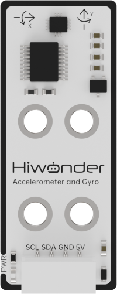

# 6. Secondary Development Project Course

## 6.1 Sound Control Program Overview

### 6.1.1 Assembly


### 6.1.2 Project Overview

This lesson demonstrates how the robotic arm responds by executing an action group once the ambient noise level exceeds the trigger threshold.

### 6.1.3 Program Procedure


### 6.1.4 Module Introduction


The sound sensor detects the intensity of ambient noise and outputs a corresponding electrical signal. It works by capturing sound vibrations through a microphone. When sound waves cause the electret diaphragm inside the microphone to vibrate, the resulting change in capacitance generates a small voltage, which is then converted into an analog signal that can be read via an `ADC` pin.

* **Wiring Instructions**

Before running this lesson's program, please connect the sound sensor module to the servo control board using the `PA4` and `PA5` IO ports, as shown in the diagram below.


### 6.1.5 Program Download

[Source Code](../_static/source_code/Secondary_Development_Project_Course.zip)

(1) Connect the main control board to the computer using a USB cable.


(2) Locate the corresponding example project file in the **"Arduino project folder"** provided in the same directory as the documentation.


(3) Open the project and select the appropriate board model, as shown in the image below.


(4) First, click **"Verify"** (Compile), then click **"Upload"**. Once the upload is complete, the output window at the bottom of the **"Arduino"** software should display a message similar to the one below, indicating that the program has been successfully uploaded.


### 6.1.6 Program Outcome

Once powered on, the robotic arm continuously detects the ambient sound intensity. If the sound level exceeds the trigger threshold, it will trigger a single beep from the buzzer, flash the `LED` once, and execute `Action Group 12`.


### 6.1.7 Program Analysis

[Source Code](../_static/source_code/Secondary_Development_Project_Course.zip)

* **main.c File (Application Layer)**

(1) Import Header Files

Include the following libraries:

① `config.h`

② `Hiwonder.hpp` – defines the buzzer and LED objects

③ `Robot_arm.hpp` – defines the robotic arm object

{lineno-start=1}

```c
#include "Config.h"
#include "Hiwonder.hpp"
#include "Robot_arm.hpp"
```

(2) Create Control Objects: Declare instances of the buzzer, robotic arm, and button objects for use in subsequent control operations.

{lineno-start=5}

```c
Buzzer_t buzzer_obj;
LeArm_t arm;
Led_t led_obj;
```

(3) `setup()` Function:

① Delay for `1000 ms` (1 second), then power off the `Bluetooth` module.

② Initialize the robotic arm, buzzer, and button objects.

③ Initialize serial communication with a baud rate of `9600`.

④ After a `2000 ms` (2 seconds) delay, call the buzzer's `blink()` method to beep once at `1500 Hz` with a `100 ms` on / `100 ms` off duration.

{lineno-start=9}

```c
void setup() {
  delay(1000);
  pinMode(IO_BLE_CTL, OUTPUT);
  digitalWrite(IO_BLE_CTL, LOW);  // Set Bluetooth control pin to high level to power off the Bluetooth module (设置蓝牙控制引脚为高电平时，断开蓝牙模块电源)

  arm.init();
  buzzer_obj.init(IO_BUZZER);
  led_obj.init(IO_LED);

  Serial.begin(9600);
  delay(2000);

  buzzer_obj.blink(1500, 100, 100, 1);
}
```

(4) `loop()` Function

① Continuously monitor the ambient sound level by reading the analog voltage from the sound sensor via pin `PA5` using `analogRead()`.If the detected value exceeds a threshold of `50`, perform the following actions:

② Call the `LED`'s `blink()` method to flash the `LED` twice (`200 ms` on, `200 ms` off per cycle).

③ Call the buzzer's `blink()` method to beep once at `1500 Hz` (`100 ms` on, `100 ms` off).

④ Call the robotic arm's `action_run(12)` method to execute `Action Group 12`.Delay for `2000 ms` (2 seconds), then return to the main loop.

{lineno-start=24}

```c
void loop() {
  int adcValue = analogRead(PA5);
  Serial.println(adcValue); 
  if(adcValue > 200){
    led_obj.blink(200, 200, 2);
    buzzer_obj.blink(1500, 100, 100, 1);
    arm.action_run(12, 1);
    delay(2000);
  }
  delay(10);
}
```

## 6.2 Infrared Control Overview

### 6.2.1 Assembly


### 6.2.2 Project Overview

This lesson demonstrates how to use an infrared sensor to detect an object and have the robotic arm move it to the center position.

### 6.2.3 Program Procedure


### 6.2.4 Module Introduction


This sensor is designed to detect obstacles in front of it. It consists of an infrared emitter and an infrared receiver. When an obstacle is present, the infrared light reflects back and is detected by the receiver.

(1) When the receiver does not detect infrared light, the signal output pin `OUT` outputs a **high-level** signal.

(2) When infrared light is detected, the `OUT` pin outputs a **low-level** signal.

The sensor includes a small potentiometer that allows you to adjust the detection distance by rotating it. When you adjust the potentiometer so that the sensor's `LED1` is at the threshold between off and on, the detection distance reaches its maximum.

* **Wiring Instructions**


As shown in the diagram below, before running this lesson's program, please connect the module on the left side of the robotic arm to the servo control board's `IO13 NC` port, and the module on the right side to the `PA4 PA5` IO ports.


### 6.2.5 Program Download

[Source Code](../_static/source_code/Secondary_Development_Project_Course.zip)

(1) Connect the main control board to the computer using a USB cable.


(2) Locate the corresponding example project file in the **"Arduino project folder"** provided in the same directory as the documentation.


(3) Open the project and select the appropriate board model, as shown in the image below.


(4) First, click **"Verify"** (Compile), then click **"Upload"**. Once the upload is complete, the output window at the bottom of the **"Arduino"** software should display a message similar to the one below, indicating that the program has been successfully uploaded.


### 6.2.6 Program Outcome

When an object is placed in either of the two areas, the infrared sensor detects its presence on the left or right side. The robotic arm then grasps the object from the detected side and places it in the center.


### 6.2.7 Program Analysis

[Source Code](../_static/source_code/Secondary_Development_Project_Course.zip)

* **ino File (Application Layer)**

(1) Import Header Files

Include the following libraries:

① `config.h`

② `Hiwonder.hpp` – defines the buzzer and `LED` objects

③ `Robot_arm.hpp` – defines the robotic arm object

{lineno-start=1}

```c
#include "Config.h"
#include "Hiwonder.hpp"
#include "Robot_arm.hpp"
```

(2) Create the robotic arm and `LED` objects for subsequent control.

{lineno-start=5}

```c
LeArm_t arm;
Led_t led_obj;
```

(3) `setup()` Function:

① Start with a `1000 ms` (1 second) delay, then power off the `Bluetooth` module. Initialize the robotic arm and `LED` objects, then begin serial communication with a baud rate of `9600`.

② After an additional `2000 ms` (2 seconds) delay, configure pin `PA5` (connected to the left infrared sensor) and pin `IO13` (connected to the right infrared sensor) as **input mode**.

{lineno-start=8}

```c
void setup() {
  delay(1000);
  pinMode(IO_BLE_CTL, OUTPUT);
  digitalWrite(IO_BLE_CTL, LOW);  // Set the Bluetooth control pin to low level to power off the Bluetooth module (设置蓝牙控制引脚为低电平时，断开蓝牙模块电源)

  arm.init();
  led_obj.init(IO_LED);
  Serial.begin(9600);
  delay(2000);

  pinMode(PA5, INPUT_PULLUP);
  pinMode(IO13, INPUT_PULLUP);
}
```

(4) `loop()` Function

① First, use `digitalRead` to read the digital voltage value from pin `PA5`, which is connected to the left infrared sensor, in order to detect whether there is an object in the left area.

② If a `LOW` signal is detected, it indicates that an object is present in the left area. Execute the following logic:

* Print a message via the serial port indicating that pin `PA5` has received a `LOW` signal.

* Call the `LED` object's `blink` method to turn the `LED` on for `200 ms`, off for `200 ms`, and blink once.

* Then call the robotic arm object's `action_run` method to execute `Action Group 8` once.

③ If `PA5` reads a `HIGH` signal, use `digitalRead` to check the digital voltage on pin `IO13`, which is connected to the right infrared sensor, to determine if there is an object in the right area.

④ If a `LOW` signal is detected on `IO13`, it indicates that an object is present in the right area. Execute the following logic:

* Call the `LED` object's `blink` method to flash the `LED` twice, with `100 ms` on and `100 ms` off per cycle.

* Print a message via the serial port indicating that pin `IO13` has received a `LOW` signal.

* Finally, call the robotic arm object's `action_run` method to execute `Action Group 11` once.

{lineno-start=22}

```c
void loop() {
  if(digitalRead(PA5) == LOW) //Pick from the left and move to the center (夹取左边到中间)
  {
    Serial.println("PA5");
    led_obj.blink(200 , 200 , 1);
    arm.action_run(8 , 1);
  }else if(digitalRead(IO13) == LOW) //Pick from the right and move to the center (夹取右边到中间)
  {
    led_obj.blink(100, 100, 2);
    Serial.println("IO13");
    arm.action_run(11, 1);
  }
  delay(100);
}
```

## 6.3 OLED Display Overview

### 6.3.1 Assembly


### 6.3.2 Project Overview

The OLED display will demonstrate the word **'Hiwonder'**.

### 6.3.3 Program Procedure


### 6.3.4 Module Introduction


This module uses a 0.91-inch blue `OLED` screen, which features a wide viewing angle, fast response time, stable graphics, high brightness, and high resolution.

The `OLED` display has a resolution of `128×32` pixels and is driven by the `SSD1306` chip. By controlling this chip, the screen can display numbers, text, images, and other visual content. It communicates externally via the `I2C` interface.

* **Wiring Instructions**

As shown in the diagram below, before running this lesson's program, please connect the module to any of the `I2C` ports within the red box on the servo control board.


### 6.3.5 Program Download

[Source Code](../_static/source_code/Secondary_Development_Project_Course.zip)

(1) Connect the main control board to the computer using a USB cable.


(2) Locate the corresponding example project file in the **"Arduino project folder"** provided in the same directory as the documentation.


(3) Open the project and select the appropriate board model, as shown in the image below.


(4) First, click **"Verify"** (Compile), then click **"Upload"**. Once the upload is complete, the output window at the bottom of the **"Arduino"** software should display a message similar to the one below, indicating that the program has been successfully uploaded.


### 6.3.6 Program Outcome

Once the robotic arm is powered on, the `OLED` screen will display the text **"Hiwonder"**.


### 6.3.7 Program Analysis

[Source Code](../_static/source_code/Secondary_Development_Project_Course.zip)

* **ino File (Application Layer)**

(1) Include the following libraries:

① `config.h`

② `Hiwonder.hpp`

③ `Robot_arm.hpp` — contains the definition of the robotic arm object

④ `IIC.hpp`

⑤ `U8g2lib.h` — provides the underlying implementation of the third-party `OLED` display library, `u8g2`

{lineno-start=1}

```c
#include "Config.h"
#include "Hiwonder.hpp"
#include "Robot_arm.hpp"
#include "IIC.hpp"
#include <U8g2lib.h>
```

(2) Create Objects: Instantiate the `u8g2` object and the robotic arm object for subsequent control.

{lineno-start=7}

```c
U8G2_SSD1306_128X64_NONAME_1_HW_I2C u8g2(U8G2_R0, /* reset=*/ U8X8_PIN_NONE,  /* clock=*/IIC_SCL, /* data=*/IIC_SDA); //Instantiate object (实例化对象)
```

(3) In the `setup()` Function:

① Start with a `1000 ms` (1-second) delay, then turn off the `Bluetooth` module. Initialize the robotic arm object, then begin serial communication at a baud rate of `9600`.

② Call the robotic arm object's `action_run` method to execute `Action Group 0` once and initialize the robotic arm's posture.

③ Initialize the `u8g2` library by calling the `begin` method on the `u8g2` object. Then call `setDisplayRotation` to rotate the display by `180°`.

{lineno-start=11}

```c
void setup() {
  delay(1000);
  pinMode(IO_BLE_CTL, OUTPUT);
  digitalWrite(IO_BLE_CTL, LOW);  // Set Bluetooth control pin to high level to power off the Bluetooth module (设置蓝牙控制引脚为高电平时，断开蓝牙模块电源)

  arm.init();
  Serial.begin(9600);
  arm.action_run(0,1);
  delay(3000);

  u8g2.begin(); //Initialize library (初始化库)
  /*****************************************/
  //Set display rotation to 180° (设置显示旋转为180°)
  //(U8G2_R0: no rotation, U8G2_R1: rotate 90°, U8G2_R2: rotate 180°, U8G2_R3: rotate 270°) ((U8G2_R0：不做旋转，U8G2_R1：旋转90°，U8G2_R2：旋转180°，U8G2_R3：旋转270°))
  /*******************************************/
  u8g2.setDisplayRotation(U8G2_R2); 
}
```

(4) In the `loop()` Function:

① Begin by calling the `firstPage()` method of the `u8g2` object to create a canvas for display on the `OLED` screen.

② Then set the font using `setFont()`. After that, call the `drawStr()` method to display a string at a specified position on the screen.

* (Parameters: `X` and `Y` coordinates on the `OLED` display coordinate system, followed by the string to be displayed.) At position `(0, 20)`, the string "**Hiwonder**" will be displayed on the `OLED` screen.

{lineno-start=29}

```c
void loop() {
  u8g2.firstPage(); //Create a canvas to send to the OLED sensor for display (创建一个画布，用来发送给OLED传感器进行显示)
  do {
    u8g2.setFont(u8g2_font_fur20_tf); //Set font (设置字体)
    u8g2.drawStr(0,20,"Hiwonder");    //Set display content (设置显示的内容)
    // u8g2.setFont(u8g2_font_courB18_tf); 
    // u8g2.setCursor(0,50); //Move cursor position; subsequent characters will start from the new position (切换光标位置，后面新增的字符将会从新的光标的位置开始显示)
    // u8g2.println(1234);   //From the new cursor position, set display content (从新的光标位置，设置显示内容)
  }
  while ( u8g2.nextPage() );
  delay(100);
}
```

## 6.4 Touch Control Overview

### 6.4.1 Assembly


### 6.4.2 Project Overview

This lesson demonstrates how pressing the touch sensor triggers the `OLED` screen to scroll random numbers. When released, the number stops, and the robotic arm selects and picks up a specific color block based on the type of number displayed.

### 6.4.3 Program Procedure


### 6.4.4 Module Introduction


The touch sensor is based on capacitive sensing technology. It primarily detects human contact or metal objects through a gold-plated contact surface.

(1) When no human or metal touches the contact surface, the signal output pin outputs a **high-level** signal.

(2) When a human or metal touches the contact surface, the signal output pin outputs a **low-level** signal.

* **Wiring Instructions**

As shown in the diagram below, before running this lesson's program, please connect the module to the **"IO13 NC"** IO port on the servo control board.


### 6.4.5 Program Download

[Source Code](../_static/source_code/Secondary_Development_Project_Course.zip)

(1) Connect the main control board to the computer using a USB cable.


(2) Locate the corresponding example project file in the **"Arduino project folder"** provided in the same directory as the documentation.


(3) Open the project and select the appropriate board model, as shown in the image below.


(4) First, click **"Verify"** (Compile), then click **"Upload"**. Once the upload is complete, the output window at the bottom of the **"Arduino"** software should display a message similar to the one below, indicating that the program has been successfully uploaded.


### 6.4.6 Program Outcome

When the touch sensor is pressed, the `OLED` display begins rapidly counting numbers. Upon release, a beep sounds and the `LED` flashes once.

(1) If the final number is a multiple of 3, the lucky color is red.

(2) If the final number is a multiple of 2, the lucky color is blue.

(3) Otherwise, the lucky color is green.

The robotic arm then picks up the color block corresponding to the determined lucky color and presents it to the user.

### 6.4.7 Program Analysis

[Source Code](../_static/source_code/Secondary_Development_Project_Course.zip)

* **main.c File (Application Layer)**

(1) Include the following header files: `config.h`, `Hiwonder.hpp`, `Robot_arm.hpp`, and `U8g2lib.h`.

①  `Hiwonder.hpp` defines the buzzer and `LED` objects.

②  `U8g2lib.h` provides the low-level implementation for the third-party `OLED` library `u8g2`.

③  `Robot_arm.hpp` defines the robotic arm object.

{lineno-start=1}

```c
#include "Config.h"
#include "Hiwonder.hpp"
#include "Robot_arm.hpp"
#include <U8g2lib.h>
```

(2) Create the `u8g2`, buzzer, robotic arm and `LED` objects for subsequent control.

{lineno-start=6}

```c
U8G2_SSD1306_128X64_NONAME_1_HW_I2C u8g2(U8G2_R0, /* reset=*/ U8X8_PIN_NONE,  /* clock=*/IIC_SCL, /* data=*/IIC_SDA); //Instantiate object (实例化对象)

Buzzer_t buzzer_obj;
LeArm_t arm;
Led_t led_obj;
```

(3) Define the maximum and minimum values for the generated random number.

{lineno-start=12}

```c
#define NUM_MAX 100
#define NUM_MIN 1
```

(4) In the `setup` function:

① Begin with a `1000 ms` (1 second) delay, then power off the `Bluetooth` module. Initialize the robotic arm, buzzer, and `LED` objects. Afterward, start serial communication with a baud rate of `9600`.

② After a `2000 ms` (2 seconds) delay, initialize the `u8g2` library by calling its `begin` method, then set the display rotation to `180°` using `setDisplayRotation`.

③ Next, configure pin `PA5`, connected to the touch sensor, as an input. Finally, call the buzzer object's `blink` method to emit a `1500 Hz` beep lasting `100 ms`, followed by `100 ms` silence, sounding once.

{lineno-start=15}

```c
void setup() {
  delay(1000);
  pinMode(IO_BLE_CTL, OUTPUT);
  digitalWrite(IO_BLE_CTL, LOW);  // Set Bluetooth control pin to high level to power off the Bluetooth module (设置蓝牙控制引脚为高电平时，断开蓝牙模块电源)

  arm.init();
  buzzer_obj.init(IO_BUZZER);
  led_obj.init(IO_LED);

  Serial.begin(9600);
  delay(2000);

  u8g2.begin(); //Initialize library (初始化库)
  /*****************************************/
  //Set display rotation to 180° (设置显示旋转为180°)
  //U8G2_R0: no rotation, U8G2_R1: rotate 90°, U8G2_R2: rotate 180°, U8G2_R3: rotate 270°（U8G2_R0：不做旋转，U8G2_R1：旋转90°，U8G2_R2：旋转180°，U8G2_R3：旋转270°）
  /*******************************************/
  u8g2.setDisplayRotation(U8G2_R2);

  pinMode(PA5, INPUT);

  buzzer_obj.blink(1500, 100, 100, 1);
}
```

(5) Set the initial value as `15`.

{lineno-start=39}

```c
int num = 15;
```

(6) In the main loop function, first use `digitalRead` to read the digital voltage value from pin `PA5`, which is connected to the touch sensor, to detect whether it is being touched.

{lineno-start=41}

```c
void loop() {
  if(digitalRead(PA5) == HIGH){
    led_obj.blink(200, 200, 1);
    buzzer_obj.blink(1500 , 100, 100, 1);
    if(num % 3 == 0)
    {
      arm.action_run(12 , 1);
    }
    else if(num % 7 == 0)
    {
      arm.action_run(13 , 1);
    }
    else
    {
      arm.action_run(14 , 1);
    }
    while(1)
    {
      if(digitalRead(PA5) == LOW)
      {
        break;
      }
    }
  }else{
      num = rand() % (NUM_MAX + 1- NUM_MIN) + NUM_MIN;
  }
  u8g2.firstPage(); //Create a canvas to send to the OLED sensor for display (创建一个画布，用来发送给OLED传感器进行显示)
  do {
    u8g2.setFont(u8g2_font_fur20_tf); 
    u8g2.drawStr(10,20,"num:");    //Set display content (设置显示的内容)
    u8g2.setCursor(10,50); //Move cursor position; subsequent characters will start from the new position (切换光标位置，后面新增的字符将会从新的光标的位置开始显示)
    u8g2.println(num);   //From the new cursor position, set display content (从新的光标位置，设置显示内容)
  }while(u8g2.nextPage());
  delay(80);
}
```

(7) If the signal is `HIGH`, it indicates no touch is detected. Perform the following actions:

① Call the `LED` object's `blink` method to flash the `LED` once (`200 ms` on, `200 ms` off). Then call the buzzer object's `blink` method to beep once at `1500 Hz` (`100 ms` on, `100 ms` off).

② Next, execute different logic based on the current value:

If the value is divisible by `3`, call the robotic arm object's `action_run` method to execute `Action Group 12` once. If the value is divisible by `7`, call `action_run` to execute `Action Group 13` once.

④ Otherwise, call `action_run` to execute `Action Group 14` once.

⑤ Then enter an infinite loop and perform no further actions until `digitalRead` detects a `LOW` signal on pin `PA5` (indicating a touch), which will exit the loop.

{lineno-start=42}

```c
  if(digitalRead(PA5) == HIGH){
    led_obj.blink(200, 200, 1);
    buzzer_obj.blink(1500 , 100, 100, 1);
    if(num % 3 == 0)
    {
      arm.action_run(12 , 1);
    }
    else if(num % 7 == 0)
    {
      arm.action_run(13 , 1);
    }
    else
    {
      arm.action_run(14 , 1);
    }
    while(1)
    {
      if(digitalRead(PA5) == LOW)
      {
        break;
      }
    }
```

(8) If the signal is `LOW`, indicating a touch is detected, execute the following steps:

① Generate a random value using the `rand` function.

② Call the `firstPage()` method of the `u8g2` object to create a canvas for the `OLED` display.

(9) Then:

① Use the `setFont()` method to set the font.

② Call `drawStr(x, y, str)` with parameters (`x`: 10, `y`: 20, `str`: **"num"**) to display the string **"num"** at position `(10, 20)` on the `OLED` screen.

(10) Use `setCursor(x, y)` to move the cursor to position `(10, 50)` on the screen, so subsequent characters are displayed starting from this new cursor position. Finally, display the previously generated random number starting from the new cursor location.

{lineno-start=64}

```c
  }else{
      num = rand() % (NUM_MAX + 1- NUM_MIN) + NUM_MIN;
  }
  u8g2.firstPage(); //Create a canvas to send to the OLED sensor for display (创建一个画布，用来发送给OLED传感器进行显示)
  do {
    u8g2.setFont(u8g2_font_fur20_tf); 
    u8g2.drawStr(10,20,"num:");    //Set display content (设置显示的内容)
    u8g2.setCursor(10,50); //Move cursor position; subsequent characters will start from the new position (切换光标位置，后面新增的字符将会从新的光标的位置开始显示)
    u8g2.println(num);   //From the new cursor position, set display content (从新的光标位置，设置显示内容)
  }while(u8g2.nextPage());
  delay(80);
}
```

## 6.5 Ultrasonic Ranging Program Overview

### 6.5.1 Assembly


### 6.5.2 Project Overview

In this lesson, the robotic arm uses inverse kinematics to grasp the block located in front of the ultrasonic sensor.

### 6.5.3 Program Procedure


### 6.5.4 Module Introduction

The ultrasonic module uses an `I2C` communication interface to read distance measurements from the ultrasonic sensor. The ultrasonic probe integrates two `RGB LEDs` that not only allow brightness adjustment but also enable colorful lighting effects by varying and combining the red (`R`), green (`G`), and blue (`B`) channels.


During distance measurement, the module automatically emits eight `40 kHz` square waves and then detects if any signals are returned. If a signal is received, the module outputs a high-level signal whose duration corresponds to the time it takes for the ultrasonic wave to travel to the obstacle and back.

* **Wiring Instructions**

As shown in the diagram below, before running this lesson's program, please connect the module to any `I2C` port within the red box on the servo control board.


### 6.5.5 Program Download

[Source Code](../_static/source_code/Secondary_Development_Project_Course.zip)

(1) Connect the main control board to the computer using a USB cable.


(2) Locate the corresponding example project file in the **"Arduino project folder"** provided in the same directory as the documentation.


(3) Open the project and select the appropriate board model, as shown in the image below.


(4) First, click **"Verify"** (Compile), then click **"Upload"**. Once the upload is complete, the output window at the bottom of the **"Arduino"** software should display a message similar to the one below, indicating that the program has been successfully uploaded.


### 6.5.6 Program Outcome

Upon powering on, the robotic arm uses the ultrasonic module to measure the distance to the object.

(1) If the distance exceeds `150 mm`, the `LED` lights up green.

(2) If the distance is less than `150 mm`, the `LED` lights up red.

The robotic arm then grasps the object and moves it to a position `200 mm` away.


### 6.5.7 Program Analysis

[Source Code](../_static/source_code/Secondary_Development_Project_Course.zip)

* **ino File (Application Layer)**

(1) Include the following header files: `config.h`, `Hiwonder.hpp`, `Robot_arm.hpp`, `IIC.hpp`, and `Ultrasound.hpp`.

① `Hiwonder.hpp` defines the buzzer object.

② `Robot_arm.hpp` defines the robotic arm object.

③ `IIC.hpp` defines the `I2C` communication object.

④ `Ultrasound.hpp` defines the ultrasonic sensor object.

{lineno-start=1}

```c
#include "Config.h"
#include "Hiwonder.hpp"
#include "Robot_arm.hpp"
#include "IIC.hpp"
#include "Ultrasound.hpp"
```

(2) Instantiate the buzzer, robotic arm, `I2C` interface, and ultrasonic sensor objects for subsequent control. Set the ultrasonic sensor offset value to `9.0`.

{lineno-start=7}

```c
LeArm_t arm;
Buzzer_t buzzer;

IIC iic;
Ultrasound ult;

#define ULTRASOUND_OFFSET 9.0f

```

(3) In the `setup` function:

① Begin with a `1000 ms` (1 second) delay, then power off the `Bluetooth` module. Initialize the robotic arm, `I2C` interface, and ultrasonic sensor objects. Next, start serial communication with a baud rate of `9600`.

② Then initialize the buzzer object, and call the robotic arm object's `coordinate_set` method to move the arm to the specified position within `1000 ms`.

{lineno-start=16}

```c
void setup() {
  delay(1000);
  pinMode(IO_BLE_CTL, OUTPUT);
  digitalWrite(IO_BLE_CTL, LOW);  // Set Bluetooth control pin to high level to power off the Bluetooth module (设置蓝牙控制引脚为高电平时，断开蓝牙模块电源)

  arm.init();

  iic.init();
  ult.init(&iic);
  Serial.begin(9600);
  buzzer.init(IO_BUZZER);

  arm.coordinate_set(15.0f, 0, 15, 0, -90, 90, 1000);
  delay(2000);
}
```

(4) Then reset the flags for operation status and completion.

{lineno-start=33}

```c
uint8_t running_state = 0;
uint8_t finish_count  = 0;
```

(5) In each iteration of the main loop function, call the ultrasonic sensor object's `GetDistance` method to obtain the current measured distance. Then, based on the movement state `running_state` (initially set to 0), execute the corresponding logic branch.

{lineno-start=35}

```c
void loop() {
  uint16_t dis = ult.GetDistance();
  switch(running_state)
  {
    case 0:{
      if(dis >= 50 && dis <= 100)
			{
        delay(1500);
        dis = ult.GetDistance();
        if(dis >= 50 && dis <= 100)
			  {
          buzzer.blink(1500 , 100 , 100 , 1);
          arm.coordinate_set((float)(dis / 10) + ULTRASOUND_OFFSET, 0, -7, 0, -90, 90, 1000);
					delay(1100);
					running_state = 1;
        }
      }
    }break;
    case 1:{
      arm.claw_set(30, 500);
			delay(700);
			running_state = 2;
    }break;
    case 2:{
      arm.coordinate_set(15.0f, 0, 15, 0, -90, 90, 1000);
			delay(1100);
			running_state = 3;
    }break;
    case 3:{
      arm.coordinate_set(25.0f, 0, -5, 0, -90, 90, 1000); // + ULTRASOUND_OFFSET
			delay(1500);
			arm.claw_set(90, 0);
			delay(1100);
			running_state = 4;
    }break;
    case 4:{
      arm.coordinate_set(15.0f, 0, 15, 0, -90, 90, 1000);
      delay(2000);
			running_state = 0;
    }break;
  }
  delay(100);
}
```

(6) If the current motion state is `0` (the robotic arm remains in its initial position while detecting obstacles ahead):

① First, check if the measured distance `dis` falls within the range `[50, 100] mm`. If not, exit the function immediately.

② If it is within the range, call the buzzer object's `blink` method to emit a beep at `1500 Hz` frequency for `100 ms`, followed by `100 ms` silence, sounding once.

* Then, based on the obstacle distance obtained from the ultrasonic sensor, dynamically compute the movement distance of the robotic arm through kinematic calculations.

* Call the joint control function to move the robotic arm to the obstacle's position. Wait until the movement is completed, then switch to the next state.

{lineno-start=39}

```c
    case 0:{
      if(dis >= 50 && dis <= 100)
			{
        delay(1500);
        dis = ult.GetDistance();
        if(dis >= 50 && dis <= 100)
			  {
          buzzer.blink(1500 , 100 , 100 , 1);
          arm.coordinate_set((float)(dis / 10) + ULTRASOUND_OFFSET, 0, -7, 0, -90, 90, 1000);
					delay(1100);
					running_state = 1;
        }
      }
    }break;
```

(7) If the current motion state is `1` (the robotic arm has detected an obstacle and moved to its position), call the joint control function to grasp the block. After a delay to allow the grasping action to complete, switch to the next motion state.

{lineno-start=53}

```c
    case 1:{
      arm.claw_set(30, 500);
			delay(700);
			running_state = 2;
    }break;
```

(8) If the current motion state is `2` (the robotic arm has grasped the block), call the joint control function to lift the block. Wait until the robotic arm completes the movement, then switch to the next state.

{lineno-start=58}

```c
    case 2:{
      arm.coordinate_set(15.0f, 0, 15, 0, -90, 90, 1000);
			delay(1100);
			running_state = 3;
    }break;
```

(9) If the current motion state is `3` (the robotic arm has lifted the block), use the previously obtained ultrasonic distance to calculate a farther placement position. Using kinematic calculations, dynamically control the robotic arm's movement to place the block at the farther position. Call the joint control function to move the arm and release the block. Wait until the movement is complete, then switch to the next state.

{lineno-start=63}

```c
    case 3:{
      arm.coordinate_set(25.0f, 0, -5, 0, -90, 90, 1000); // + ULTRASOUND_OFFSET
			delay(1500);
			arm.claw_set(90, 0);
			delay(1100);
			running_state = 4;
    }break;
```

(10) If the current motion state is `4` (the robotic arm has placed down the block), call the joint control function to return the arm to its origin. Wait until the movement is complete, then switch back to the initial state `0`.

{lineno-start=70}

```c
    case 4:{
      arm.coordinate_set(15.0f, 0, 15, 0, -90, 90, 1000);
      delay(2000);
			running_state = 0;
    }break;
```

* **Ultrasound.cpp File (Low-Level)**

(1) We will introduce the `Ultrasound::GetDistance` method:

① Inside the function, relevant variables are first created. Then, the `wireReadDataArray` method of the `I2C` object is called to read distance parameters from the ultrasonic sensor's registers via the `I2C` interface.

{lineno-start=42}

```c
//Get the distance measured by the ultrasonic sensor in mm （获取超声波测得的距离单位mm）
uint16_t Ultrasound::GetDistance()
{
  uint16_t distance;
  iic->wireReadDataArray(ULTRASOUND_I2C_ADDR, 0,(uint8_t *)&distance,2);
  return distance;
}
```

## 6.6 Accelerometer Control Overview

### 6.6.1 Assembly


### 6.6.2 Project Overview

In this lesson, the program detects the left and right tilt states of the accelerometer to grasp and sort blocks onto the corresponding side.

### 6.6.3 Program Procedure


### 6.6.4 Module Introduction



This sensor module features the `QMI8658` component, which integrates a 3-axis `MEMS` gyroscope, a 3-axis `MEMS` accelerometer, and an expandable Digital Motion Processor (`DMP`).

Both the gyroscope and accelerometer utilize three 16-bit `ADC`s to convert analog signals into precise digital outputs.

* **Wiring Instructions**

As illustrated below, before running this lesson's program, please connect the module to any available `I2C` port within the red box on the servo control board.


### 6.6.5 Program Download

[Source Code](../_static/source_code/Secondary_Development_Project_Course.zip)

(1) Connect the main control board to the computer using a USB cable.


(2) Locate the corresponding example project file in the **"Arduino project folder"** provided in the same directory as the documentation.


(3) Open the project and select the appropriate board model, as shown in the image below.


(4) First, click **"Verify"** (Compile), then click **"Upload"**. Once the upload is complete, the output window at the bottom of the **"Arduino"** software should display a message similar to the one below, indicating that the program has been successfully uploaded.


### 6.6.6 Program Outcome

After powering on, tilt the sensor to the left, and the robotic arm will recognize this gesture to sort and grasp the block to the left side.

Similarly, tilting the sensor to the right will prompt the robotic arm to sort and grasp the block to the right side.

### 6.6.7 Program Analysis

[Source Code](../_static/source_code/Secondary_Development_Project_Course.zip)

* **ino File (Application Layer)**

(1) Include the `robot_arm.h` header file, which provides functions to execute and write robotic arm action groups; include `IMU.hpp`, which offers functions for data transmission and parsing of the accelerometer sensor.

{lineno-start=1}

```c
#include "Config.h"
#include "Hiwonder.hpp"
#include "Robot_arm.hpp"
#include "IIC.hpp"
#include "IMU.hpp"
```

(2) In the main function, define a three-element Euler angle array `euler`, where the elements correspond to:

① Pitch (tilt forward/backward / rotation around the `X-axis`)

② Roll (tilt left/right / rotation around the `Y-axis`)

③ Yaw (rotation around the `Z-axis`).

{lineno-start=31}

```c
float euler[3];
```

(3) In `main()`, call the `imu_init` function to initialize the accelerometer sensor object `imu` with its `I2C` communication address, binding the data receive and send functions.

(4) Then call `arm_init` to pre-read the flash verification string for the stored action group data to confirm its validity; also read the action group data and servo offset data.

{lineno-start=13}

```c
void setup() {
  delay(1000);
  pinMode(IO_BLE_CTL, OUTPUT);
  digitalWrite(IO_BLE_CTL, LOW);  // Set Bluetooth control pin to low level to power off the Bluetooth module (设置蓝牙控制引脚为低电平时，断开蓝牙模块电源)
  Serial.begin(9600);
  arm.init();
  buzzer_obj.init(IO_BUZZER);

  iic.init();
  imu.init(&iic);

  arm.coordinate_set(15,0,10,0,-90,90, 1000);
  arm.claw_set(90, 500);
  buzzer_obj.blink(1500 , 50, 50, 1);
  Serial.println("begin");
  delay(1000);
}
```

(5) In the `loop`, call `qmi8658_get_euler` to read real-time Euler angle data from the sensor and store it into the `euler` array.

(6) In the preparation-to-grasp phase (`step = 0`), check the pitch angle `euler[0]`. If it is less than `-30` (i.e., the module is tilted downward by `30°`), trigger the grasping logic:

① Call `arm_coordinate_set` to use inverse kinematics to lower the robotic arm, grasp the object in front, then lift it. After completion, transition to the **"preparation-to-place"** phase.

{lineno-start=37}

```c
  switch(setp){
    case 0:
      if(euler[0] < -30){
        buzzer_obj.blink(1500 , 50, 50, 1);
        delay(500);
        arm.coordinate_set(20,0,-4,0,-90,90, 1000);
        delay(1200);
        arm.claw_set(30, 500);
        delay(1000);
        arm.coordinate_set(15,0,10,0,-90,90, 1000);
        delay(1200);
        setp = 1;
      }
      break;
```

(7) In the preparation-to-place phase (`step = 1`), execute different sorting logics based on the roll angle `euler[1]`.

{lineno-start=}

```c
void loop() {
  imu.get_euler(euler);
  // Serial.printf("euler: %f, %f\n", euler[0], euler[1]);
  switch(setp){
    case 0:
      if(euler[0] < -30){
        buzzer_obj.blink(1500 , 50, 50, 1);
        delay(500);
        arm.coordinate_set(20,0,-4,0,-90,90, 1000);
        delay(1200);
        arm.claw_set(30, 500);
        delay(1000);
        arm.coordinate_set(15,0,10,0,-90,90, 1000);
        delay(1200);
        setp = 1;
      }
      break;
    case 1:
      if(euler[1] < -30){
        buzzer_obj.blink(1500 , 50, 50, 1);
        delay(500);
        arm.coordinate_set(1,15,10,0,-90,90, 1000);
        delay(1200);
        arm.coordinate_set(1,20,-4,0,-90,90, 1000);
        delay(1200);
        arm.claw_set(90, 500);
        delay(1000);
        arm.coordinate_set(1,15,10,0,-90,90, 1000);
        delay(1200);
        arm.coordinate_set(15,0,10,0,-90,90, 1000);
        delay(1200);
        setp = 0;
      }else if(euler[1] > 30){
        buzzer_obj.blink(1500 , 50, 50, 1);
        delay(500);
        arm.coordinate_set(1,-15,10,0,-90,90, 1000);
        delay(1200);
        arm.coordinate_set(1,-20,-4,0,-90,90, 1000);
        delay(1200);
        arm.claw_set(90, 500);
        delay(1000);
        arm.coordinate_set(1,-15,10,0,-90,90, 1000);
        delay(1200);
        arm.coordinate_set(15,0,10,0,-90,90, 1000);
        delay(1200);
        setp = 0;
      }
      break;
  }
  delay(50);
}
```

(8) The two sorting logics are very similar; here is an example of one:

① First, check if the roll angle `euler[1]` is greater than `30°` (i.e., the module is tilted left by more than `30°`).

② If not, exit this branch; if yes, call `led_flash` to make `LED2` flash once, and call `buzzer_blink` to make the buzzer beep once.

* Then, call `arm_coordinate_set` to control the robotic arm through inverse kinematics to turn left, lower, place the object, lift, turn right, and reset.

* Wait for the action group to complete, then return to the "**preparation-to-place**" phase.

{lineno-start=51}

```c
    case 1:
      if(euler[1] < -30){
        buzzer_obj.blink(1500 , 50, 50, 1);
        delay(500);
        arm.coordinate_set(1,15,10,0,-90,90, 1000);
        delay(1200);
        arm.coordinate_set(1,20,-4,0,-90,90, 1000);
        delay(1200);
        arm.claw_set(90, 500);
        delay(1000);
        arm.coordinate_set(1,15,10,0,-90,90, 1000);
        delay(1200);
        arm.coordinate_set(15,0,10,0,-90,90, 1000);
        delay(1200);
        setp = 0;
```

* **qmi8658.c File (Low Level)**

(1) qmi8658_init Function

① Within the function, call `imu.init(&iic);` to initialize the accelerometer module object `iic_obj`. Set the object's `I2C` communication address to `QMI8658_ADDR (0x68)`.

{lineno-start=11}

```c
void IMU::init(IIC* iic_obj)
{
  iic = iic_obj;
  dev_addr = QMI8658_ADDR;
}
```

(2) IMU::get_euler Function

① Within the function, call `iic->wireReadDataArray` in a loop to sequentially read six bytes of data starting from the register that stores the high byte of the `X-axis Euler angle`. These registers contain, in order, the high and low bytes of the Euler angles for the `X`, `Y`, and `Z` axes. The retrieved data is stored in the `rec_data` array member of the `qmi8658` structure.

② Then, call the `BYTE_TO_HW` function to combine the high and low bytes of the `X`, `Y`, and `Z` Euler angles into complete values, and store the results in the `euler` array.

{lineno-start=45}

```c
void IMU::get_euler(float* euler)
{
	static uint8_t rec_data[6];
	
	for(uint8_t i = 0; i < 6; i++)
	{
		iic->wireReadDataArray(dev_addr, EULER_XOUT_H + i, &rec_data[i], 1);
		delay(1);
	}
	euler[0] = (float)((int16_t)BYTE_TO_HW(rec_data[0], rec_data[1])) / 100.0f;
	euler[1] = (float)((int16_t)BYTE_TO_HW(rec_data[2], rec_data[3])) / 100.0f;
	euler[2] = (float)((int16_t)BYTE_TO_HW(rec_data[4], rec_data[5])) / 100.0f;
}
```