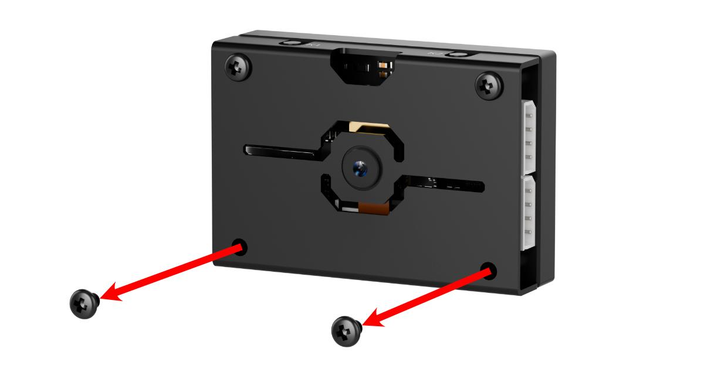
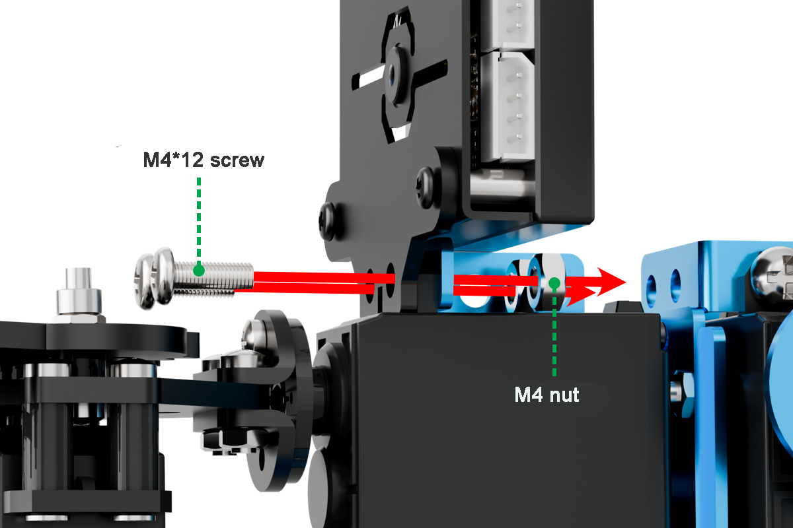
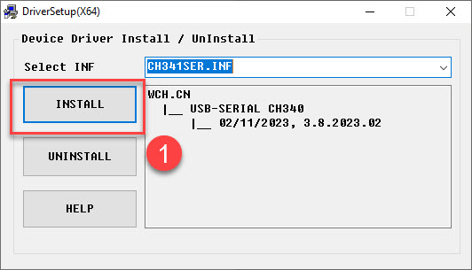
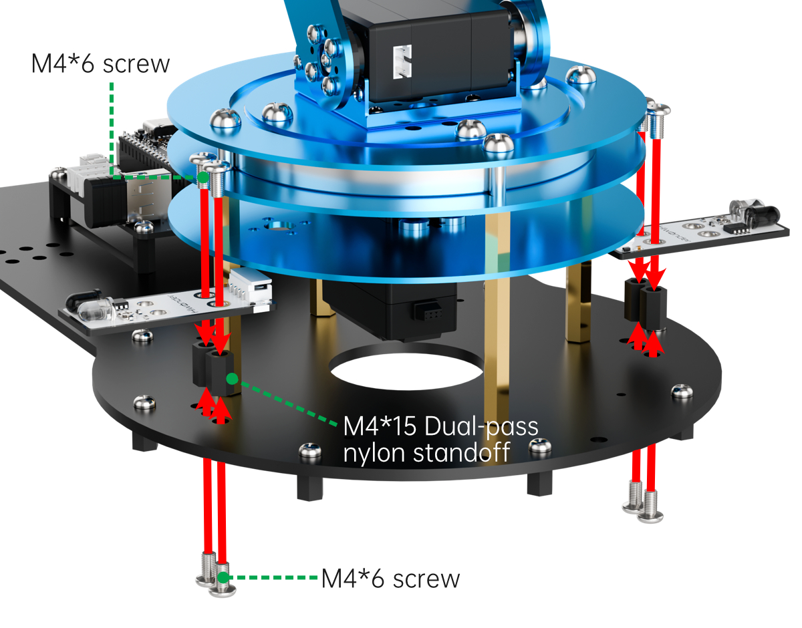

# 7. AI Vision Course

## 7.1 WonderMV Vision Module Introduction and Installation

### 7.1.1 Introduction to WonderMV Vision Module

* **Product Overview**

The WonderMV Vision Module is a powerful and cost-effective AI vision module developed based on the K210 chip, and is also referred to as the K210 Vision Module in the following sections.

It supports 12 AI vision functions, including color recognition, traffic sign recognition, line tracking, face recognition, mask detection, label recognition, QR code scanning, feature detection, digit recognition, and barcode scanning.


The WonderMV module features a durable metal casing, avoiding the use of cheap, low-quality acrylic materials. On the front of the module is a 2.0-inch capacitive touchscreen with a resolution of 320×240. It comes with onboard UART and I2C communication interfaces, making it compatible with a wide range of control platforms such as STM32, Raspberry Pi, Arduino, 8051 microcontrollers, and ESP32.

Visual recognition data can be output via the UART or I2C interface to external controllers. The module supports one-click training, eliminating the need to understand complex vision algorithms. This greatly shortens project development time and allows users to easily implement a variety of engaging AI projects.

* **Function Diagram**


* **Model Import**

::: {Note}
Some functions of the WonderMV module require model files. Please ensure that the necessary model files are loaded onto the TF card in advance.
:::

(1) Insert the TF card into your computer using a card reader, and copy the **"KPU"** folder (containing the model files) from this section directly onto the TF card.


(2) After the transfer is complete, insert the TF card into the WonderMV module.

* **Module Connection**

Connect the module to any I2C port within the red frame on the servo control board using a 4-pin cable.


* **Coordinate System Introduction**

Understanding the coordinate system will help you better interpret the output data from the WonderMV vision module in future lessons.
The resolution of the module's touchscreen is 320×240. The top-left corner of the image is defined as the origin point (O), with the X-axis extending to the right and the Y-axis extending downward. Within the image, the maximum X-axis value is 320, and the maximum Y-axis value is 240.


### 7.1.2 WonderMV Installation







### 7.1.3 WonderMV Development Environment Setup

*  **Serial driver installation**

(1) Connect K210 to the computer using a Type-C cable. Before installing the software, you can check if your computer already has the CH340 driver. If the computer can recognize the corresponding serial port, there is no need to install the serial port driver. You can check the ports by connecting the module to the computer and opening the **"Device Manager"**, as shown in the figure below:


(2) If the driver is not available, you can find the [Serial Driver Installation Package](Appendix.md) in the same directory as this section.


(3) The installation method is as follows: double-click to open the installation package, click **"Install"** and wait for the prompt indicating **"successful installation"**.




* **CanMV IDE Installation**

CanMV is developed based on the OpenMV project, so CanMV IDE is essentially similar to the OpenMV IDE. The main modifications include changes in connection methods, communication protocols, and other related components. The IDE is developed using Qt Creator.


The installation process is as follows:

(1) Double-click to open the [canmv-ide-windows-v2.9.2.exe](Appendix.md) file located in the same directory as this document.


(2) Click **"Next (N)"**.


(3) Click **"Browse..."** to choose the installation path, then click **"Next (N)"**.


(4) Check the **"I accept the agreement"** option, then click **"Next (N)"**.


(5) Click **"Next (N)"**.


(6) Click **"Install"**.


(7) Wait for the installation to complete.


(8) Check **"Launch CanMV IDE"** and click **"Finish (F)"**.


(9) At this point, the installation of CanMV IDE software is complete. The software will automatically open after installation.

## 7.2 Color Sorting

### 7.2.1 Color Recognition Feature Description

* **Game Introduction**

In this lesson's program, color thresholds are preconfigured, allowing direct recognition of five colors—red, green, blue, yellow, and purple—without the need for manual sampling.

When any of these colors is detected, it will be highlighted with a bounding box and labeled with the corresponding color name.


* **Getting Ready**

(1) Device Connection

Connect the vision module to a computer with a Type-C data cable.


(2) Download and Run Program

① Double-click  to open the software.

② Click  in the bottom left corner.

③ Select the corresponding serial port number. Check **"Advanced Settings"**, and select **"Mode-3"**.


④ Click **"OK"** and wait for the connection to be completed.


⑤ After the connection is successful, the CanMV IDE displays the  icon in the bottom left corner.

⑥ If the connection takes more than 10 seconds, it indicates a connection failure. Click **"Cancel"**, and a pop-up window shown below appears. Click **"OK"** and re-check the connection.


:::{Note}

**Tips for connection failure:**

* The selected serial port number is wrong.

Please unplug other serial ports connected to your PC. Try the above steps again to select the correct serial port number.

* The cable used for the connection is not a data cable.

Use a Type-C data cable that supports data transmission. A Type-C data cable is included in the package before delivery.

* Other K210 firmware is flashed.

Reflash the factory firmware, and then proceed with the connection.

:::

**There are two ways to run K210 programs: online and offline.**

**Online operation:**

After connecting successfully, drag the program under the same folder as this lesson to the code editor area of CanMV IDE. Click the  at the bottom left corner to run the program online.

::: {Note}
Programs run in this way will be lost when the connection is disconnected or the device is shut down. They will not be saved on the K210 vision module.
:::


**Offline operation:**

① After connecting, drag the program under the same directory to the CanMV IDE code editing area. Click **"Tools"** on the toolbar. Select **"Save open script to CanMV Cam (as main.py)"**.


② Click **"Yes"**.


③ Once the writing is successful, a window shown below will appear. Click **"OK"**. This saves the MicroPython file into the K210 Vision Module.


By downloading in this way, after powering on the K210 Vision Module without connecting, it will run the MicroPython file, enabling offline operation.

* **Notes**

(1) The colors to be learned should be bright and highly saturated, such as pure red, green, and blue. For more details about learning colors, please refer to the following sections.

(2) The colors to be learned should significantly differ from the color of the background. For example, avoid yellow background when using yellow.

(3) Avoid learning colors such as white and mixed colors. Ensure adequate ambient lightness. If the lightness is insufficient, turn on fill light.

(4) Adjust the lighting to make the white frame stable; and adjust the angle to ensure that the color to be recognized is fully covered inside the white frame.

* **Program Outcome**

The factory program comes preloaded with threshold values for red, green, blue, yellow, and purple. Once the program is running, simply place objects in these colors within the detection range of the K210 vision module. The module will automatically recognize them and draw bounding boxes around the detected colored objects, as shown in the image below.


<p id="anchor_7_2_1_5"></p>

* **Program Analysis**

[Source Code](../_static/source_code/AI_Vision_Course.zip)

(1) Import the necessary libraries, including `sensor`, `image`, `time`, and `lcd`.

{lineno-start=1}

```python
import hiwonder
import sensor
import image
import time
import lcd
```

(2) Initialize the LCD screen. Restart and configure the camera module. Set the pixel mode to `RGB565` and image size to `QVGA`. Also, disable auto gain and auto white balance.

{lineno-start=9}

```python
lcd.init()
sensor.reset()
sensor.set_pixformat(sensor.RGB565)
sensor.set_framesize(sensor.QVGA)
sensor.skip_frames(time = 100)
sensor.set_auto_gain(False)
sensor.set_auto_whitebal(False)
```

(3) Create an object of frame rate clock. It is used to calculate the frame rate.

{lineno-start=16}

```python
clock = time.clock()
```

(4) Define LAB thresholds for identifying different colors. Set thresholds for five target colors and assign corresponding color name strings for display during detection.

{lineno-start=25}

```python
# Store LAB thresholds for 6 colors (储存6种颜色的LAB阈值)
thresholds = [(21, 82, 35, 127, 0, 82),     # Red      index is 0 so code == (1 << 0)
              (33, 100, -46, -26, -61, 127),# Green    index is 1 so code == (1 << 1)
              (34, 100, -20, 18, -41, -11), # Blue     index is 2 so code == (1 << 2)
              (65, 78, -10, -5, 38, 50),    # Yellow   index is 3 so code == (1 << 3)
              (20, 50, 17, 37, -34, -14)]   # Purple   index is 4 so code == (1 << 4)
```

(5) Enter a `while` loop to continuously recognize multiple colors with the following workflow:

① Continuously capture frames from the camera in each loop iteration.

② Use the `find_blobs` method to detect color regions in the image based on the predefined LAB thresholds.

③ For each detected color, draw a bounding rectangle and a cross marker, then display the associated color name next to it.

④ Store the detected color information in the `color_data` array.

{lineno-start=32}

```python
while True:
    #Capture an image from the sensor (从传感器捕获一张图像)
    img = sensor.snapshot()

    # Initialize flags for whether each color is detected (初始化每种颜色是否检测到的标志)
    detect = False

    #Iterate through multiple colors (遍历多种颜色)
    for blob in img.find_blobs(thresholds, pixels_threshold=100, area_threshold=100, merge=True, margin=10):
        if blob:
            #Draw rectangle (画方框)
            if blob.code() == 1:    #Red
                detect = True
                img.draw_rectangle(blob.rect(), color=(255, 0, 0),thickness = 3)
                img.draw_cross(blob.cx(), blob.cy(), color=(255, 0, 0))
                color_data[0] = 1                            #Color id
                color_data[1] = blob.cx() & 0xFF             #Low 8 bits of detected color center x-coordinate (识别到的颜色中心x轴坐标点低八位)
                color_data[2] = (blob.cx() >> 8) & 0xFF      #High 8 bits of detected color center x-coordinate (识别到的颜色中心x轴坐标点高八位)
                color_data[3] = blob.cy() & 0xFF             #Low 8 bits of detected color center y-coordinate (识别到的颜色中心y轴坐标点低八位)
                color_data[4] = (blob.cy() >> 8) & 0xFF      #High 8 bits of detected color center y-coordinate (识别到的颜色中心y轴坐标点高八位)
                color_data[5] = blob.w() & 0xFF              #Low 8 bits of detected color box width (识别到的颜色检测框宽度低八位)
                color_data[6] = (blob.w() >> 8) & 0xFF       #High 8 bits of detected color box width (识别到的颜色检测框宽度高八位)
                color_data[7] = blob.h() & 0xFF              #Low 8 bits of detected color box height (识别到的颜色检测框高度低八位)
                color_data[8] = (blob.h() >> 8) & 0xFF       #High 8 bits of detected color box height (识别到的颜色检测框高度高八位)

```

(6) Finally, transmit the collected data to the register, output the color data via the serial port, and display the processed image on the LCD screen.

{lineno-start=113}

```python
    if detect == False:
        for i in range(len(color_data)):
            color_data[i] = 0
    i2c.set_reg_value(0x00, color_data)
    print(" ".join(str(x) for x in color_data))
    #Display on LCD (显示在LCD上)
    lcd.display(img)
    #Print frame rate (打印帧率)
```

* **Function Extension**

(1) Adding New Colors for Recognition

To add new colors for recognition, simply include the desired LAB threshold values in Step 3 of Section 5: [Program Analysis](#anchor_7_2_1_5).

(2) How to Obtain LAB Thresholds for New Colors

You can use the tools provided in the CanMV IDE to obtain LAB threshold values for additional colors.

① Double-click to open **CanMV IDE**, then go to **Tools** → **Machine Vision** → **Threshold Editor** to launch the Threshold Editor tool.


② Click on **Image File**.


③ Select an image that contains the color you want to add (preferably with a clean background and minimal color interference).


④ Adjust the sliders until the target color region turns completely white while all other regions turn black. Then, record the resulting LAB threshold values.


### 7.2.2 Color Sorting Overview

* **Project Overview**

In this lesson, the WonderMV vision module is used to detect red, green, and blue colors. Based on the detected color, the robotic arm will sort the corresponding object accordingly.

* **Program Procedure**


* **Module Introduction**

(1) WonderMV Vision Module


The WonderMV module is equipped with a high-performance K210 chip, supporting AI vision capabilities such as color recognition, face detection, and face recognition through user programming. It features an IIC interface, allowing seamless data communication with various main control boards and providing an efficient solution for intelligent vision applications.

**Module Connection:**

As shown in the diagram below, please connect the module to any IIC interface marked in red on the servo control board before running this lesson's program.


(2) Ultrasonic Module


The module communicates via an IIC interface, enabling it to read distance measurements from the ultrasonic sensor. It also features two integrated RGB LEDs at the probe, which support brightness control and rich color effects by adjusting the red (R), green (G), and blue (B) channels individually or in combination.


* **Program Download**

(1) WonderMV Program Download

① Launch the CanMV IDE development software, and click on the icon shown below.


② Select the corresponding serial port number. Check **"Advanced Settings"**, and select **"Mode-3"**.


③ Click **"OK"** and wait for the connection to be completed.


④ After the connection is successful, the CanMV IDE displays the  icon in the bottom left corner.

⑤ Drag the program from this lesson's folder into the code editor area of the CanMV IDE. Then, click **"Tools"** on the toolbar and select **"Save the currently opened script as (main.py) to CanMV Cam"**, as shown in the figure below:


⑥ Click **'Yes'**.


⑦ Once the writing is successful, a window shown below will appear. Click **"OK"**. This saves the MicroPython file into the K210 Vision Module.


(2) ESP32 Program Download

[Source Code](../_static/source_code/AI_Vision_Course.zip)

① Connect the main control board to the computer using a USB cable.


② Locate the corresponding example project file in the Arduino project folder provided in the same directory as the documentation.


③ Open the project and select the appropriate board model, as shown in the image below.


④ First, click **"Verify"** (Compile), then click **"Upload"**. Once the upload is complete, the output window at the bottom of the Arduino software should display a message similar to the one below, indicating that the program has been successfully uploaded.


* **Program Outcome**

When the vision module detects a colored block ahead and the ultrasonic sensor confirms it is within grasping range, the robotic arm will pick up the block and sort it to different locations according to its color.

* **Program Analysis**

[Source Code](../_static/source_code/AI_Vision_Course.zip)

(1) Import the following header files: `config.h`, `Hiwonder.hpp`, `Robot_arm.hpp`, `IIC.hpp`, `WonderMV.hpp`, and `Ultrasound.hpp`.

`Hiwonder.hpp` contains the definitions of peripheral objects such as LEDs, buzzer, and buttons.

`Robot_arm.hpp` defines the robot arm control object.

`IIC.hpp` includes the definition of the IIC communication object.

`WonderMV.hpp` defines the vision module object.

`Ultrasound.hpp` defines the ultrasonic sensor object.

{lineno-start=1}

```cpp
#include "Config.h"
#include "Hiwonder.hpp"
#include "Robot_arm.hpp"
#include "IIC.hpp"
#include "WonderMV.hpp"
#include "Ultrasound.hpp"
```

(2) Create objects for the `LED`, `buzzer`, `button`, `robot arm`, `IIC`, `vision module`, and `ultrasonic sensor` to enable subsequent control operations.

{lineno-start=8}

```cpp
Led_t led_obj;
Buzzer_t buzzer_obj;
Button_t key_obj;
LeArm_t arm;

IIC iic;
WonderMV mv;
Ultrasound ult;
```

(3) Then define the ultrasonic compensation value as `9.0`, and create variables for the vision recognition result, the operating state flag, the ultrasonic detection distance, and the robot arm movement completion counter.

{lineno-start=18}

```cpp
#define ULTRASOUND_OFFSET 9.0f

MV_RESULT_ST result;
uint8_t running_state = 0;
uint16_t dis = 0;
uint16_t finish_count = 0;
```

(4) In the `setup` function:

① First, delay for 1000 ms (1 second), then cut off the power supply to the Bluetooth module. After that, initialize the robot arm, LED, buzzer, IIC, vision, and ultrasonic objects. Then open the serial port and set the baud rate to 9600.

② Next, call the `blink` method of the `buzzer` object to make it beep once at 1500 Hz, with 100 ms on and 100 ms off. Then call the `color` method of the `ultrasonic` object to set the RGB intensity arrays for both left and right RGB lights to 0, turning them off.

③ Finally, call the `action_run` method of the `robot arm` object to execute action group 0 once, moving the arm to its initial position.

{lineno-start=25}

```cpp
void setup() {
  delay(1000);
  pinMode(IO_BLE_CTL, OUTPUT);
  digitalWrite(IO_BLE_CTL, LOW);  // Set the Bluetooth control pin to high level to power off the Bluetooth module (设置蓝牙控制引脚为高电平时，断开蓝牙模块电源)
  
  arm.init();
  led_obj.init(IO_LED);
  buzzer_obj.init(IO_BUZZER);

  iic.init();
  mv.init(&iic);
  ult.init(&iic);

  Serial.begin(9600);
  buzzer_obj.blink(1500, 100, 100, 1);

  ult.Color(0,0,0,0,0,0);
  //arm.action_run(1,1);
  arm.coordinate_set(12.0f, 0, 0.0f, 0, -90, 90, 500);
  delay(3000);
}
```

(5) In the `loop` function, the program executes different logic branches depending on the current value of `running_state`, allowing it to perform various tasks based on the system's operational state.

{lineno-start=49}

```cpp
void loop() {
  switch(running_state)
	{
    case 0:{
      mv.get_result(COLOR_REG , &result);
      if(result.id != 0)
      {
        delay(500);
        mv.get_result(COLOR_REG , &result);
        if(result.id != 0)
        {
          running_state = 1;
          delay(1000);
          buzzer_obj.blink(1500, 100, 100, 1);
          delay(500);
          break;
        }
      }
      delay(10);
    }break;

    /* Pick up the object (夹取物体) */
    case 1:{
      dis = ult.GetDistance();
      if(dis >= 50 && dis <= 100)
      {
        delay(500);
        dis = ult.GetDistance();
        if(dis >= 50 && dis <= 100)
        {
          arm.coordinate_set((float)(dis / 10) + ULTRASOUND_OFFSET, 0, -7, 0, -90, 90, 1000);
          delay(1200);
          running_state = 2;
        }
      }
    }break;
    
    case 2:{
      arm.claw_set(30, 200);
      delay(500);
      running_state = 3;
    }break;
    
    case 3:{
      arm.coordinate_set(15.0f, 0, 15, 0, -90, 90, 1000);
      delay(1200);
      running_state = 4;
    }break;
    
    /* Place the object based on its color (根据颜色来放置物体) */
    case 4:{
      switch(result.id)
      {
        /* Red (红) */
        case 1:
          arm.coordinate_set(5.0f, 12.0f, -5, 0, -90, 90, 1000);
          break;
        
        /* Green (绿) */
        case 2:
          arm.coordinate_set(5.0f, -12.0f, -5, 0, -90, 90, 1000);
          break;
        
        /* Blue (蓝) */
        case 3:
          //arm.coordinate_set(30.0f, 0, -5, -20, -90, 0, 1000);
          arm.coordinate_set(20.0f, 0, -5, -20, -90, 0, 1000);
          break;
      }  
      delay(1200);

      arm.claw_set(90, 200);
			delay(500);
      running_state = 5;
    }break;		
    
    /* Reset (复位) */
    case 5:{
      arm.coordinate_set(12.0f, 0, -2.0f, 0, -90, 90, 1000);
      delay(1200);
      running_state = 0;
    }break;
	}
}
```

(6) The program first enters the `case 0` branch:

① It calls the `get_result` method of the `vision` (`mv`) object to obtain the detected color data and stores it in the `result` variable.

② Then it checks the value of `result.id`. If it is not `0`, it indicates that a color has been detected. The program waits for 0.5 seconds and retrieves the color data again. If `result.id` is still not `0`, it sets the `running_state` variable to 1 to move to the next branch, and calls the `blink` method of the `buzzer` object to make a single beep.

③ This two-step verification of `result.id` is used to filter out false color detections.

{lineno-start=52}

```cpp
    case 0:{
      mv.get_result(COLOR_REG , &result);
      if(result.id != 0)
      {
        delay(500);
        mv.get_result(COLOR_REG , &result);
        if(result.id != 0)
        {
          running_state = 1;
          delay(1000);
          buzzer_obj.blink(1500, 100, 100, 1);
          delay(500);
          break;
        }
      }
      delay(10);
    }break;
```

(7) In the `case 1` branch:

① The program calls the `GetDistance` method of the `ultrasonic` (`ult`) object to retrieve the detected distance and stores the result in the `dis` variable. Similar to color detection, the distance is verified twice to filter out inaccurate readings.

② If the distance is greater than 50 mm and less than 100 mm, the program calls the `coordinate_set` method of the `robot arm` (`arm`) object to move the arm above the detected object. A `while` loop is then used to check whether all servos have completed their movements. Once all servos have finished, the program proceeds to the next step.

{lineno-start=70}

```cpp
    /* Pick up the object (夹取物体) */
    case 1:{
      dis = ult.GetDistance();
      if(dis >= 50 && dis <= 100)
      {
        delay(500);
        dis = ult.GetDistance();
        if(dis >= 50 && dis <= 100)
        {
          arm.coordinate_set((float)(dis / 10) + ULTRASOUND_OFFSET, 0, -7, 0, -90, 90, 1000);
          delay(1200);
          running_state = 2;
        }
      }
    }break;
```

(8) In the `case 2` branch, the main operation is to call the `claw_set` method of the `robot arm` (`arm`) object to control the claw for grabbing the object, then proceed to the next step.

{lineno-start=86}

```cpp
    case 2:{
      arm.claw_set(30, 200);
      delay(500);
      running_state = 3;
    }break;
```

(9) In the `case 3` branch, the program calls the `coordinate_set` method of the `robot arm` (`arm`) object to move the arm—lifting the object to the coordinates (x=15, y=0, z=15). After waiting for the arm to complete its movement, the program proceeds to the next branch.

{lineno-start=92}

```cpp
    case 3:{
      arm.coordinate_set(15.0f, 0, 15, 0, -90, 90, 1000);
      delay(1200);
      running_state = 4;
    }break;
```

(10) In `case 4`, the program determines the sorting position based on the color detected by the vision module: red objects are placed on the left, green on the right, and blue in the center. After executing the sorting action, a `while` loop is used to wait until the movement completes, during which the claw servo rotates to open. Then the program proceeds to the next branch.

{lineno-start=99}

```cpp
    case 4:{
      switch(result.id)
      {
        /* Red (红) */
        case 1:
          arm.coordinate_set(5.0f, 12.0f, -5, 0, -90, 90, 1000);
          break;
        
        /* Green (绿) */
        case 2:
          arm.coordinate_set(5.0f, -12.0f, -5, 0, -90, 90, 1000);
          break;
        
        /* Blue (蓝) */
        case 3:
          //arm.coordinate_set(30.0f, 0, -5, -20, -90, 0, 1000);
          arm.coordinate_set(20.0f, 0, -5, -20, -90, 0, 1000);
          break;
      }  
```

(11) In the final branch, the program primarily commands the robot arm to return to its initial posture. After waiting for the movement to complete, it resets the `running_state` variable to 0, thereby restarting the loop.

{lineno-start=125}

```cpp
    /* Reset (复位) */
    case 5:{
      arm.coordinate_set(12.0f, 0, -2.0f, 0, -90, 90, 1000);
      delay(1200);
      running_state = 0;
    }break;
	}
}
```

## 7.3 Color Tracking

### 7.3.1 Color Recognition Feature Description

* **Game Introduction**

In this lesson's program, color thresholds are preconfigured, allowing direct recognition of five colors—red, green, blue, yellow, and purple—without the need for manual sampling.

When any of these colors is detected, it will be highlighted with a bounding box and labeled with the corresponding color name.


* **Getting Ready**

(1) Device Connection

Connect the vision module to a computer with a Type-C data cable.


(2) Download and Run Program

① Double-click  to open the software.

② Click  in the bottom left corner.

③ Select the corresponding serial port number. Check **"Advanced Settings"**, and select **"Mode-3"**.


④ Click **"OK"** and wait for the connection to be completed.


⑤ After the connection is successful, the CanMV IDE displays the  icon in the bottom left corner.

⑥ If the connection takes more than 10 seconds, it indicates a connection failure. Click **"Cancel"**, and a pop-up window shown below appears. Click **"OK"** and re-check the connection.


:::{Note}

**Tips for connection failure:**

* The selected serial port number is wrong.

Please unplug other serial ports connected to your PC. Try the above steps again to select the correct serial port number.

* The cable used for the connection is not a data cable.

Use a Type-C data cable that supports data transmission. A Type-C data cable is included in the package before delivery.

* Other K210 firmware is flashed.

Reflash the factory firmware, and then proceed with the connection.

:::

**There are two ways to run K210 programs: online and offline.**

**Online operation:**

After connecting successfully, drag the program under the same folder as this lesson to the code editor area of CanMV IDE. Click the  at the bottom left corner to run the program online.

::: {Note}
Programs run in this way will be lost when the connection is disconnected or the device is shut down. They will not be saved on the K210 vision module.
:::


**Offline operation:**

① After connecting, drag the program under the same directory to the CanMV IDE code editing area. Click **"Tools"** on the toolbar. Select **"Save open script to CanMV Cam (as main.py)"**.


② Click **"Yes"**.


③ Once the writing is successful, a window shown below will appear. Click **"OK"**. This saves the MicroPython file into the K210 Vision Module.


By downloading in this way, after powering on the K210 Vision Module without connecting, it will run the MicroPython file, enabling offline operation.

* **Notes**

(1) The colors to be learned should be bright and highly saturated, such as pure red, green, and blue. For more details about learning colors, please refer to the following sections.

(2) The colors to be learned should significantly differ from the color of the background. For example, avoid yellow background when using yellow.

(3) Avoid learning colors such as white and mixed colors. Ensure adequate ambient lightness. If the lightness is insufficient, turn on fill light.

(4) Adjust the lighting to make the white frame stable; and adjust the angle to ensure that the color to be recognized is fully covered inside the white frame.

* **Program Outcome**

The factory program comes preloaded with threshold values for red, green, blue, yellow, and purple. Once the program is running, simply place objects in these colors within the detection range of the K210 vision module. The module will automatically recognize them and draw bounding boxes around the detected colored objects, as shown in the image below.


<p id="anchor_7_3_1_5"></p>

* **Program Analysis**

[Source Code](../_static/source_code/AI_Vision_Course.zip)

(1) Import the necessary libraries, including `sensor`, `image`, `time`, and `lcd`.

{lineno-start=1}

```python
import hiwonder
import sensor
import image
import time
import lcd
```

(2) Initialize the LCD screen. Restart and configure the camera module. Set the pixel mode to `RGB565` and image size to `QVGA`. Also, disable auto gain and auto white balance.

{lineno-start=9}

```python
lcd.init()
sensor.reset()
sensor.set_pixformat(sensor.RGB565)
sensor.set_framesize(sensor.QVGA)
sensor.skip_frames(time = 100)
sensor.set_auto_gain(False)
sensor.set_auto_whitebal(False)
clock = time.clock()
```

(3) Create an object of frame rate clock. It is used to calculate the frame rate.

{lineno-start=16}

```python
clock = time.clock()
```

(4) Define LAB thresholds for identifying different colors. Set thresholds for five target colors and assign corresponding color name strings for display during detection.

{lineno-start=26}

```python
thresholds = [(21, 82, 35, 127, 0, 82),     # Red      index is 0 so code == (1 << 0)
              (33, 100, -46, -26, -61, 127),# Green    index is 1 so code == (1 << 1)
              (34, 100, -20, 18, -41, -11), # Blue     index is 2 so code == (1 << 2)
              (65, 78, -10, -5, 38, 50),    # Yellow   index is 3 so code == (1 << 3)
              (20, 50, 17, 37, -34, -14)]   # Purple   index is 4 so code == (1 << 4)
```

(5) Enter a `while` loop to continuously recognize multiple colors with the following workflow:

① Continuously capture frames from the camera in each loop iteration.

② Use the `find_blobs` method to detect color regions in the image based on the predefined LAB thresholds.

③ For each detected color, draw a bounding rectangle and a cross marker, then display the associated color name next to it.

④ Store the detected color information in the `color_data` array.

{lineno-start=32}

```python
while True:
    #Capture an image from the sensor (从传感器捕获一张图像)
    img = sensor.snapshot()

    # Initialize flags indicating whether each color is detected (初始化每种颜色是否检测到的标志)
    detect = False
    #Iterate through multiple colors (遍历多种颜色)
    for blob in img.find_blobs(thresholds, pixels_threshold=100, area_threshold=100, merge=True, margin=10):
        if blob:
            #Draw rectangle (画方框)
            if blob.code() == 1:    #Red
                detect = True
                img.draw_rectangle(blob.rect(), color=(255, 0, 0),thickness = 3)
                img.draw_cross(blob.cx(), blob.cy(), color=(255, 0, 0))
                color_data[0] = 1                            #Color id
                color_data[1] = blob.cx() & 0xFF             #Low 8 bits of x-coordinate of detected color center (识别到的颜色中心x轴坐标点低八位)
                color_data[2] = (blob.cx() >> 8) & 0xFF      #High 8 bits of x-coordinate of detected color center (识别到的颜色中心x轴坐标点高八位)
                color_data[3] = blob.cy() & 0xFF             #Low 8 bits of y-coordinate of detected color center (识别到的颜色中心y轴坐标点低八位)
                color_data[4] = (blob.cy() >> 8) & 0xFF      #High 8 bits of y-coordinate of detected color center (识别到的颜色中心y轴坐标点高八位)
                color_data[5] = blob.w() & 0xFF              #Low 8 bits of detected color box width (识别到的颜色检测框宽度低八位)
                color_data[6] = (blob.w() >> 8) & 0xFF       #High 8 bits of detected color box width (识别到的颜色检测框宽度高八位)
                color_data[7] = blob.h() & 0xFF              #Low 8 bits of detected color box height (识别到的颜色检测框高度低八位)
                color_data[8] = (blob.h() >> 8) & 0xFF       #High 8 bits of detected color box height (识别到的颜色检测框高度高八位)
```

(6) Finally, transmit the collected data to the register, output the color data via the serial port, and display the processed image on the LCD screen.

{lineno-start=112}

```python
    if detect == False:
        for i in range(len(color_data)):
            color_data[i] = 0
    i2c.set_reg_value(0x00, color_data)
    print(" ".join(str(x) for x in color_data))
    #Display on LCD (显示在LCD上)
    lcd.display(img)
    #Print frame rate (打印帧率)
```

* **Function Extension**

(1) Adding New Colors for Recognition

To add new colors for recognition, simply include the desired LAB threshold values in Step 3 of Section 5: [Program Analysis](#anchor_7_3_1_5).

(2) How to Obtain LAB Thresholds for New Colors

You can use the tools provided in the CanMV IDE to obtain LAB threshold values for additional colors.

① Double-click to open **CanMV IDE**, then go to **Tools** → **Machine Vision** → **Threshold Editor** to launch the Threshold Editor tool.


② Click on **Image File**.


③ Select an image that contains the color you want to add (preferably with a clean background and minimal color interference).


④ Adjust the sliders until the target color region turns completely white while all other regions turn black. Then, record the resulting LAB threshold values.


### 7.3.2 Color Tracking Overview

* **Project Overview**

In this lesson, we utilize the WonderMV vision module to detect red objects and control the robot arm to track and follow their movement.

* **Program Procedure**


* **Module Introduction**


The WonderMV module is equipped with a high-performance K210 chip, supporting AI vision capabilities such as color recognition, face detection, and face recognition through user programming. It features an IIC interface, allowing seamless data communication with various main control boards and providing an efficient solution for intelligent vision applications.

(1) Module Connection:
As shown in the diagram below, please connect the module to any IIC interface marked in red on the servo control board before running this lesson's program.


* **Program Download**

(1) WonderMV Program Download

① Launch the CanMV IDE development software, and click on the icon shown below.


② Select the corresponding serial port number. Check **"Advanced Settings"**, and select **"Mode-3"**.


③ Click **"OK"** and wait for the connection to be completed.


④ After the connection is successful, the CanMV IDE displays the  icon in the bottom left corner.

⑤ Drag the program from this lesson's folder into the code editor area of the CanMV IDE. Then, click **"Tools"** on the toolbar and select **"Save the currently opened script as (main.py) to CanMV Cam"**, as shown in the figure below:


⑥ Click **'Yes'**.


⑦ Once the writing is successful, a window shown below will appear. Click **"OK"**. This saves the MicroPython file into the K210 Vision Module.


(2) ESP32 Program Download

[Source Code](../_static/source_code/AI_Vision_Course.zip)

① Connect the main control board to the computer using a USB cable.


② Locate the corresponding example project file in the Arduino project folder provided in the same directory as the documentation.


③ Open the project and select the appropriate board model, as shown in the image below.


④ First, click **"Verify"** (Compile), then click **"Upload"**. Once the upload is complete, the output window at the bottom of the Arduino software should display a message similar to the one below, indicating that the program has been successfully uploaded.


* **Program Outcome**

When the vision module detects the color red, the robot arm will rotate based on the position data of the detected color.

* **Program Analysis**

[Source Code](../_static/source_code/AI_Vision_Course.zip)

(1) Import the following header files: `config.h`, `Hiwonder.hpp`, `Robot_arm.hpp`, `IIC.hpp`, and `WonderMV.hpp`.

* `Hiwonder.hpp` contains the definitions of peripheral objects such as LEDs, buzzer, and buttons.
* `Robot_arm.hpp` defines the robot arm control object.
* `IIC.hpp` includes the definition of the IIC communication object.
* `WonderMV.hpp` defines the vision module object.

{lineno-start=1}

```cpp
#include "Config.h"
#include "Hiwonder.hpp"
#include "Robot_arm.hpp"
#include "IIC.hpp"
#include "WonderMV.hpp"
```

(2) Create objects for the `LED`, `buzzer`, `button`, `robot arm`, `IIC`, and `vision module`, and declare a variable to store the vision recognition results.

{lineno-start=7}

```cpp
Led_t led_obj;
Buzzer_t buzzer_obj;
Button_t key_obj;
LeArm_t arm;

IIC iic;
WonderMV mv;


MV_RESULT_ST result;
```

(3) In the `setup` function:

① Begin with a 1000 ms (1-second) delay, then power off the Bluetooth module. Initialize the robot arm, LED, buzzer, IIC interface, vision module, and ultrasonic sensor. After initialization, open the serial port and set the baud rate to 9600.

② Next, call the `blink` method of the `buzzer` to make it beep once at a frequency of 1500 Hz, with 100 ms on and 100 ms off. After the beep, call the `action_run` method of the `robot arm` to execute action group 0, moving the arm to its initial position.

{lineno-start=17}

```cpp
void setup() {
  delay(1000);
  pinMode(IO_BLE_CTL, OUTPUT);
  digitalWrite(IO_BLE_CTL, LOW);  // Set Bluetooth control pin to low level to power off the Bluetooth module (设置蓝牙控制引脚为低电平时，断开蓝牙模块电源)
  
  arm.init();
  led_obj.init(IO_LED);
  buzzer_obj.init(IO_BUZZER);

  iic.init();
  mv.init(&iic);

  Serial.begin(9600);
  buzzer_obj.blink(1500, 100, 100, 1);

  arm.action_run(0,1);
  delay(3000);
}
```

(4) Then define the coordinates for the center and dead zone. After that, create variables for the x and y offsets, the runtime duration, and the total offset positions in both the x and y directions.

{lineno-start=36}

```cpp
#define CENTER_X	160
#define CENTER_Y	120
#define DEADBAND_X	10
#define DEADBAND_Y	10

int x_bias = 0;
int y_bias = 0;
int run_time = 600;

float x_inc_total = 0;
float y_inc_total = 0;
```

(5) In the `loop` function:

① First, call the `get_result` method of the `vision` (`mv`) object to retrieve the detected color data and store it in the `result` variable. Then, check the value of `result.id`. If it equals 1, it indicates that the color red has been detected. In that case, calculate the x and y offset distances of the color block from the center.

② If the x-axis offset is greater than or equal to 10, map the offset value to a range of -800 to 800 and use it to control the rotation of joint 6. If the y-axis offset is greater than or equal to 10, map the offset to a range of -300 to 300 to control the rotation of joint 3.

③ If `result.id` is not 1, instruct the robot arm to return to its initial position.

{lineno-start=48}

```cpp
void loop() {
  mv.get_result(COLOR_REG , &result);
  if(result.id == 1){
    x_bias = result.x - CENTER_X;
    y_bias = result.y - CENTER_Y;
    if(abs(x_bias) >= DEADBAND_X)
    {	  
      x_inc_total = map((float)x_bias, -160.0f, 160.0f, -800, 800);
      arm.knot_run(6, (int)(SERVO6_RESET_DUTY - x_inc_total), run_time);
    }
    if(abs(y_bias) >= DEADBAND_Y)
    {	  
      y_inc_total = map((float)y_bias, -120.0f, 120.0f, -300, 300);
      arm.knot_run(3, (int)(SERVO3_RESET_DUTY - (int)y_inc_total), run_time);
    }
  }else
  {
    arm.knot_run(6, SERVO6_RESET_DUTY, 2000);
    arm.knot_run(3, SERVO3_RESET_DUTY, 2000);
  }
  result.id = 0;
  delay(100);
}
```

## 7.4 Tag Sorting

### 7.4.1 Tag Recognition Feature Description

* **Experiment Steps**

In this lesson, the program highlights the detected tag information and displays it on the vision module.

AprilTag is a visual fiducial system used for a wide range of applications, including augmented reality, robotics, and camera calibration. Targets can be created using a regular printer, and the AprilTag detection software is capable of computing the precise 3D position, orientation, and identity of each tag relative to the camera.

Official AprilTag website introduction: <https://april.eecs.umich.edu/software/apriltag.html>

* **Preparation**

(1) Device Connection

Connect the K210 vision module to the PC using a Type-C data cable, as shown in the figure below:


(2) Program Import & Running

① Double-click the icon to open the CanMV IDE development software.


② Click in the bottom left corner.


③ Select the corresponding serial port number. Check **"Advanced Settings"**, and select **"Mode-3"**.


④ Click **"OK"** and wait for the connection to be completed.


⑤ After the connection is successful, the CanMV IDE displays the icon in the bottom left corner.


⑥ If the connection takes more than 10 seconds, it indicates a connection failure. Click **"Cancel"**, and a pop-up window shown below appears. Click **"OK"** and re-check the connection.


:::{Note}

**Tips for connection failure:**

* Incorrect COM port selected: Disconnect other USB devices from your PC to reduce interference, then repeat the above steps and ensure the correct COM port is selected.

* Cable is not a data cable: Some Type-C cables are for charging only and do not support data transmission. Please use a Type-C cable with data transfer capability (a Type-C data cable is included with our product).

* Other firmware has been flashed to the K210 module: Reflash the factory firmware and then reconnect.

:::

**There are two modes for running programs on the K210 vision module: Online Mode and Offline Mode.**

**Online Mode:** In this mode, after connecting the module, drag the program file from this lesson's folder into the CanMV IDE code editor. Then click the Run button in the lower left corner  to execute the program online, as shown below.

::: {Note}
Programs run using this method will be lost once the device is disconnected or powered off—they are not saved to the vision module.
:::


**Offline Mode:** After connecting, drag the program file from this lesson's folder into the CanMV IDE code editor.

① Click the **"Tools"** menu in the toolbar, and select **"Save current script as (main.py) to CanMV Cam"** as shown below.


② Then click **"Yes"** to confirm.


③ A prompt will appear indicating that the script has been written successfully—click **"OK"**. This saves the MicroPython script to the K210 vision module.


In this mode, the K210 can run the script automatically when powered on, even without a PC connection—enabling true offline operation.

* **Notice**

(1) Please maintain an appropriate distance from the tag (as long as the module can frame it, it can recognize it). If the tag is too far from the vision module or appears too small in the frame, recognition may fail.

(2) For best results, the area around the tag should ideally have a white or light-colored background. Dark backgrounds may prevent the K210 vision module from recognizing the tag.

(3) Note: This feature consumes relatively high memory during operation, so the image displayed on the K210 screen may appear smaller. The presence of black borders during operation is normal.

* **Running Effect**

Place the tag within the field of view of the K210 vision module. Once the target is detected, it will be highlighted with a red bounding box.

* **Experiment Explanation**

[Source Code](../_static/source_code/AI_Vision_Course.zip)

(1) Load the necessary module libraries.

{lineno-start=3}

```python
import hiwonder
import sensor
import image
import time
import math
import lcd
```

(2) Set the module as an IIC bus slave device and initialize the LCD screen. Restart and configure the camera module with the following settings: pixel format set to `RGB565`, image size set to `QVGA`, capturing one frame every 2000 ms, and disable automatic gain and automatic white balance.

{lineno-start=10}

```python
i2c = hiwonder.hw_slavei2c()
#初始化LCD
lcd.init()
sensor.reset()
sensor.set_pixformat(sensor.RGB565)
sensor.set_framesize(sensor.QQVGA) # we run out of memory if the resolution is much bigger...
sensor.skip_frames(time = 2000)
sensor.set_auto_gain(False)  # must turn this off to prevent image washout...
sensor.set_auto_whitebal(False)  # must turn this off to prevent image washout...
```

(3) Create a frame rate clock object for later frame rate calculations.

{lineno-start=19}

```python
clock = time.clock()
```

(4) Set the module's focal lengths on the X and Y axes, `f_x` and `f_y` (in pixels, fixed values depending on the camera type), and the screen center coordinates `c_x` and `c_y` (in pixels). Also, create a byte-type queue `result` to store recognition results.

{lineno-start=44}

```python
f_x = (2.8 / 3.984) * 160 # find_apriltags defaults to this if not set
f_y = (2.8 / 2.952) * 120 # find_apriltags defaults to this if not set
c_x = 160 * 0.5 # find_apriltags defaults to this if not set (the image.w * 0.5)
c_y = 120 * 0.5 # find_apriltags defaults to this if not set (the image.h * 0.5)

result = bytearray([0, 0, 0, 0, 0, 0, 0, 0, 0])
```

(5) Enter a `while` loop to continuously capture images and detect tags. The program flow is as follows:

① Initialize the tag detection flag `detect` to `False` (indicating no tag detected).

② Capture a frame using the `snapshot` method.

③ Use the `find_apriltags` method to detect AprilTag markers, storing the results in `tag` (if detection fails, `tag` is `NULL`).

{lineno-start=54}

```python
while(True):
    detect = False
    clock.tick()
    img = sensor.snapshot()
    tag = img.find_apriltags(fx=f_x, fy=f_y, cx=c_x, cy=c_y)
```

(6) Check if `tag` is not empty, indicating one or more valid tags detected. For each detected tag, process as follows:

Call the `rect` method to draw a rectangle that precisely encloses the detected tag. Use `draw_rectangle` to render the rectangle on the LCD screen in red color (R:G:B = 255:0:0). Store the rectangle's center coordinates, width, and height into `pos`.

Check the ID of the currently processed tag. Since the handling logic for different tag IDs is similar, the example below illustrates processing for tag ID 1:

Set the detection flag `detect` to `True`. Extract the tag's ID data and separate the high and low bytes of the rectangle parameters in `pos`, storing them into the `result` list.

{lineno-start=60}

```python
    if tag:
        for code in tag:
            pos = code.rect()
            img.draw_rectangle(code.rect(), color = (255, 0, 0))
            #print_args = (code.id(), pos[0] + (pos[2] // 2), pos[1] + (pos[3] // 2), pos[2], pos[3])
            #print("ID: %d, Cx: %f, Cy %f, W %f, H %f" % print_args)
            if code.id() == 1:
                detect = True
                result[0] = 1
                result[1] = (pos[0] + (pos[2] // 2)) & 0xFF             #Low 8 bits of x-coordinate of detected object center (识别到的物体中心x轴坐标点低八位)
                result[2] = ((pos[0] + (pos[2] // 2)) >> 8) & 0xFF      #High 8 bits of x-coordinate of detected object center (识别到的物体中心x轴坐标点高八位)
                result[3] = (pos[1] + (pos[3] // 2)) & 0xFF             #Low 8 bits of y-coordinate of detected object center (识别到的物体中心y轴坐标点低八位)
                result[4] = ((pos[1] + (pos[3] // 2)) >> 8) & 0xFF      #High 8 bits of y-coordinate of detected object center (识别到的物体中心y轴坐标点高八位)
                result[5] = pos[2] & 0xFF                          #Low 8 bits of detected object box width (识别到的物体检测框宽度低八位)
                result[6] = (pos[2] >> 8) & 0xFF                   #High 8 bits of detected object box width (识别到的物体检测框宽度高八位)
                result[7] = pos[3] & 0xFF                          #Low 8 bits of detected object box height (识别到的物体检测框高度低八位)
                result[8] = (pos[3] >> 8) & 0xFF                   #High 8 bits of detected object box height (识别到的物体检测框高度高八位)
```

(7) At the end of each loop iteration, check the detection flag `detect`: If `False`, no specified tag IDs were detected, so clear the `result` list.

Finally, call `set_reg_value` to store the `result` list into the device's designated register for external devices to read, and display the processed image on the LCD screen.

{lineno-start=99}

```python
    if detect == False:
        for i in range(len(result)):
            result[i] = 0


    i2c.set_reg_value(0x20, result)
    #Display processed image on LCD (在LCD上显示处理后的图像)
    lcd.display(img)xxxxxxxxxx     if detect == False:        for i in range(len(result)):            result[i] = 0    i2c.set_reg_value(0x20, result)    #Display processed image on LCD (在LCD上显示处理后的图像)    lcd.display(img)paste source code here.
```

* **Function Expansion**

(1) Customizing AprilTag Content

If you need to generate other AprilTag codes, you can create them using the tools provided in CanMV IDE:

① Double-click to open **CanMV IDE**, then navigate to **Tools** > **Machine Vision** > **AprilTag** and select the desired tag.


② Select the portion of the image you need and click **OK**.


③ Choose the destination folder where you want to save the AprilTag image.


④ After generation completes, click **OK**. You can then find the generated AprilTag image in the specified folder.


### 7.4.2 Tag Recognition Overview

* **Project Description**

In this lesson, we use the WonderMV vision module to detect tag QR codes and control the robot arm to perform sorting based on the detected tags.

* **Program Procedure**


* **Module Introduction**

(1) WonderMV Vision Module


The WonderMV module features a high-performance built-in K210 chip, enabling users to implement AI vision functions such as color recognition and face detection through programming. Equipped with an IIC interface, this module allows easy data communication with various main control devices, providing an efficient solution for intelligent vision applications.

* **Program Download**

(1) WonderMV Program Download

① Double-click the icon to open the CanMV IDE development software.


② Select the corresponding serial port number. Check **"Advanced Settings"**, and select **"Mode-3"**.


③ Click **"OK"** and wait for the connection to be completed.


④ After the connection is successful, the CanMV IDE displays the icon in the bottom left corner.


⑤ Offline Mode: After connecting, drag the program file from this lesson's folder into the CanMV IDE code editor.
Click the **"Tools"** menu in the toolbar, and select **"Save current script as (main.py) to CanMV Cam"** as shown below.


⑥ Then click **"Yes"** to confirm.


⑦ A prompt will appear indicating that the script has been written successfully—click **"OK"**. This saves the MicroPython script to the K210 vision module.


(2) ESP32 Program Download

[Source Code](../_static/source_code/AI_Vision_Course.zip)

① Connect the core board to the computer using the USB cable.


② Locate the corresponding example project folder within the Arduino workspace located in the same directory as this document.


③ Open the project, then select the appropriate development board model as shown in the figure below.


④ First, click **"Compile"**, then click **"Upload"**. Once the upload completes successfully, if the output window at the bottom of the software displays the screen shown below, the program has been downloaded successfully.


* **Program Outcome**

When the vision module detects a tag QR code, it triggers the robot arm to grasp the object and then sorts it according to the corresponding tag area.

* **Brief Program Analysis**

[Source Code](../_static/source_code/AI_Vision_Course.zip)

(1) Import the hardware and module library files. The hardware libraries include `ADC` for analog signal acquisition, `DMA` for data transmission, and `I2C` for communication with other modules. The module libraries consist of files for the buzzer, ultrasonic sensor, vision module, and others.

{lineno-start=1}

```cpp
#include "Config.h"
#include "Hiwonder.hpp"
#include "Robot_arm.hpp"
#include "IIC.hpp"
#include "WonderMV.hpp"
```

(2) Enumerate the identifiers representing each stage in the tag classification process as follows:
`RECOGNITION` (Target Recognition)
`FIND_TAG_POSITION` (Target Positioning)
`RESET_ARM` (Robot Arm Reset) Create a data frame class variable `tag_result` for the vision module to store tag recognition data.

{lineno-start=32}

```cpp
enum
{
	RECOGNITION = 0,
	FIND_TAG_POSITION,
	RESET_ARM
};
```

(3) Define a variable `tag_id` for the tag ID, set the program flow state variable `fsm_state` initialized to `RECOGNITION`, and create the `position` array representing various kinematic poses of the robot arm.

{lineno-start=38}

```cpp
uint8_t tag_id;
uint8_t fsm_state = RECOGNITION;
float position[6][3] = {{15.0f,  15.0f, 15.0f},
						{15.0f,   0.0f, 15.0f},		/* Reset position (复位位置) */
					    {15.0f, -15.0f, 15.0f},
					    {15.0f,  15.0f, -5.0f},		/* Left placement position (左侧放置位置) */
					    {15.0f,   0.0f, -5.0f},		/* Middle placement position (中间放置位置) */
					    {15.0f, -15.0f, -5.0f}};	/* Right placement position (右侧放置位置) */
```

(4) First, the necessary hardware interfaces for `LeArm` were initialized, followed by the initialization of the `LED` lights, `robot arm`, `buzzer`, and `WonderMV vision module`. Call the inverse kinematics control function `arm.coordinate_set` to move the robot arm to its initial position (x=15, y=0, z=15), and call `arm.claw_set` to initialize the claw at 90 degrees.

{lineno-start=17}

```cpp
void setup() {
  delay(1000);
  pinMode(IO_BLE_CTL, OUTPUT);
  digitalWrite(IO_BLE_CTL, LOW);  // Set Bluetooth control pin to low level to power off the Bluetooth module (设置蓝牙控制引脚为低电平时，断开蓝牙模块电源)
  
  arm.init();
  led_obj.init(IO_LED);
  buzzer_obj.init(IO_BUZZER);
  iic.init();
  mv.init(&iic);

  Serial.begin(9600);
  buzzer_obj.blink(1500, 100, 100, 1);
}
```

(5) Within the loop, execute different program logic steps based on the value of `fsm_state`.

① The program first enters the `RECOGNITION` branch, where it calls the `mv.get_result()` function to obtain the detected tag data and stores it in `result`. It then checks `result.id`; if it is not 0, indicating a tag has been detected, the program waits 0.5 seconds and retrieves the tag data again. If `result.id` is still not 0, the current `result` is saved into `tag_id`, the robot arm grasps the tagged object, and the program proceeds to the next branch. This double-check on `result.id` is used to filter out false detections.

{lineno-start=48}

```cpp
void loop() {
  switch(fsm_state)
	{
	  case RECOGNITION:{
      mv.get_result(TAG_REG , &result);
		  delay(20);
		  if(result.id != 0)
		  {
        delay(200);
        mv.get_result(TAG_REG , &result);
        if(result.id != 0)
        {
          tag_id = result.id;
          buzzer_obj.blink(1500, 100, 100, 1);
          arm.claw_set(30, 0);
          delay(500);
          fsm_state = FIND_TAG_POSITION;
        }
		  }
    }break;
```

② In the `FIND_TAG_POSITION` branch, the program calls `arm.coordinate_set()` in a loop to move the robot arm down to three placement points: left, center, and right. At each position, it calls `mv.get_result()` again to read the real-time tag recognition results from the vision module. If the tag ID detected at the current position matches the `tag_id` obtained during the `RECOGNITION` phase, it means the placement location for the tagged object has been successfully identified. The program then places the object at that location and moves to the next step.

{lineno-start=69}

```cpp
	  case FIND_TAG_POSITION:{
		  for(uint8_t i = 0; i< 3; i++)
		  {
			  arm.coordinate_set(position[3 + i][0], position[3 + i][1], position[3 + i][2], 0, -90, 90, 600);
			  delay(5000);
			  mv.get_result(TAG_REG , &result);
			  if(result.id == tag_id)
			  {
          buzzer_obj.blink(1500, 100, 100, 1);
          arm.claw_set(90, 0);
          delay(500);
          arm.coordinate_set(position[i][0], position[i][1], position[i][2], 0, -90, 90, 600);
          delay(600);
          break;
			  }
		  }
		  fsm_state = RESET_ARM;
    }

```

③ In the final `RESET_ARM` branch, the robot arm is commanded to return to its initial posture. After the movement completes, the `fsm_state` variable is reset, allowing the program to loop back and start over.

{lineno-start=88}

```cpp
	  case RESET_ARM:{
		  arm.coordinate_set(position[1][0], position[1][1], position[1][2], 0, -90, 90, 600);
		  delay(1000);
		  fsm_state = RECOGNITION;
    }break;
```

## 7.5 Face Recognition

### 7.5.1 Face Recognition Feature Description

* **Experiment Overview**

In this section, the K210 vision module is used to detect faces. The camera first captures an image of a face, then detects whether a face is present in the image. If a face is detected, a bounding box is drawn around it and the result is displayed on the LCD screen.

* **Preparation**

(1) Device Connection

Connect the K210 vision module to the PC using a Type-C data cable, as shown in the figure below:


(2) Program Import & Running

① Double-click the icon to open the CanMV IDE development software.


② Click in the bottom left corner.


③ Select the corresponding serial port number. Check **"Advanced Settings"**, and select **"Mode-3"**.


④ Click **"OK"** and wait for the connection to be completed.


⑤ After the connection is successful, the CanMV IDE displays the icon in the bottom left corner.


⑥ If the connection takes more than 10 seconds, it indicates a connection failure. Click **"Cancel"**, and a pop-up window shown below appears. Click **"OK"** and re-check the connection.


**Tips for connection failure:**

* Incorrect COM port selected: Disconnect other USB devices from your PC to reduce interference, then repeat the above steps and ensure the correct COM port is selected.

* Cable is not a data cable: Some Type-C cables are for charging only and do not support data transmission. Please use a Type-C cable with data transfer capability (a Type-C data cable is included with our product).

* Other firmware has been flashed to the K210 module: Reflash the factory firmware and then reconnect.

**There are two modes for running programs on the K210 vision module: Online Mode and Offline Mode.**

**Online Mode:** In this mode, after connecting the module, drag the program file from this lesson's folder into the CanMV IDE code editor. Then click the Run button in the lower left corner  to execute the program online, as shown below.

::: {Note}
Programs run using this method will be lost once the device is disconnected or powered off—they are not saved to the vision module.
:::


**Offline Mode:** After connecting, drag the program file from this lesson's folder into the CanMV IDE code editor.

① Click the **"Tools"** menu in the toolbar, and select **"Save current script as (main.py) to CanMV Cam"** as shown below.


② Then click **"Yes"** to confirm.


③ A prompt will appear indicating that the script has been written successfully—click **"OK"**. This saves the MicroPython script to the K210 vision module.


In this mode, the K210 can run the script automatically when powered on, even without a PC connection—enabling true offline operation.

* **Notice**

(1) For face recognition, it is best to have a white or uniformly light-colored background around the face to avoid interference from other objects.

(2) This feature supports the detection of multiple faces simultaneously.

* **Running Effect**

Place the face within the field of view of the K210 vision module. When a face is detected, it will be highlighted with a green bounding box, and the current frame rate of the video feed will be displayed in the top-left corner.


* **Experiment Explanation**

[Source Code](../_static/source_code/AI_Vision_Course.zip)

(1) Load the required libraries, including the `KPU` module, which is specifically used for loading and processing AI models.

{lineno-start=9}

```python
import hiwonder
import sensor  # Import camera module (导入相机模块)
import image   #Import image processing module (导入图像处理模块)
import time    #Import time module (导入时间模块)
import lcd     #Import LCD module (导入 LCD 屏幕模块)
#Load KPU module (加载KPU模块)
from maix import KPU
```

(2) Initialize the LCD screen. Restart and configure the camera module. Set the pixel format to `RGB565` and the image resolution to `QVGA`.

{lineno-start=32}

```python
#Initialize LCD (初始化LCD)
lcd.init()
#Initialize sensor below (以下是初始化传感器)
sensor.reset()
sensor.set_pixformat(sensor.RGB565)
sensor.set_framesize(sensor.QVGA)
sensor.skip_frames(time = 100)
```

(3) Create a frame rate clock object for later frame rate calculations.

{lineno-start=51}

```python
#Frame rate clock (帧率时钟)
clock = time.clock()
```

(4) Create an image buffer object to store the raw and processed images captured by the camera.

{lineno-start=54}

```python
#Create image object (创建图像对象)
img_obj = image.Image(size=(320,256))
```

(5) Set the parameters required for face detection using the model—these are fixed parameters specific to the model and should not be changed.

{lineno-start=57}

```python
#Create anchor list for bounding box sizes in object detection (创建锚框的尺寸列表，用于目标检测)
anchor = (0.893, 1.463, 0.245, 0.389, 1.55, 2.58, 0.375, 0.594, 3.099, 5.038, 0.057, 0.090, 0.567, 0.904, 0.101, 0.160, 0.159, 0.255)
```

(6) Create a `KPU` object and load the model file from the specified path.

{lineno-start=64}

```python
#Load YOLO object detection model file (.kmodel format) (加载 YOLO 目标检测模型文件（.kmodel 格式）)
kpu.load_kmodel("/sd/KPU/yolo_face_detect/yolo_face_detect.kmodel")
```

(7) Initialize the YOLO model parameters.

{lineno-start=67}

```python
#Initialize YOLO model parameters using init_yolo2 (使用 init_yolo2 初始化 YOLO 模型参数)
#anchor: list of anchor box sizes for object detection (anchor: 锚框的尺寸列表，用于目标检测)
#anchor_num: number of anchor boxes (锚框的数量)
#img_w, img_h: input image width and height (输入图像的宽度和高度)
#net_w, net_h: model input width and height (模型输入的宽度和高度)
#layer_w, layer_h: final layer width and height of the model (模型最终层的宽度和高度)
#threshold: confidence threshold for detecting objects (检测目标的置信度阈值)
#nms_value: IOU threshold for non-maximum suppression (非最大抑制的 IOU 阈值)
#classes: number of object classes (目标类别数量)
kpu.init_yolo2(anchor, anchor_num=9, img_w=320, img_h=240, net_w=320, net_h=256, layer_w=10, layer_h=8, threshold=0.75, nms_value=0.3, classes=1)
```

The `init_yolo2()` function is used to set up the YOLO model with the following parameters:

① `anchor`: A list of anchor box sizes used for object detection

② `anchor_num`: Number of anchor boxes

③ `img_w`, `img_h`: Width and height of the input image

④ `net_w`, `net_h`: Width and height of the model input

⑤ `layer_w`, `layer_h`: Width and height of the final model layer

⑥ `threshold`: Confidence threshold for object detection

⑦ `nms_value`: IOU threshold for Non-Maximum Suppression (NMS)

⑧ `classes`: Number of object classes

(8) Enter the `while` loop to continuously process images.

{lineno-start=79}

```python
    #loop
    while True:
```

(9) Start the timer for calculating the frame rate.

{lineno-start=85}

```python
        clock.tick()  #Calculate frames per second (计算每秒帧率)
```

(10) Capture an image using the `snapshot()` function. The image is then duplicated and preprocessed before being passed to the loaded model for detection.

{lineno-start=86}

```python
        img = sensor.snapshot()  #Get image from camera (从相机获取图像)
        #Copy image data to img_obj object for KPU inference (将图像数据复制到 img_obj 对象中，以便传递给 KPU 运行)
        img_obj.draw_image(img, 0, 0)
        img_obj.pix_to_ai()
        #Run object detection model using KPU (使用 KPU 运行目标检测模型)
        kpu.run_with_output(img_obj)
```

(11) Obtain the detection results. If faces are detected, draw bounding boxes around each face.

{lineno-start=93}

```python
        dect = kpu.regionlayer_yolo2()
        #Calculate frame rate (计算帧率)
        fps = clock.fps()
        #If an object is detected (如果检测到目标)
        if len(dect) > 0:
            for l in dect:
                #Draw detected bounding boxes on the image (在图像上绘制检测到的目标框)
                img.draw_rectangle(l[0], l[1], l[2], l[3], color=(0, 0, 255))
```

(12) The detected face data is stored in the `face_data` array.

{lineno-start=100}

```python
                img.draw_rectangle(l[0], l[1], l[2], l[3], color=(0, 0, 255))
                face_data[0] = 1                        #face id
                face_data[1] = l[0] & 0xFF              #Low 8 bits of x-coordinate of detected face center (识别到的人脸中心x轴坐标点低八位)
                face_data[2] = (l[0] >> 8) & 0xFF       #High 8 bits of x-coordinate of detected face center (识别到的人脸中心x轴坐标点高八位)
                face_data[3] = l[1] & 0xFF              #Low 8 bits of y-coordinate of detected face center (识别到的人脸中心y轴坐标点低八位)
                face_data[4] = (l[1] >> 8) & 0xFF       #High 8 bits of y-coordinate of detected face center (识别到的人脸中心y轴坐标点高八位)
                face_data[5] = l[2] & 0xFF              #Low 8 bits of detected face box width (识别到的人脸检测框宽度低八位)
                face_data[6] = (l[2] >> 8) & 0xFF       #High 8 bits of detected face box width (识别到的人脸检测框宽度高八位)
                face_data[7] = l[3] & 0xFF              #Low 8 bits of detected face box height (识别到的人脸检测框高度低八位)
                face_data[8] = (l[3] >> 8) & 0xFF       #High 8 bits of detected face box height (识别到的人脸检测框高度高八位)
                detect = True
```

(13) If no faces are detected, the `face_data` array is cleared.

{lineno-start=112}

```python
        if detect == False:
            for i in range(len(face_data)):
                face_data[i] = 0
        i2c.set_reg_value(0x10, face_data)
        print(" ".join(str(x) for x in face_data))
        #Display frame rate on the image (在图像上显示帧率)
        img.draw_string(0, 0, "%2.1ffps" % (fps), color=(100, 150, 255), scale=2.0)
        #Display processed image on LCD (在 LCD 上显示处理后的图像)
        lcd.display(img)
```

(14) The result data is transmitted to a register and printed via the serial port. The current frame rate is then rendered on the image, and the processed image is displayed on the LCD screen.

{lineno-start=115}

```python
        i2c.set_reg_value(0x10, face_data)
        print(" ".join(str(x) for x in face_data))
        #Display frame rate on the image (在图像上显示帧率)
        img.draw_string(0, 0, "%2.1ffps" % (fps), color=(100, 150, 255), scale=2.0)
        #Display processed image on LCD (在 LCD 上显示处理后的图像)
        lcd.display(img)
```

(15) At the end, in case of a runtime error, resources related to the model and processor are released to prevent the device from freezing.

{lineno-start=122}

```python
#Capture and handle exceptions (捕获错误并处理)
except Exception as e:
    raise e
finally:
    #If an error occurs, release KPU resources (若出现错误，则释放 KPU 资源)
    kpu.deinit()
```

### 7.5.2 Face Detection Overview

* **Project Description**

In this lesson, we use the WonderMV vision module to detect faces and control the robotic arm to execute an action group.

* **Program Procedure**


* **Module Introduction**


The WonderMV module features a high-performance built-in K210 chip, enabling users to implement AI vision functions such as color recognition and face detection through programming. Equipped with an IIC interface, this module allows easy data communication with various main control devices, providing an efficient solution for intelligent vision applications.

(1) Module Wiring: As shown in the figure below, before running the program in this lesson, please connect the module to any IIC interface within the red box on the servo control board.


* **Program Download**

(1) WonderMV Program Download

① Double-click the icon to open the CanMV IDE development software.


② Select the corresponding serial port number. Check **"Advanced Settings"**, and select **"Mode-3"**.


③ Click **"OK"** and wait for the connection to be completed.


④ After the connection is successful, the CanMV IDE displays the icon in the bottom left corner.


⑤ Click the **"Tools"** menu in the toolbar, and select **"Save current script as (main.py) to CanMV Cam"** as shown below.


⑥ Then click **"Yes"** to confirm.


⑦ A prompt will appear indicating that the script has been written successfully—click **"OK"**. This saves the MicroPython script to the K210 vision module.


(2) ESP32 Program Download

[Source Code](../_static/source_code/AI_Vision_Course.zip)

① Connect the core board to the computer using the USB cable.


② Locate the corresponding example project folder within the Arduino workspace located in the same directory as this document.


③ Open the project, then select the appropriate development board model as shown in the figure below.


④ First, click **"Compile"**, then click **"Upload"**. Once the upload completes successfully, if the output window at the bottom of the software displays the screen shown below, the program has been downloaded successfully.


* **How It Works**

When the vision module detects a face, the LED light flashes once, the buzzer sounds, and action group 17 is executed.

* **Brief Program Analysis**

[Source Code](../_static/source_code/AI_Vision_Course.zip)

(1) Import the following library files: `config.h`, `Hiwonder.hpp`, `Robot_arm.hpp`, `IIC.hpp`, and `WonderMV.hpp`.
* `Hiwonder.hpp` contains the definitions for the `LED`, `buzzer`, and `button` objects.
* `Robot_arm.hpp` defines the `robot arm` object.
* `IIC.hpp` includes the definition of the `IIC` communication object.
* `WonderMV.hpp` defines the `vision module` object.

{lineno-start=1}

```cpp
#include "Config.h"
#include "Hiwonder.hpp"
#include "Robot_arm.hpp"
#include "IIC.hpp"
#include "WonderMV.hpp"
```

(2) Create objects for the `LED`, `buzzer`, `button`, `robot arm`, `IIC`, and `vision module`, as well as a variable to store the face recognition results.

{lineno-start=7}

```cpp
Led_t led_obj;
Buzzer_t buzzer_obj;
Button_t key_obj;
LeArm_t arm;

IIC iic;
WonderMV mv;

MV_RESULT_ST result;
```

(3) In the `setup` function:

① First, delay for 1000 ms (1 second), then power off the Bluetooth module. Initialize the robot arm, LED, buzzer, IIC interface, vision module, and ultrasonic sensor. Then, open the serial port and set the baud rate to 9600.

② Call the buzzer's `blink` method to make it beep once at 1500 Hz, with 100 ms on and 100 ms off. Call the robot arm's `action_run` method to execute action group 0, moving the arm to its initial position.

{lineno-start=16}

```cpp
void setup() {
  delay(1000);
  pinMode(IO_BLE_CTL, OUTPUT);
  digitalWrite(IO_BLE_CTL, LOW);  // Set Bluetooth control pin to low level to power off the Bluetooth module (设置蓝牙控制引脚为低电平时，断开蓝牙模块电源)
  
  arm.init();
  led_obj.init(IO_LED);
  buzzer_obj.init(IO_BUZZER);

  iic.init();
  mv.init(&iic);

  Serial.begin(9600);
  buzzer_obj.blink(1500, 100, 100, 1);

  arm.action_run(0,1);
  delay(3000);
}
```

(4) In the main `loop` function: First, call the `get_result` method of the `vision` (`mv`) object to retrieve the detected face data and store it in the `result` variable. Then, check `result.id`. If the value is 1, indicating a face has been detected, make the LED flash once, trigger the buzzer, and execute action group 17 once.

{lineno-start=36}

```cpp
void loop() {
  mv.get_result(FACE_REG , &result);
  if(result.id == 1){
    Serial.println(result.id);
    led_obj.blink(100, 100 , 1);
    buzzer_obj.blink(1500 , 100, 100 , 1);
    arm.action_run(17,1);
    delay(1000);
    result.id = 0;
  }
  delay(100);
}
```

## 7.6 Face Tracking

### 7.6.1 Face Recognition Feature Description

* **Experiment Overview**

In this section, the K210 vision module is used to detect faces. The camera first captures an image of a face, then detects whether a face is present in the image. If a face is detected, a bounding box is drawn around it and the result is displayed on the LCD screen.

* **Preparation**

(1) Device Connection

Connect the K210 vision module to the PC using a Type-C data cable, as shown in the figure below:


(2) Program Import & Running

① Double-click the icon to open the CanMV IDE development software.


② Click in the bottom left corner.


③ Select the corresponding serial port number. Check **"Advanced Settings"**, and select **"Mode-3"**.


④ Click **"OK"** and wait for the connection to be completed.


⑤ After the connection is successful, the CanMV IDE displays the icon in the bottom left corner.


⑥ If the connection takes more than 10 seconds, it indicates a connection failure. Click **"Cancel"**, and a pop-up window shown below appears. Click **"OK"** and re-check the connection.


:::{Note}

**Tips for connection failure:**

* Incorrect COM port selected: Disconnect other USB devices from your PC to reduce interference, then repeat the above steps and ensure the correct COM port is selected.

* Cable is not a data cable: Some Type-C cables are for charging only and do not support data transmission. Please use a Type-C cable with data transfer capability (a Type-C data cable is included with our product).

* Other firmware has been flashed to the K210 module: Reflash the factory firmware and then reconnect.

:::

**There are two modes for running programs on the K210 vision module: Online Mode and Offline Mode.**

**Online Mode:** In this mode, after connecting the module, drag the program file from this lesson's folder into the CanMV IDE code editor. Then click the Run button in the lower left corner  to execute the program online, as shown below.

::: {Note}
Programs run using this method will be lost once the device is disconnected or powered off—they are not saved to the vision module.
:::


**Offline Operation**:

Offline Mode: After connecting, drag the program file from this lesson's folder into the CanMV IDE code editor.

① Click the **"Tools"** menu in the toolbar, and select **"Save current script as (main.py) to CanMV Cam"** as shown below.


② Then click **"Yes"** to confirm.


③ A prompt will appear indicating that the script has been written successfully—click **"OK"**. This saves the MicroPython script to the K210 vision module.


In this mode, the K210 can run the script automatically when powered on, even without a PC connection—enabling true offline operation.

* **Notice**

(1) For face recognition, it is best to have a white or uniformly light-colored background around the face to avoid interference from other objects.

(2) This feature supports the detection of multiple faces simultaneously.

* **Running Effect**

Place the face within the field of view of the K210 vision module. When a face is detected, it will be highlighted with a green bounding box, and the current frame rate of the video feed will be displayed in the top-left corner.


* **Experiment Explanation**

[Source Code](../_static/source_code/AI_Vision_Course.zip)

(1) Load the required libraries, including the `KPU` module, which is specifically used for loading and processing AI models.

{lineno-start=9}

```python
import hiwonder
import sensor  # Import camera module (导入相机模块)
import image   #Import image processing module (导入图像处理模块)
import time    #Import time module (导入时间模块)
import lcd     #Import LCD module (导入 LCD 屏幕模块)
#Load KPU module (加载KPU模块)
from maix import KPU
```

(2) Initialize the LCD screen. Restart and configure the camera module. Set the pixel format to `RGB565` and the image resolution to `QVGA`.

{lineno-start=30}

```python
i2c = hiwonder.hw_slavei2c()

#Initialize LCD (初始化LCD)
lcd.init()
#Initialize sensor below (以下是初始化传感器)
sensor.reset()
sensor.set_pixformat(sensor.RGB565)
sensor.set_framesize(sensor.QVGA)
sensor.skip_frames(time = 100)
```

(3) Create a frame rate clock object for later frame rate calculations.

{lineno-start=51}

```python
#Frame rate clock (帧率时钟)
clock = time.clock()
```

(4) Create an image buffer object to store the raw and processed images captured by the camera.

{lineno-start=54}

```python
#Create image object (创建图像对象)
img_obj = image.Image(size=(320,256))
```

(5) Set the parameters required for face detection using the model—these are fixed parameters specific to the model and should not be changed.

{lineno-start=57}

```python
#Create anchor list for bounding box sizes in object detection (创建锚框的尺寸列表，用于目标检测)
anchor = (0.893, 1.463, 0.245, 0.389, 1.55, 2.58, 0.375, 0.594, 3.099, 5.038, 0.057, 0.090, 0.567, 0.904, 0.101, 0.160, 0.159, 0.255)
```

(6) Create a `KPU` object and load the model file from the specified path.

{lineno-start=61}

```python
#Create KPU model object (创建 KPU 模型对象)
kpu = KPU()

#Load YOLO object detection model file (.kmodel format) (加载 YOLO 目标检测模型文件（.kmodel 格式）)
kpu.load_kmodel("/sd/KPU/yolo_face_detect/yolo_face_detect.kmodel")

```

(7) Initialize the YOLO model parameters.

{lineno-start=67}

```python
#Initialize YOLO model parameters using init_yolo2 (使用 init_yolo2 初始化 YOLO 模型参数)
#anchor: list of anchor box sizes for object detection (anchor: 锚框的尺寸列表，用于目标检测)
#anchor_num: number of anchor boxes (锚框的数量)
#img_w, img_h: input image width and height (输入图像的宽度和高度)
#net_w, net_h: model input width and height (模型输入的宽度和高度)
#layer_w, layer_h: final layer width and height of the model (模型最终层的宽度和高度)
#threshold: confidence threshold for detecting objects (检测目标的置信度阈值)
#nms_value: IOU threshold for non-maximum suppression (非最大抑制的 IOU 阈值)
#classes: number of object classes (目标类别数量)
kpu.init_yolo2(anchor, anchor_num=9, img_w=320, img_h=240, net_w=320, net_h=256, layer_w=10, layer_h=8, threshold=0.75, nms_value=0.3, classes=1)

```

The `init_yolo2()` function is used to set up the YOLO model with the following parameters:

① `anchor`: A list of anchor box sizes used for object detection

② `anchor_num`: Number of anchor boxes

③ `img_w`, `img_h`: Width and height of the input image

④ `net_w`, `net_h`: Width and height of the model input

⑤ `layer_w`, `layer_h`: Width and height of the final model layer

⑥ `threshold`: Confidence threshold for object detection

⑦ `nms_value`: IOU threshold for Non-Maximum Suppression (NMS)

⑧ `classes`: Number of object classes

(8) Enter the `while` loop to continuously process images.

{lineno-start=79}

```python
    #loop
    while True:
```

(9) Start the timer for calculating the frame rate.

{lineno-start=85}

```python
        clock.tick()  #Calculate frames per second (计算每秒帧率)
```

(10) Capture an image using the `snapshot()` function. The image is then duplicated and preprocessed before being passed to the loaded model for detection.

{lineno-start=86}

```python
        img = sensor.snapshot()  #Get image from camera (从相机获取图像)
        #Copy image data to img_obj object for KPU inference (将图像数据复制到 img_obj 对象中，以便传递给 KPU 运行)
        img_obj.draw_image(img, 0, 0)
        img_obj.pix_to_ai()
        #Run object detection model using KPU (使用 KPU 运行目标检测模型)
        kpu.run_with_output(img_obj)
```

(11) Obtain the detection results. If faces are detected, draw bounding boxes around each face.

{lineno-start=92}

```python
        #Get detection results (获取检测结果)
        dect = kpu.regionlayer_yolo2()
        #Calculate frame rate (计算帧率)
        fps = clock.fps()
        #If an object is detected (如果检测到目标)
        if len(dect) > 0:
            for l in dect:
                #Draw detected bounding boxes on the image (在图像上绘制检测到的目标框)
                img.draw_rectangle(l[0], l[1], l[2], l[3], color=(0, 0, 255))
```

(12) The detected face data is stored in the `face_data` array.

{lineno-start=100}

```python
                img.draw_rectangle(l[0], l[1], l[2], l[3], color=(0, 0, 255))
                face_data[0] = 1                        #face id
                face_data[1] = l[0] & 0xFF              #Low 8 bits of x-coordinate of detected face center (识别到的人脸中心x轴坐标点低八位)
                face_data[2] = (l[0] >> 8) & 0xFF       #High 8 bits of x-coordinate of detected face center (识别到的人脸中心x轴坐标点高八位)
                face_data[3] = l[1] & 0xFF              #Low 8 bits of y-coordinate of detected face center (识别到的人脸中心y轴坐标点低八位)
                face_data[4] = (l[1] >> 8) & 0xFF       #High 8 bits of y-coordinate of detected face center (识别到的人脸中心y轴坐标点高八位)
                face_data[5] = l[2] & 0xFF              #Low 8 bits of detected face box width (识别到的人脸检测框宽度低八位)
                face_data[6] = (l[2] >> 8) & 0xFF       #High 8 bits of detected face box width (识别到的人脸检测框宽度高八位)
                face_data[7] = l[3] & 0xFF              #Low 8 bits of detected face box height (识别到的人脸检测框高度低八位)
                face_data[8] = (l[3] >> 8) & 0xFF       #High 8 bits of detected face box height (识别到的人脸检测框高度高八位)
                detect = True                 
```

(13) If no faces are detected, the `face_data` array is cleared.

{lineno-start=112}

```python
        if detect == False:
            for i in range(len(face_data)):
                face_data[i] = 0
        i2c.set_reg_value(0x10, face_data)
        print(" ".join(str(x) for x in face_data))
        #Display frame rate on the image (在图像上显示帧率)
        img.draw_string(0, 0, "%2.1ffps" % (fps), color=(100, 150, 255), scale=2.0)
        #Display processed image on LCD (在 LCD 上显示处理后的图像)
```

(14) The result data is transmitted to a register and printed via the serial port. The current frame rate is then rendered on the image, and the processed image is displayed on the LCD screen.

{lineno-start=115}

```python
        i2c.set_reg_value(0x10, face_data)
        print(" ".join(str(x) for x in face_data))
        #Display frame rate on the image (在图像上显示帧率)
        img.draw_string(0, 0, "%2.1ffps" % (fps), color=(100, 150, 255), scale=2.0)
        #Display processed image on LCD (在 LCD 上显示处理后的图像)
        lcd.display(img)
```

(15) At the end, in case of a runtime error, resources related to the model and processor are released to prevent the device from freezing.

{lineno-start=122}

```python
#Capture and handle exceptions (捕获错误并处理)
except Exception as e:
    raise e
finally:
    #If an error occurs, release KPU resources (若出现错误，则释放 KPU 资源)
    kpu.deinit()
```

### 7.6.2 Face Tracking Overview

* **Project Description**

In this lesson, we use the WonderMV vision module to detect faces and control the robot arm to follow the movement of the detected face.

* **Program Procedure**


* **Module Introduction**


The WonderMV module features a high-performance built-in K210 chip, enabling users to implement AI vision functions such as color recognition and face detection through programming. Equipped with an IIC interface, this module allows easy data communication with various main control devices, providing an efficient solution for intelligent vision applications.

(1) Module Wiring: As shown in the figure below, before running the program in this lesson, please connect the module to any IIC interface within the red box on the servo control board.


* **Program Download**

(1) WonderMV Program Download

① Double-click the icon to open the CanMV IDE development software.


② Select the corresponding serial port number. Check **"Advanced Settings"**, and select **"Mode-3"**.


③ Click **"OK"** and wait for the connection to be completed.


④ After the connection is successful, the CanMV IDE displays the icon in the bottom left corner.


⑤ Offline Mode: After connecting, drag the program file from this lesson's folder into the CanMV IDE code editor.
Click the **"Tools"** menu in the toolbar, and select **"Save current script as (main.py) to CanMV Cam"** as shown below.


⑥ Then click **"Yes"** to confirm.


⑦ A prompt will appear indicating that the script has been written successfully—click **"OK"**. This saves the MicroPython script to the K210 vision module.


(2) ESP32 Program Download

[Source Code](../_static/source_code/AI_Vision_Course.zip)

① Connect the core board to the computer using the USB cable.


② Locate the corresponding example project folder within the Arduino workspace located in the same directory as this document.


③ Open the project, then select the appropriate development board model as shown in the figure below.


④ First, click **"Compile"**, then click **"Upload"**. Once the upload completes successfully, if the output window at the bottom of the software displays the screen shown below, the program has been downloaded successfully.


* **How It Works**

When a face is detected by the vision module, the robot arm adjusts its movement based on the position of the face.


* **Brief Program Analysis**

[Source Code](../_static/source_code/AI_Vision_Course.zip)

(1) Import the following library files: `config.h`, `Hiwonder.hpp`, `Robot_arm.hpp`, `IIC.hpp`, and `WonderMV.hpp`.
* `Hiwonder.hpp` contains the definitions for the `LED`, `buzzer`, and `button` objects.
* `Robot_arm.hpp` defines the `robot arm` object.
* `IIC.hpp` includes the definition of the `IIC` communication object.
* `WonderMV.hpp` defines the `vision module` object.

{lineno-start=1}

```cpp
#include "Config.h"
#include "Hiwonder.hpp"
#include "Robot_arm.hpp"
#include "IIC.hpp"
#include "WonderMV.hpp"
```

(2) Create objects for the `LED`, `buzzer`, `button`, `robot arm`, `IIC`, and `vision module`, as well as a variable to store the face recognition results.

{lineno-start=7}

```cpp
Led_t led_obj;
Buzzer_t buzzer_obj;
Button_t key_obj;
LeArm_t arm;

IIC iic;
WonderMV mv;


MV_RESULT_ST result;
```

(3) In the `setup` function:

① First, delay for 1000 ms (1 second), then power off the Bluetooth module. Initialize the robot arm, LED, buzzer, IIC interface, vision module, and ultrasonic sensor. Then, open the serial port and set the baud rate to 9600.
② Next, call the buzzer's `blink` method to make it beep once at a frequency of 1500 Hz, with 100 ms on and 100 ms off. After the buzzer finishes, call the robot arm's `action_run` method to execute action group 0 and move the arm to its initial position.

{lineno-start=17}

```cpp
void setup() {
  delay(1000);
  pinMode(IO_BLE_CTL, OUTPUT);
  digitalWrite(IO_BLE_CTL, LOW);  // Set the Bluetooth control pin to high level to disconnect the Bluetooth module power (设置蓝牙控制引脚为高电平时，断开蓝牙模块电源)
  
  arm.init();
  led_obj.init(IO_LED);
  buzzer_obj.init(IO_BUZZER);

  iic.init();
  mv.init(&iic);

  Serial.begin(9600);
  buzzer_obj.blink(1500, 100, 100, 1);

  arm.action_run(0,1);
  delay(3000);
}

```

(4) First, define the coordinates for the center and dead zone. Then create variables for the x and y offsets, runtime duration, and the total offset positions in both x and y directions.

{lineno-start=36}

```cpp
#define CENTER_X	160
#define CENTER_Y	120
#define DEADBAND_X	10
#define DEADBAND_Y	10

int x_bias = 0;
int y_bias = 0;
int run_time = 600;

float x_inc_total = 0;
float y_inc_total = 0;
```

(5) In the main `loop` function:

① Call the vision module's `mv.get_result()` method to obtain the detected face data and store it in the `result` variable.

② Check the value of `result.id`. If it equals 1, indicating a face has been detected, calculate the face's offset from the center along the x and y axes. If the x-axis offset is greater than or equal to 10, map this value to the range of -800 to 800 and use it to control the rotation of joint 6. If the y-axis offset is greater than or equal to 10, map this value to the range of -300 to 300 and use it to control the rotation of joint 3.

③ If `result.id` is not 1, command the robot arm to return to its initial position.

{lineno-start=48}

```cpp
void loop() {
  mv.get_result(FACE_REG , &result);
  if(result.id == 1){

    x_bias = result.x - CENTER_X;
    y_bias = result.y - CENTER_Y;
    if(abs(x_bias) >= DEADBAND_X)
    {	  
      x_inc_total = map((float)x_bias, -160.0f, 160.0f, -800, 800);
      arm.knot_run(6, (int)(SERVO6_RESET_DUTY - x_inc_total), run_time);
    }
    if(abs(y_bias) >= DEADBAND_Y)
    {	  
      y_inc_total = map((float)y_bias, -120.0f, 120.0f, -300, 300);
      // arm.knot_run(3, (int)(900 - (int)y_inc_total), run_time);
      arm.knot_run(3, (int)(SERVO3_RESET_DUTY - (int)y_inc_total), run_time);
    }
  }else
  {

    arm.knot_run(6, SERVO6_RESET_DUTY, 2000);
    arm.knot_run(3, SERVO3_RESET_DUTY, 2000);
    //arm.knot_run(3, 900, 2000);
  }

  result.id = 0;
  delay(100);
}
```

## 7.7 Waste Recycle

### 7.7.1 Assembly




### 7.7.2 Tag Recognition Feature Description

* **Experiment Overview**

In this section, the K210 vision module is used to detect garbage cards. The camera first captures an image, then identifies whether a garbage card is present. If detected, a bounding box is drawn around the card, and the image is displayed on the LCD screen.

* **Preparation**

(1) Device Connection

Connect the K210 vision module to the PC using a Type-C data cable, as shown in the figure below:


(2) Program Import & Running

① Double-click the icon to open the CanMV IDE development software.


② Click in the bottom left corner.


③ Select the corresponding serial port number. Check **"Advanced Settings"**, and select **"Mode-3"**.


④ Click **"OK"** and wait for the connection to be completed.


⑤ After the connection is successful, the CanMV IDE displays the icon in the bottom left corner.


⑥ If the connection takes more than 10 seconds, it indicates a connection failure. Click **"Cancel"**, and a pop-up window shown below appears. Click **"OK"** and re-check the connection.


:::{Note}

**Tips for connection failure:**

* Incorrect COM port selected: Disconnect other USB devices from your PC to reduce interference, then repeat the above steps and ensure the correct COM port is selected.

* Cable is not a data cable: Some Type-C cables are for charging only and do not support data transmission. Please use a Type-C cable with data transfer capability (a Type-C data cable is included with our product).

* Other firmware has been flashed to the K210 module: Reflash the factory firmware and then reconnect.

:::

**There are two modes for running programs on the K210 vision module: Online Mode and Offline Mode.**

Online Mode: In this mode, after connecting the module, drag the program file from this lesson's folder into the CanMV IDE code editor. Then click the Run button in the lower left corner to execute the program online, as shown below.

::: {Note}
Programs run using this method will be lost once the device is disconnected or powered off—they are not saved to the vision module.
:::


Offline Operation

Offline Mode: After connecting, drag the program file from this lesson's folder into the CanMV IDE code editor.

① Click the **"Tools"** menu in the toolbar, and select **"Save current script as (main.py) to CanMV Cam"** as shown below.


② Then click **"Yes"** to confirm.


③ A prompt will appear indicating that the script has been written successfully—click **"OK"**. This saves the MicroPython script to the K210 vision module.


In this mode, the K210 can run the script automatically when powered on, even without a PC connection—enabling true offline operation.

* **Notice**

(1) The background of the detected object should be distinct and clear; a clean background helps improve recognition accuracy.

(2) If detection fails during use, try adjusting the distance or angle appropriately.

* **Running Effect**

Place the garbage card within the recognizable range. The K210 vision module will highlight and label the detected garbage card area, displaying it on the LCD screen.


* **Experiment Explanation**

[Source Code](../_static/source_code/AI_Vision_Course.zip)

(1) Load the required libraries, including the `KPU` module, which is specifically used for loading and processing AI models.

{lineno-start=1}

```python
import hiwonder
import sensor
import image
import cmath
import time
import lcd
import gc

from maix import KPU
```

(2) Initialize the LCD screen. Restart and configure the camera module. Set the pixel format to `RGB565` and the image resolution to `QVGA`.

{lineno-start=11}

```python
i2c = hiwonder.hw_slavei2c()

lcd.init()                          # Init lcd display
lcd.clear(lcd.RED)                  # Clear lcd screen.

# sensor.reset(dual_buff=True)      # improve fps
sensor.reset()                      # Reset and initialize the sensor.
sensor.set_pixformat(sensor.RGB565) # Set pixel format to RGB565 (or GRAYSCALE)
sensor.set_framesize(sensor.QVGA)   # Set frame size to QVGA (320x240)
sensor.set_vflip(False)              # Flip the camera (翻转摄像头)
sensor.set_hmirror(False)            # Mirror the camera (镜像摄像头)
sensor.skip_frames(time = 1000)     # Wait for settings take effect.
clock = time.clock()                # Create a clock object to track the FPS.
```

(3) Create a frame rate clock object for later frame rate calculations.

{lineno-start=23}

```python
clock = time.clock()
```

(4) Initialized a `labels` list to store the names of garbage cards. The `GarbageCategory` class is used to represent the categories of the garbage cards.

{lineno-start=28}

```python
labels = ["oral_bottle",
          "color_pen",
          "battery",
          "brush",
          "plastic_bottle",
          "umbrella",
          "banana_peel",
          "ketchup",
          "bone",
          "chopstick",
          "plate",
          "cigarette_end"] #Class names, fill in according to label.txt order (类名称，按照label.txt顺序填写)
```

(5) Define a hash table to associate garbage card names with their corresponding garbage categories.

{lineno-start=48}

```python
# Define the hash table (定义哈希表)
garbage_classification = {
    "oral_bottle": GarbageCategory.RECYCLE,
    "color_pen": GarbageCategory.OTHERS,
    "battery": GarbageCategory.HAZARDOUS,
    "brush": GarbageCategory.OTHERS,
    "plastic_bottle": GarbageCategory.RECYCLE,
    "umbrella": GarbageCategory.OTHERS,
    "banana_peel": GarbageCategory.ORGANIC,
    "ketchup": GarbageCategory.ORGANIC,
    "bone": GarbageCategory.ORGANIC,
    "chopstick": GarbageCategory.OTHERS,
    "plate": GarbageCategory.OTHERS,
    "cigarette_end": GarbageCategory.OTHERS
}
```

(6) Set up the parameters required for the garbage card detection model—these are fixed model parameters and should not be modified.

{lineno-start=64}

```python
anchor = (1.38, 1.41, 2.00, 2.03, 2.78,
            2.81, 3.72, 3.66, 5.66, 5.47) # anchors, use values from the second line of anchor.txt (anchors,使用anchor.txt中第二行的值)
```

(7) Create a `KPU` object and load the model file from the specified path. Then, initialize the YOLO model parameters.

{lineno-start=68}

```python
kpu = KPU()
# Load the model from sd or flash (从sd或flash加载模型)
kpu.load_kmodel('/sd/KPU/garbage_sorting/garbage_sorting.kmodel')
kpu.init_yolo2(anchor, anchor_num=(int)(len(anchor)/2), img_w=320, img_h=240, net_w=320 , net_h=240 ,layer_w=10 ,layer_h=8, threshold=0.6, nms_value=0.3, classes=len(labels))
```

The `init_yolo2()` function is used to set up the YOLO model with the following parameters:

① `anchor`: A list of anchor box sizes used for object detection

② `anchor_num`: Number of anchor boxes

③ `img_w`, `img_h`: Width and height of the input image

④ `net_w`, `net_h`: Width and height of the model input

⑤ `layer_w`, `layer_h`: Width and height of the final model layer

⑥ `threshold`: Confidence threshold for object detection

⑦ `nms_value`: IOU threshold for Non-Maximum Suppression (NMS)

⑧ `classes`: Number of object classes

(8) Enter the `while` loop to continuously process images.

{lineno-start=74}

```python
while(True):
```

(9) Calculate the frames per second (FPS) for display purposes.

{lineno-start=78}

```python
    clock.tick()
```

(10) Capture an image using the `snapshot()` function. The image is then duplicated and preprocessed before being passed to the loaded model for detection.

{lineno-start=79}

```python
    img = sensor.snapshot()

    kpu.run_with_output(img)
```

(11) Retrieve detection results. If garbage cards are detected, draw bounding boxes and confidence scores around each detected card. Then, use the hash table to obtain the corresponding garbage category and store it in the `classification` variable.

{lineno-start=82}

```python
    dect = kpu.regionlayer_yolo2()

    fps = clock.fps()

    if len(dect) > 0:
        for l in dect :
            detect = True
            a = img.draw_rectangle(l[0],l[1],l[2],l[3],color=(0,255,0))
            info = "%s %.3f" % (labels[l[4]], l[5])
            a = img.draw_string(l[0],l[1],info,color=(255,0,0),scale=2.0)
            classification = garbage_classification.get(labels[l[4]], GarbageCategory.UNKNOWN)
```

(12) Based on the `classification` result, store the detected garbage card data into the `result` array.

{lineno-start=93}

```python
            if classification == GarbageCategory.RECYCLE:
                result[0] = 1
                result[1] = (l[0] + (l[2] // 2)) & 0xFF             #Low 8 bits of the detected object's center x-axis coordinate (识别到的物体中心x轴坐标点低八位)
                result[2] = ((l[0] + (l[2] // 2)) >> 8) & 0xFF      #High 8 bits of the detected object's center x-axis coordinate (识别到的物体中心x轴坐标点高八位)
                result[3] = (l[1] + (l[3] // 2)) & 0xFF             #Low 8 bits of the detected object's center y-axis coordinate (识别到的物体中心y轴坐标点低八位)
                result[4] = ((l[1] + (l[3] // 2)) >> 8) & 0xFF      #High 8 bits of the detected object's center y-axis coordinate (识别到的物体中心y轴坐标点高八位)
                result[5] = l[2] & 0xFF                          #Low 8 bits of the detected object's bounding box width (识别到的物体检测框宽度低八位)
                result[6] = (l[2] >> 8) & 0xFF                   #High 8 bits of the detected object's bounding box width (识别到的物体检测框宽度高八位)
                result[7] = l[3] & 0xFF                          #Low 8 bits of the detected object's bounding box height (识别到的物体检测框高度低八位)
                result[8] = (l[3] >> 8) & 0xFF                   #High 8 bits of the detected object's bounding box height (识别到的物体检测框高度高八位)
            elif classification == GarbageCategory.HAZARDOUS:
                result[0] = 2
                result[1] = (l[0] + (l[2] // 2)) & 0xFF
                result[2] = ((l[0] + (l[2] // 2)) >> 8) & 0xFF
                result[3] = (l[1] + (l[3] // 2)) & 0xFF
                result[4] = ((l[1] + (l[3] // 2)) >> 8) & 0xFF
                result[5] = l[2] & 0xFF
                result[6] = (l[2] >> 8) & 0xFF
                result[7] = l[3] & 0xFF
                result[8] = (l[3] >> 8) & 0xFF
            elif classification == GarbageCategory.ORGANIC:
                result[0] = 3
                result[1] = (l[0] + (l[2] // 2)) & 0xFF
                result[2] = ((l[0] + (l[2] // 2)) >> 8) & 0xFF
                result[3] = (l[1] + (l[3] // 2)) & 0xFF
                result[4] = ((l[1] + (l[3] // 2)) >> 8) & 0xFF
                result[5] = l[2] & 0xFF
                result[6] = (l[2] >> 8) & 0xFF
                result[7] = l[3] & 0xFF
                result[8] = (l[3] >> 8) & 0xFF
            elif classification == GarbageCategory.OTHERS:
                result[0] = 4
                result[1] = (l[0] + (l[2] // 2)) & 0xFF
                result[2] = ((l[0] + (l[2] // 2)) >> 8) & 0xFF
                result[3] = (l[1] + (l[3] // 2)) & 0xFF
                result[4] = ((l[1] + (l[3] // 2)) >> 8) & 0xFF
                result[5] = l[2] & 0xFF
                result[6] = (l[2] >> 8) & 0xFF
                result[7] = l[3] & 0xFF
                result[8] = (l[3] >> 8) & 0xFF
```

(13) If no garbage cards are detected, clear the `face_data` array.

{lineno-start=134}

```python
    if detect == False:
        for i in range(len(result)):
            result[i] = 0
    #print(result)
    i2c.set_reg_value(0x30, result)
    a = img.draw_string(0, 0, "%2.1ffps" %(fps),color=(0,60,255),scale=2.0)
    lcd.display(img)
```

(14) Transmit the detection data to the register. Then, overlay the FPS on the image, and finally display the processed image on the LCD screen.

{lineno-start=138}

```python
    i2c.set_reg_value(0x30, result)
    a = img.draw_string(0, 0, "%2.1ffps" %(fps),color=(0,60,255),scale=2.0)
    lcd.display(img)
```

### 7.7.3 Waste Recycle Overview

* **Project Description**

In this lesson, we use an infrared obstacle avoidance sensor to detect whether there is garbage in front of the probe. Then, the WonderMV vision module identifies if the detected garbage card is recyclable, and the robotic arm is controlled to sort accordingly.

* **Program Procedure**


* **Module Introduction**

(1) WonderMV Vision Module


The WonderMV module features a high-performance built-in K210 chip, enabling users to implement AI vision functions such as color recognition and face detection through programming. Equipped with an IIC interface, this module allows easy data communication with various main control devices, providing an efficient solution for intelligent vision applications.

**Module Wiring:** As shown in the figure below, before running the program in this lesson, please connect the module to any IIC interface within the red box on the servo control board.


(2) Infrared Obstacle Avoidance Sensor


This sensor is designed to detect obstacles in front of it. It consists of an infrared emitter and an infrared receiver. When an obstacle is present, the emitted infrared light reflects back and is detected by the receiver. When the receiver does not detect infrared light, the signal output pin (`OUT`) outputs a high level signal. When infrared light is detected, the `OUT` pin outputs a low level signal.

A miniature potentiometer is provided on the sensor, allowing you to adjust the detection distance by turning it. The maximum detection distance is reached when the LED1 indicator on the sensor is at the critical point between off and on.


**Module wiring:**
As shown in the figure below, before running this lesson's program, please connect the sensor installed on the left side of the robotic arm to the servo controller board's **"IO13 NC"** IO port, and the sensor on the right side to the **"PA4 PA5"** IO port.


* **Program Download**

(1) WonderMV Program Download

① Double-click the icon to open the CanMV IDE development software.


② Select the corresponding serial port number. Check **"Advanced Settings"**, and select **"Mode-3"**.


③ Click **"OK"** and wait for the connection to be completed.


④ After the connection is successful, the CanMV IDE displays the icon in the bottom left corner.


⑤ Offline Mode: After connecting, drag the program file from this lesson's folder into the CanMV IDE code editor.
Click the **"Tools"** menu in the toolbar, and select **"Save current script as (main.py) to CanMV Cam"** as shown below.


⑥ Then click **"Yes"** to confirm.


⑦ A prompt will appear indicating that the script has been written successfully—click **"OK"**. This saves the MicroPython script to the K210 vision module.


(2) WonderMV Model Import

① Insert the TF card into your computer using a card reader, and copy the **"KPU"** model folder from this section directly onto the TF card.


② Once completed, insert the TF card into the **WonderMV** module.

(3) ESP32 Program Download

[Source Code](../_static/source_code/AI_Vision_Course.zip)

① Connect the core board to the computer using the USB cable.


② Locate the corresponding example project folder within the Arduino workspace located in the same directory as this document.


③ Open the project, then select the appropriate development board model as shown in the figure below.


④ First, click **"Compile"**, then click **"Upload"**. Once the upload completes successfully, if the output window at the bottom of the software displays the screen shown below, the program has been downloaded successfully.


* **How It Works**

When the infrared obstacle avoidance sensor detects garbage, the robotic arm moves above the garbage. The vision module then identifies whether the garbage card corresponds to recyclable waste. Based on this identification, the robotic arm performs sorting accordingly.


* **Brief Program Analysis**

[Source Code](../_static/source_code/AI_Vision_Course.zip)

(1) Import the following library files: `config.h`, `Hiwonder.hpp`, `Robot_arm.hpp`, `IIC.hpp`, and `WonderMV.hpp`.
* `Hiwonder.hpp` contains the definitions for the `LED`, `buzzer`, and `button` objects.
* `Robot_arm.hpp` defines the `robot arm` object.
* `IIC.hpp` includes the definition of the `IIC` communication object.
* `WonderMV.hpp` defines the `vision module` object.

{lineno-start=1}

```cpp
#include "Config.h"
#include "Hiwonder.hpp"
#include "Robot_arm.hpp"
#include "IIC.hpp"
#include "WonderMV.hpp"
```

(2) Create objects for the `LED`, `buzzer`, `button`, `robotic arm`, `IIC` interface, and `vision module` to facilitate subsequent control.

{lineno-start=8}

```cpp
Led_t led_obj;
Buzzer_t buzzer_obj;
Button_t key_obj;
LeArm_t arm;

IIC iic;
WonderMV mv;
```

(3) Defined an enumeration type for tracking the running state.

{lineno-start=16}

```cpp
enum
{
	RESET_ARM = 0,
	RECOGNITION,
	PLACE,
};
```

(4) Created variables to store infrared obstacle detection results, a flag variable, variables for storing the robotic arm's kinematic positions, and variables to hold vision recognition results.

{lineno-start=23}

```cpp
uint8_t ao1_state;
uint8_t ao2_state;
uint8_t left_state;
uint8_t right_state;
uint8_t fsm_state = RESET_ARM;
// float position[8][3] = {{15.0f,   0.0f, 15.0f},		/* Reset position (复位位置) */
// 						{12.0f,  12.0f, -5.0f},		/* Left-side detection position (左侧识别位置) */
// 					    {15.0f,  15.0f, -8.0f},		/* Left-side pick-up position (左侧夹取位置) */
// 						{12.0f, -12.0f, -5.0f},		/* Right-side detection position (右侧识别位置) */
// 						{15.0f, -15.0f, -8.0f},		/* Right-side pick-up position (右侧夹取位置) */
// 					    {20.0f,   0.0f, -5.0f},		/* Center placement position (中间放置位置) */
// 						{15.0f,  15.0f, 15.0f},		/* Left-side reset position (左侧复位位置) */
// 			  			{15.0f, -15.0f, 15.0f}};	/* Right-side reset position (右侧复位位置) */	

float position[8][3] = {{15.0f,   0.0f, 15.0f},		/* Reset position (复位位置) */
						{0.6f,  12.0f, -2.8f},		/* Left-side detection position (左侧识别位置) */
					   {0.6f,  13.6f, -6.0f},		/* Left-side pick-up position (左侧夹取位置) */
						{0.6f, -12.0f, -2.8f},		/* Right-side detection position (右侧识别位置) */
						{0.6f, -13.6f, -6.0f},		/* Right-side pick-up position (右侧夹取位置) */
					    {20.0f,   0.0f, -5.0f},		/* Center placement position (中间放置位置) */
						{0.6f,  12.06f, 2.0f},		/* Left-side reset position (左侧复位位置) */
			  			{0.6f, -12.0f, 2.0f}};	/* Right-side reset position (右侧复位位置) */	
```

(5) In the `setup` function:

① First, delay for 1000 ms (1 second), then power off the Bluetooth module. Initialize the robot arm, LED, buzzer, IIC interface, vision module, and ultrasonic sensor. Then, open the serial port and set the baud rate to 9600.
② Call the buzzer's `blink` method to make it beep once at 1500 Hz, with 100 ms on and 100 ms off. Next, set the pins connected to the left and right infrared sensors as input mode. Finally, call the robotic arm object's `action_run` method to execute action group 0, moving the arm to its initial posture.

{lineno-start=48}

```cpp
void setup() {
  delay(1000);
  pinMode(IO_BLE_CTL, OUTPUT);
  digitalWrite(IO_BLE_CTL, LOW);  // Set the Bluetooth control pin to low level to power off the Bluetooth module (设置蓝牙控制引脚为低电平时，断开蓝牙模块电源)
  
  arm.init();
  led_obj.init(IO_LED);
  buzzer_obj.init(IO_BUZZER);

  iic.init();
  mv.init(&iic);

  Serial.begin(9600);
  buzzer_obj.blink(1500, 100, 100, 1);

  pinMode(PA5, INPUT_PULLUP);
  pinMode(IO13, INPUT_PULLUP);

  arm.action_run(0,1);
  delay(3000);
}
```

(6) In the main `loop`, different tasks are executed based on the value of `fsm_state`.

{lineno-start=72}

```cpp
void loop() {
  switch(fsm_state)
	{
	  case RESET_ARM:{
      if(digitalRead(PA5) == LOW) //Pick from the left side and move to the center (夹取左边到中间)
      {
				Serial.printf("left\r\n");
        left_state = 1;
        fsm_state = RECOGNITION;
        arm.coordinate_set(position[1][0], position[1][1], position[1][2], 0, -90, 90, 1000);
        delay(1100);
      }else if(digitalRead(IO13) == LOW) //Pick from the right side and move to the center (夹取右边到中间)
      {
				Serial.printf("right\r\n");
        right_state = 1;
        fsm_state = RECOGNITION;
			  arm.coordinate_set(position[3][0], position[3][1], position[3][2], 0, -90, 90, 1000);
        delay(1100);
      }
      delay(50);
    }break;
	  
	  case RECOGNITION:{
		  delay(5000);
      mv.get_result(OBJECT_REG , &result);
			Serial.println(result.id);
		  if(result.id != 1)
		  {
			  left_state = 0;
			  right_state = 0;
			  fsm_state = RESET_ARM;
			  arm.coordinate_set(position[0][0], position[0][1], position[0][2], 0, -90, 90, 1000);
			  delay(2000);
			  break;
		  }else{
			  if(left_state == 1)
			  {
					Serial.printf("left_pick\r\n");
				  left_state = 0;
				  arm.coordinate_set(position[2][0], position[2][1], position[2][2], 0, -90, 90, 1000);
				  delay(1200);
				  arm.claw_set(30, 0);
				  delay(500);
				  arm.coordinate_set(position[6][0], position[6][1], position[6][2], 0, -90, 90, 1000);
				  delay(1200);
				  arm.coordinate_set(position[0][0], position[0][1], position[0][2], 0, -90, 90, 1000);
				  delay(1200);
			  }
			  else if(right_state == 1)
			  {
				  right_state = 0;
				  arm.coordinate_set(position[4][0], position[4][1], position[4][2], 0, -90, 90, 1000);
				  delay(1200);
				  arm.claw_set(30, 0);
				  delay(500);
				  arm.coordinate_set(position[7][0], position[7][1], position[7][2], 0, -90, 90, 1000);
				  delay(1200);
				  arm.coordinate_set(position[0][0], position[0][1], position[0][2], 0, -90, 90, 1000);
				  delay(1200);
			  }
			  fsm_state = PLACE;
		  }
    }break;
 
	  case PLACE:
		  arm.coordinate_set(position[5][0], position[5][1], position[5][2], 0, -90, 90, 1000);
		  delay(1200);
		  arm.claw_set(90, 0);
		  delay(800);
		  arm.coordinate_set(position[0][0], position[0][1], position[0][2], 0, -90, 90, 1000);
      delay(1500);
		  fsm_state = RESET_ARM;
		  break;
	}

	// arm.coordinate_set(20, 0, -5, 0, -90, 90, 1000);
  delay(50);
}
```

(7) Case `RESET_ARM`:

① Read values from the left and right infrared obstacle sensors. If the left sensor outputs 0, it means garbage is detected on the left side. Set the `left_state` flag to 1 and use the `coordinate_set` method to move the robotic arm to the left.
② If the right sensor detects garbage, set the `right_state` flag to 1 and move the robotic arm to the right.
③ Then transition to the next state.

{lineno-start=75}

```cpp
	  case RESET_ARM:{
      if(digitalRead(PA5) == LOW) //Pick from the left side and move to the center (夹取左边到中间)
      {
				Serial.printf("left\r\n");
        left_state = 1;
        fsm_state = RECOGNITION;
        arm.coordinate_set(position[1][0], position[1][1], position[1][2], 0, -90, 90, 1000);
        delay(1100);
      }else if(digitalRead(IO13) == LOW) //Pick from the right side and move to the center (夹取右边到中间)
      {
				Serial.printf("right\r\n");
        right_state = 1;
        fsm_state = RECOGNITION;
			  arm.coordinate_set(position[3][0], position[3][1], position[3][2], 0, -90, 90, 1000);
        delay(1100);
      }
      delay(50);
    }break;
```

(8) Case `RECOGNITION`:

① Call the `mv.get_result()` method of the vision module to obtain the classification result of the garbage detected, storing it in `result`.
② If `result.id` is not 1, it means the detected garbage card is not recyclable. In this case, clear both `left_state` and `right_state` flags, command the robotic arm to return to its initial posture, and transition back to the previous state.

{lineno-start=94}

```cpp
	  case RECOGNITION:{
		  delay(5000);
      mv.get_result(OBJECT_REG , &result);
			Serial.println(result.id);
		  if(result.id != 1)
		  {
			  left_state = 0;
			  right_state = 0;
			  fsm_state = RESET_ARM;
			  arm.coordinate_set(position[0][0], position[0][1], position[0][2], 0, -90, 90, 1000);
			  delay(2000);
			  break;
```

(9) If `result.id` equals 1 (recyclable garbage detected), control the robotic arm to pick up the block based on the `left_state` and `right_state` flags. After completion, move to the next state.

{lineno-start=106}

```cpp
		  }else{
			  if(left_state == 1)
			  {
					Serial.printf("left_pick\r\n");
				  left_state = 0;
				  arm.coordinate_set(position[2][0], position[2][1], position[2][2], 0, -90, 90, 1000);
				  delay(1200);
				  arm.claw_set(30, 0);
				  delay(500);
				  arm.coordinate_set(position[6][0], position[6][1], position[6][2], 0, -90, 90, 1000);
				  delay(1200);
				  arm.coordinate_set(position[0][0], position[0][1], position[0][2], 0, -90, 90, 1000);
				  delay(1200);
			  }
			  else if(right_state == 1)
			  {
				  right_state = 0;
				  arm.coordinate_set(position[4][0], position[4][1], position[4][2], 0, -90, 90, 1000);
				  delay(1200);
				  arm.claw_set(30, 0);
				  delay(500);
				  arm.coordinate_set(position[7][0], position[7][1], position[7][2], 0, -90, 90, 1000);
				  delay(1200);
				  arm.coordinate_set(position[0][0], position[0][1], position[0][2], 0, -90, 90, 1000);
				  delay(1200);
			  }
			  fsm_state = PLACE;
		  }
    }break;
```

(10) Finally, place the block at the specified location, return the robotic arm to its initial posture, and start the next loop iteration.

{lineno-start=136}

```cpp
	  case PLACE:
		  arm.coordinate_set(position[5][0], position[5][1], position[5][2], 0, -90, 90, 1000);
		  delay(1200);
		  arm.claw_set(90, 0);
		  delay(800);
		  arm.coordinate_set(position[0][0], position[0][1], position[0][2], 0, -90, 90, 1000);
      delay(1500);
		  fsm_state = RESET_ARM;
		  break;
	}
```