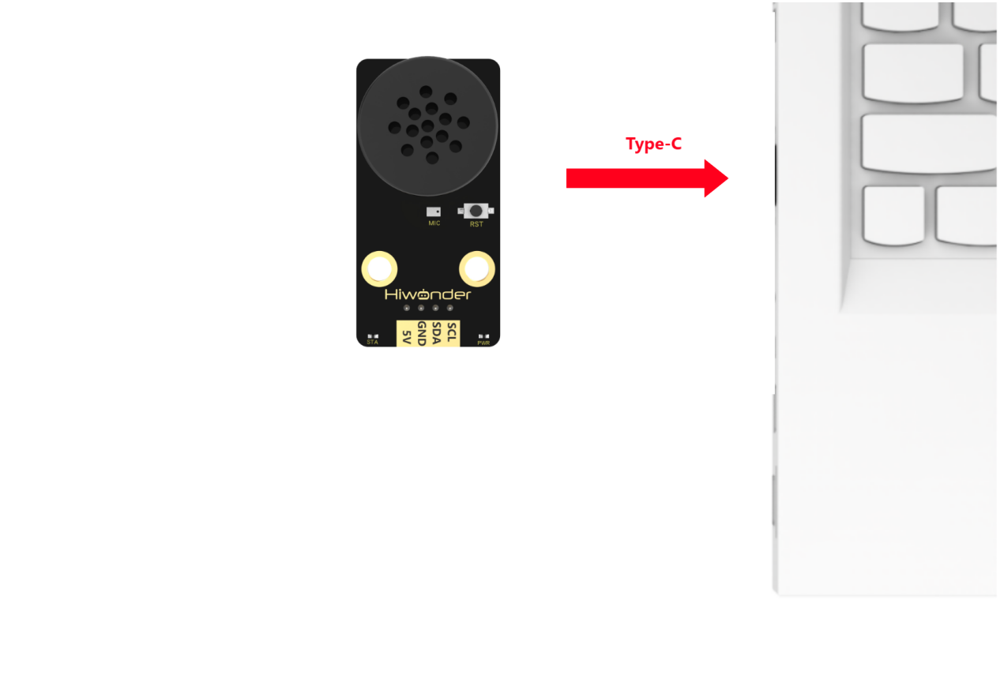
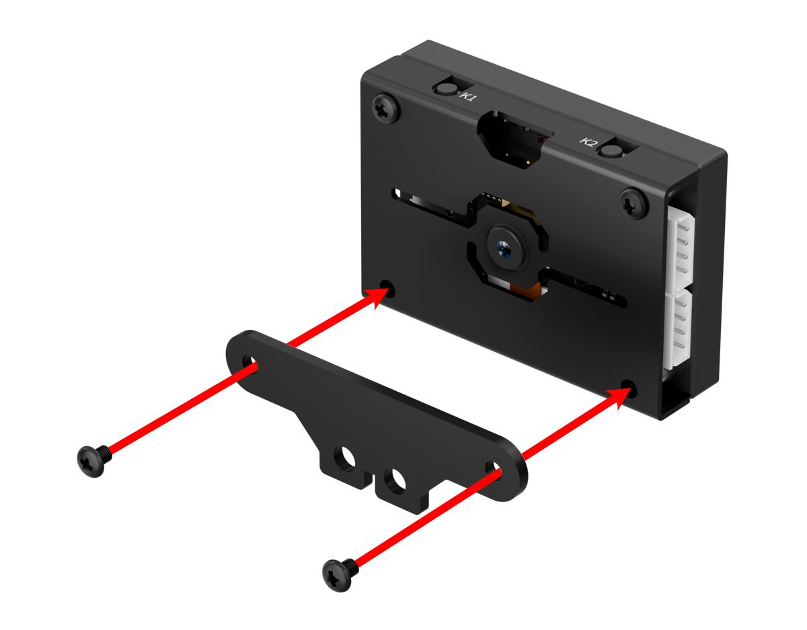
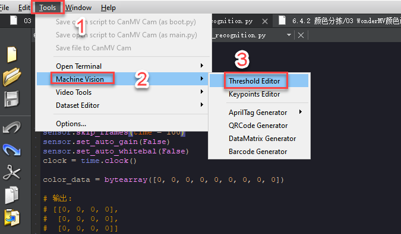
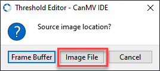
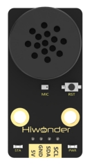

# 8. AI Voice Interaction Course

## 8.1 Introduction to WonderEcho Voice Module & Assembly

### 8.1.1 Introduction to WonderEcho Voice Module

*   **Voice Interaction Module Introduction**

(1) Module Introduction


The integrated voice interaction module (WonderEcho) is based on the `CI1302` chip, designed for voice recognition and playback. It supports offline neural network (NN) acceleration and hardware-accelerated voice signal processing. Through deep noise reduction and neural network models, it analyzes audio to produce recognition results.

The `CI1302` chip features a Brain Neural Processing Unit (BNPU), enabling offline NN acceleration and voice signal hardware acceleration. With a CPU clock speed of up to 220 MHz, it supports offline far-field voice recognition. It also includes 2MB of built-in flash memory, capable of storing up to 300 command phrases.

This module is easy to operate and offers excellent voice recognition performance, making it widely applicable in areas such as smart home systems, conversational robots, educational robots, and in-vehicle dispatch terminals. 

(2) How It Works

This module uses a wake-word mode for activation. Users need to say the wake word to activate the voice interaction module before recognition can begin. By default, the module recognizes English. The English wake word is **"Hello Hiwonder."** To switch to Chinese recognition, you need to flash the Chinese recognition firmware. After switching, the Chinese wake word is **"小幻小幻"** (Xiao Huan Xiao Huan). If no voice input is detected within 15 seconds, the module enters sleep mode and requires reactivation by the wake word.

When the `CI1302` chip detects a matching voice command, it sends the corresponding instruction to the `IIC` chip and provides voice feedback. The `IIC` chip stores the received voice command and sends it out via the `IIC` slave protocol. For detailed voice command lists, please refer to the **"Command and Playback Protocol List"** located in the same directory as this document.

*   **Module Wiring**

Module Wiring: As shown in the figure below, before running the program in this lesson, please connect the module to any `IIC` interface within the red box on the servo control board.


*   **Notice**

(1) Please power the module with a 5V supply only; using other voltages may damage the module.

(2) The operating environment should be quiet, as noisy surroundings can affect recognition accuracy.

(3) When speaking commands, use a clear and loud voice, and avoid speaking too quickly. It is recommended to stay within 5 meters of the module.

*   **Hardware Interface Description**


| NO. | Name             | Feature Description                                         |
| :--: | :---------------: | :---------------------------------------------------------: |
| 1   | Speaker          | Converts analog signals into sound                          |
| 2   | Microphone       | Converts sound into analog signals                          |
| 3   | RST button       | Reset Button                                                |
| 4   | Signal Indicator LED (Blue) | Steady on; flashes once when a voice command is recognized |
| 5   | Power Indicator LED (Red) | Steady on when power supply is normal                       |
| 6   | IIC Ports        | Acts as an `IIC` slave for power supply and communication with host device |
| 7   | Type-C port      | Used for power supply and firmware updates for the `CI1302` chip |
| 8   | CI1302 chip      | High-performance voice recognition chip that processes voice commands and outputs signals |
| 9   | IIC chip         | Converts commands from the voice recognition chip into `IIC` protocol commands |
| 10  | Amplifier Chip   | Converts digital signals to analog signals to drive the speaker |

### 8.1.2 WonderEcho Firmware Flashing Tutorial

*   **Notice**

The module is shipped with the English voice recognition firmware pre-installed, using the wake word **"Hello Hiwonder."**
A Chinese firmware version with the wake word **"Hello Hiwonder"** is provided in the same directory as this document.
If you need to reflash the firmware, please follow the instructions in this document.

*   **Flashing the Firmware**

(1) First, connect the voice interaction module to your computer using a Type-C data cable.



(2) Open the [PACK_UPDATE_TOOL.exe]() located in the [Appendix->Firmware Update Tool]() folder in the same directory as this document. Select the **"CI1302"** chip, then click **"Firmware Upgrade."**


(3) Click **"Select Firmware"** and locate the file named **"CI1302_Chinese_single microphone_V00729_UART1_115200_2M.bin"** in the same directory as this document.
Select the appropriate `COM` port from the list.


(4) Identify the correct `COM` port and select it.


(5) Press the `RST` button on the WonderEcho to initiate the flashing process. Wait for the process to complete successfully.


### 8.1.3 Module Assembly


[Command and Broadcast Word Protocol List (English).xlsx]()

[CI1302_English_Single Microphone_V00729_UART1_115200_2M.bin]()

## 8.2 Custom Wake Word

### 8.2.1 Precautions

(1) Please modify the wake word in a quiet environment, as background noise may affect the recognition accuracy of the voice interaction module.

(2) When speaking the command, make sure your voice is clear and loud, and avoid speaking too fast. It is recommended to stay within 5 meters of the module during operation.

### 8.2.2 Device Connection

Connect the voice interaction module to your computer using a Type-C cable, or power it using a 4-pin cable.


### 8.2.3 Steps to Modify the Wake Word

(1) Say **"HELLO-HI-WONDER"** to wake up the voice interaction module. When the module replies with **"I'm here,"** it indicates that it is ready to receive voice commands.

(2) Then say the command **"Learn wake word."** The module will respond with **"Please say the wake word,"** indicating it has entered wake word learning mode.

(3) Next, say your desired wake word. Keep it as short and simple as possible. For example, you can set it to **"Hello Xiao Huan."**

(4) If the wake word is successfully recognized, the module will respond with **"Learning successful,"** indicating that the new wake word has been set. You can now use **"Hello Xiao Huan"** to wake the module.

:::{Note}
The default wake word **"HELLO-HI-WONDER"** embedded in the factory firmware cannot be modified or deleted via voice commands. Users can only set one custom wake word via voice, which will coexist with the default wake word.
:::

## 8.3 Voice Control Overview

### 8.3.1 Project Description

In this lesson, the system recognizes user commands and picks up different colored blocks accordingly.

### 8.3.2 Program Procedure


### 8.3.3 Module Introduction


The integrated voice interaction module (WonderEcho) is based on the `CI1302` chip, designed for voice recognition and playback. It supports offline neural network (NN) acceleration and hardware-accelerated voice signal processing. Through deep noise reduction and neural network models, it analyzes audio to produce recognition results.

Module Wiring: As shown in the figure below, before running the program in this lesson, please connect the module to any `IIC` interface within the red box on the servo control board.


### 8.3.4 Program Download

[Source Code]()

(1) Connect the core board to the computer using the USB cable.


(2) Locate the corresponding example project folder within the Arduino workspace located in the same directory as this document.


(3) Open the project, then select the appropriate development board model as shown in the figure below.


(4) First, click **"Compile"**, then click **"Upload"**. Once the upload completes successfully, if the output window at the bottom of the software displays the screen shown below, the program has been downloaded successfully.


### 8.3.5 How It Works

After powering on the device, say the wake-up phrase **"HELLO-HI-WONDER"** to activate the voice interaction module. The module will respond with **"I’m here."** You can then speak other commands to start the sorting activity.

The program recognizes the commands **"SORT-RED," "SORT-GREEN,"** and **"SORT-BLUE,"** and controls the robotic arm using inverse kinematics to pick and sort the corresponding colored blocks.

If no new command is received for an extended period, the module will respond with **"I’m going to take a break"** and enter sleep mode. To continue, you’ll need to wake it up again.


### 8.3.6 Brief Program Analysis

[Source Code]()

(1) ino File (Application Layer)

① Import the following libraries: `config.h`, `Hiwonder.hpp`, `Robot_arm.hpp`, `IIC.hpp`, and `ASR_module.hpp`.
Among them, `Robot_arm.hpp` contains the definition of the robotic arm object, `IIC.hpp` defines the `IIC` communication object, and `ASR_module.hpp` contains the voice interaction module object.

{lineno-start=1}

```cpp
#include "Config.h"
#include "Hiwonder.hpp"
#include "Robot_arm.hpp"
#include "IIC.hpp"
#include "ASR_module.hpp"
```

② Create objects for the robotic arm, `IIC` communication, and voice interaction module to enable subsequent control operations.

{lineno-start=7}

```cpp
LeArm_t arm;
IIC iic;
ASR_MOUDLE asr;
```

③ In the `setup` function:

① First, delay for 1000 ms (1 second), then power off the Bluetooth module. Initialize the robot arm, `IIC`, buzzer, `IIC` interface, vision module, and ultrasonic sensor. Then, open the serial port and set the baud rate to 9600.

② Then, call the `coordinate_set` method of the robotic arm object to move the arm to the specified position within 1000 ms. After a 1500 ms (1.5 s) delay, call the `claw_set` method to open Servo 1 of the robotic arm to 90 degrees within 100 ms.

{lineno-start=11}

```cpp
void setup() {
  delay(1000);
  pinMode(IO_BLE_CTL, OUTPUT);
  digitalWrite(IO_BLE_CTL, LOW);  // Set the Bluetooth control pin to low level to power off the Bluetooth module (设置蓝牙控制引脚为低电平时，断开蓝牙模块电源)

  arm.init();
  iic.init();
  asr.init(&iic);

  Serial.begin(9600);
  arm.coordinate_set(20 , 0 , 20, 0 , -90, 90, 1000);
  delay(1500);
  arm.claw_set(90, 100);
  delay(2000);
}
```

④ In the main loop, each iteration begins by calling the `rec_recognition` method of the voice interaction module to retrieve the recognition result (the return value is the hexadecimal `ID` of the recognized command). Based on the recognition result, execute the corresponding logic to pick and place different colored blocks.

{lineno-start=27}

```cpp
void loop() {
  uint8_t asr_result = asr.rec_recognition();
  if(asr_result == 0x69){
    // Sort red (分拣红色)
    arm.coordinate_set(5, 12 , -6 , 0 , -90 , 90 , 1000);
    delay(1500);
    arm.claw_set(30, 100);
    delay(300);
    arm.coordinate_set(20 , 0 , 20, 0 , -90, 90, 1000);
    delay(1100);
    arm.coordinate_set(26 , 0 , -6, -90 , -90, 90, 1000);
    delay(1100);
    arm.claw_set(90, 100);
    delay(300);
    arm.coordinate_set(20 , 0 , 20, 0 , -90, 90, 1000);
    delay(1500);
  }else if(asr_result == 0x6A){
    // Sort green (分拣绿色)
    arm.coordinate_set(5, -12 , -6 , 0 , -90 , 90 , 1000);
    delay(1500);
    arm.claw_set(30, 100);
    delay(300);
    arm.coordinate_set(20 , 0 , 20, 0 , -90, 90, 1000);
    delay(1100);
    arm.coordinate_set(26 , 0 , -6, -90 , -90, 90, 1000);
    delay(1100);
    arm.claw_set(90, 100);
    delay(300);
    arm.coordinate_set(20 , 0 , 20, 0 , -90, 90, 1000);
    delay(1500);
  }else if(asr_result == 0x6B){
    // Sort blue (分拣蓝色)
    arm.coordinate_set(15, 0 , -6 , 0 , -90 , 90 , 1000);
    delay(1500);
    arm.claw_set(30, 100);
    delay(300);
    arm.coordinate_set(20 , 0 , 20, 0 , -90, 90, 1000);
    delay(1100);
    arm.coordinate_set(26 , 0 , -6, -90 , -90, 90, 1000);
    delay(1100);
    arm.claw_set(90, 100);
    delay(300);
    arm.coordinate_set(20 , 0 , 20, 0 , -90, 90, 1000);
    delay(1500);
  }
  delay(200);
}
```

| **Command Keywords** | **ID**  |
| :------------------: | :-------: |
| Sort red             | 105(0x69) |
| Sort green           | 106(0x6A) |
| Sort blue            | 107(0x6B) |

① The pick-and-place logic for the three color blocks is highly similar. Here, we’ll use the red block as an example:

② First, call `robot_arm_coordinate_set` to control the robotic arm via inverse kinematics and move it within 1000 ms to the coordinates corresponding to the **"lowering toward the target red block."** At this point, the gripper is positioned above the red block.

③ Call `robot_arm_claw_set` to rotate Servo 1 of the robotic arm to 30°, closing the gripper to grab the block.

④ Call `robot_arm_coordinate_set` again to move the arm within 1000 ms to the coordinates for **"lifting back to the initial position"** after grabbing the red block. This lifts the gripped block and resets the arm posture.

⑤ Call `robot_arm_coordinate_set` once more to move the arm to the **"lowering toward the placement location"** coordinates within 1000 ms. At this point, the arm rotates toward the placement zone and lowers to bring the block above the designated area.

⑥ Call `robot_arm_claw_set` to rotate Servo 1 to 90°, opening the gripper to release the red block.

⑦ Finally, call `robot_arm_coordinate_set` to return the arm to the **"lift and reset to initial posture"** coordinates within 1000 ms, restoring the arm to its original orientation.

{lineno-start=30}

```cpp
    // Sort red (分拣红色)
    arm.coordinate_set(5, 12 , -6 , 0 , -90 , 90 , 1000);
    delay(1500);
    arm.claw_set(30, 100);
    delay(300);
    arm.coordinate_set(20 , 0 , 20, 0 , -90, 90, 1000);
    delay(1100);
    arm.coordinate_set(26 , 0 , -6, -90 , -90, 90, 1000);
    delay(1100);
    arm.claw_set(90, 100);
    delay(300);
    arm.coordinate_set(20 , 0 , 20, 0 , -90, 90, 1000);
    delay(1500);
```

(2) ASR_module.cpp File (Low Level)

① We illustrate this using the `ASR_MODULE::rec_recognition` method. In this function, the `IIC` object’s `wireReadDataArray` method reads 1 byte of data from the module’s register at address `ASR_RESULT_ADDR`, which holds the recognized command `ID`. The retrieved value is stored in the variable `result` and then returned.

{lineno-start=15}

```cpp
uint8_t ASR_MOUDLE::rec_recognition(void)
{
  if(iic != nullptr){
    uint8_t result = 0;
    iic->wireReadDataArray(I2C_ADDR , ASR_RESULT_ADDR ,&result,1);
    return result;
  }
  return 0;
}
```

## 8.4 Ultrasonic Detection and Announcement Overview

### 8.4.1 Assembly


### 8.4.2 Project Description

This lesson controls the RGB light color based on the obstacle distance and broadcasts corresponding voice commands.

### 8.4.3 Program Procedure


### 8.4.4 Module Introduction 


The integrated voice interaction module (WonderEcho) is based on the `CI1302` chip, designed for voice recognition and playback. It supports offline neural network (NN) acceleration and hardware-accelerated voice signal processing. Through deep noise reduction and neural network models, it analyzes audio to produce recognition results.

Module Wiring: As shown in the figure below, before running the program in this lesson, please connect the module to any `IIC` interface within the red box on the servo control board.


### 8.4.5 Program Download

[Source Code]()

(1) Connect the core board to the computer using the USB cable.


(2) Locate the corresponding example project folder within the Arduino workspace located in the same directory as this document.


(3) Open the project, then select the appropriate development board model as shown in the figure below.


(4) First, click **"Compile"**, then click **"Upload"**. Once the upload completes successfully, if the output window at the bottom of the software displays the screen shown below, the program has been downloaded successfully.


### 8.4.6 How It Works

After powering on the robotic arm, it detects the distance to obstacles ahead. If the distance is less than 200mm, it announces **"Obstacle ahead"** and the illuminated ultrasonic module lights up red. If the distance is 200mm or greater, the illuminated ultrasonic module lights up green.


### 8.4.7 Brief Program Analysis

[Source Code]()

(1) ino File (Application Layer)

① Import the following library files: `config.h`, `Hiwonder.hpp`, `Robot_arm.hpp`, `IIC.hpp`, `ASR_module.hpp`, and `Ultrasound.hpp`.
`Robot_arm.hpp` contains the definition of the robotic arm object.
`IIC.hpp` contains the definition of the `IIC` communication object.
`ASR_module.hpp` contains the definition of the voice interaction object.
`Ultrasound.hpp` contains the definition of the ultrasonic sensor object.

{lineno-start=}

```cpp
paste source code here.
```


② Create objects for the robotic arm, `IIC` communication, voice interaction module and ultrasonic object to enable subsequent control operations.

{lineno-start=}

```cpp
paste source code here.
```


③ First, delay for 1000 ms (1 second) in the `setup` function, then power off the Bluetooth module. Initialize the robot arm, `IIC` interface, voice interaction, and ultrasonic sensor object. Then, open the serial port and set the baud rate to 9600.

{lineno-start=}

```cpp
paste source code here.
```


④ In the main loop function:

① At the start of each cycle, call the ultrasonic object's `GetDistance` method to read the real-time distance to the obstacle in front of the ultrasonic sensor, and print the current distance value via the serial port. Based on the distance value, execute the following logic:

② If the current distance is between 20mm and 200mm, it is considered that an obstacle is nearby in front. Call the ultrasonic object's `Color` method to set the red light intensity to 250 and green and blue light intensities to 0 for both left and right RGB LED arrays, causing both RGB lights on the ultrasonic module to display red. Call the voice interaction object's `speak` method to broadcast the voice prompt of type 0xFF with `ID` 5, corresponding to the phrase **"Obstacle ahead."**

③ Otherwise, call the ultrasonic object's `Color` method to set the green light intensity to 250 and red and blue light intensities to 0 for both left and right RGB LED arrays, causing both RGB lights on the ultrasonic module to display green.

{lineno-start=}

```cpp
paste source code here.
```


(2) ASR_module.c File (Low Level)

① We explain the `ASR_MODULE::speak` method as follows: after verifying the validity of the `IIC` object and the input parameters, the broadcast command type (`cmd`) and phrase `ID` (`id`) are sequentially stored into the `send` array. Then, the `IIC` object's `wireWriteDataArray` method is called to transmit this data to the speech module’s register `ASR_SPEAK_ADDR`, where the phrase is queued for playback.

{lineno-start=}

```cpp
paste source code here.
```


| **Broadcast Phrase** | **ID**  |
| :------------------: | :-------: |
| Obstacle Ahead       | 5(0x05)   |

:::{Note}
*   The phrase `ID`s used for broadcast speech are separate and do not overlap with the command phrase `ID`s used for recognition.
*   Command-type phrases (`ID` 0x00) that are actively returned upon recognition of voice commands can also be triggered programmatically for playback.
:::

## 8.5 Voice + Waste Sorting

### 8.5.1 Assembly





### 8.5.2 Tag Recognition Feature Description

*   **Experiment Overview**

In this section, the `K210` vision module is used to detect garbage cards. The camera first captures an image, then identifies whether a garbage card is present. If detected, a bounding box is drawn around the card, and the image is displayed on the `LCD` screen.

*   **Preparation**

(1) Device Connection

Connect the `K210` vision module to the `PC` using a Type-C data cable, as shown in the figure below:


(2) Program Import & Running

① Double-click the icon to open the `CanMV IDE` development software.


② Click in the bottom left corner.


③ Select the corresponding serial port number. Check **"Advanced Settings"**, and select **"Mode-3"**.


④ Click **"OK"** and wait for the connection to be completed.

 

⑤ After the connection is successful, the `CanMV IDE` displays the icon in the bottom left corner.


⑥ If the connection takes more than 10 seconds, it indicates a connection failure. Click **"Cancel"**, and a pop-up window shown below appears. Click **"OK"** and re-check the connection.


:::{Note}

Tips for connection failure:

*   Incorrect `COM` port selected: Disconnect other USB devices from your `PC` to reduce interference, then repeat the above steps and ensure the correct `COM` port is selected.

*   Cable is not a data cable: Some Type-C cables are for charging only and do not support data transmission. Please use a Type-C cable with data transfer capability (a Type-C data cable is included with our product).

*   Other firmware has been flashed to the `K210` module: Reflash the factory firmware and then reconnect.

:::

There are two modes for running programs on the `K210` vision module: Online Mode and Offline Mode.

① Online Mode: In this mode, after connecting the module, drag the program file from this lesson's folder into the `CanMV IDE` code editor. Then click the **Run** button in the lower left corner to execute the program online, as shown below.

:::{Note}
Programs run using this method will be lost once the device is disconnected or powered off—they are not saved to the vision module.
:::


② Offline Operation

Offline Mode: After connecting, drag the program file from this lesson's folder into the `CanMV IDE` code editor.

* Click the **"Tools"** menu in the toolbar, and select **"Save current script as (main.py) to CanMV Cam"** as shown below.


*   Then click **"Yes"** to confirm.


*   A prompt will appear indicating that the script has been written successfully—click **"OK"**. This saves the MicroPython script to the `K210` vision module.


In this mode, the `K210` can run the script automatically when powered on, even without a `PC` connection—enabling true offline operation.

*   **Notice**

(1) The background of the detected object should be distinct and clear; a clean background helps improve recognition accuracy.

(2) If detection fails during use, try adjusting the distance or angle appropriately.

*   **Running Effect**

Place the garbage card within the recognizable range. The `K210` vision module will highlight and label the detected garbage card area, displaying it on the `LCD` screen.


*   **Experiment Explanation**

[Souce Code]()

(1) Load the required libraries, including the `KPU` module, which is specifically used for loading and processing `AI` models.

{lineno-start=1}

```python
import hiwonder
import sensor
import image
import cmath
import time
import lcd
import gc

from maix import KPU
```

(2) Initialize the `LCD` screen, then restart and configure the camera module. Set the pixel format to `RGB565` and the image resolution to `QVGA`.

{lineno-start=11}

```python
i2c = hiwonder.hw_slavei2c()

lcd.init()                          # Init lcd display
lcd.clear(lcd.RED)                  # Clear lcd screen.

# sensor.reset(dual_buff=True)      # improve fps
sensor.reset()                      # Reset and initialize the sensor.
sensor.set_pixformat(sensor.RGB565) # Set pixel format to RGB565 (or GRAYSCALE)
sensor.set_framesize(sensor.QVGA)   # Set frame size to QVGA (320x240)
sensor.set_vflip(False)              # Flip the camera (翻转摄像头)
sensor.set_hmirror(False)            # Mirror the camera (镜像摄像头)
sensor.skip_frames(time = 1000)     # Wait for settings take effect.
clock = time.clock()                # Create a clock object to track the FPS.
```

(3) Create a frame rate clock object for later frame rate calculations.

{lineno-start=23}

```python
clock = time.clock()                # Create a clock object to track the FPS.
```

(4) Initialized a `labels` list to store the names of garbage cards. The `GarbageCategory` class is used to represent the categories of the garbage cards.

{lineno-start=25}

```python
result = bytearray([0, 0, 0, 0, 0, 0, 0, 0, 0])
print("ready load model")

labels = ["oral_bottle",
          "color_pen",
          "battery",
          "brush",
          "plastic_bottle",
          "umbrella",
          "banana_peel",
          "ketchup",
          "bone",
          "chopstick",
          "plate",
          "cigarette_end"] #Class names, fill in according to label.txt order (类名称，按照label.txt顺序填写)

class GarbageCategory:
    RECYCLE = "Recyclable"
    HAZARDOUS = "Hazardous"
    ORGANIC = "Organic"
    OTHERS = "Others"
    UNKNOWN = "Unknown"paste source code here.
```

(5) Define a hash table to associate garbage card names with their corresponding garbage categories.

{lineno-start=48}

```python
# Define the hash table (定义哈希表)
garbage_classification = {
    "oral_bottle": GarbageCategory.RECYCLE,
    "color_pen": GarbageCategory.OTHERS,
    "battery": GarbageCategory.HAZARDOUS,
    "brush": GarbageCategory.OTHERS,
    "plastic_bottle": GarbageCategory.RECYCLE,
    "umbrella": GarbageCategory.OTHERS,
    "banana_peel": GarbageCategory.ORGANIC,
    "ketchup": GarbageCategory.ORGANIC,
    "bone": GarbageCategory.ORGANIC,
    "chopstick": GarbageCategory.OTHERS,
    "plate": GarbageCategory.OTHERS,
    "cigarette_end": GarbageCategory.OTHERS
}
```

(6) Set up the parameters required for the garbage card detection model—these are fixed model parameters and should not be modified.

{lineno-start=64}

```python
anchor = (1.38, 1.41, 2.00, 2.03, 2.78,
            2.81, 3.72, 3.66, 5.66, 5.47) # anchors, use values from the second line of anchor.txt (anchors,使用anchor.txt中第二行的值)

```

(7) Create a `KPU` object and load the model file from the specified path. Then, initialize the `YOLO` model parameters.

{lineno-start=68}

```python
kpu = KPU()
# Load the model from sd or flash (从sd或flash加载模型)
kpu.load_kmodel('/sd/KPU/garbage_sorting/garbage_sorting.kmodel')
kpu.init_yolo2(anchor, anchor_num=(int)(len(anchor)/2), img_w=320, img_h=240, net_w=320 , net_h=240 ,layer_w=10 ,layer_h=8, threshold=0.6, nms_value=0.3, classes=len(labels))

```

① `init_yolo2()` function is used to set up the `YOLO` model with the following parameters:

② `anchor`: A list of anchor box sizes used for object detection

③ `anchor_num`: Number of anchor boxes

④ `img_w`, `img_h`: Width and height of the input image

⑤ `net_w`, `net_h`: Width and height of the model input

⑥ `layer_w`, `layer_h`: Width and height of the final model layer

⑦ `threshold`: Confidence threshold for object detection

⑧ `nms_value`: `IOU` threshold for Non-Maximum Suppression (`NMS`)

(8) Enter the `while` loop to continuously process images.

{lineno-start=74}

```python
while(True):
```

(9) Calculate the frames per second (`FPS`) for display purposes.

{lineno-start=78}

```python
    clock.tick()
```

(10) Capture an image using the `snapshot()` function. The image is then duplicated and preprocessed before being passed to the loaded model for detection.

{lineno-start=79}

```python
    img = sensor.snapshot()

    kpu.run_with_output(img)
```

(11) Retrieve detection results. If garbage cards are detected, draw bounding boxes and confidence scores around each detected card. Then, use the hash table to obtain the corresponding garbage category and store it in the `classification` variable.

{lineno-start=82}

```python
    dect = kpu.regionlayer_yolo2()

    fps = clock.fps()

    if len(dect) > 0:
        for l in dect :
            detect = True
            a = img.draw_rectangle(l[0],l[1],l[2],l[3],color=(0,255,0))
            info = "%s %.3f" % (labels[l[4]], l[5])
            a = img.draw_string(l[0],l[1],info,color=(255,0,0),scale=2.0)
            classification = garbage_classification.get(labels[l[4]], GarbageCategory.UNKNOWN)
```

(12) Based on the `classification` result, store the detected garbage card data into the `result` array.

{lineno-start=86}

```python
    if len(dect) > 0:
        for l in dect :
            detect = True
            a = img.draw_rectangle(l[0],l[1],l[2],l[3],color=(0,255,0))
            info = "%s %.3f" % (labels[l[4]], l[5])
            a = img.draw_string(l[0],l[1],info,color=(255,0,0),scale=2.0)
            classification = garbage_classification.get(labels[l[4]], GarbageCategory.UNKNOWN)
            if classification == GarbageCategory.RECYCLE:
                result[0] = 1
                result[1] = (l[0] + (l[2] // 2)) & 0xFF             #Low 8 bits of the detected object's center x-axis coordinate (识别到的物体中心x轴坐标点低八位)
                result[2] = ((l[0] + (l[2] // 2)) >> 8) & 0xFF      #High 8 bits of the detected object's center x-axis coordinate (识别到的物体中心x轴坐标点高八位)
                result[3] = (l[1] + (l[3] // 2)) & 0xFF             #Low 8 bits of the detected object's center y-axis coordinate (识别到的物体中心y轴坐标点低八位)
                result[4] = ((l[1] + (l[3] // 2)) >> 8) & 0xFF      #High 8 bits of the detected object's center y-axis coordinate (识别到的物体中心y轴坐标点高八位)
                result[5] = l[2] & 0xFF                          #Low 8 bits of the detected object's bounding box width (识别到的物体检测框宽度低八位)
                result[6] = (l[2] >> 8) & 0xFF                   #High 8 bits of the detected object's bounding box width (识别到的物体检测框宽度高八位)
                result[7] = l[3] & 0xFF                          #Low 8 bits of the detected object's bounding box height (识别到的物体检测框高度低八位)
                result[8] = (l[3] >> 8) & 0xFF                   #High 8 bits of the detected object's bounding box height (识别到的物体检测框高度高八位)
            elif classification == GarbageCategory.HAZARDOUS:
                result[0] = 2
                result[1] = (l[0] + (l[2] // 2)) & 0xFF
                result[2] = ((l[0] + (l[2] // 2)) >> 8) & 0xFF
                result[3] = (l[1] + (l[3] // 2)) & 0xFF
                result[4] = ((l[1] + (l[3] // 2)) >> 8) & 0xFF
                result[5] = l[2] & 0xFF
                result[6] = (l[2] >> 8) & 0xFF
                result[7] = l[3] & 0xFF
                result[8] = (l[3] >> 8) & 0xFF
            elif classification == GarbageCategory.ORGANIC:
                result[0] = 3
                result[1] = (l[0] + (l[2] // 2)) & 0xFF
                result[2] = ((l[0] + (l[2] // 2)) >> 8) & 0xFF
                result[3] = (l[1] + (l[3] // 2)) & 0xFF
                result[4] = ((l[1] + (l[3] // 2)) >> 8) & 0xFF
                result[5] = l[2] & 0xFF
                result[6] = (l[2] >> 8) & 0xFF
                result[7] = l[3] & 0xFF
                result[8] = (l[3] >> 8) & 0xFF
            elif classification == GarbageCategory.OTHERS:
                result[0] = 4
                result[1] = (l[0] + (l[2] // 2)) & 0xFF
                result[2] = ((l[0] + (l[2] // 2)) >> 8) & 0xFF
                result[3] = (l[1] + (l[3] // 2)) & 0xFF
                result[4] = ((l[1] + (l[3] // 2)) >> 8) & 0xFF
                result[5] = l[2] & 0xFF
                result[6] = (l[2] >> 8) & 0xFF
                result[7] = l[3] & 0xFF
                result[8] = (l[3] >> 8) & 0xFF
```

(13) If no garbage cards are detected, clear the `face_data` array.

{lineno-start=134}

```python
    if detect == False:
        for i in range(len(result)):
            result[i] = 0
    #print(result)
    i2c.set_reg_value(0x30, result)
    a = img.draw_string(0, 0, "%2.1ffps" %(fps),color=(0,60,255),scale=2.0)
```

(14) Transmit the detection data to the register. Then, overlay the `FPS` on the image, and finally display the processed image on the `LCD` screen.

{lineno-start=138}

```python
    i2c.set_reg_value(0x30, result)
    a = img.draw_string(0, 0, "%2.1ffps" %(fps),color=(0,60,255),scale=2.0)
    lcd.display(img)
```

### 8.5.3 Voice + Waste Sorting Overview

*   **Project Description**

This lesson enables garbage sorting via voice command, allowing the robotic arm to automatically recognize and sort waste.

*   **Program Procedure**


*   **Module Introduction**

(1) Introduction to WonderEcho Voice Module


The integrated voice interaction module (WonderEcho) is based on the `CI1302` chip, designed for voice recognition and playback. It supports offline neural network (NN) acceleration and hardware-accelerated voice signal processing. Through deep noise reduction and neural network models, it analyzes audio to produce recognition results.

Module Wiring: As shown in the figure below, before running the program in this lesson, please connect the module to any `IIC` interface within the red box on the servo control board.


(2) WonderMV Vision Module


The `WonderMV` module features a high-performance built-in `K210` chip, enabling users to implement `AI` vision functions such as color recognition and face detection through programming. Equipped with an `IIC` interface, this module allows easy data communication with various main control devices, providing an efficient solution for intelligent vision applications.

Module Wiring: As shown in the figure below, before running the program in this lesson, please connect the module to any `IIC` interface within the red box on the servo control board.


*   **Program Download**

[Source Code]()

(1) Connect the core board to the computer using the USB cable.


(2) Locate the corresponding example project folder within the Arduino workspace located in the same directory as this document.


(3) Open the project, then select the appropriate development board model as shown in the figure below.


(4) First, click **"Compile"**, then click **"Upload"**. Once the upload completes successfully, if the output window at the bottom of the software displays the screen shown below, the program has been downloaded successfully.


*   **How It Works**

After powering on the device, say the wake-up phrase **"HELLO-HI-WONDER"** to activate the voice interaction module. The module will respond with **"I’m here."** You can then speak additional commands to start the activity.

Once the robotic arm is powered on, users can say **"START-WASTE-SORTING"** or **"STOP-WASTE-SORTING"** to enable or disable the waste sorting function. When the function is enabled, the robotic arm will recognize the type of waste, announce the category, and then pick it up and place it in the corresponding area.

If no new command is given for a period of time, the module will respond with **"I’m going to take a break"** and enter sleep mode. To resume the activity, the system must be reawakened.


*   **Brief Program Analysis**

[Source Code]()

(1) ino File (Application Layer)

① Import the following library files: `config.h`, `Hiwonder.hpp`, `Robot_arm.hpp`, `IIC.hpp`, and `WonderMV.hpp`.

`Hiwonder.hpp` contains the definitions for the `LED`, buzzer, and button objects.

`Robot_arm.hpp` defines the robot arm object.

`IIC.hpp` includes the definition of the `IIC` communication object.

`WonderMV.hpp` defines the vision module object.

{lineno-start=1}

```cpp
#include "Config.h"
#include "Hiwonder.hpp"
#include "Robot_arm.hpp"
#include "IIC.hpp"
#include "WonderMV.hpp"
#include "ASR_module.hpp"
```

② Create objects for the `LED`, buzzer, button, robotic arm, `IIC` interface, vision module and voice module to facilitate subsequent control.

{lineno-start=9}

```cpp
Led_t led_obj;
Buzzer_t buzzer_obj;
Button_t key_obj;
LeArm_t arm;

IIC iic;
WonderMV mv;
ASR_MOUDLE asr;
```

③ Then, create and implement seven coordinate arrays `coord` corresponding to the robotic arm’s target positions for the following actions:

Reset to initial posture

Lower down above the target block for picking

Lift up to a transitional posture after grasping

Lower down above the recyclable waste placement area

Lower down above the hazardous waste placement area

Lower down above the kitchen waste placement area

Lower down above the other waste placement area

Also, create a variable `result` to store the visual recognition outcomes.

{lineno-start=18}

```cpp
float coord[7][3] = {
 {14,0,-3}, //Reset coordinates (复位坐标)
 {17,0,-6}, //Grasp (夹取)
 {15,0,15}, //Grasp transition position (夹取过渡位置)
 {3,-18,10}, //Place at position one (放一)
 {15,-18,10}, //Place at position two (放二)
 {3,18,10}, //Place at position three (放三)
 {15,18,10}, //Place at position four (放四)
};
```

④ In the `setup` function:

First, delay for 1000 ms (1 second), then power off the Bluetooth module. Initialize the robotic arm, `LED`, buzzer, `IIC`, vision, voice interaction, and ultrasonic objects, then start the serial port and set the baud rate to 9600.

Call the buzzer’s `blink` method to make it beep once at 1500 Hz, with 100 ms on and 100 ms off. Then, call the `coordinate_set` method of the robotic arm object to move the arm to the specified position within 1000 ms.

{lineno-start=29}

```cpp
void setup() {
  delay(1000);
  pinMode(IO_BLE_CTL, OUTPUT);
  digitalWrite(IO_BLE_CTL, LOW);  // Set the Bluetooth control pin to high level to power off the Bluetooth module (设置蓝牙控制引脚为高电平时，断开蓝牙模块电源)
  
  arm.init();
  led_obj.init(IO_LED);
  buzzer_obj.init(IO_BUZZER);

  iic.init();
  mv.init(&iic);
  asr.init(&iic);

  Serial.begin(9600);
  buzzer_obj.blink(1500, 100, 100, 1);

  arm.coordinate_set(coord[0][0],coord[0][1],coord[0][2],0,-90,90,1000); //Reset (复位)
  delay(3000);
}
```

⑤ Then create the necessary flag variables.

{lineno-start=49}

```cpp
uint8_t asr_result = 0;
uint8_t open_flag = 0;
```

⑥ In the main loop function:

*   At the beginning of each cycle, call the `rec_recognition` method of the voice interaction module to read the recognized command word (returns the command `ID` in hexadecimal form).

*   Determine the user command based on the recognized command `ID`. If the command is **"Start waste sorting"**, set the waste sorting flag `open_flag` to 1, trigger a short beep on the buzzer, and turn on the `LED`.

*   If the command is **"Stop"**, set `open_flag` to 0, trigger a long beep on the buzzer, and turn off the `LED`.

| **Command Keywords** | **ID**  |
| :------------------: | :-------: |
| Start waste sorting  | 100(0x64) |
| Stop the game        | 123(0x7B) |

{lineno-start=51}

```cpp
void loop() {
  asr_result = asr.rec_recognition();
  if(asr_result == 0x64)
  {
    open_flag = 1;
    buzzer_obj.blink(1500, 100, 50, 1);
    led_obj.on_off(1);
  }else if(asr_result == 0x7B){
    open_flag = 0;
    buzzer_obj.blink(1500, 300, 50, 1);
    led_obj.on_off(0);
  }
  asr_result = 0;
```

*   Next, check whether the garbage classification function switch is enabled in this loop. If it is not enabled, exit the loop directly.

*   If it is enabled, call the `get_result` method of the vision object twice in succession to obtain the recognition result. The first call is to confirm whether a target has been detected. The second call is to eliminate false positives. The identified garbage type `ID` is stored in the `id` member of the `result` object returned by the vision module.

*   Then, based on the `id` value, execute the corresponding grabbing logic for the specific garbage type (details omitted here).

*   After the grabbing is completed, call the `claw_set` method of the robotic arm object to control Servo 1 to rotate to 90°, which opens the claw above the designated drop-off area to release the object.

*   Call the `coordinate_set` method of the robotic arm object to control the arm using inverse kinematics. The motion takes 1000 ms, during which the arm moves to the coordinates corresponding to the **"reset to initial position"** posture. At this point, the robotic arm has returned to its home position.

{lineno-start=65}

```cpp
  if(open_flag == 1){
    mv.get_result(OBJECT_REG , &result);
    if(result.id != 0){
      Serial.println(result.id);
      delay(2000);
      mv.get_result(OBJECT_REG , &result);
      if(result.id == 1){ /* Recognized as recyclable waste (识别为可回收垃圾)  */
        Serial.println("1");
        asr.speak(ASR_ANNOUNCER , 1);
        arm.coordinate_set(coord[1][0],coord[1][1],coord[1][2],0,-90,90,1200); //Grasp (夹取)
        delay(1500);
        arm.claw_set(30,200); //Grasp (夹取)
        delay(300);
        arm.coordinate_set(coord[2][0],coord[2][1],coord[2][2],0,-90,90,1000); //Grasp transition position (夹取过渡位置)
        delay(1300);
        arm.coordinate_set(coord[3][0],coord[3][1],coord[3][2],0,-90,90,1000); //Place at position one (放一)
      }else if(result.id == 2){ /* Recognized as hazardous waste (识别为有害垃圾) */
        Serial.println("2");
        asr.speak(ASR_ANNOUNCER , 3);
        arm.coordinate_set(coord[1][0],coord[1][1],coord[1][2],0,-90,90,1200); //Grasp (夹取)
        delay(1500);
        arm.claw_set(30,200); //Grasp (夹取)
        delay(300);
        arm.coordinate_set(coord[2][0],coord[2][1],coord[2][2],0,-90,90,1000); //Grasp transition position (夹取过渡位置)
        delay(1300);
        arm.coordinate_set(coord[4][0],coord[4][1],coord[4][2],0,-90,90,1000); //Place at position two (放二）
      }else if(result.id == 3){ /* Recognized as kitchen waste (识别为厨余垃圾) */
        Serial.println("3");
        asr.speak(ASR_ANNOUNCER , 2);
        arm.coordinate_set(coord[1][0],coord[1][1],coord[1][2],0,-90,90,1200); //Grasp (夹取)
        delay(1500);
        arm.claw_set(30,200); //Grasp (夹取)
        delay(300);
        arm.coordinate_set(coord[2][0],coord[2][1],coord[2][2],0,-90,90,1000); //Grasp transition position (夹取过渡位置)
        delay(1300);
        arm.coordinate_set(coord[5][0],coord[5][1],coord[5][2],0,-90,90,1000); //Place at position one (Place at position one (放一)
      }else if(result.id == 4){ /* Recognized as other waste (识别为其他垃圾) */
        Serial.println("4");
        asr.speak(ASR_ANNOUNCER , 4);
        arm.coordinate_set(coord[1][0],coord[1][1],coord[1][2],0,-90,90,1200); //Grasp (夹取)
        delay(1500);
        arm.claw_set(30,200); //Grasp (夹取)
        delay(300);
        arm.coordinate_set(coord[2][0],coord[2][1],coord[2][2],0,-90,90,1000); //Grasp transition position (夹取过渡位置)
        delay(1300);
        arm.coordinate_set(coord[6][0],coord[6][1],coord[6][2],0,-90,90,1000); //Place at position one (放一)
      }
      delay(1300);
      arm.claw_set(90,100); //Release (放)
      delay(500);
      arm.coordinate_set(coord[0][0],coord[0][1],coord[0][2],0,-90,90,1000); //Reset (复位)
      delay(1300);
      result.id = 0;
    }
  }
  delay(100);
}
```

*   The grab-and-place logic for the four types of garbage is highly similar. Here, we take recyclable waste as an example:

*   First, call the `speak` method of the voice interaction module to play the speech entry with type 0xFF (broadcast message) and `ID` 1, which corresponds to the phrase **"Recyclable Waste."**

| **Broadcast Phrase** | **ID**  |
| :------------------: | :-------: |
| Recyclable Waste     | 1(0x01)   |
| Food waste           | 2(0x02)   |
| Hazardous waste      | 3(0x03)   |
| Other waste          | 4(0x04)   |

*   Call the `coordinate_set` method of the robotic arm object to control the arm using inverse kinematics. The movement takes 1200 ms and brings the arm to the coordinates corresponding to **"descend toward the object to be picked."** At this point, the claw moves down above the target object.

*   Then, call the `claw_set` method to control Servo 1 of the robotic claw to rotate to 30°, causing the claw to close and grip the object.

*   Next, call the `coordinate_set` method again to move the robotic arm to the **"lift-up transition pose after gripping"**. This movement takes 1000 ms, during which the gripped object is lifted.

*   Then, call the `coordinate_set` method to move the robotic arm to the coordinates corresponding to **"descend toward the recyclable waste drop-off area."** This movement also takes 1000 ms. At this stage, the robotic arm rotates to face the direction of the drop-off area and descends, positioning the gripped object directly above the drop-off zone.

{lineno-start=65}

```cpp
  if(open_flag == 1){
    mv.get_result(OBJECT_REG , &result);
    if(result.id != 0){
      Serial.println(result.id);
      delay(2000);
      mv.get_result(OBJECT_REG , &result);
      if(result.id == 1){ /* Recognized as recyclable waste (识别为可回收垃圾)  */
        Serial.println("1");
        asr.speak(ASR_ANNOUNCER , 1);
        arm.coordinate_set(coord[1][0],coord[1][1],coord[1][2],0,-90,90,1200); //Grasp (夹取)
        delay(1500);
        arm.claw_set(30,200); //Grasp (夹取)
        delay(300);
        arm.coordinate_set(coord[2][0],coord[2][1],coord[2][2],0,-90,90,1000); //Grasp transition position (夹取过渡位置)
        delay(1300);
        arm.coordinate_set(coord[3][0],coord[3][1],coord[3][2],0,-90,90,1000); //Place at position one (放一)

```

The remaining part of the code is as follows.

{lineno-start=81}

```cpp
      }else if(result.id == 2){ /* Recognized as hazardous waste (识别为有害垃圾) */
        Serial.println("2");
        asr.speak(ASR_ANNOUNCER , 3);
        arm.coordinate_set(coord[1][0],coord[1][1],coord[1][2],0,-90,90,1200); //Grasp (夹取)
        delay(1500);
        arm.claw_set(30,200); //Grasp (夹取)
        delay(300);
        arm.coordinate_set(coord[2][0],coord[2][1],coord[2][2],0,-90,90,1000); //Grasp transition position (夹取过渡位置)
        delay(1300);
        arm.coordinate_set(coord[4][0],coord[4][1],coord[4][2],0,-90,90,1000); //Place at position two (放二）
      }else if(result.id == 3){ /* Recognized as kitchen waste (识别为厨余垃圾) */
        Serial.println("3");
        asr.speak(ASR_ANNOUNCER , 2);
        arm.coordinate_set(coord[1][0],coord[1][1],coord[1][2],0,-90,90,1200); //Grasp (夹取)
        delay(1500);
        arm.claw_set(30,200); //Grasp (夹取)
        delay(300);
        arm.coordinate_set(coord[2][0],coord[2][1],coord[2][2],0,-90,90,1000); //Grasp transition position (夹取过渡位置)
        delay(1300);
        arm.coordinate_set(coord[5][0],coord[5][1],coord[5][2],0,-90,90,1000); //Place at position one (Place at position one (放一)
      }else if(result.id == 4){ /* Recognized as other waste (识别为其他垃圾) */
        Serial.println("4");
        asr.speak(ASR_ANNOUNCER , 4);
        arm.coordinate_set(coord[1][0],coord[1][1],coord[1][2],0,-90,90,1200); //Grasp (夹取)
        delay(1500);
        arm.claw_set(30,200); //Grasp (夹取)
        delay(300);
        arm.coordinate_set(coord[2][0],coord[2][1],coord[2][2],0,-90,90,1000); //Grasp transition position (夹取过渡位置)
        delay(1300);
        arm.coordinate_set(coord[6][0],coord[6][1],coord[6][2],0,-90,90,1000); //Place at position one (放一)
```

## 8.6 Voice + Vision Color Sorting

### 8.6.1 Assembly


### 8.6.2 Color Recognition Feature Description

*   **Game Introduction**

In this lesson's program, color thresholds are preconfigured, allowing direct recognition of five colors—red, green, blue, yellow, and purple—without the need for manual sampling.

When any of these colors is detected, it will be highlighted with a bounding box and labeled with the corresponding color name.


*   **Getting Ready**

(1) Device Connection

Connect the vision module to a computer with a Type-C data cable.


(2) Download and Run Program

① Double-click to open the software.


② Click in the bottom left corner.


③ Select the corresponding serial port number. Check **"Advanced Settings"**, and select **"Mode-3"**.


④ Click **"OK"** and wait for the connection to be completed.


⑤ After the connection is successful, the `CanMV IDE` displays the icon in the bottom left corner.


⑥ If the connection takes more than 10 seconds, it indicates a connection failure. Click **"Cancel"**, and a pop-up window shown below appears. Click **"OK"** and re-check the connection.


:::{Note}

Tips for connection failure:

*   The selected serial port number is wrong.
    Please unplug other serial ports connected to your `PC`. Try the above steps again to select the correct serial port number.

*   The cable used for the connection is not a data cable.
    Use a Type-C data cable that supports data transmission. A Type-C data cable is included in the package before delivery.

*   Other `K210` firmware is flashed.
    Reflash the factory firmware, and then proceed with the connection.

:::
    

There are two ways to run `K210` programs: online and offline.

**Online operation:**

After connecting successfully, drag the program under the same folder as this lesson to the code editor area of `CanMV IDE`. Click the at the bottom left corner to run the program online.

:::{Note}
Programs run in this way will be lost when the connection is disconnected or the device is shut down. They will not be saved on the `K210` vision module.
:::


**Offline operation:**

① After connecting, drag the program under the same directory to the `CanMV IDE` code editing area. Click **"Tools"** on the toolbar. Select **"Save open script to CanMV Cam (as main.py)"**.


② Click **"Yes"**.


③ Once the writing is successful, a window shown below will appear. Click **"OK"**. This saves the MicroPython file into the `K210` Vision Module.


By downloading in this way, after powering on the `K210` Vision Module without connecting, it will run the MicroPython file, enabling offline operation.

*   **Notes**

(1) The colors to be learned should be bright and highly saturated, such as pure red, green, and blue. For more details about learning colors, please refer to the following sections.

(2) The colors to be learned should significantly differ from the color of the background. For example, avoid yellow background when using yellow.

(3) Avoid learning colors such as white and mixed colors. Ensure adequate ambient lightness. If the lightness is insufficient, turn on fill light.

(4) Adjust the lighting to make the white frame stable; and adjust the angle to ensure that the color to be recognized is fully covered inside the white frame.

*   **Program Outcome**

The factory program comes preloaded with threshold values for red, green, blue, yellow, and purple. Once the program is running, simply place objects in these colors within the detection range of the `K210` vision module. The module will automatically recognize them and draw bounding boxes around the detected colored objects, as shown in the image below.


*   **Program Analysis**

(1) Import the necessary libraries, including `sensor`, `image`, `time`, and `lcd`.

{lineno-start=1}

```python
import hiwonder
import sensor
import image
import time
import lcd
```

(2) Initialize the `LCD` screen. Restart and configure the camera module. Set the pixel mode to `RGB565` and image size to `QVGA`. Also, disable auto gain and auto white balance.

{lineno-start=9}

```python
lcd.init()
sensor.reset()
sensor.set_pixformat(sensor.RGB565)
sensor.set_framesize(sensor.QVGA)
sensor.skip_frames(time = 100)
sensor.set_auto_gain(False)
sensor.set_auto_whitebal(False)
clock = time.clock()
```

(3) Create an object of frame rate clock. It is used to calculate the frame rate.

{lineno-start=16}

```python
clock = time.clock()
```


(4) Define `LAB` thresholds for identifying different colors. Set thresholds for five target colors and assign corresponding color name strings for display during detection.

{lineno-start=26}

```python
thresholds = [(21, 82, 35, 127, 0, 82),     # Red      index is 0 so code == (1 << 0)
              (33, 100, -46, -26, -61, 127),# Green    index is 1 so code == (1 << 1)
              (34, 100, -20, 18, -41, -11), # Blue     index is 2 so code == (1 << 2)
              (65, 78, -10, -5, 38, 50),    # Yellow   index is 3 so code == (1 << 3)
              (20, 50, 17, 37, -34, -14)]   # Purple   index is 4 so code == (1 << 4)
```

(5) Enter a `while` loop to continuously recognize multiple colors with the following workflow:

While loop logic:

① Continuously capture frames from the camera in each loop iteration.

② Use the `find_blobs` method to detect color regions in the image based on the predefined `LAB` thresholds.

③ For each detected color, draw a bounding rectangle and a cross marker, then display the associated color name next to it.

④ Store the detected color information in the `color_data` array.

{lineno-start=32}

```python
while True:
    #Capture an image from the sensor (从传感器捕获一张图像)
    img = sensor.snapshot()

    # Initialize flags for whether each color is detected (初始化每种颜色是否检测到的标志)
    detect = False

    #Iterate through multiple colors (遍历多种颜色)
    for blob in img.find_blobs(thresholds, pixels_threshold=100, area_threshold=100, merge=True, margin=10):
        if blob:
            #Draw rectangle (画方框)
            if blob.code() == 1:    #Red
                detect = True
                img.draw_rectangle(blob.rect(), color=(255, 0, 0),thickness = 3)
                img.draw_cross(blob.cx(), blob.cy(), color=(255, 0, 0))
                color_data[0] = 1                            #Color id
                color_data[1] = blob.cx() & 0xFF             #Low 8 bits of detected color center x-coordinate (识别到的颜色中心x轴坐标点低八位)
                color_data[2] = (blob.cx() >> 8) & 0xFF      #High 8 bits of detected color center x-coordinate (识别到的颜色中心x轴坐标点高八位)
                color_data[3] = blob.cy() & 0xFF             #Low 8 bits of detected color center y-coordinate (识别到的颜色中心y轴坐标点低八位)
                color_data[4] = (blob.cy() >> 8) & 0xFF      #High 8 bits of detected color center y-coordinate (识别到的颜色中心y轴坐标点高八位)
                color_data[5] = blob.w() & 0xFF              #Low 8 bits of detected color box width (识别到的颜色检测框宽度低八位)
                color_data[6] = (blob.w() >> 8) & 0xFF       #High 8 bits of detected color box width (识别到的颜色检测框宽度高八位)
                color_data[7] = blob.h() & 0xFF              #Low 8 bits of detected color box height (识别到的颜色检测框高度低八位)
                color_data[8] = (blob.h() >> 8) & 0xFF       #High 8 bits of detected color box height (识别到的颜色检测框高度高八位)

```

(6) Finally, transmit the collected data to the register, output the color data via the serial port, and display the processed image on the `LCD` screen.

{lineno-start=113}

```python
    if detect == False:
        for i in range(len(color_data)):
            color_data[i] = 0
    i2c.set_reg_value(0x00, color_data)
    print(" ".join(str(x) for x in color_data))
    #Display on LCD (显示在LCD上)
    lcd.display(img)
    #Print frame rate (打印帧率)
```

*   **Function Extension**

(1) Adding New Colors for Recognition

To add new colors for recognition, simply include the desired `LAB` threshold values in Step 3 of Section 5: [Program Analysis]().

(2) How to Obtain LAB Thresholds for New Colors

You can use the tools provided in the `CanMV IDE` to obtain `LAB` threshold values for additional colors.

① Double-click to open `CanMV IDE`, then go to [Appendix → Machine Vision → Threshold Editor]() to launch the Threshold Editor tool.



② Click on **Image File**.



③ Select an image that contains the color you want to add (preferably with a clean background and minimal color interference).


④ Adjust the sliders until the target color region turns completely white while all other regions turn black. Then, record the resulting `LAB` threshold values.


### 8.6.3 Voice + Vision Color Sorting Overview

*   **Project Description**

In this lesson, the user gives a voice command specifying the color to be sorted (from three available colors). The robotic arm then locates the corresponding color block and picks it up to hand it to the user.

*   **Program Procedure**


*   **Module Introduction**

(1) Introduction to WonderEcho Voice Module



The integrated voice interaction module (WonderEcho) is based on the `CI1302` chip, designed for voice recognition and playback. It supports offline neural network (NN) acceleration and hardware-accelerated voice signal processing. Through deep noise reduction and neural network models, it analyzes audio to produce recognition results.

Module Wiring: As shown in the figure below, before running the program in this lesson, please connect the module to any `IIC` interface within the red box on the servo control board.


(2) WonderMV Vision Module


The `WonderMV` module features a high-performance built-in `K210` chip, enabling users to implement `AI` vision functions such as color recognition and face detection through programming. Equipped with an `IIC` interface, this module allows easy data communication with various main control devices, providing an efficient solution for intelligent vision applications.

Module Wiring: As shown in the figure below, before running the program in this lesson, please connect the module to any `IIC` interface within the red box on the servo control board.


*   **Program Download**

[Source Code]()

(1) Connect the core board to the computer using the USB cable.


(2) Locate the corresponding example project folder within the Arduino workspace located in the same directory as this document.


(3) Open the project, then select the appropriate development board model as shown in the figure below.

```
# Open project and select board
```


(4) First, click **"Compile"**, then click **"Upload"**. Once the upload completes successfully, if the output window at the bottom of the software displays the screen shown below, the program has been downloaded successfully.

```
# Compile and Upload
```


*   **How It Works**

After powering on the device, say the wake-up phrase **"HELLO-HI-WONDER"** to activate the voice interaction module. The module will respond with **"I’m here."** You can then speak additional commands to start the activity.

Once the robotic arm is powered on, users can issue commands such as **"Sort red," "Sort green,"** or **"Sort blue."** The robotic arm will continuously scan the three designated areas for colored blocks. When it detects a matching color, it will pick up the block and hand it to the user.

If no new command is received for an extended period, the module will respond with **"I’m going to take a break"** and enter sleep mode. To continue the activity, the system must be reawakened.

*   **Brief Program Analysis**

[Source Code]()

(1) ino File (Application Layer)

① Import the following header files: `config.h`, `Hiwonder.hpp`, `Robot_arm.hpp`, `IIC.hpp`, `WonderMV.hpp`, `ASR_module.hpp`, and `Ultrasound.hpp`.

`Hiwonder.hpp` contains the definitions of the `LED`, buzzer, and button objects.

`Robot_arm.hpp` contains the definition of the robotic arm object.

`IIC.hpp` contains the definition of the `IIC` communication object.

`WonderMV.hpp` contains the definition of the vision module object.

`ASR_module.hpp` contains the definition of the voice interaction module object.

`Ultrasound.hpp` contains the definition of the ultrasonic sensor object.

{lineno-start=1}

```cpp
#include "Config.h"
#include "Hiwonder.hpp"
#include "Robot_arm.hpp"
#include "IIC.hpp"
#include "WonderMV.hpp"
#include "ASR_module.hpp"
#include "Ultrasound.hpp"
```

② Create objects for the `LED`, buzzer, button, robotic arm, `IIC` interface, vision module and voice module to facilitate subsequent control.

{lineno-start=9}

```cpp
Led_t led_obj;
Buzzer_t buzzer_obj;
Button_t key_obj;
LeArm_t arm;

IIC iic;
WonderMV mv;
ASR_MOUDLE asr;
Ultrasound ult;
```

③ Next, define the positions required for the robotic arm to perform the following 10 actions by creating corresponding coordinate arrays (`position`):

Look straight ahead from a high position toward the left placement area

Look straight ahead from a high position toward the front placement area

Look straight ahead from a high position toward the right placement area

Look down from a high position toward the left placement area

Look down from a high position toward the front placement area

Look down from a high position toward the right placement area

Probe downward toward the left placement area

Probe downward toward the front placement area

Probe downward toward the right placement area

Hand over to the user

{lineno-start=19}

```cpp
float position[10][3] = {
            {15.0f,  15.0f, 15.0f},
						{15.0f,   0.0f, 15.0f},		/* Reset position */
            {15.0f, -15.0f, 15.0f},

            {15.0f,  15.0f, -3.0f},		/* Left placement position (左侧放置位置) */
            {15.0f,   0.0f, -3.0f},		/* Middle placement position (中间放置位置) */
            {15.0f, -15.0f, -3.0f},	/* Right placement position (右侧放置位置) */

            {15.0f,  15.0f, -6.0f},		/* Left pick-up position (左侧夹取位置) */
            {15.0f,   0.0f, -6.0f},		/* Middle pick-up position (中间夹取位置) */
            {15.0f, -15.0f, -6.0f},	/* Right pick-up position (右侧夹取位置) */

            {28.0f, 0.0f, 15.0f}	/*  Hand over to user (递给用户)  */
            };
```

④ In the `setup` function:

First, delay for 1000 ms (1 second), then power off the Bluetooth module. Initialize the robotic arm, `LED`, buzzer, `IIC`, vision, voice interaction, and ultrasonic objects, then start the serial port and set the baud rate to 9600.

Call the buzzer’s `blink` method to make it beep once at 1500 Hz, with 100 ms on and 100 ms off. Then, call the `color` method of the ultrasonic object to set the RGB light intensity arrays on both the left and right sides to 0, effectively turning off the RGB lights.

Then, call the `coordinate_set` method of the robotic arm object to move the arm to the specified position within 1000 ms.

{lineno-start=}

```cpp
void setup() {
  delay(1000);
  pinMode(IO_BLE_CTL, OUTPUT);
  digitalWrite(IO_BLE_CTL, LOW);  // Set the Bluetooth control pin to high level to power off the Bluetooth module (设置蓝牙控制引脚为高电平时，断开蓝牙模块电源)
  
  arm.init();
  led_obj.init(IO_LED);
  buzzer_obj.init(IO_BUZZER);

  iic.init();
  mv.init(&iic);
  asr.init(&iic);
  ult.init(&iic);

  Serial.begin(9600);
  buzzer_obj.blink(1500, 100, 100, 1);
  ult.Color(0,0,0,0,0,0);
  arm.coordinate_set(position[1][0],position[1][1],position[1][2],0,-90,90,1000); //Reset (复位)
  delay(3000);
}

uint8_t asr_result = 0;
uint8_t color_flag = 0;
uint8_t step = 0;
```

⑤ Then create the necessary flag variables.

{lineno-start=57}

```cpp
uint8_t asr_result = 0;
uint8_t color_flag = 0;
uint8_t step = 0;
```

⑥ In the main loop, different operations will be executed based on the value of the `step` variable, which represents the current stage of the workflow. When `step` is 0, the robotic arm remains idle and listens for voice commands from the user.
When `step` is 1, the system detects colored blocks in the three pickup areas based on the recognized command. Once the target block is identified, the robotic arm picks it up and hands it to the user.

{lineno-start=61}

```cpp
void loop() {
  switch(step)
  {
    case 0:{
      asr_result = asr.rec_recognition();
      if(asr_result == 0x69) //Sort red (分拣红色)
      {
        color_flag = 1;
        step = 1;
      }else if(asr_result == 0x6A){ //Sort green (分拣绿色)
        color_flag = 2;
        step = 1;
      }else if(asr_result == 0x6B){ //Sort blue (分拣蓝色)
        color_flag = 3;
        step = 1;
      }
    }break;
    case 1:{
      int successful_flag = 0;
      while(1){
        for(int i = 0; i< 3; i++)
        {
          arm.coordinate_set(position[3 + i][0], position[3 + i][1], position[3 + i][2], 0, -90, 90, 600);
          delay(3000);
          mv.get_result(COLOR_REG , &result);
          if(result.id == color_flag)
          {
            buzzer_obj.blink(1500, 100, 100, 1);
            arm.coordinate_set(position[6 + i][0], position[6 + i][1], position[6 + i][2], 0, -90, 90, 500);
            delay(700);
            arm.claw_set(30, 0);
            delay(500);
            arm.coordinate_set(position[i][0], position[i][1], position[i][2], 0, -90, 90, 600); //Lift up (起来)
            delay(1000);
            arm.coordinate_set(position[9][0], position[9][1], position[9][2], 0, -90, 90, 600); //Hand over to user (递给用户)
            delay(1000);
            arm.claw_set(90, 0); //Release the gripper (松开爪子)
            delay(500);
            arm.coordinate_set(position[1][0],position[1][1],position[1][2],0,-90,90,1000); //Reset (复位)
            delay(1000);
            successful_flag = 1;
            color_flag = 0;
            step = 0;
            break;
          }
        }
        if(successful_flag == 1)
        {
          break;
        }
      }
    }break;
  }
}
```

⑦ During `step` 0, in each cycle, the system first calls the `rec_recognition` method of the voice interaction object to read the recognition result from the voice module. The return value is a hexadecimal `ID` corresponding to the recognized voice command. Based on this result, the variable `color_flag` is assigned the appropriate color `ID`:

| **Command Keywords** | **ID**  |
| :------------------: | :-------: |
| Sort red             | 105(0x69) |
| Sort green           | 106(0x6A) |
| Sort blue            | 107(0x6B) |

⑧ Finally, set the `step` variable to 1 so that the next cycle of the loop enters the execution logic for the next stage.

{lineno-start=64}

```cpp
    case 0:{
      asr_result = asr.rec_recognition();
      if(asr_result == 0x69) //Sort red (分拣红色)
      {
        color_flag = 1;
        step = 1;
      }else if(asr_result == 0x6A){ //Sort green (分拣绿色)
        color_flag = 2;
        step = 1;
      }else if(asr_result == 0x6B){ //Sort blue (分拣蓝色)
        color_flag = 3;
        step = 1;
      }
    }break;
```

⑨ When `step` is 1, each loop cycle is divided into three directions. The robotic arm moves to a high-overlook position for each direction to check if a target-colored block is present below. If a matching block is found, it is picked up and handed to the user. (`i` = 0: red, `i` = 1: green, `i` = 2: blue)

⑩ The pick-and-place logic for the three color blocks is highly similar. Here, we’ll use the red block as an example:

* Since the detection and pick-up logic for all three types of blocks is highly similar, the process for picking up a red block (`i` = 0) is used here as an example:

* The system first calls the `coordinate_set` method of the robotic arm object to move the arm to the coordinate corresponding to the **"high-overlook position facing the left placement area."** This movement is based on inverse kinematics and takes approximately 600 ms.

* If the two values match, it indicates that a target block has been detected in the current placement area, and the system will proceed with the corresponding pick-up operation for that direction.

* Call the `blink` method of the buzzer object to make it beep once at a frequency of 1500Hz, with a 100ms beep followed by 100ms of silence.

Then, call the `coordinate_set` method of the robotic arm object to move the arm—using inverse kinematics—to the coordinate corresponding to the **"downward probing position toward the left placement area."** This movement takes approximately 500ms, positioning the gripper just above the target block.

Then, call the `claw_set` method to control Servo 1 of the robotic claw to rotate to 30°, causing the claw to close and grip the object.

Call the `coordinate_set` method of the robotic arm object to move the arm—over 600ms—to the **"high horizontal position facing the left placement area."** At this point, the gripper lifts the color block after picking it up.

Then, call the `coordinate_set` method to move the robotic arm to the coordinates corresponding to **"descend toward the recyclable waste drop-off area."** This movement also takes 600 ms. At this stage, the arm rotates to face forward and extends outward to hand the block to the user.

Then, call the `claw_set` method to control servo 1, which drives the gripper. Rotate it to 90°, causing the gripper to open and release the block.

Finally, call the `coordinate_set` method to move the robotic arm—over 1000ms—to the **"high overlook position facing the front placement area."** This returns the arm to its initial position, completing the pick-and-place sequence.

{lineno-start=78}

```cpp
    case 1:{
      int successful_flag = 0;
      while(1){
        for(int i = 0; i< 3; i++)
        {
          arm.coordinate_set(position[3 + i][0], position[3 + i][1], position[3 + i][2], 0, -90, 90, 600);
          delay(3000);
          mv.get_result(COLOR_REG , &result);
          if(result.id == color_flag)
          {
            buzzer_obj.blink(1500, 100, 100, 1);
            arm.coordinate_set(position[6 + i][0], position[6 + i][1], position[6 + i][2], 0, -90, 90, 500);
            delay(700);
            arm.claw_set(30, 0);
            delay(500);
            arm.coordinate_set(position[i][0], position[i][1], position[i][2], 0, -90, 90, 600); //Lift up (起来)
            delay(1000);
            arm.coordinate_set(position[9][0], position[9][1], position[9][2], 0, -90, 90, 600); //Hand over to user (递给用户)
            delay(1000);
            arm.claw_set(90, 0); //Release the gripper (松开爪子)
            delay(500);
            arm.coordinate_set(position[1][0],position[1][1],position[1][2],0,-90,90,1000); //Reset (复位)
            delay(1000);
            successful_flag = 1;
            color_flag = 0;
            step = 0;
            break;
          }
        }
        if(successful_flag == 1)
        {
          break;
        }
      }
    }break;
```
